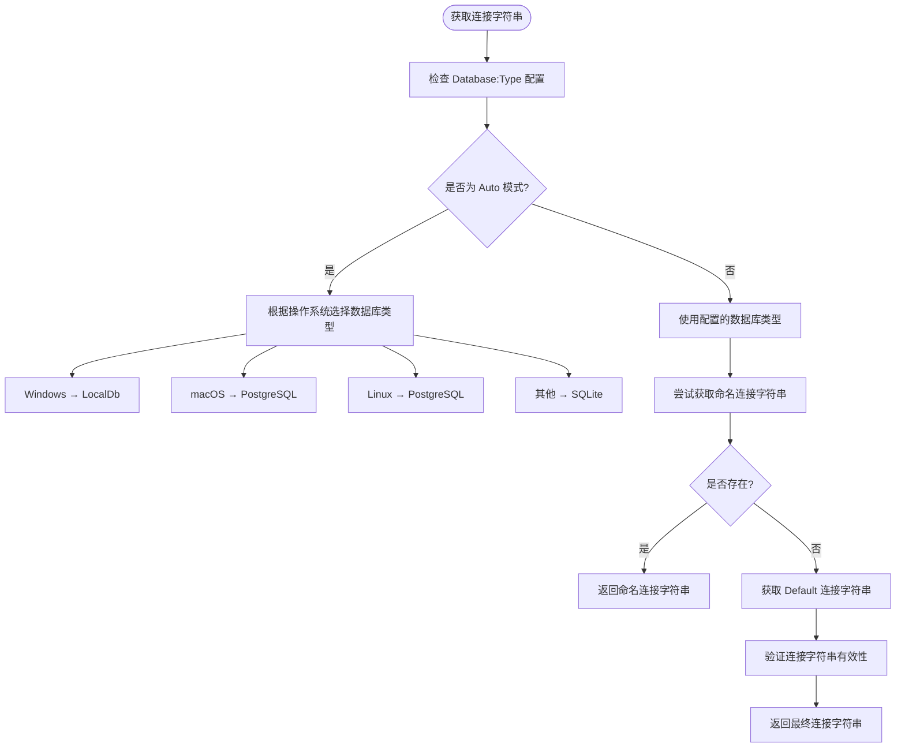
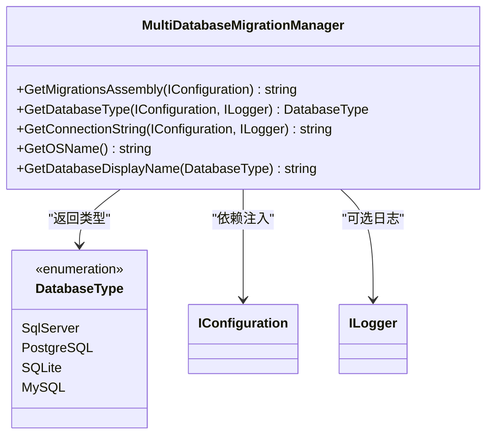

# 数据库配置

<cite>
**本文档中引用的文件**  
- [appsettings.json](file://src/SmartAbp.AspireHost/appsettings.json)
- [appsettings.json](file://src/SmartAbp.DbMigrator/appsettings.json)
- [appsettings.json](file://src/SmartAbp.Web/appsettings.json)
- [DatabaseConfigurationHelper.cs](file://src/SmartAbp.Web/Configuration/DatabaseConfigurationHelper.cs)
- [MultiDatabaseMigrationManager.cs](file://src/SmartAbp.EntityFrameworkCore/EntityFrameworkCore/MultiDatabaseMigrationManager.cs)
- [DatabaseType.cs](file://src/SmartAbp.Database.Abstraction/DatabaseType.cs)
</cite>

## 目录
1. [连接字符串配置结构](#连接字符串配置结构)  
2. [多数据库连接管理机制](#多数据库连接管理机制)  
3. [数据库配置助手类分析](#数据库配置助手类分析)  
4. [数据库迁移策略与实现](#数据库迁移策略与实现)  
5. [连接池与性能优化建议](#连接池与性能优化建议)  
6. [EF Core 配置最佳实践](#ef-core-配置最佳实践)  
7. [数据库健康检查实现](#数据库健康检查实现)

## 连接字符串配置结构

`appsettings.json` 文件中的 `ConnectionStrings` 配置节定义了多个数据库连接字符串，支持多数据库环境下的灵活切换。该配置节包含以下命名连接字符串：

- **Default**：默认连接字符串，当未指定具体数据库类型时使用
- **LocalDb**：用于 Windows 开发环境的 SQL Server LocalDB
- **SqlServer**：标准 SQL Server 连接
- **PostgreSQL**：PostgreSQL 数据库连接
- **Sqlite**：SQLite 嵌入式数据库连接

配置中还通过 `Database:Type` 指定当前使用的数据库类型，支持 `"Auto"` 模式，可根据操作系统自动选择合适的数据库提供程序。

**Section sources**  
- [appsettings.json](file://src/SmartAbp.DbMigrator/appsettings.json#L1-L25)
- [appsettings.json](file://src/SmartAbp.Web/appsettings.json#L1-L42)

## 多数据库连接管理机制

系统通过 `DatabaseConfigurationHelper` 和 `MultiDatabaseMigrationManager` 实现多数据库连接的动态管理。其核心逻辑如下：

1. **自动检测模式（Auto）**：根据运行环境的操作系统自动选择数据库：
   - Windows → SQL Server (LocalDb)
   - macOS → PostgreSQL
   - Linux → PostgreSQL
   - 其他 → SQLite（默认跨平台选项）

2. **连接字符串优先级**：
   - 优先使用与数据库类型同名的连接字符串（如 `PostgreSQL`）
   - 若未找到，则回退到 `Default` 连接字符串

3. **统一配置入口**：通过静态方法封装连接字符串获取逻辑，确保各组件行为一致。

**Diagram sources**  
- [DatabaseConfigurationHelper.cs](file://src/SmartAbp.Web/Configuration/DatabaseConfigurationHelper.cs#L10-L183)
- [MultiDatabaseMigrationManager.cs](file://src/SmartAbp.EntityFrameworkCore/EntityFrameworkCore/MultiDatabaseMigrationManager.cs#L12-L146)

## 数据库配置助手类分析

`DatabaseConfigurationHelper` 是一个静态工具类，负责解析配置并提供数据库连接信息。其主要功能包括：

- `GetConnectionString()`：获取当前环境适用的连接字符串
- `GetDatabaseType()`：获取实际使用的数据库类型（考虑 Auto 模式）
- `ValidateDatabaseConfiguration()`：验证配置完整性
- `PrintDatabaseConfiguration()`：输出调试信息，包含操作系统、数据库类型和脱敏后的连接字符串

该类通过 `RuntimeInformation.IsOSPlatform()` 判断运行环境，并结合日志记录提供详细的配置决策过程，便于开发和运维人员排查问题。

**Section sources**  
- [DatabaseConfigurationHelper.cs](file://src/SmartAbp.Web/Configuration/DatabaseConfigurationHelper.cs#L10-L183)

## 数据库迁移策略与实现

`MultiDatabaseMigrationManager` 类实现了企业级多数据库迁移管理机制，核心特性如下：

- **统一迁移程序集**：所有数据库迁移均打包在 `SmartAbp.EntityFrameworkCore` 程序集中
- **命名空间过滤**：通过 `FilteringMigrationsAssembly` 按命名空间（如 `SmartAbp.Migrations.{Provider}`）过滤对应数据库的迁移脚本
- **自动适配数据库类型**：根据配置或操作系统自动选择正确的迁移路径
- **支持多种数据库**：SQL Server、PostgreSQL、SQLite、MySQL

迁移流程由 `DbMigratorHostedService` 触发，在应用启动时自动执行模式更新和数据种子操作，确保数据库结构与代码模型保持同步。

**Diagram sources**  
- [MultiDatabaseMigrationManager.cs](file://src/SmartAbp.EntityFrameworkCore/EntityFrameworkCore/MultiDatabaseMigrationManager.cs#L12-L146)
- [DatabaseType.cs](file://src/SmartAbp.Database.Abstraction/DatabaseType.cs#L6-L27)

## 连接池与性能优化建议

为提升数据库访问性能，建议在连接字符串中配置以下参数：

- **连接池设置**：
  - `Max Pool Size=100`：最大连接数
  - `Min Pool Size=5`：最小连接数
  - `Connection Lifetime=300`：连接生命周期（秒）

- **超时设置**：
  - `Command Timeout=30`：命令执行超时（秒）
  - `Connection Timeout=15`：连接建立超时（秒）

- **其他优化**：
  - 启用 `TrustServerCertificate=true` 在开发环境中跳过证书验证
  - 使用异步方法（如 `ToListAsync()`）避免阻塞线程
  - 合理使用 `AsNoTracking()` 提高只读查询性能

生产环境中应根据负载测试结果调整连接池大小，避免资源耗尽或过度闲置。

## EF Core 配置最佳实践

1. **上下文生命周期管理**：使用 `AddScoped` 注册 `DbContext`，确保每个请求拥有独立上下文实例
2. **显式迁移管理**：通过 `Add-Migration` 和 `Update-Database` 手动控制迁移脚本，避免生产环境自动迁移风险
3. **多租户支持**：利用 ABP 框架的多租户机制，为不同租户配置独立数据库或 Schema
4. **查询优化**：避免 N+1 查询问题，合理使用 `Include`、`ThenInclude` 和投影查询
5. **事务管理**：使用 `UnitOfWork` 模式保证数据一致性，长事务应分解为多个短事务

## 数据库健康检查实现

系统通过集成 ASP.NET Core 健康检查中间件实现数据库可用性监控。健康检查组件会定期尝试执行简单查询（如 `SELECT 1`），以验证数据库连接状态。检查结果可用于：

- Kubernetes 就绪/存活探针
- 运维监控告警
- 自动故障转移决策

健康检查应配置合理的超时时间（建议 5-10 秒），并避免过于频繁的检测对数据库造成额外负担。

**Section sources**  
- [ResourceAvailabilityChecker.cs](file://src/SmartAbp.CodeGenerator/Core/Reliability/ResourceAvailabilityChecker.cs#L184-L210)
- [SmartAbpDbMigrationService.cs](file://src/SmartAbp.Domain/Data/SmartAbpDbMigrationService.cs#L41-L82)