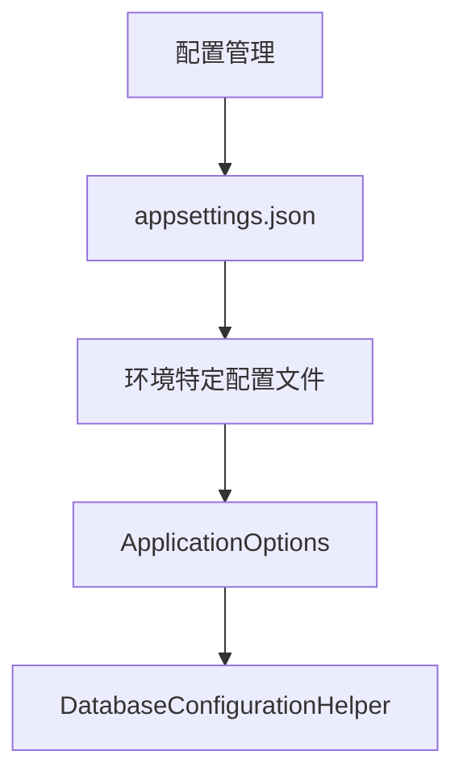
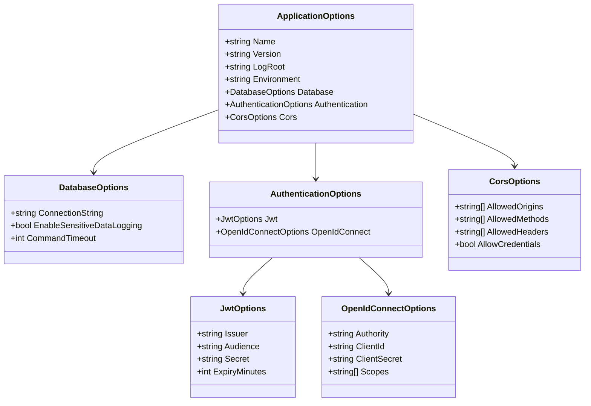
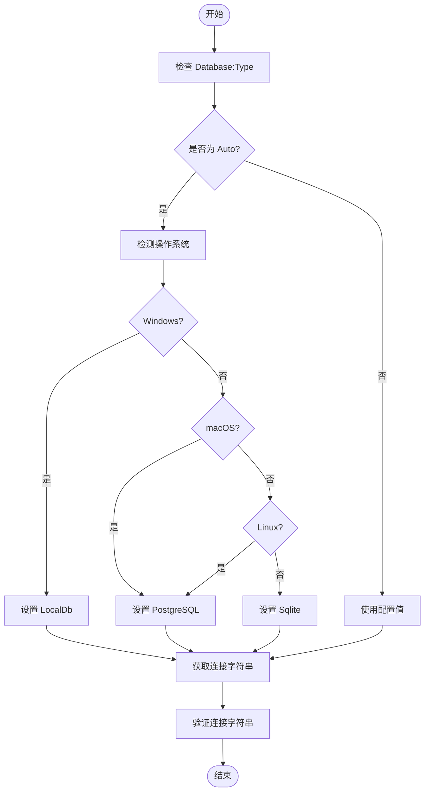

# 配置管理

<cite>
**本文档中引用的文件**  
- [appsettings.json](file://src/SmartAbp.Web/appsettings.json)
- [appsettings.Development.json](file://src/SmartAbp.Web/appsettings.Development.json)
- [ApplicationOptions.cs](file://src/SmartAbp.Web/Configuration/ApplicationOptions.cs)
- [DatabaseConfigurationHelper.cs](file://src/SmartAbp.Web/Configuration/DatabaseConfigurationHelper.cs)
- [SmartAbp.AspireHost/appsettings.json](file://src/SmartAbp.AspireHost/appsettings.json)
- [SmartAbp.DbMigrator/appsettings.json](file://src/SmartAbp.DbMigrator/appsettings.json)
- [SmartAbp.DevKit.Cli/appsettings.json](file://src/SmartAbp.DevKit.Cli/appsettings.json)
</cite>

## 目录
1. [项目结构](#项目结构)
2. [核心配置文件解析](#核心配置文件解析)
3. [应用配置封装类](#应用配置封装类)
4. [数据库配置处理机制](#数据库配置处理机制)
5. [配置层次结构与环境覆盖](#配置层次结构与环境覆盖)
6. [配置验证与默认值设置](#配置验证与默认值设置)
7. [敏感配置安全存储方案](#敏感配置安全存储方案)
8. [配置热更新实现方法](#配置热更新实现方法)

## 项目结构

hxlot项目的配置管理主要集中在`src`目录下的多个微服务模块中，包括Web主机、AspireHost、DbMigrator和DevKit.Cli等。每个模块均包含独立的`appsettings.json`文件用于基础配置，同时通过共享的配置类实现统一管理。



**Diagram sources**
- [appsettings.json](file://src/SmartAbp.Web/appsettings.json)
- [ApplicationOptions.cs](file://src/SmartAbp.Web/Configuration/ApplicationOptions.cs)
- [DatabaseConfigurationHelper.cs](file://src/SmartAbp.Web/Configuration/DatabaseConfigurationHelper.cs)

**Section sources**
- [appsettings.json](file://src/SmartAbp.Web/appsettings.json)
- [ApplicationOptions.cs](file://src/SmartAbp.Web/Configuration/ApplicationOptions.cs)

## 核心配置文件解析

### ConnectionStrings 配置节

`ConnectionStrings` 配置节定义了多种数据库连接字符串，支持多数据库类型切换。在 `SmartAbp.DbMigrator` 和 `SmartAbp.Web` 模块中均存在该配置项，允许根据运行环境选择合适的数据库。

```json
"ConnectionStrings": {
  "Default": "Server=(localdb)\\MSSQLLocalDB;Database=SmartAbp;Trusted_Connection=True;TrustServerCertificate=true",
  "Sqlite": "Data Source=../smartabp.db",
  "PostgreSQL": "Host=localhost;Port=5432;Database=smartabp;Username=smartabp_user;Password=SmartAbp123!;Include Error Detail=true;Search Path=public"
}
```

此设计支持开发、测试和生产环境下的灵活切换，尤其适用于跨平台部署场景。

### Logging 与 Serilog 配置

日志配置通过标准的 `Logging` 节点进行控制，设置不同命名空间的日志级别。例如，在 `SmartAbp.AspireHost` 中：

```json
"Logging": {
  "LogLevel": {
    "Default": "Information",
    "Microsoft.AspNetCore": "Warning",
    "Aspire": "Information"
  }
}
```

而在 `SmartAbp.DevKit.Cli` 中还启用了控制台格式化器，便于命令行工具调试输出。

**Section sources**
- [SmartAbp.AspireHost/appsettings.json](file://src/SmartAbp.AspireHost/appsettings.json)
- [SmartAbp.DevKit.Cli/appsettings.json](file://src/SmartAbp.DevKit.Cli/appsettings.json)

## 应用配置封装类

`ApplicationOptions` 类封装了应用程序的核心配置参数，采用强类型方式组织配置项，提升可维护性和类型安全性。

```csharp
public class ApplicationOptions
{
    [Required]
    public string Name { get; set; } = "SmartAbp";
    public string Environment { get; set; } = "Development";
    public DatabaseOptions Database { get; set; } = new DatabaseOptions();
    public AuthenticationOptions Authentication { get; set; } = new AuthenticationOptions();
}
```

此类结构清晰地划分了应用名称、版本、日志路径、环境、数据库、认证和跨域等关键配置区域，便于集中管理和依赖注入。



**Diagram sources**
- [ApplicationOptions.cs](file://src/SmartAbp.Web/Configuration/ApplicationOptions.cs)

**Section sources**
- [ApplicationOptions.cs](file://src/SmartAbp.Web/Configuration/ApplicationOptions.cs)

## 数据库配置处理机制

`DatabaseConfigurationHelper` 是一个静态工具类，负责根据操作系统自动选择合适的数据库类型，并获取对应的连接字符串。

### 自动检测逻辑

该类通过 `RuntimeInformation.IsOSPlatform()` 判断当前操作系统：
- Windows → 使用 LocalDb
- macOS → 使用 PostgreSQL
- Linux → 使用 PostgreSQL

```csharp
private static string GetDatabaseTypeByOS()
{
    if (RuntimeInformation.IsOSPlatform(OSPlatform.Windows))
        return "LocalDb";
    if (RuntimeInformation.IsOSPlatform(OSPlatform.OSX))
        return "PostgreSQL";
    if (RuntimeInformation.IsOSPlatform(OSPlatform.Linux))
        return "PostgreSQL";
    return "Sqlite";
}
```

### 连接字符串获取流程

1. 读取 `Database:Type` 配置
2. 若为 `Auto` 模式，则调用 `GetDatabaseTypeByOS()`
3. 根据数据库类型查找对应连接字符串
4. 若未找到，则回退到 `Default` 连接字符串

此外，该类还提供配置验证、日志打印和敏感信息脱敏功能，确保数据库配置的安全性和可观测性。



**Diagram sources**
- [DatabaseConfigurationHelper.cs](file://src/SmartAbp.Web/Configuration/DatabaseConfigurationHelper.cs)

**Section sources**
- [DatabaseConfigurationHelper.cs](file://src/SmartAbp.Web/Configuration/DatabaseConfigurationHelper.cs)

## 配置层次结构与环境覆盖

项目采用 ASP.NET Core 标准的配置层次结构，支持多层级配置文件叠加：

1. `appsettings.json` - 基础配置
2. `appsettings.{Environment}.json` - 环境特定配置（如 Development、Production）
3. 环境变量
4. 命令行参数

例如，`SmartAbp.AspireHost` 包含：
- `appsettings.json`
- `appsettings.Development.json`

其中 `appsettings.Development.json` 会覆盖基础配置中的日志级别等设置，实现开发环境的精细化控制。

```json
// appsettings.Development.json
{
  "Logging": {
    "LogLevel": {
      "Default": "Debug",
      "Aspire": "Debug"
    }
  }
}
```

这种机制使得不同环境可以拥有独立的调试级别、监控端点和其他运行时参数，而无需修改代码或构建产物。

**Section sources**
- [appsettings.Development.json](file://src/SmartAbp.Web/appsettings.Development.json)
- [appsettings.json](file://src/SmartAbp.Web/appsettings.json)

## 配置验证与默认值设置

### 默认值设置

所有配置类均在定义时设置合理的默认值，确保即使缺少外部配置也能正常运行：

```csharp
public string Environment { get; set; } = "Development";
public int CommandTimeout { get; set; } = 30;
public int ExpiryMinutes { get; set; } = 60;
```

### 配置验证

通过数据注解 `[Required]` 实现基本验证：

```csharp
[Required]
public string Name { get; set; }
```

同时 `DatabaseConfigurationHelper` 提供专门的验证方法：

```csharp
public static bool ValidateDatabaseConfiguration(
    IConfiguration configuration, 
    out string errorMessage)
{
    // 验证逻辑
}
```

该方法在应用启动时调用，确保数据库配置完整有效，避免运行时错误。

**Section sources**
- [ApplicationOptions.cs](file://src/SmartAbp.Web/Configuration/ApplicationOptions.cs)
- [DatabaseConfigurationHelper.cs](file://src/SmartAbp.Web/Configuration/DatabaseConfigurationHelper.cs)

## 敏感配置安全存储方案

### 敏感信息脱敏

`DatabaseConfigurationHelper` 提供 `MaskConnectionString` 方法，使用正则表达式隐藏密码字段：

```csharp
private static string MaskConnectionString(string connectionString)
{
    var masked = Regex.Replace(
        connectionString,
        @"(Password|Pwd)=([^;]+)",
        "$1=***",
        RegexOptions.IgnoreCase
    );
    return masked;
}
```

### 安全建议

尽管当前配置中仍存在明文密码（如 `SmartAbp_DbMigrator`），但应结合以下方案提升安全性：
- 使用环境变量替代配置文件中的敏感信息
- 集成 Azure Key Vault 或 Hashicorp Vault
- 启用配置加密（如 ASP.NET Core Data Protection）
- 在生产环境中禁用 `appsettings.json` 中的凭据，改由 CI/CD 注入

**Section sources**
- [DatabaseConfigurationHelper.cs](file://src/SmartAbp.Web/Configuration/DatabaseConfigurationHelper.cs)

## 配置热更新实现方法

虽然当前代码未显式实现配置热更新，但基于 ASP.NET Core 的 `IOptionsMonitor<T>` 模式，可通过以下方式实现：

### 使用 IOptionsMonitor

```csharp
public class MyService
{
    private readonly IOptionsMonitor<ApplicationOptions> _options;

    public MyService(IOptionsMonitor<ApplicationOptions> options)
    {
        _options = options;
        _options.OnChange(opt =>
        {
            // 配置变更时的处理逻辑
        });
    }
}
```

### 文件监听机制

ASP.NET Core 自动监听 `appsettings.json` 文件变化，当文件被修改时会触发重新加载。结合 `IOptionsSnapshot` 或 `IOptionsMonitor` 可实现运行时配置更新。

### 推荐实践

1. 将频繁变更的配置项（如限流阈值、开关标志）放入独立的 `settings.json`
2. 使用 `FileSystemWatcher` 或 `IFileProvider` 监听特定配置文件
3. 提供管理API触发配置重载
4. 记录配置变更日志并支持回滚

**Section sources**
- [ApplicationOptions.cs](file://src/SmartAbp.Web/Configuration/ApplicationOptions.cs)