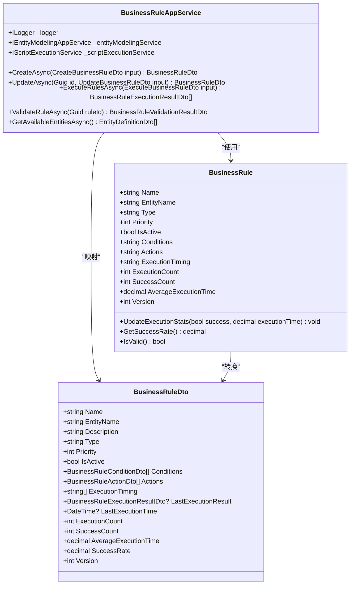
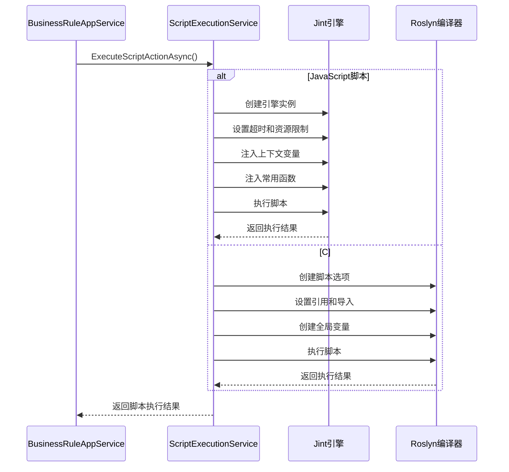
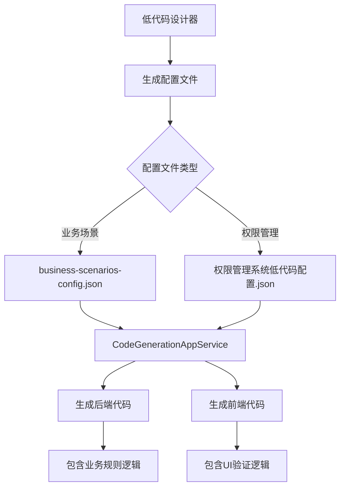
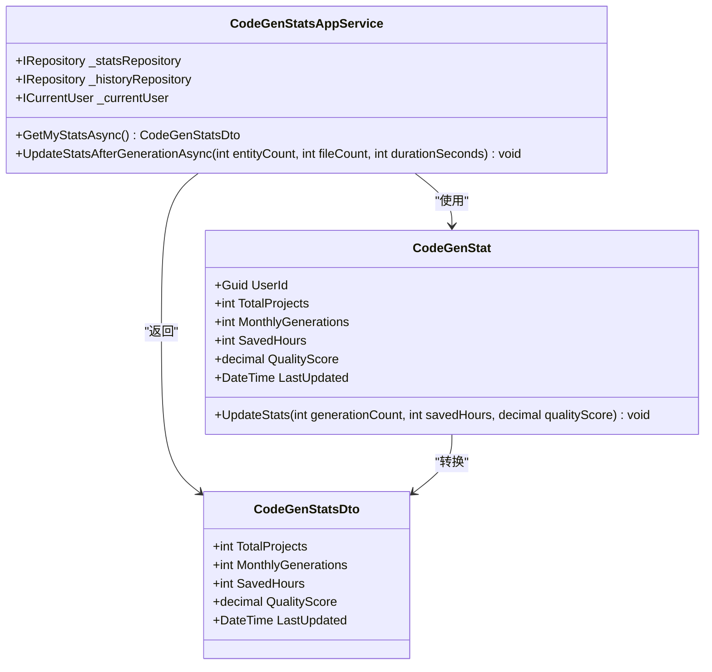
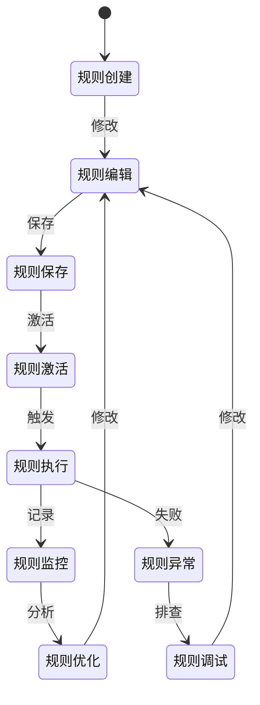
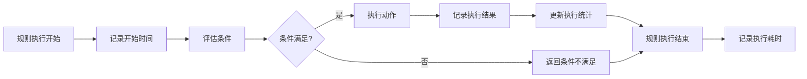
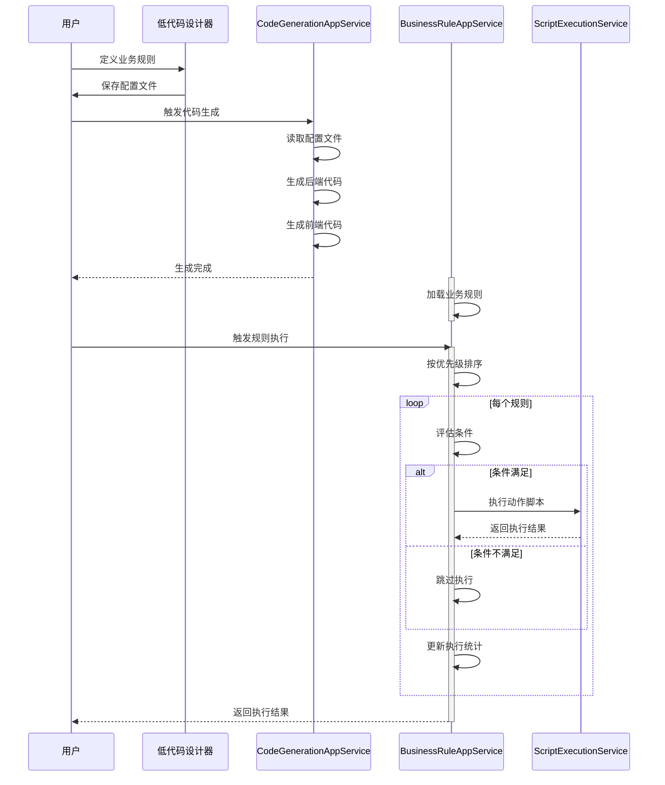

# 业务规则服务

<cite>
**本文档引用文件**   
- [BusinessRuleAppService.cs](file://src/SmartAbp.Application/BusinessRules/BusinessRuleAppService.cs)
- [ScriptExecutionService.cs](file://src/SmartAbp.Application/BusinessRules/Services/ScriptExecutionService.cs)
- [CodeGenerationAppService.cs](file://src/SmartAbp.CodeGenerator/Services/CodeGenerationAppService.cs)
- [CodeGenStatsAppService.cs](file://src/SmartAbp.Application/CodeGenerator/CodeGenStatsAppService.cs)
- [business-scenarios-config.json](file://config/business-scenarios-config.json)
- [权限管理系统低代码配置.json](file://config/权限管理系统低代码配置.json)
</cite>

## 目录
1. [业务规则服务概述](#业务规则服务概述)
2. [BusinessRuleAppService设计与实现](#businessruleappservice设计与实现)
3. [ScriptExecutionService安全执行机制](#scriptexecutionservice安全执行机制)
4. [业务规则与代码生成集成](#业务规则与代码生成集成)
5. [CodeGenStatsAppService统计分析](#codegenstatsappservice统计分析)
6. [权限控制与版本管理](#权限控制与版本管理)
7. [执行监控与性能分析](#执行监控与性能分析)
8. [完整工作流示例](#完整工作流示例)
9. [错误处理与最佳实践](#错误处理与最佳实践)

## 业务规则服务概述

业务规则服务是hxlot项目的核心组件，负责管理业务规则的全生命周期，包括创建、验证、执行和监控。该服务通过与代码生成服务的深度集成，实现了业务规则与系统功能的自动化关联。服务支持用户自定义脚本的执行，并提供了完善的权限控制、版本管理和执行监控机制。业务规则服务不仅能够处理简单的条件-动作逻辑，还能通过脚本执行实现复杂的业务逻辑，为系统的灵活性和可扩展性提供了坚实基础。

**Section sources**
- [BusinessRuleAppService.cs](file://src/SmartAbp.Application/BusinessRules/BusinessRuleAppService.cs#L20-L796)

## BusinessRuleAppService设计与实现

BusinessRuleAppService是业务规则服务的核心实现类，继承自ABP框架的CrudAppService，提供了完整的CRUD操作。该服务通过IRepository<BusinessRule, Guid>与数据访问层交互，实现了业务规则的持久化管理。服务的关键功能包括规则创建、更新、执行和验证。

在规则创建过程中，服务将条件、动作和执行时机等复杂结构序列化为JSON字符串存储，确保了数据的灵活性和可扩展性。规则执行时，服务按照优先级顺序依次执行激活的规则，并实时更新执行统计信息。服务还提供了批量验证功能，能够对所有规则进行完整性检查，确保系统稳定性。

**Diagram sources**
- [BusinessRuleAppService.cs](file://src/SmartAbp.Application/BusinessRules/BusinessRuleAppService.cs#L81-L796)
- [BusinessRule.cs](file://src/SmartAbp.Domain/BusinessRules/BusinessRule.cs#L12-L263)
- [BusinessRuleDto.cs](file://src/SmartAbp.Application.Contracts/BusinessRules/Dtos/BusinessRuleDto.cs#L10-L101)

**Section sources**
- [BusinessRuleAppService.cs](file://src/SmartAbp.Application/BusinessRules/BusinessRuleAppService.cs#L81-L796)

## ScriptExecutionService安全执行机制

ScriptExecutionService负责安全地执行用户定义的脚本，支持JavaScript和C#两种脚本语言。服务通过Jint引擎执行JavaScript脚本，通过Roslyn编译器执行C#脚本，确保了脚本执行的安全性和性能。

服务实现了严格的执行环境控制，包括超时限制、最大语句数限制和递归深度限制，防止恶意脚本导致系统资源耗尽。对于JavaScript脚本，服务在执行前注入了常用函数，如日志记录、时间获取和GUID生成等，增强了脚本的功能性。对于C#脚本，服务通过ScriptGlobals类提供了变量注入和获取机制，实现了脚本与上下文的数据交互。

**Diagram sources**
- [ScriptExecutionService.cs](file://src/SmartAbp.Application/BusinessRules/Services/ScriptExecutionService.cs#L20-L417)
- [BusinessRuleAppService.cs](file://src/SmartAbp.Application/BusinessRules/BusinessRuleAppService.cs#L81-L796)

**Section sources**
- [ScriptExecutionService.cs](file://src/SmartAbp.Application/BusinessRules/Services/ScriptExecutionService.cs#L20-L417)

## 业务规则与代码生成集成

业务规则服务与代码生成服务通过低代码配置文件实现了深度集成。当用户通过低代码设计器定义业务规则时，系统会将规则配置保存到JSON文件中，如"权限管理系统低代码配置.json"。这些配置文件不仅定义了实体和字段，还包含了业务规则的定义。

CodeGenerationAppService在生成代码时，会读取这些配置文件，将业务规则转换为相应的后端代码。例如，对于验证类型的规则，服务会生成相应的验证方法；对于计算类型的规则，服务会生成计算逻辑。这种集成方式实现了业务规则的可视化定义和自动化代码生成，大大提高了开发效率。

**Diagram sources**
- [权限管理系统低代码配置.json](file://config/权限管理系统低代码配置.json#L1-L1080)
- [business-scenarios-config.json](file://config/business-scenarios-config.json#L1-L308)
- [CodeGenerationAppService.cs](file://src/SmartAbp.CodeGenerator/Services/CodeGenerationAppService.cs#L38-L2620)

**Section sources**
- [权限管理系统低代码配置.json](file://config/权限管理系统低代码配置.json#L1-L1080)
- [business-scenarios-config.json](file://config/business-scenarios-config.json#L1-L308)

## CodeGenStatsAppService统计分析

CodeGenStatsAppService负责收集和分析代码生成的统计信息，为用户提供生成效率和质量的洞察。服务通过ICurrentUser获取当前用户信息，将统计信息与用户关联，实现了个性化的统计展示。

服务的关键功能包括获取用户统计信息和更新生成统计。当用户完成代码生成后，服务会根据生成的实体数量、文件数量和生成耗时，计算节省的开发时间和质量评分。这些统计信息不仅帮助用户了解自己的开发效率，还为系统优化提供了数据支持。

**Diagram sources**
- [CodeGenStatsAppService.cs](file://src/SmartAbp.Application/CodeGenerator/CodeGenStatsAppService.cs#L13-L136)
- [CodeGenerationAppService.cs](file://src/SmartAbp.CodeGenerator/Services/CodeGenerationAppService.cs#L38-L2620)

**Section sources**
- [CodeGenStatsAppService.cs](file://src/SmartAbp.Application/CodeGenerator/CodeGenStatsAppService.cs#L13-L136)

## 权限控制与版本管理

业务规则服务实现了完善的权限控制和版本管理机制。权限控制通过ABP框架的Authorize特性实现，确保只有授权用户才能访问业务规则服务。服务还提供了细粒度的权限管理，如创建、读取、更新和删除权限，满足了不同用户角色的需求。

版本管理是业务规则服务的重要特性，每个业务规则都有一个版本号，每次更新都会递增版本号。服务还支持规则的复制功能，用户可以基于现有规则创建新规则，提高了规则创建的效率。对于重要的规则变更，服务会记录变更类型和描述，便于审计和追溯。

**Diagram sources**
- [BusinessRuleAppService.cs](file://src/SmartAbp.Application/BusinessRules/BusinessRuleAppService.cs#L81-L796)
- [BusinessRule.cs](file://src/SmartAbp.Domain/BusinessRules/BusinessRule.cs#L12-L263)

**Section sources**
- [BusinessRuleAppService.cs](file://src/SmartAbp.Application/BusinessRules/BusinessRuleAppService.cs#L81-L796)

## 执行监控与性能分析

业务规则服务提供了全面的执行监控和性能分析功能。每个业务规则都记录了执行次数、成功次数、失败次数和平均执行时间等统计信息。服务还提供了获取统计信息的接口，用户可以实时了解规则的执行情况。

在性能分析方面，服务通过日志记录了规则执行的详细信息，包括开始时间、结束时间和执行耗时。这些信息不仅有助于性能优化，还能帮助开发人员快速定位问题。服务还实现了执行超时检测，防止长时间运行的规则影响系统性能。

**Diagram sources**
- [BusinessRuleAppService.cs](file://src/SmartAbp.Application/BusinessRules/BusinessRuleAppService.cs#L81-L796)
- [BusinessRule.cs](file://src/SmartAbp.Domain/BusinessRules/BusinessRule.cs#L12-L263)

**Section sources**
- [BusinessRuleAppService.cs](file://src/SmartAbp.Application/BusinessRules/BusinessRuleAppService.cs#L81-L796)

## 完整工作流示例

以下是一个完整的业务规则工作流示例，展示了从规则定义到执行的全过程：

1. 用户在低代码设计器中定义业务规则，包括条件和动作
2. 系统将规则配置保存到JSON文件中
3. 用户触发代码生成，CodeGenerationAppService读取配置文件
4. 服务生成包含业务规则逻辑的后端代码和UI验证逻辑的前端代码
5. 业务规则服务加载生成的规则，准备执行
6. 当满足执行时机时，服务按优先级顺序执行激活的规则
7. 服务记录执行结果，更新统计信息
8. 用户通过统计面板查看规则执行情况，进行优化

**Diagram sources**
- [BusinessRuleAppService.cs](file://src/SmartAbp.Application/BusinessRules/BusinessRuleAppService.cs#L81-L796)
- [CodeGenerationAppService.cs](file://src/SmartAbp.CodeGenerator/Services/CodeGenerationAppService.cs#L38-L2620)
- [ScriptExecutionService.cs](file://src/SmartAbp.Application/BusinessRules/Services/ScriptExecutionService.cs#L20-L417)

**Section sources**
- [BusinessRuleAppService.cs](file://src/SmartAbp.Application/BusinessRules/BusinessRuleAppService.cs#L81-L796)

## 错误处理与最佳实践

业务规则服务实现了完善的错误处理机制。在规则验证阶段，服务会检查规则的基本信息、条件和动作的完整性，确保规则的正确性。在规则执行阶段，服务通过try-catch块捕获异常，防止单个规则的错误影响其他规则的执行。

最佳实践包括：
1. 为规则设置合理的优先级，确保关键规则优先执行
2. 使用有意义的规则名称和描述，便于维护和理解
3. 定期验证规则的正确性，及时发现和修复问题
4. 监控规则的执行性能，优化耗时较长的规则
5. 利用版本管理功能，记录重要变更，便于追溯和回滚

**Section sources**
- [BusinessRuleAppService.cs](file://src/SmartAbp.Application/BusinessRules/BusinessRuleAppService.cs#L81-L796)
- [ScriptExecutionService.cs](file://src/SmartAbp.Application/BusinessRules/Services/ScriptExecutionService.cs#L20-L417)