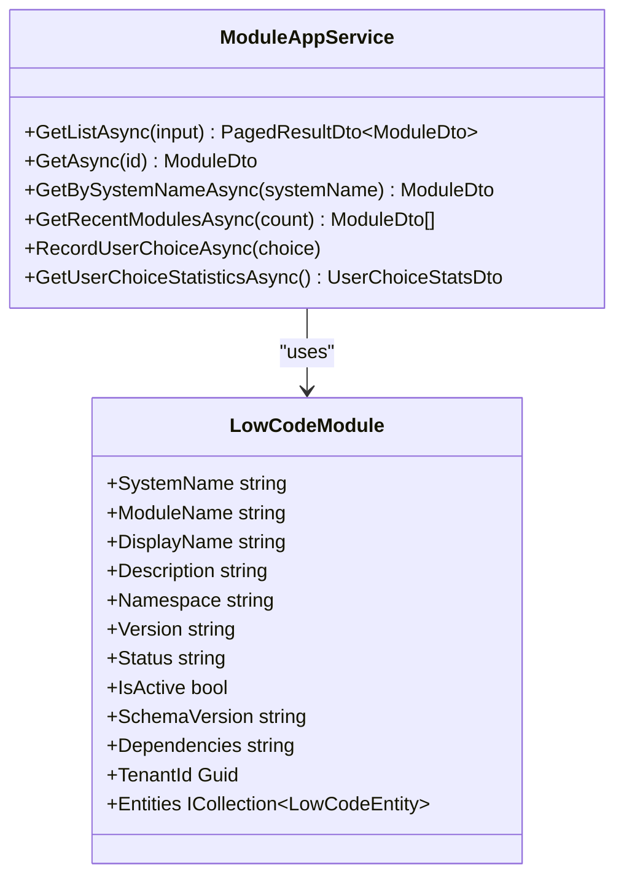
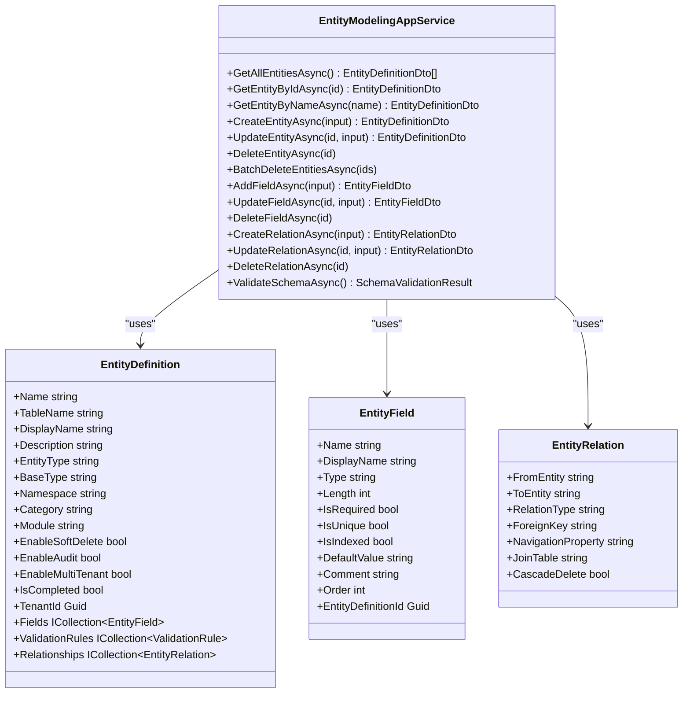
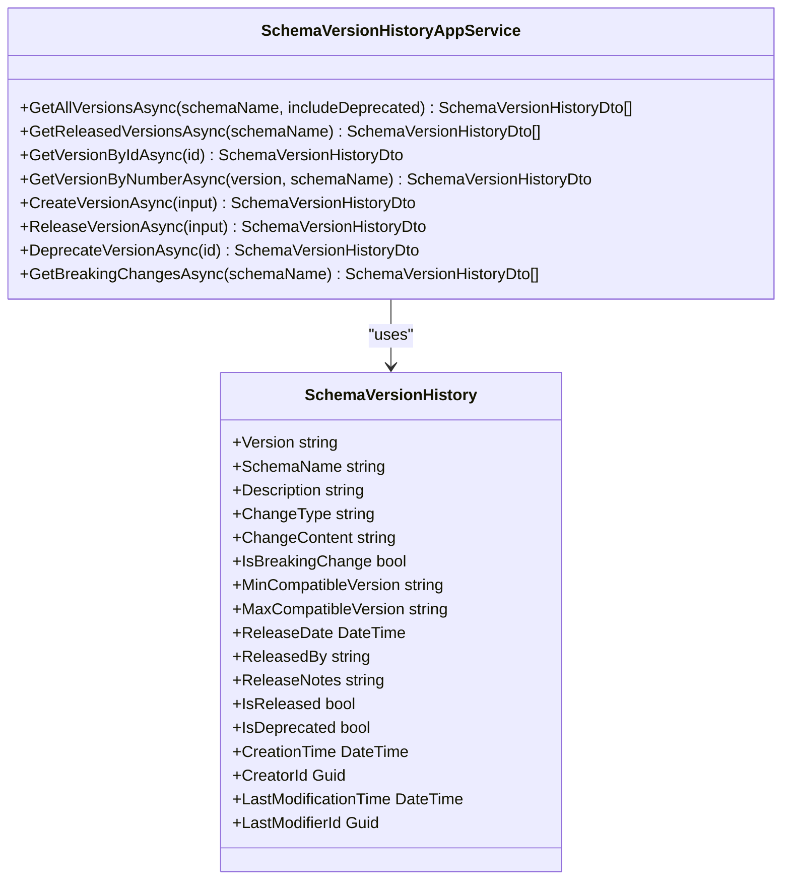
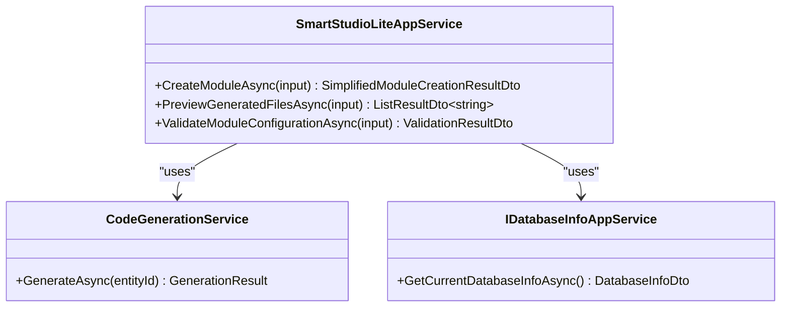
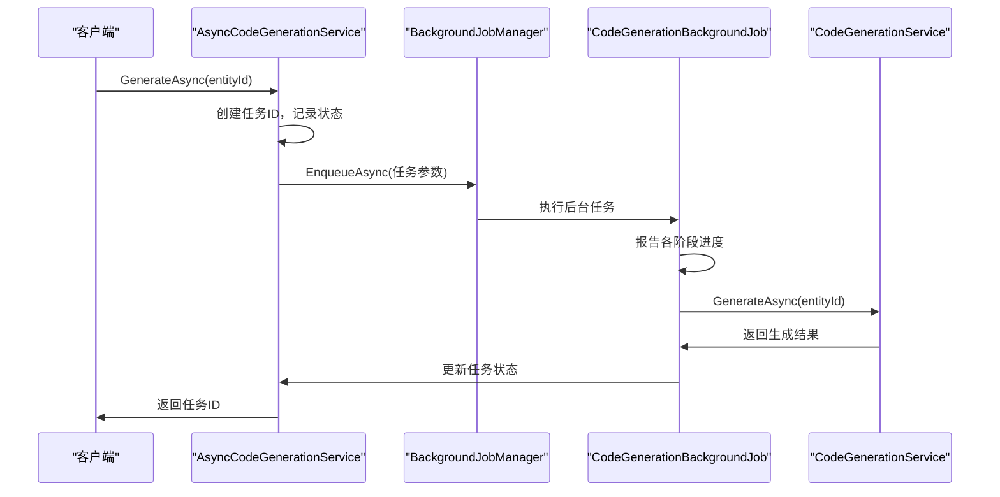
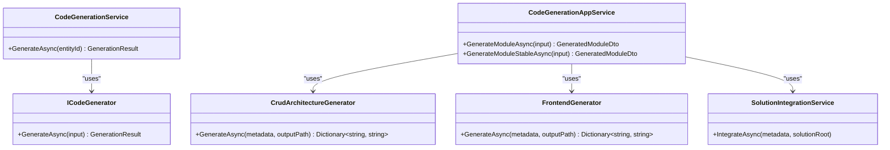
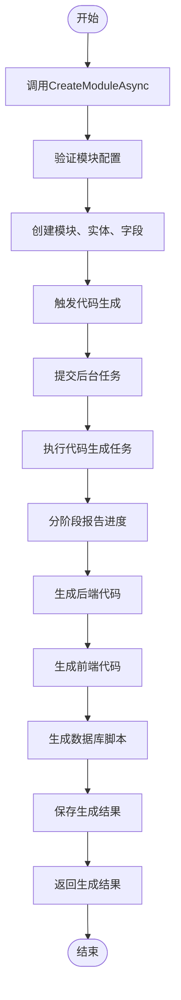

# 低代码服务

<cite>
**本文档引用文件**  
- [ModuleAppService.cs](file://src/SmartAbp.Application/LowCode/ModuleAppService.cs)
- [EntityModelingAppService.cs](file://src/SmartAbp.Application/LowCode/EntityModelingAppService.cs)
- [SchemaVersionHistoryAppService.cs](file://src/SmartAbp.Application/LowCode/SchemaVersionHistoryAppService.cs)
- [SmartStudioLiteAppService.cs](file://src/SmartAbp.Application/LowCode/SmartStudioLiteAppService.cs)
- [AsyncCodeGenerationService.cs](file://src/SmartAbp.Application/LowCode/AsyncCodeGenerationService.cs)
- [CodeGenerationBackgroundJob.cs](file://src/SmartAbp.Application/LowCode/CodeGenerationBackgroundJob.cs)
- [CodeGenerationService.cs](file://src/SmartAbp.Application/LowCode/CodeGenerationService.cs)
- [LowCodeModule.cs](file://src/SmartAbp.Domain/Entities/LowCode/LowCodeModule.cs)
- [EntityDefinition.cs](file://src/SmartAbp.Domain/Entities/LowCode/EntityDefinition.cs)
- [LowCodeEntity.cs](file://src/SmartAbp.Domain/Entities/LowCode/LowCodeEntity.cs)
- [LowCodeProperty.cs](file://src/SmartAbp.Domain/Entities/LowCode/LowCodeProperty.cs)
- [SchemaVersionService.cs](file://src/SmartAbp.Application/LowCode/Services/SchemaVersionService.cs)
- [CodeGenerationAppService.cs](file://src/SmartAbp.CodeGenerator/Services/CodeGenerationAppService.cs)
</cite>

## 目录
1. [模块管理服务](#模块管理服务)
2. [实体建模服务](#实体建模服务)
3. [元数据版本控制](#元数据版本控制)
4. [轻量级开发体验](#轻量级开发体验)
5. [异步代码生成](#异步代码生成)
6. [代码生成引擎集成](#代码生成引擎集成)
7. [完整流程示例](#完整流程示例)

## 模块管理服务

`ModuleAppService` 是低代码平台的核心应用服务之一，负责模块的全生命周期管理。该服务继承自 ABP 框架的 `CrudAppService`，实现了模块的创建、读取、更新和删除（CRUD）操作。服务通过 `IRepository<LowCodeModule, Guid>` 与数据库进行交互，确保数据持久化。

模块管理服务支持分页查询、按系统名称查询等操作。`GetListAsync` 方法允许通过过滤条件（如模块名称、状态）获取模块列表。`GetBySystemNameAsync` 方法根据系统名称获取特定模块及其关联的实体列表。服务还提供了门户入口页面的扩展方法，如 `GetRecentModulesAsync` 用于获取最近访问的模块，`RecordUserChoiceAsync` 用于记录用户选择，`GetUserChoiceStatisticsAsync` 用于获取用户选择统计信息。

**图表来源**  
- [ModuleAppService.cs](file://src/SmartAbp.Application/LowCode/ModuleAppService.cs#L21-L213)
- [LowCodeModule.cs](file://src/SmartAbp.Domain/Entities/LowCode/LowCodeModule.cs#L15-L162)

**本节来源**  
- [ModuleAppService.cs](file://src/SmartAbp.Application/LowCode/ModuleAppService.cs#L21-L213)
- [LowCodeModule.cs](file://src/SmartAbp.Domain/Entities/LowCode/LowCodeModule.cs#L15-L162)

## 实体建模服务

`EntityModelingAppService` 提供了实体建模的核心功能，包括实体定义、字段管理、关系管理和架构验证。服务通过 `IRepository<EntityDefinition, Guid>`、`IRepository<EntityField, Guid>` 和 `IRepository<EntityRelation, Guid>` 与数据库进行交互，确保实体、字段和关系的持久化。

实体建模服务支持创建、更新、删除实体及其字段和关系。`CreateEntityAsync` 方法用于创建新实体，`UpdateEntityAsync` 方法用于更新现有实体，`DeleteEntityAsync` 方法用于删除实体。服务还提供了字段和关系的管理方法，如 `AddFieldAsync`、`UpdateFieldAsync`、`DeleteFieldAsync`、`CreateRelationAsync` 等。

架构验证功能通过 `ValidateSchemaAsync` 方法实现，用于验证实体名称的唯一性、关系的实体存在性等。服务还支持批量删除实体，通过 `BatchDeleteEntitiesAsync` 方法实现。

**图表来源**  
- [EntityModelingAppService.cs](file://src/SmartAbp.Application/LowCode/EntityModelingAppService.cs#L18-L351)
- [EntityDefinition.cs](file://src/SmartAbp.Domain/Entities/LowCode/EntityDefinition.cs#L12-L199)

**本节来源**  
- [EntityModelingAppService.cs](file://src/SmartAbp.Application/LowCode/EntityModelingAppService.cs#L18-L351)
- [EntityDefinition.cs](file://src/SmartAbp.Domain/Entities/LowCode/EntityDefinition.cs#L12-L199)

## 元数据版本控制

`SchemaVersionHistoryAppService` 负责管理元数据的版本历史，确保元数据的变更可追溯。服务通过 `IRepository<SchemaVersionHistory, Guid>` 与数据库进行交互，记录每个版本的详细信息。

服务提供了获取所有版本历史、已发布版本、指定版本详情、创建新版本记录、发布版本、弃用版本等功能。`GetAllVersionsAsync` 方法用于获取所有版本历史，`GetReleasedVersionsAsync` 方法用于获取已发布的版本列表，`GetVersionByIdAsync` 方法用于获取指定版本的详情。

`CreateVersionAsync` 方法用于创建新版本记录，`ReleaseVersionAsync` 方法用于发布版本，`DeprecateVersionAsync` 方法用于弃用版本。服务还支持获取破坏性变更版本列表，通过 `GetBreakingChangesAsync` 方法实现。

**图表来源**  
- [SchemaVersionHistoryAppService.cs](file://src/SmartAbp.Application/LowCode/SchemaVersionHistoryAppService.cs#L21-L218)
- [SchemaVersionService.cs](file://src/SmartAbp.Application/LowCode/Services/SchemaVersionService.cs#L19-L176)

**本节来源**  
- [SchemaVersionHistoryAppService.cs](file://src/SmartAbp.Application/LowCode/SchemaVersionHistoryAppService.cs#L21-L218)
- [SchemaVersionService.cs](file://src/SmartAbp.Application/LowCode/Services/SchemaVersionService.cs#L19-L176)

## 轻量级开发体验

`SmartStudioLiteAppService` 提供了轻量级的开发体验，简化了模块创建和代码生成的流程。服务通过 `IRepository<LowCodeModule, Guid>`、`IRepository<LowCodeEntity, Guid>` 和 `IRepository<LowCodeProperty, Guid>` 与数据库进行交互，同时依赖 `CodeGenerationService` 和 `IDatabaseInfoAppService` 提供代码生成和数据库信息查询功能。

服务的核心方法是 `CreateModuleAsync`，它接收一个简化的模块创建 DTO，验证配置，创建模块、实体和字段，并触发代码生成。`ValidateModuleConfigurationAsync` 方法用于验证模块配置，确保模块名称唯一、字段配置有效等。

`PreviewGeneratedFilesAsync` 方法用于预览将要生成的文件列表，帮助用户了解生成结果。服务还通过 `_databaseInfoAppService` 获取数据库信息，确保生成的文件与当前数据库环境兼容。

**图表来源**  
- [SmartStudioLiteAppService.cs](file://src/SmartAbp.Application/LowCode/SmartStudioLiteAppService.cs#L21-L410)
- [CodeGenerationService.cs](file://src/SmartAbp.Application/LowCode/CodeGenerationService.cs#L17-L78)

**本节来源**  
- [SmartStudioLiteAppService.cs](file://src/SmartAbp.Application/LowCode/SmartStudioLiteAppService.cs#L21-L410)
- [CodeGenerationService.cs](file://src/SmartAbp.Application/LowCode/CodeGenerationService.cs#L17-L78)

## 异步代码生成

`AsyncCodeGenerationService` 提供了异步代码生成的功能，通过后台作业协调代码生成任务。服务依赖 `IBackgroundJobManager` 提交后台任务，`SmartAbpProgressService` 跟踪生成进度，`ILogger` 记录日志。

`GenerateAsync` 方法接收实体 ID，创建任务 ID，记录任务状态，并提交后台任务。任务状态存储在 `ConcurrentDictionary<string, CodeGenerationTaskStatus>` 中，支持获取任务状态和所有任务状态。

`CodeGenerationBackgroundJob` 是后台任务处理器，负责执行代码生成任务。它通过 `CodeGenerationService` 调用代码生成逻辑，并通过 `SmartAbpProgressService` 报告进度。任务执行过程中，会分阶段报告进度，如初始化、加载配置、验证数据、生成后端代码、生成前端代码、生成数据库脚本等。

**图表来源**  
- [AsyncCodeGenerationService.cs](file://src/SmartAbp.Application/LowCode/AsyncCodeGenerationService.cs#L17-L147)
- [CodeGenerationBackgroundJob.cs](file://src/SmartAbp.Application/LowCode/CodeGenerationBackgroundJob.cs#L16-L182)
- [CodeGenerationService.cs](file://src/SmartAbp.Application/LowCode/CodeGenerationService.cs#L17-L78)

**本节来源**  
- [AsyncCodeGenerationService.cs](file://src/SmartAbp.Application/LowCode/AsyncCodeGenerationService.cs#L17-L147)
- [CodeGenerationBackgroundJob.cs](file://src/SmartAbp.Application/LowCode/CodeGenerationBackgroundJob.cs#L16-L182)
- [CodeGenerationService.cs](file://src/SmartAbp.Application/LowCode/CodeGenerationService.cs#L17-L78)

## 代码生成引擎集成

低代码服务通过 `CodeGenerationService` 与代码生成引擎集成。`CodeGenerationService` 依赖 `ICodeGenerator` 接口，该接口由 `SmartAbp.CodeGenerator` 模块实现。`CodeGenerationService` 负责聚合实体、属性和页面配置，验证配置，然后调用 `ICodeGenerator` 生成代码。

`CodeGenerationAppService` 在 `SmartAbp.CodeGenerator` 模块中提供了更高级的代码生成功能，支持模块级别的代码生成。它通过 `CrudArchitectureGenerator`、`FrontendGenerator` 等组件生成后端和前端代码，并通过 `SolutionIntegrationService` 将生成的代码集成到解决方案中。

**图表来源**  
- [CodeGenerationService.cs](file://src/SmartAbp.Application/LowCode/CodeGenerationService.cs#L17-L78)
- [CodeGenerationAppService.cs](file://src/SmartAbp.CodeGenerator/Services/CodeGenerationAppService.cs#L25-L799)

**本节来源**  
- [CodeGenerationService.cs](file://src/SmartAbp.Application/LowCode/CodeGenerationService.cs#L17-L78)
- [CodeGenerationAppService.cs](file://src/SmartAbp.CodeGenerator/Services/CodeGenerationAppService.cs#L25-L799)

## 完整流程示例

以下是一个完整的模块创建、实体定义和代码生成流程示例：

1. **创建模块**：调用 `SmartStudioLiteAppService.CreateModuleAsync` 方法，传入模块名称、实体名称、字段配置等信息。
2. **验证配置**：服务调用 `ValidateModuleConfigurationAsync` 方法，验证模块名称唯一性、字段配置有效性等。
3. **创建实体**：服务创建 `LowCodeModule`、`LowCodeEntity` 和 `LowCodeProperty` 实体，并保存到数据库。
4. **触发代码生成**：服务调用 `CodeGenerationService.GenerateAsync` 方法，生成代码。
5. **异步生成**：`AsyncCodeGenerationService` 提交后台任务，`CodeGenerationBackgroundJob` 执行代码生成，分阶段报告进度。
6. **返回结果**：生成完成后，返回生成的文件列表和结果。

**图表来源**  
- [SmartStudioLiteAppService.cs](file://src/SmartAbp.Application/LowCode/SmartStudioLiteAppService.cs#L21-L410)
- [CodeGenerationService.cs](file://src/SmartAbp.Application/LowCode/CodeGenerationService.cs#L17-L78)
- [CodeGenerationBackgroundJob.cs](file://src/SmartAbp.Application/LowCode/CodeGenerationBackgroundJob.cs#L16-L182)

**本节来源**  
- [SmartStudioLiteAppService.cs](file://src/SmartAbp.Application/LowCode/SmartStudioLiteAppService.cs#L21-L410)
- [CodeGenerationService.cs](file://src/SmartAbp.Application/LowCode/CodeGenerationService.cs#L17-L78)
- [CodeGenerationBackgroundJob.cs](file://src/SmartAbp.Application/LowCode/CodeGenerationBackgroundJob.cs#L16-L182)