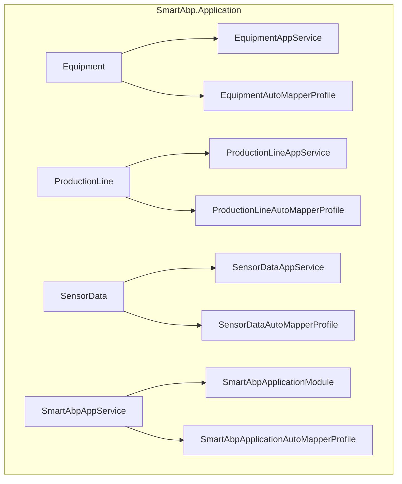
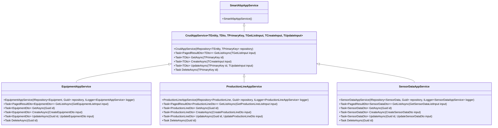
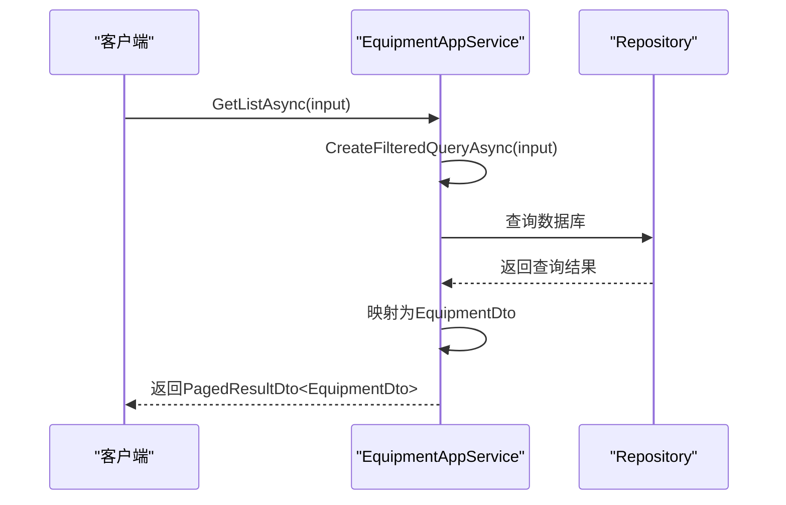
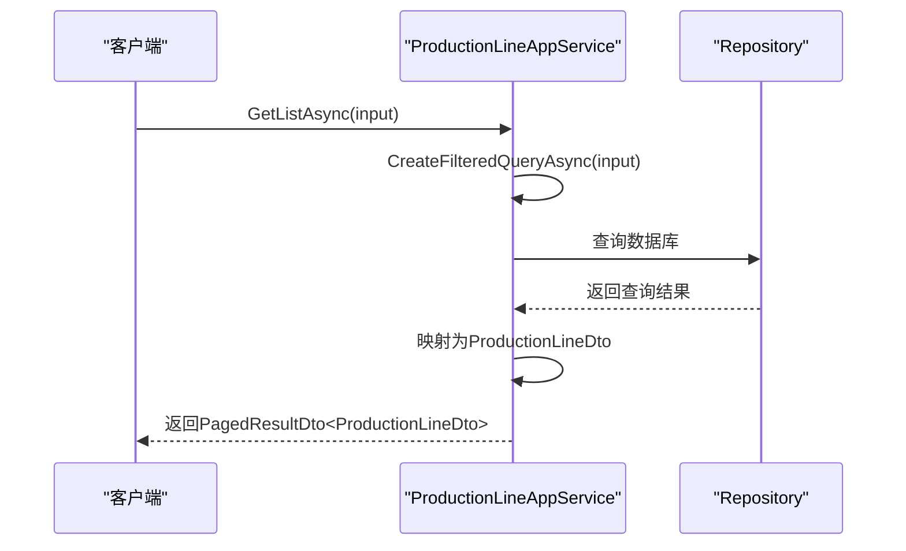
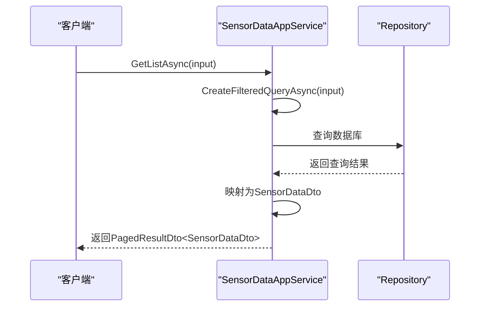

# 应用服务层

<cite>
**本文档引用的文件**
- [SmartAbpAppService.cs](file://src/SmartAbp.Application/SmartAbpAppService.cs)
- [SmartAbpApplicationModule.cs](file://src/SmartAbp.Application/SmartAbpApplicationModule.cs)
- [SmartAbpApplicationAutoMapperProfile.cs](file://src/SmartAbp.Application/SmartAbpApplicationAutoMapperProfile.cs)
- [EquipmentAppService.cs](file://src/SmartAbp.Application/Equipment/EquipmentAppService.cs)
- [EquipmentAutoMapperProfile.cs](file://src/SmartAbp.Application/Equipment/EquipmentAutoMapperProfile.cs)
- [ProductionLineAppService.cs](file://src/SmartAbp.Application/ProductionLine/ProductionLineAppService.cs)
- [ProductionLineAutoMapperProfile.cs](file://src/SmartAbp.Application/ProductionLine/ProductionLineAutoMapperProfile.cs)
- [SensorDataAppService.cs](file://src/SmartAbp.Application/SensorData/SensorDataAppService.cs)
- [SensorDataAutoMapperProfile.cs](file://src/SmartAbp.Application/SensorData/SensorDataAutoMapperProfile.cs)
- [IProductionLineAppService.cs](file://src/SmartAbp.Application.Contracts/ProductionLine/IProductionLineAppService.cs)
- [ProductionLineDto.cs](file://src/SmartAbp.Application.Contracts/ProductionLine/ProductionLineDto.cs)
- [CreateProductionLineDto.cs](file://src/SmartAbp.Application.Contracts/ProductionLine/CreateProductionLineDto.cs)
- [UpdateProductionLineDto.cs](file://src/SmartAbp.Application.Contracts/ProductionLine/UpdateProductionLineDto.cs)
- [GetProductionLineListInput.cs](file://src/SmartAbp.Application.Contracts/ProductionLine/GetProductionLineListInput.cs)
</cite>

## 目录
1. [简介](#简介)
2. [项目结构](#项目结构)
3. [核心组件](#核心组件)
4. [架构概述](#架构概述)
5. [详细组件分析](#详细组件分析)
6. [依赖分析](#依赖分析)
7. [性能考虑](#性能考虑)
8. [故障排除指南](#故障排除指南)
9. [结论](#结论)

## 简介
本文件详细解析了hxlot项目中SmartAbp.Application模块的应用服务层设计与实现。重点阐述了应用服务（AppService）在ABP框架中的角色和职责，以及其如何协调领域层和基础设施层来实现业务逻辑的编排。文档深入分析了应用服务的基类继承关系、依赖注入配置、权限验证机制，并以EquipmentAppService、ProductionLineAppService等具体服务为例，说明了CRUD操作的标准化处理、DTO转换和自动化映射配置。此外，还解释了应用服务与领域服务的协作方式，以及如何通过应用服务暴露领域逻辑。

## 项目结构
SmartAbp.Application模块是ABP框架中的应用层，负责协调领域层和基础设施层之间的交互，实现业务逻辑的编排。该模块包含多个子目录，每个子目录对应一个业务领域，如Equipment、ProductionLine、SensorData等。每个子目录下包含应用服务类和AutoMapper配置文件。

**图示来源**
- [SmartAbpAppService.cs](file://src/SmartAbp.Application/SmartAbpAppService.cs)
- [SmartAbpApplicationModule.cs](file://src/SmartAbp.Application/SmartAbpApplicationModule.cs)
- [SmartAbpApplicationAutoMapperProfile.cs](file://src/SmartAbp.Application/SmartAbpApplicationAutoMapperProfile.cs)
- [EquipmentAppService.cs](file://src/SmartAbp.Application/Equipment/EquipmentAppService.cs)
- [EquipmentAutoMapperProfile.cs](file://src/SmartAbp.Application/Equipment/EquipmentAutoMapperProfile.cs)
- [ProductionLineAppService.cs](file://src/SmartAbp.Application/ProductionLine/ProductionLineAppService.cs)
- [ProductionLineAutoMapperProfile.cs](file://src/SmartAbp.Application/ProductionLine/ProductionLineAutoMapperProfile.cs)
- [SensorDataAppService.cs](file://src/SmartAbp.Application/SensorData/SensorDataAppService.cs)
- [SensorDataAutoMapperProfile.cs](file://src/SmartAbp.Application/SensorData/SensorDataAutoMapperProfile.cs)

**章节来源**
- [SmartAbpAppService.cs](file://src/SmartAbp.Application/SmartAbpAppService.cs)
- [SmartAbpApplicationModule.cs](file://src/SmartAbp.Application/SmartAbpApplicationModule.cs)
- [SmartAbpApplicationAutoMapperProfile.cs](file://src/SmartAbp.Application/SmartAbpApplicationAutoMapperProfile.cs)

## 核心组件
SmartAbp.Application模块的核心组件包括应用服务基类SmartAbpAppService、应用模块SmartAbpApplicationModule和AutoMapper配置文件SmartAbpApplicationAutoMapperProfile。这些组件共同构成了应用层的基础，为具体的业务应用服务提供了支持。

**章节来源**
- [SmartAbpAppService.cs](file://src/SmartAbp.Application/SmartAbpAppService.cs)
- [SmartAbpApplicationModule.cs](file://src/SmartAbp.Application/SmartAbpApplicationModule.cs)
- [SmartAbpApplicationAutoMapperProfile.cs](file://src/SmartAbp.Application/SmartAbpApplicationAutoMapperProfile.cs)

## 架构概述
SmartAbp.Application模块的架构遵循ABP框架的设计原则，通过应用服务协调领域层和基础设施层之间的交互。应用服务继承自CrudAppService，实现了CRUD操作的标准化处理。AutoMapper配置文件用于DTO和实体之间的映射，确保数据的一致性。

**图示来源**
- [SmartAbpAppService.cs](file://src/SmartAbp.Application/SmartAbpAppService.cs)
- [EquipmentAppService.cs](file://src/SmartAbp.Application/Equipment/EquipmentAppService.cs)
- [ProductionLineAppService.cs](file://src/SmartAbp.Application/ProductionLine/ProductionLineAppService.cs)
- [SensorDataAppService.cs](file://src/SmartAbp.Application/SensorData/SensorDataAppService.cs)

## 详细组件分析
本节详细分析SmartAbp.Application模块中的各个组件，包括应用服务的实现模式、DTO转换和自动化映射配置。

### EquipmentAppService 分析
EquipmentAppService 是设备管理的应用服务，继承自CrudAppService，实现了设备的CRUD操作。通过重写CreateFilteredQueryAsync方法，实现了设备的筛选查询。

**图示来源**
- [EquipmentAppService.cs](file://src/SmartAbp.Application/Equipment/EquipmentAppService.cs)

**章节来源**
- [EquipmentAppService.cs](file://src/SmartAbp.Application/Equipment/EquipmentAppService.cs)

### ProductionLineAppService 分析
ProductionLineAppService 是生产线管理的应用服务，继承自CrudAppService，实现了生产线的CRUD操作。通过重写CreateFilteredQueryAsync方法，实现了生产线的筛选查询。

**图示来源**
- [ProductionLineAppService.cs](file://src/SmartAbp.Application/ProductionLine/ProductionLineAppService.cs)

**章节来源**
- [ProductionLineAppService.cs](file://src/SmartAbp.Application/ProductionLine/ProductionLineAppService.cs)

### SensorDataAppService 分析
SensorDataAppService 是传感器数据管理的应用服务，继承自CrudAppService，实现了传感器数据的CRUD操作。通过重写CreateFilteredQueryAsync方法，实现了传感器数据的筛选查询。

**图示来源**
- [SensorDataAppService.cs](file://src/SmartAbp.Application/SensorData/SensorDataAppService.cs)

**章节来源**
- [SensorDataAppService.cs](file://src/SmartAbp.Application/SensorData/SensorDataAppService.cs)

## 依赖分析
SmartAbp.Application模块依赖于SmartAbp.Domain、SmartAbp.Application.Contracts等模块，通过依赖注入配置，实现了组件之间的松耦合。

**图示来源**
- [SmartAbpApplicationModule.cs](file://src/SmartAbp.Application/SmartAbpApplicationModule.cs)

**章节来源**
- [SmartAbpApplicationModule.cs](file://src/SmartAbp.Application/SmartAbpApplicationModule.cs)

## 性能考虑
在应用服务层，性能优化主要体现在查询的筛选和分页处理上。通过重写CreateFilteredQueryAsync方法，可以在数据库层面进行筛选，减少数据传输量。此外，AutoMapper的配置也对性能有重要影响，合理的映射配置可以减少不必要的数据转换。

## 故障排除指南
在应用服务层，常见的问题包括DTO映射错误、依赖注入失败等。通过查看日志，可以快速定位问题。例如，EquipmentAppService中的日志记录了每次操作的详细信息，有助于排查问题。

**章节来源**
- [EquipmentAppService.cs](file://src/SmartAbp.Application/Equipment/EquipmentAppService.cs)
- [ProductionLineAppService.cs](file://src/SmartAbp.Application/ProductionLine/ProductionLineAppService.cs)
- [SensorDataAppService.cs](file://src/SmartAbp.Application/SensorData/SensorDataAppService.cs)

## 结论
SmartAbp.Application模块通过应用服务协调领域层和基础设施层之间的交互，实现了业务逻辑的编排。应用服务继承自CrudAppService，实现了CRUD操作的标准化处理。AutoMapper配置文件用于DTO和实体之间的映射，确保数据的一致性。通过合理的依赖注入配置，实现了组件之间的松耦合。在性能优化方面，通过在数据库层面进行筛选和分页处理，减少了数据传输量。在故障排除方面，通过详细的日志记录，可以快速定位问题。