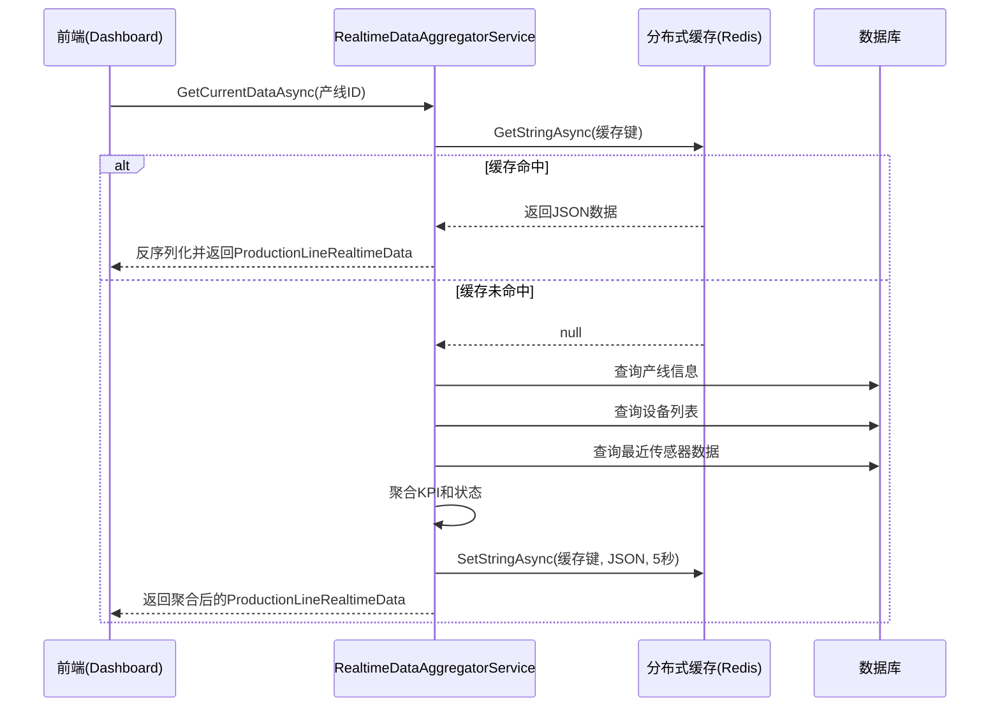

# 核心服务

<cite>
**本文档引用的文件**  
- [EquipmentAppService.cs](file://src/SmartAbp.Application/Equipment/EquipmentAppService.cs)
- [ProductionLineAppService.cs](file://src/SmartAbp.Application/ProductionLine/ProductionLineAppService.cs)
- [SensorDataAppService.cs](file://src/SmartAbp.Application/SensorData/SensorDataAppService.cs)
- [RealtimeDataAggregatorService.cs](file://src/SmartAbp.Application/RealtimeData/RealtimeDataAggregatorService.cs)
- [EquipmentAutoMapperProfile.cs](file://src/SmartAbp.Application/Equipment/EquipmentAutoMapperProfile.cs)
- [ProductionLineAutoMapperProfile.cs](file://src/SmartAbp.Application/ProductionLine/ProductionLineAutoMapperProfile.cs)
- [SensorDataAutoMapperProfile.cs](file://src/SmartAbp.Application/SensorData/SensorDataAutoMapperProfile.cs)
- [IEquipmentAppService.cs](file://src/SmartAbp.Application.Contracts/Equipment/IEquipmentAppService.cs)
- [IProductionLineAppService.cs](file://src/SmartAbp.Application.Contracts/ProductionLine/IProductionLineAppService.cs)
- [ISensorDataAppService.cs](file://src/SmartAbp.Application.Contracts/SensorData/ISensorDataAppService.cs)
- [ProductionLineRealtimeData.cs](file://src/SmartAbp.Application.Contracts/Realtime/ProductionLineRealtimeData.cs)
</cite>

## 目录
1. [引言](#引言)
2. [核心应用服务设计与实现](#核心应用服务设计与实现)
   - [设备应用服务 (EquipmentAppService)](#设备应用服务-equipmentappservice)
   - [产线应用服务 (ProductionLineAppService)](#产线应用服务-productionlineappservice)
   - [传感器数据应用服务 (SensorDataAppService)](#传感器数据应用服务-sensordataappservice)
3. [数据聚合与实时服务](#数据聚合与实时服务)
   - [实时数据聚合服务 (RealtimeDataAggregatorService)](#实时数据聚合服务-realtimedataaggregatorservice)
4. [数据映射与DTO配置](#数据映射与dto配置)
   - [AutoMapper 配置详解](#automapper-配置详解)
5. [服务调用关系与数据流](#服务调用关系与数据流)
6. [权限验证与异常处理](#权限验证与异常处理)
7. [典型业务场景示例](#典型业务场景示例)
8. [性能优化与缓存机制](#性能优化与缓存机制)
9. [结论](#结论)

## 引言
本文档深入解析hxlot项目中MES领域的核心应用服务，重点阐述`EquipmentAppService`、`ProductionLineAppService`和`SensorDataAppService`的设计与实现。这些服务构成了制造执行系统（MES）的基础，负责处理设备、产线和传感器数据的CRUD操作及核心业务逻辑。同时，文档将详细说明`RealtimeDataAggregatorService`如何整合多源数据，并提供关于DTO映射、权限、异常处理、性能优化等方面的全面技术细节。

## 核心应用服务设计与实现

### 设备应用服务 (EquipmentAppService)
`EquipmentAppService`是处理设备实体的核心应用服务，位于`src/SmartAbp.Application/Equipment/`目录下。它继承自ABP框架的`CrudAppService`，实现了对设备的完整CRUD操作。

该服务通过`IRepository<Domain.Entities.MES.Equipment, Guid>`与数据访问层交互，确保了数据持久化的可靠性。服务提供了分页、筛选和排序功能，支持根据设备名称、编号、状态、类型、所属产线、启用状态和在线状态进行复合查询。

服务方法均集成了日志记录，便于追踪操作。例如，创建设备时会记录设备名称和编号，更新和删除操作也会记录相应的ID，为系统监控和审计提供了支持。

**Section sources**
- [EquipmentAppService.cs](file://src/SmartAbp.Application/Equipment/EquipmentAppService.cs#L12-L95)
- [IEquipmentAppService.cs](file://src/SmartAbp.Application.Contracts/Equipment/IEquipmentAppService.cs)

### 产线应用服务 (ProductionLineAppService)
`ProductionLineAppService`位于`src/SmartAbp.Application/ProductionLine/`目录，是产线管理模块的核心。与设备服务类似，它也继承自`CrudAppService`，并实现了`IProductionLineAppService`接口。

该服务支持通过关键词（名称、编号）、状态、类型和启用状态对产线列表进行筛选。其CRUD操作（获取列表、获取详情、创建、更新、删除）均已实现，并通过重写基类方法添加了详细的日志信息，记录了操作的输入参数和结果统计。

服务的实现遵循了ABP框架的最佳实践，利用基类的自动映射和持久化能力，开发者只需关注业务逻辑和查询条件的定制，极大地提高了开发效率和代码一致性。

**Section sources**
- [ProductionLineAppService.cs](file://src/SmartAbp.Application/ProductionLine/ProductionLineAppService.cs#L17-L213)
- [IProductionLineAppService.cs](file://src/SmartAbp.Application.Contracts/ProductionLine/IProductionLineAppService.cs)

### 传感器数据应用服务 (SensorDataAppService)
`SensorDataAppService`负责处理来自工厂现场的传感器数据，位于`src/SmartAbp.Application/SensorData/`目录。它同样基于`CrudAppService`构建，提供了对传感器数据的增删改查能力。

该服务的查询功能非常丰富，支持按传感器名称、编号、类型、所属产线、所属设备、是否报警以及时间范围（开始时间和结束时间）进行筛选。这使得系统能够灵活地查询特定时间段内特定设备或产线的传感器数据，为数据分析和故障诊断提供了基础。

所有操作，包括创建、更新和删除，都伴随着详细的日志记录，确保了数据操作的可追溯性。

**Section sources**
- [SensorDataAppService.cs](file://src/SmartAbp.Application/SensorData/SensorDataAppService.cs#L12-L100)
- [ISensorDataAppService.cs](file://src/SmartAbp.Application.Contracts/SensorData/ISensorDataAppService.cs)

## 数据聚合与实时服务

### 实时数据聚合服务 (RealtimeDataAggregatorService)
`RealtimeDataAggregatorService`是系统中一个关键的聚合服务，位于`src/SmartAbp.Application/RealtimeData/`目录。它不直接处理CRUD，而是从`ProductionLineAppService`、`EquipmentAppService`和`SensorDataAppService`所依赖的数据源中聚合实时数据，为前端Dashboard提供统一的实时视图。

该服务通过依赖注入获取`IRepository<MesProductionLine, Guid>`、`IRepository<MesEquipment, Guid>`和`IRepository<MesSensorData, Guid>`，直接访问底层数据，避免了服务间的循环调用。

#### 核心功能
1.  **数据聚合**：`AggregateDataFromDatabaseAsync`方法是核心。它接收产线ID，查询该产线及其所有设备，并统计运行中、待机和故障设备的数量。同时，它会查询最近10分钟内的传感器数据，用于计算当前功率和累计能耗。
2.  **缓存机制**：服务使用`IDistributedCache`（如Redis）来缓存聚合结果。`GetCurrentDataAsync`方法首先尝试从缓存获取数据，如果未命中，则从数据库聚合并写入缓存（默认5秒过期）。这极大地减轻了数据库的查询压力，保证了实时数据的快速响应。
3.  **数据刷新**：`RefreshDataAsync`方法允许外部触发（如后台任务或WebSocket消息）来主动刷新指定产线的缓存数据，确保前端显示的数据是最新的。

**Diagram sources**
- [RealtimeDataAggregatorService.cs](file://src/SmartAbp.Application/RealtimeData/RealtimeDataAggregatorService.cs#L29-L262)

**Section sources**
- [RealtimeDataAggregatorService.cs](file://src/SmartAbp.Application/RealtimeData/RealtimeDataAggregatorService.cs#L29-L262)
- [ProductionLineRealtimeData.cs](file://src/SmartAbp.Application.Contracts/Realtime/ProductionLineRealtimeData.cs)

## 数据映射与DTO配置

### AutoMapper 配置详解
AutoMapper在本项目中用于在领域实体（Entity）和数据传输对象（DTO）之间进行自动映射，减少了手动赋值的样板代码。

#### 设备服务映射 (EquipmentAutoMapperProfile)
位于`src/SmartAbp.Application/Equipment/EquipmentAutoMapperProfile.cs`。配置了`Equipment`实体与`EquipmentDto`之间的双向映射。
*   **CreateEquipmentDto → Equipment**：在创建时，忽略审计字段（如CreationTime、CreatorId），并为`Status`、`HealthStatus`、`IsOnline`等字段设置默认值（分别为"stopped"、"healthy"、false），同时设置`LastUpdateTime`为当前时间。
*   **UpdateEquipmentDto → Equipment**：在更新时，同样忽略审计字段，并更新`LastUpdateTime`。

#### 产线服务映射 (ProductionLineAutoMapperProfile)
位于`src/SmartAbp.Application/ProductionLine/ProductionLineAutoMapperProfile.cs`。配置了`ProductionLine`实体与`ProductionLineDto`之间的映射。
*   **CreateProductionLineDto → ProductionLine**：除了忽略审计字段和导航属性外，还为多个KPI指标设置了合理的初始值，如`Status`为"stopped"，`TotalProduction`、`DailyProduction`、`CurrentEfficiency`等为0，`QualifiedRate`为100.0。
*   **UpdateProductionLineDto → ProductionLine**：更新时忽略审计字段，并设置`LastUpdateTime`。

#### 传感器数据映射 (SensorDataAutoMapperProfile)
位于`src/SmartAbp.Application/SensorData/SensorDataAutoMapperProfile.cs`。配置了`MesSensorData`实体与`SensorDataDto`之间的映射。
*   **CreateSensorDataDto → MesSensorData**：创建时，忽略审计字段和导航属性，并将`Timestamp`映射为`DateTime.UtcNow`，`Quality`和`IsAlarm`设置默认值（"good"和false）。
*   **UpdateSensorDataDto → MesSensorData**：更新时，忽略审计字段和导航属性，`Timestamp`保持不变。

**Section sources**
- [EquipmentAutoMapperProfile.cs](file://src/SmartAbp.Application/Equipment/EquipmentAutoMapperProfile.cs)
- [ProductionLineAutoMapperProfile.cs](file://src/SmartAbp.Application/ProductionLine/ProductionLineAutoMapperProfile.cs)
- [SensorDataAutoMapperProfile.cs](file://src/SmartAbp.Application/SensorData/SensorDataAutoMapperProfile.cs)

## 服务调用关系与数据流
在典型的业务场景中，服务间的调用关系清晰。例如，当需要展示一个产线的完整实时视图时：
1.  前端调用`RealtimeDataAggregatorService.GetCurrentDataAsync`。
2.  聚合服务首先查询`ProductionLine`实体获取基本信息和KPI。
3.  然后查询`Equipment`实体列表，统计设备状态。
4.  最后查询`SensorData`实体，获取能耗等实时指标。
5.  聚合服务将所有数据整合成`ProductionLineRealtimeData` DTO并返回。

这种设计模式将数据聚合的逻辑集中在一个服务中，避免了前端进行多次API调用或后端服务间的复杂链式调用，简化了数据流，提高了系统性能和可维护性。

## 权限验证与异常处理
虽然核心服务代码中未直接体现权限验证逻辑，但ABP框架通过`[Authorize]`特性在应用服务层或HTTP API控制器层统一处理。权限定义在`SmartAbpPermissions.cs`中，确保了只有授权用户才能执行创建、更新、删除等敏感操作。

异常处理方面，`RealtimeDataAggregatorService`展示了良好的实践。在`GetCurrentDataAsync`和`RefreshDataAsync`方法中，使用了`try-catch`块捕获所有异常，并通过`ILogger`记录详细的错误信息，同时向调用方返回`null`或忽略错误，保证了服务的健壮性，避免因单个产线数据问题导致整个服务不可用。其他CRUD服务则依赖ABP框架的全局异常处理机制，将数据库异常等转换为用户友好的错误响应。

## 典型业务场景示例

### 设备状态更新
当设备状态发生变化时，前端或PLC系统调用`EquipmentAppService.UpdateAsync`，传入设备ID和新的状态。服务会记录日志，并通过仓储层更新数据库中的设备记录。

### 产线数据聚合
`RealtimeDataAggregatorService`通过`AggregateDataFromDatabaseAsync`方法，从`ProductionLine`、`Equipment`和`SensorData`三个数据源聚合数据，计算出运行设备数、故障设备数、当前功率等KPI，形成一个完整的`ProductionLineRealtimeData`对象。

### 实时数据推送
前端Dashboard通过SignalR连接到后端。后端可以定期（如每5秒）调用`RealtimeDataAggregatorService.GetCurrentDataAsync`获取最新数据，并通过SignalR Hub将`ProductionLineRealtimeData`对象推送给所有连接的客户端，实现数据的实时更新。

## 性能优化与缓存机制
性能优化是本系统设计的重点。
*   **分布式缓存**：`RealtimeDataAggregatorService`使用`IDistributedCache`缓存聚合结果，有效期5秒。这将高频的实时数据查询从数据库转移到内存，显著降低了数据库负载，提升了API响应速度。
*   **高效查询**：所有应用服务在`CreateFilteredQueryAsync`中都使用了`IQueryable`进行延迟加载和数据库端的筛选，避免了将大量数据加载到内存后再过滤，减少了网络传输和内存消耗。
*   **日志级别控制**：服务中使用了不同级别的日志（`LogInformation`用于操作记录，`LogDebug`用于缓存命中等细节，`LogError`用于异常），便于在生产环境中调整日志输出，平衡监控需求和性能开销。

## 结论
hxlot项目的核心应用服务设计精良，充分利用了ABP框架的`CrudAppService`基类，实现了高效、一致的CRUD操作。`RealtimeDataAggregatorService`作为数据聚合中心，通过引入缓存机制，有效解决了实时数据查询的性能瓶颈。AutoMapper的合理配置保证了实体与DTO之间转换的准确性和便捷性。整体架构清晰，服务职责分明，为MES系统的稳定运行和高效扩展奠定了坚实的基础。