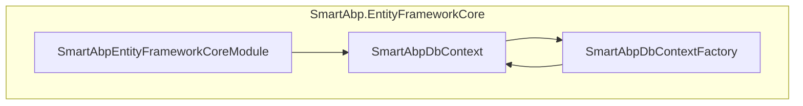
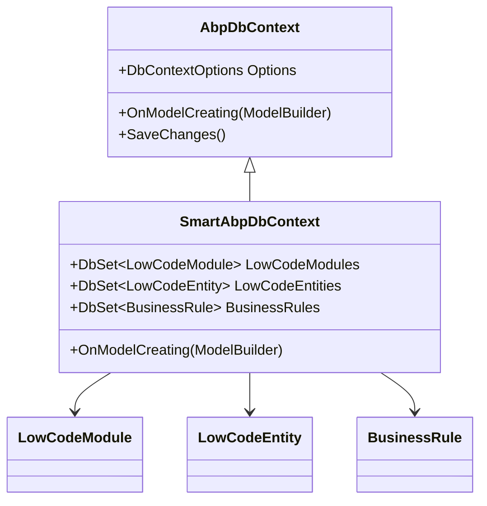
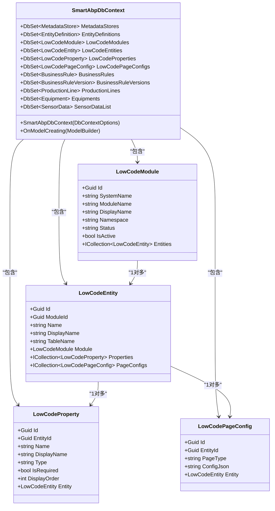
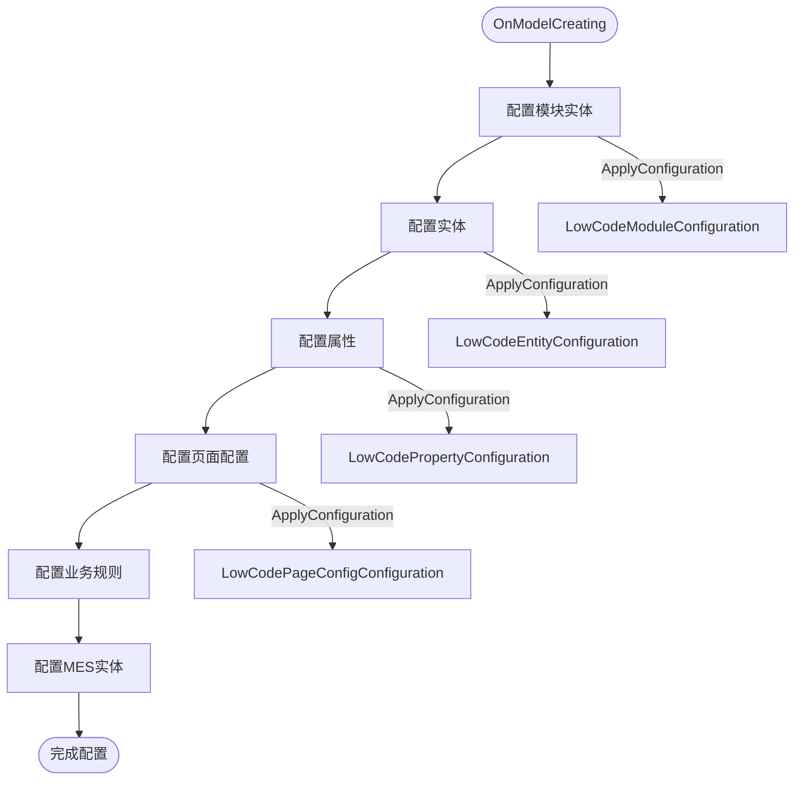
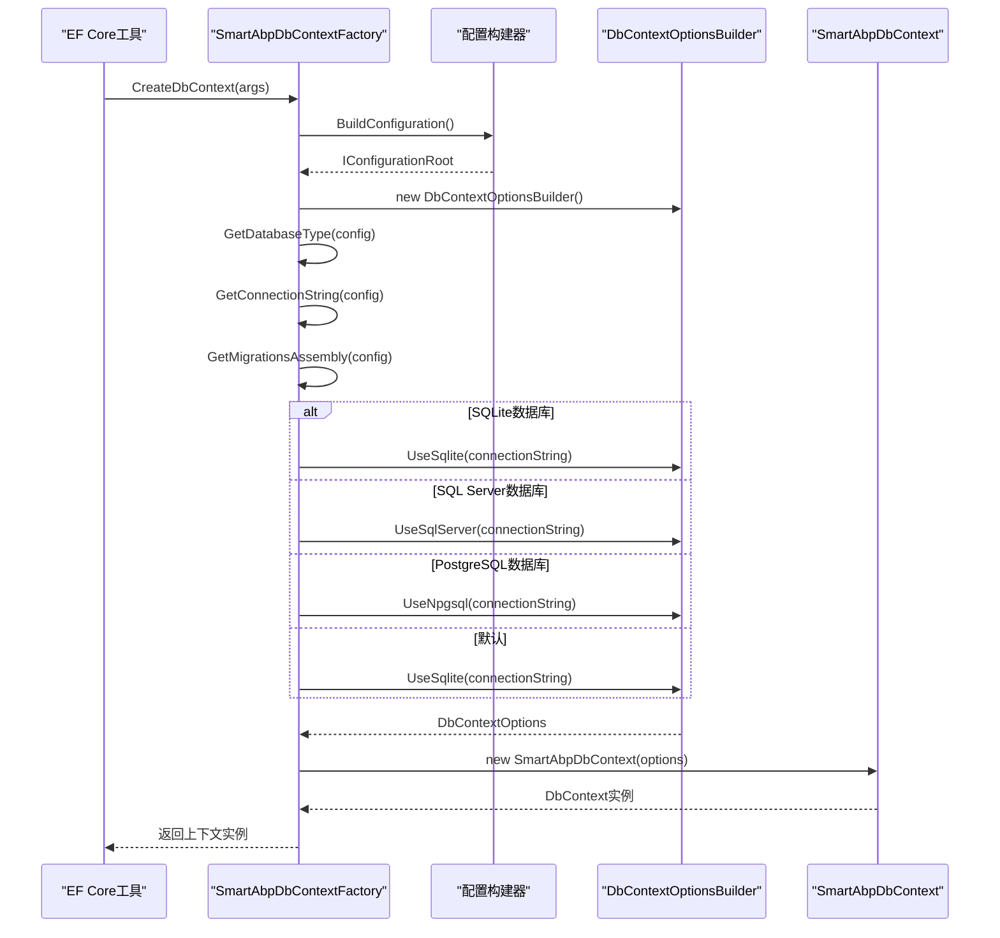
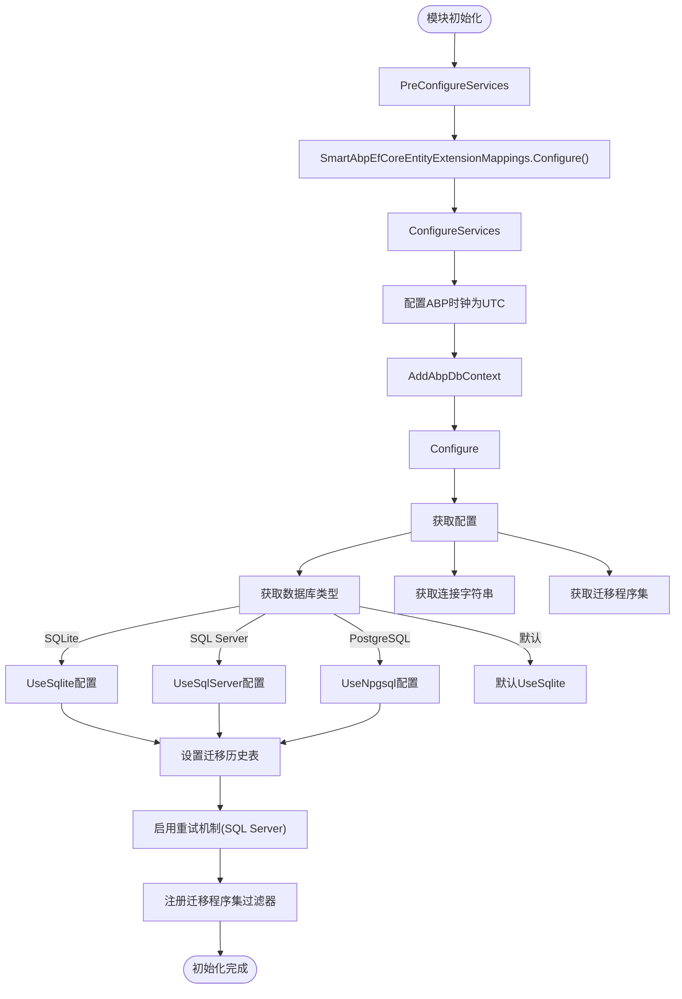
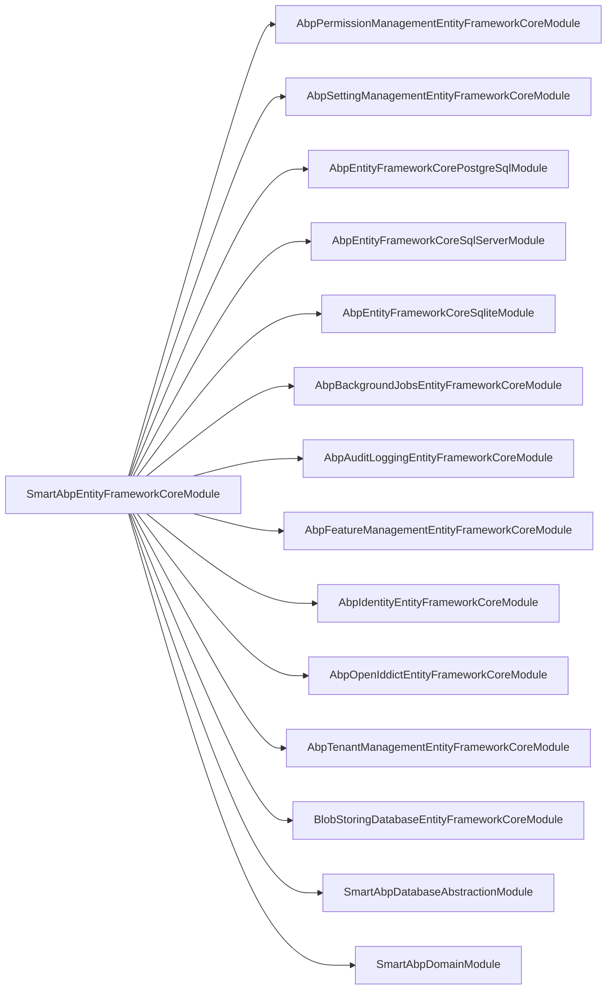

# 上下文设计

<cite>
**本文档中引用的文件**  
- [SmartAbpDbContext.cs](file://src/SmartAbp.EntityFrameworkCore/EntityFrameworkCore/SmartAbpDbContext.cs)
- [SmartAbpDbContextFactory.cs](file://src/SmartAbp.EntityFrameworkCore/EntityFrameworkCore/SmartAbpDbContextFactory.cs)
- [SmartAbpEntityFrameworkCoreModule.cs](file://src/SmartAbp.EntityFrameworkCore/EntityFrameworkCore/SmartAbpEntityFrameworkCoreModule.cs)
- [LowCodeModule.cs](file://src/SmartAbp.Domain/Entities/LowCode/LowCodeModule.cs)
- [LowCodeEntity.cs](file://src/SmartAbp.Domain/Entities/LowCode/LowCodeEntity.cs)
</cite>

## 目录
1. [简介](#简介)
2. [项目结构](#项目结构)
3. [核心组件](#核心组件)
4. [架构概述](#架构概述)
5. [详细组件分析](#详细组件分析)
6. [依赖分析](#依赖分析)
7. [性能考虑](#性能考虑)
8. [故障排除指南](#故障排除指南)
9. [结论](#结论)

## 简介
本文档深入解析hxlot项目中数据访问层上下文的设计原理，重点分析`SmartAbpDbContext`类的设计与实现机制。文档涵盖其继承自`AbpDbContext`的特性、与ABP框架的集成方式、上下文工厂模式的应用、依赖注入配置以及上下文模块的生命周期管理。同时提供上下文使用中的最佳实践建议。

## 项目结构
hxlot项目的上下文设计主要集中在`SmartAbp.EntityFrameworkCore`模块中，该模块负责数据访问层的核心实现。上下文相关类位于`EntityFrameworkCore`命名空间下，包括上下文类、工厂类和模块类。

**图示来源**  
- [SmartAbpDbContext.cs](file://src/SmartAbp.EntityFrameworkCore/EntityFrameworkCore/SmartAbpDbContext.cs)
- [SmartAbpDbContextFactory.cs](file://src/SmartAbp.EntityFrameworkCore/EntityFrameworkCore/SmartAbpDbContextFactory.cs)
- [SmartAbpEntityFrameworkCoreModule.cs](file://src/SmartAbp.EntityFrameworkCore/EntityFrameworkCore/SmartAbpEntityFrameworkCoreModule.cs)

**章节来源**  
- [SmartAbpDbContext.cs](file://src/SmartAbp.EntityFrameworkCore/EntityFrameworkCore/SmartAbpDbContext.cs)
- [SmartAbpDbContextFactory.cs](file://src/SmartAbp.EntityFrameworkCore/EntityFrameworkCore/SmartAbpDbContextFactory.cs)
- [SmartAbpEntityFrameworkCoreModule.cs](file://src/SmartAbp.EntityFrameworkCore/EntityFrameworkCore/SmartAbpEntityFrameworkCoreModule.cs)

## 核心组件
`SmartAbpDbContext`是数据访问层的核心组件，继承自ABP框架的`AbpDbContext`，实现了`ITenantManagementDbContext`和`IIdentityDbContext`接口。该上下文通过`ReplaceDbContext`属性替换ABP框架的默认上下文，实现统一的数据访问。

**章节来源**  
- [SmartAbpDbContext.cs](file://src/SmartAbp.EntityFrameworkCore/EntityFrameworkCore/SmartAbpDbContext.cs)

## 架构概述
`SmartAbpDbContext`的设计体现了ABP框架的模块化和可扩展性特点。通过继承`AbpDbContext`，获得了ABP框架提供的审计日志、软删除、多租户等开箱即用的功能。

**图示来源**  
- [SmartAbpDbContext.cs](file://src/SmartAbp.EntityFrameworkCore/EntityFrameworkCore/SmartAbpDbContext.cs)
- [LowCodeModule.cs](file://src/SmartAbp.Domain/Entities/LowCode/LowCodeModule.cs)
- [LowCodeEntity.cs](file://src/SmartAbp.Domain/Entities/LowCode/LowCodeEntity.cs)

## 详细组件分析

### SmartAbpDbContext分析
`SmartAbpDbContext`类通过`DbSet`属性映射到具体的领域实体，如`LowCodeModule`、`LowCodeEntity`等。每个`DbSet`属性对应数据库中的一个表。

#### 类图分析

**图示来源**  
- [SmartAbpDbContext.cs](file://src/SmartAbp.EntityFrameworkCore/EntityFrameworkCore/SmartAbpDbContext.cs)
- [LowCodeModule.cs](file://src/SmartAbp.Domain/Entities/LowCode/LowCodeModule.cs)
- [LowCodeEntity.cs](file://src/SmartAbp.Domain/Entities/LowCode/LowCodeEntity.cs)

#### 实体映射配置
在`OnModelCreating`方法中，通过Fluent API配置实体映射关系。对于`LowCodeModule`、`LowCodeEntity`等核心实体，使用了独立的配置类进行配置。

**图示来源**  
- [SmartAbpDbContext.cs](file://src/SmartAbp.EntityFrameworkCore/EntityFrameworkCore/SmartAbpDbContext.cs)

**章节来源**  
- [SmartAbpDbContext.cs](file://src/SmartAbp.EntityFrameworkCore/EntityFrameworkCore/SmartAbpDbContext.cs)

### SmartAbpDbContextFactory分析
`SmartAbpDbContextFactory`实现了`IDesignTimeDbContextFactory`接口，用于EF Core命令行工具在设计时创建上下文实例。

#### 序列图分析

**图示来源**  
- [SmartAbpDbContextFactory.cs](file://src/SmartAbp.EntityFrameworkCore/EntityFrameworkCore/SmartAbpDbContextFactory.cs)

**章节来源**  
- [SmartAbpDbContextFactory.cs](file://src/SmartAbp.EntityFrameworkCore/EntityFrameworkCore/SmartAbpDbContextFactory.cs)

### SmartAbpEntityFrameworkCoreModule分析
`SmartAbpEntityFrameworkCoreModule`是EF Core模块的启动模块，负责上下文的依赖注入配置和生命周期管理。

#### 初始化流程

**图示来源**  
- [SmartAbpEntityFrameworkCoreModule.cs](file://src/SmartAbp.EntityFrameworkCore/EntityFrameworkCore/SmartAbpEntityFrameworkCoreModule.cs)

**章节来源**  
- [SmartAbpEntityFrameworkCoreModule.cs](file://src/SmartAbp.EntityFrameworkCore/EntityFrameworkCore/SmartAbpEntityFrameworkCoreModule.cs)

## 依赖分析
`SmartAbpDbContext`依赖于ABP框架的多个模块，通过`[DependsOn]`属性声明了对这些模块的依赖关系。

**图示来源**  
- [SmartAbpEntityFrameworkCoreModule.cs](file://src/SmartAbp.EntityFrameworkCore/EntityFrameworkCore/SmartAbpEntityFrameworkCoreModule.cs)

**章节来源**  
- [SmartAbpEntityFrameworkCoreModule.cs](file://src/SmartAbp.EntityFrameworkCore/EntityFrameworkCore/SmartAbpEntityFrameworkCoreModule.cs)

## 性能考虑
在上下文设计中，考虑了多数据库支持的性能优化。通过为不同数据库类型使用独立的迁移文件夹和迁移历史表，避免了迁移冲突。同时，在SQL Server配置中启用了瞬态错误重试机制，提高了数据库操作的可靠性。

**章节来源**  
- [SmartAbpEntityFrameworkCoreModule.cs](file://src/SmartAbp.EntityFrameworkCore/EntityFrameworkCore/SmartAbpEntityFrameworkCoreModule.cs)

## 故障排除指南
当遇到数据库迁移问题时，应检查`appsettings.json`中的数据库配置，确保`Database:Type`设置正确。对于EF Core命令行工具问题，确保`SmartAbp.DbMigrator`项目的`appsettings.json`文件存在且配置正确。

**章节来源**  
- [SmartAbpDbContextFactory.cs](file://src/SmartAbp.EntityFrameworkCore/EntityFrameworkCore/SmartAbpDbContextFactory.cs)
- [SmartAbpEntityFrameworkCoreModule.cs](file://src/SmartAbp.EntityFrameworkCore/EntityFrameworkCore/SmartAbpEntityFrameworkCoreModule.cs)

## 结论
`SmartAbpDbContext`的设计充分体现了ABP框架的模块化和可扩展性特点。通过继承`AbpDbContext`，获得了ABP框架提供的丰富功能。上下文工厂模式支持多数据库环境，模块化配置实现了灵活的依赖注入。整体设计遵循了领域驱动设计原则，为低代码平台提供了坚实的数据访问基础。