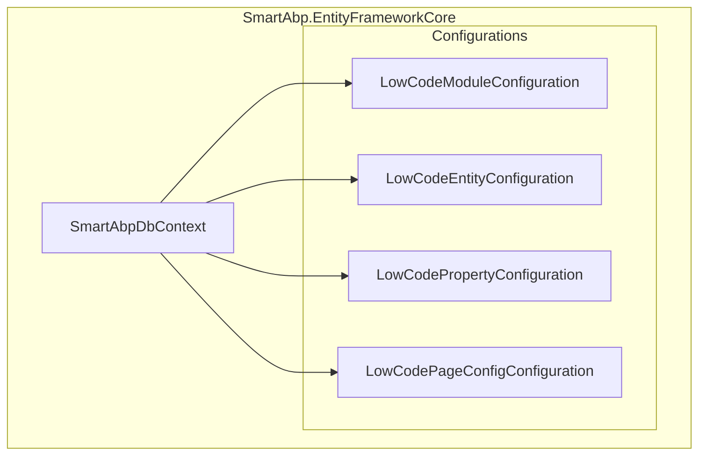
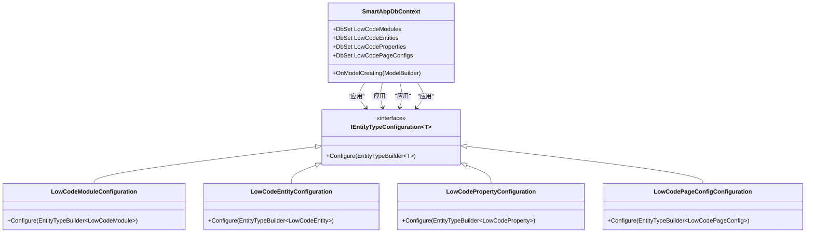
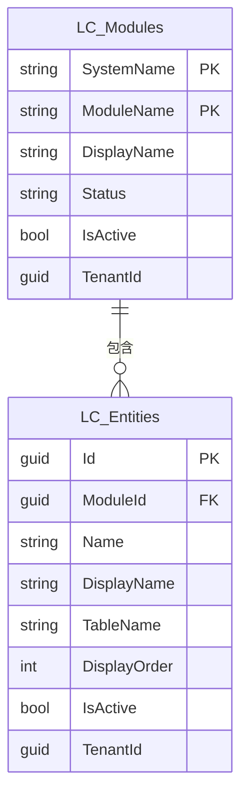
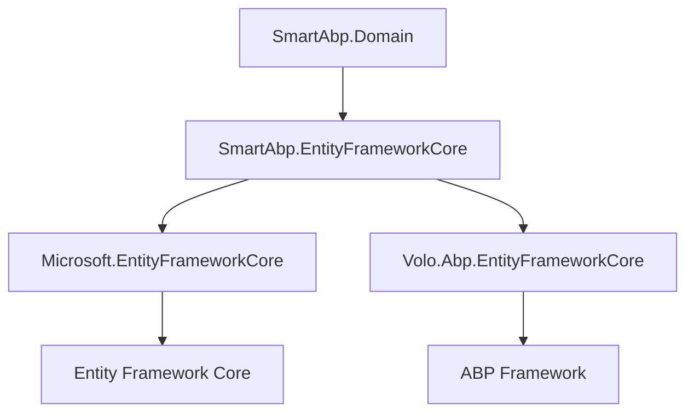

# 实体映射

<cite>
**本文档引用的文件**  
- [LowCodeModuleConfiguration.cs](file://src/SmartAbp.EntityFrameworkCore/Configurations/LowCodeModuleConfiguration.cs)
- [LowCodeEntityConfiguration.cs](file://src/SmartAbp.EntityFrameworkCore/Configurations/LowCodeEntityConfiguration.cs)
- [LowCodePropertyConfiguration.cs](file://src/SmartAbp.EntityFrameworkCore/Configurations/LowCodePropertyConfiguration.cs)
- [LowCodePageConfigConfiguration.cs](file://src/SmartAbp.EntityFrameworkCore/Configurations/LowCodePageConfigConfiguration.cs)
- [SmartAbpDbContext.cs](file://src/SmartAbp.EntityFrameworkCore/EntityFrameworkCore/SmartAbpDbContext.cs)
- [LowCodeModule.cs](file://src/SmartAbp.Domain/Entities/LowCode/LowCodeModule.cs)
- [LowCodeEntity.cs](file://src/SmartAbp.Domain/Entities/LowCode/LowCodeEntity.cs)
- [LowCodeProperty.cs](file://src/SmartAbp.Domain/Entities/LowCode/LowCodeProperty.cs)
- [LowCodePageConfig.cs](file://src/SmartAbp.Domain/Entities/LowCode/LowCodePageConfig.cs)
</cite>

## 目录
1. [引言](#引言)
2. [项目结构](#项目结构)
3. [核心组件](#核心组件)
4. [架构概述](#架构概述)
5. [详细组件分析](#详细组件分析)
6. [依赖分析](#依赖分析)
7. [性能考虑](#性能考虑)
8. [故障排除指南](#故障排除指南)
9. [结论](#结论)

## 引言
本文档深入解析hxlot项目中基于EF Core的实体映射机制，重点阐述低代码模块（LowCode）中实体与数据库表之间的映射关系。通过分析`LowCodeModuleConfiguration`、`LowCodeEntityConfiguration`等配置类，详细说明表名、架构、字段类型、长度、默认值等属性的配置方法。同时，探讨导航属性、外键约束、一对多、多对多等复杂关系的配置实现，以及索引和唯一约束的配置策略。文档还解释了如何通过`OnModelCreating`方法批量注册配置，并提供实体映射的最佳实践建议。

## 项目结构
hxlot项目采用分层架构，实体映射配置主要位于`SmartAbp.EntityFrameworkCore`项目下的`Configurations`目录中。核心低代码实体包括`LowCodeModule`、`LowCodeEntity`、`LowCodeProperty`和`LowCodePageConfig`，分别对应数据库中的`LC_Modules`、`LC_Entities`、`LC_Properties`和`LC_PageConfigs`表。这些实体的映射配置通过实现`IEntityTypeConfiguration<T>`接口完成，并在`SmartAbpDbContext`的`OnModelCreating`方法中统一注册。



**图示来源**
- [LowCodeModuleConfiguration.cs](file://src/SmartAbp.EntityFrameworkCore/Configurations/LowCodeModuleConfiguration.cs)
- [LowCodeEntityConfiguration.cs](file://src/SmartAbp.EntityFrameworkCore/Configurations/LowCodeEntityConfiguration.cs)
- [LowCodePropertyConfiguration.cs](file://src/SmartAbp.EntityFrameworkCore/Configurations/LowCodePropertyConfiguration.cs)
- [LowCodePageConfigConfiguration.cs](file://src/SmartAbp.EntityFrameworkCore/Configurations/LowCodePageConfigConfiguration.cs)
- [SmartAbpDbContext.cs](file://src/SmartAbp.EntityFrameworkCore/EntityFrameworkCore/SmartAbpDbContext.cs)

**章节来源**
- [SmartAbpDbContext.cs](file://src/SmartAbp.EntityFrameworkCore/EntityFrameworkCore/SmartAbpDbContext.cs#L101-L459)

## 核心组件
核心组件包括四个低代码实体及其对应的配置类：`LowCodeModule`（低代码模块）、`LowCodeEntity`（低代码实体）、`LowCodeProperty`（低代码属性）和`LowCodePageConfig`（低代码页面配置）。每个实体都定义了丰富的属性，包括基础信息、数据库映射、JSON配置、状态管理和导航属性。其配置类则通过Fluent API精确控制实体与数据库表之间的映射关系。

**章节来源**
- [LowCodeModule.cs](file://src/SmartAbp.Domain/Entities/LowCode/LowCodeModule.cs)
- [LowCodeEntity.cs](file://src/SmartAbp.Domain/Entities/LowCode/LowCodeEntity.cs)
- [LowCodeProperty.cs](file://src/SmartAbp.Domain/Entities/LowCode/LowCodeProperty.cs)
- [LowCodePageConfig.cs](file://src/SmartAbp.Domain/Entities/LowCode/LowCodePageConfig.cs)

## 架构概述
系统采用领域驱动设计（DDD）和低代码架构，实体映射是连接领域模型与数据库的关键环节。`SmartAbpDbContext`作为EF Core的上下文，负责管理所有实体的生命周期。通过`ApplyConfiguration`方法，将分散在不同配置类中的映射规则集中应用，实现了配置的分离与复用。这种设计提高了代码的可维护性和可读性。



**图示来源**
- [SmartAbpDbContext.cs](file://src/SmartAbp.EntityFrameworkCore/EntityFrameworkCore/SmartAbpDbContext.cs#L101-L459)
- [LowCodeModuleConfiguration.cs](file://src/SmartAbp.EntityFrameworkCore/Configurations/LowCodeModuleConfiguration.cs#L11-L77)
- [LowCodeEntityConfiguration.cs](file://src/SmartAbp.EntityFrameworkCore/Configurations/LowCodeEntityConfiguration.cs#L11-L72)
- [LowCodePropertyConfiguration.cs](file://src/SmartAbp.EntityFrameworkCore/Configurations/LowCodePropertyConfiguration.cs#L16-L202)
- [LowCodePageConfigConfiguration.cs](file://src/SmartAbp.EntityFrameworkCore/Configurations/LowCodePageConfigConfiguration.cs#L17-L131)

## 详细组件分析

### LowCodeModuleConfiguration 分析
该配置类定义了`LowCodeModule`实体与`LC_Modules`表的映射关系。

#### 表名与架构
使用`ToTable("LC_Modules")`方法将实体映射到指定的数据库表名。

#### 字段类型与长度
通过`Property`方法配置字段的长度和是否必填。例如，`SystemName`、`ModuleName`等字符串字段均设置了最大长度限制。

#### JSON字段配置
对于`ArchitectureConfig`、`FrontendConfig`等复杂对象，使用`HasConversion`方法将其序列化为JSON字符串存储在数据库中，并指定`JsonSerializerOptions`以确保序列化的一致性。

#### 索引与唯一约束
配置了多个索引以优化查询性能：
- `IX_LC_Modules_SystemName_ModuleName`：确保`SystemName`、`ModuleName`和`TenantId`的组合唯一。
- `IX_LC_Modules_Status`和`IX_LC_Modules_IsActive`：为状态字段创建索引。

#### 导航属性与外键约束
通过`HasMany`和`WithOne`方法配置了一对多关系，`LowCodeModule`可以包含多个`LowCodeEntity`。外键为`LowCodeEntity`的`ModuleId`，并设置级联删除行为（`DeleteBehavior.Cascade`），即删除模块时，其下的所有实体也会被删除。



**图示来源**
- [LowCodeModuleConfiguration.cs](file://src/SmartAbp.EntityFrameworkCore/Configurations/LowCodeModuleConfiguration.cs#L11-L77)
- [LowCodeEntityConfiguration.cs](file://src/SmartAbp.EntityFrameworkCore/Configurations/LowCodeEntityConfiguration.cs#L11-L72)

**章节来源**
- [LowCodeModuleConfiguration.cs](file://src/SmartAbp.EntityFrameworkCore/Configurations/LowCodeModuleConfiguration.cs#L11-L77)

### LowCodeEntityConfiguration 分析
该配置类定义了`LowCodeEntity`实体与`LC_Entities`表的映射关系。

#### 表名与架构
使用`ToTable("LC_Entities")`方法将实体映射到指定的数据库表名。

#### 字段类型与长度
同样使用`Property`方法配置字段的长度和是否必填。`Name`、`DisplayName`、`TableName`等字段均有明确的长度限制。

#### JSON字段配置
`EntityConfig`和`UIConfig`两个复杂对象也通过`HasConversion`方法序列化为JSON存储。

#### 索引与唯一约束
配置了以下索引：
- `IX_LC_Entities_ModuleId_Name`：确保`ModuleId`、`Name`和`TenantId`的组合唯一。
- `IX_LC_Entities_DisplayOrder`和`IX_LC_Entities_IsActive`：为显示顺序和激活状态创建索引。

#### 导航属性与外键约束
配置了双向的一对多关系：
- `HasOne(e => e.Module).WithMany(e => e.Entities)`：一个实体属于一个模块。
- `HasMany(e => e.Properties).WithOne(e => e.Entity)`：一个实体可以有多个属性。
- `HasMany(e => e.PageConfigs).WithOne(e => e.Entity)`：一个实体可以有多个页面配置。
所有外键均设置为级联删除。

```mermaid
erDiagram
LC_Entities ||--o{ LC_Properties : "包含"
LC_Entities ||--o{ LC_PageConfigs : "包含"
LC_Entities {
guid Id PK
guid ModuleId FK
string Name
string DisplayName
string TableName
int DisplayOrder
bool IsActive
guid TenantId
}
LC_Properties {
guid Id PK
guid EntityId FK
string Name
string DisplayName
string Type
string ColumnName
string ColumnType
bool IsKey
bool IsRequired
bool IsUnique
bool IsForeignKey
int DisplayOrder
guid TenantId
}
LC_PageConfigs {
guid Id PK
guid EntityId FK
string Name
string DisplayName
string PageType
string PageConfig JSON
bool IsPublished
string Status
guid TenantId
}
```

**图示来源**
- [LowCodeEntityConfiguration.cs](file://src/SmartAbp.EntityFrameworkCore/Configurations/LowCodeEntityConfiguration.cs#L11-L72)
- [LowCodePropertyConfiguration.cs](file://src/SmartAbp.EntityFrameworkCore/Configurations/LowCodePropertyConfiguration.cs#L16-L202)
- [LowCodePageConfigConfiguration.cs](file://src/SmartAbp.EntityFrameworkCore/Configurations/LowCodePageConfigConfiguration.cs#L17-L131)

**章节来源**
- [LowCodeEntityConfiguration.cs](file://src/SmartAbp.EntityFrameworkCore/Configurations/LowCodeEntityConfiguration.cs#L11-L72)

### LowCodePropertyConfiguration 分析
该配置类定义了`LowCodeProperty`实体与`LC_Properties`表的映射关系。

#### JSON字段配置
`UIConfig`和`ValidationRules`字段使用`HasConversion`进行JSON序列化。特别地，`ValidationRules`是一个`List<ValidationRuleConfig>`，为了确保EF Core能正确比较和跟踪其变化，配置了自定义的`ValueComparer`。

#### 数值精度
`MinValue`和`MaxValue`字段使用`HasPrecision(18, 4)`指定了数值的精度和小数位数，以避免在SQL Server等数据库中出现截断警告。

#### 索引与唯一约束
配置了以下索引：
- `IX_LC_Properties_EntityId_Name`：确保`EntityId`和`Name`的组合唯一。
- `IX_LC_Properties_DisplayOrder`、`IX_LC_Properties_IsKey`、`IX_LC_Properties_IsForeignKey`：为显示顺序、是否为主键、是否为外键等字段创建索引。

#### 外键约束
`HasOne(e => e.Entity).WithMany(e => e.Properties)`配置了`LowCodeProperty`与`LowCodeEntity`的一对多关系，外键为`EntityId`，并设置级联删除。

**章节来源**
- [LowCodePropertyConfiguration.cs](file://src/SmartAbp.EntityFrameworkCore/Configurations/LowCodePropertyConfiguration.cs#L16-L202)

### LowCodePageConfigConfiguration 分析
该配置类定义了`LowCodePageConfig`实体与`LC_PageConfigs`表的映射关系。

#### JSON字段配置
`PageConfig`字段是必填的（`IsRequired()`），并使用`HasConversion`将其序列化为JSON。由于`PageConfig`是一个复杂的DTO（`PageConfigDto`），此配置是实现低代码页面配置的核心。

#### 索引与唯一约束
配置了以下索引：
- `IX_LC_PageConfigs_EntityId_PageType`：确保`EntityId`、`PageType`和`TenantId`的组合唯一。
- `IX_LC_PageConfigs_Status`和`IX_LC_PageConfigs_IsPublished`：为状态和发布状态创建索引。

#### 外键约束
`HasOne(e => e.Entity).WithMany(e => e.PageConfigs)`配置了`LowCodePageConfig`与`LowCodeEntity`的一对多关系，外键为`EntityId`，并设置级联删除。

**章节来源**
- [LowCodePageConfigConfiguration.cs](file://src/SmartAbp.EntityFrameworkCore/Configurations/LowCodePageConfigConfiguration.cs#L17-L131)

## 依赖分析
实体映射的配置依赖于EF Core框架和ABP框架。`SmartAbpDbContext`继承自`AbpDbContext<SmartAbpDbContext>`，并使用了ABP提供的`ConfigureByConvention()`方法来应用通用约定（如软删除、多租户等）。各配置类依赖于`Microsoft.EntityFrameworkCore`和`Volo.Abp.EntityFrameworkCore.Modeling`命名空间中的类型。实体类本身位于`SmartAbp.Domain`项目中，而配置类位于`SmartAbp.EntityFrameworkCore`项目中，体现了领域模型与数据访问层的分离。



**图示来源**
- [SmartAbpDbContext.cs](file://src/SmartAbp.EntityFrameworkCore/EntityFrameworkCore/SmartAbpDbContext.cs)
- [LowCodeModuleConfiguration.cs](file://src/SmartAbp.EntityFrameworkCore/Configurations/LowCodeModuleConfiguration.cs)
- [LowCodeEntityConfiguration.cs](file://src/SmartAbp.EntityFrameworkCore/Configurations/LowCodeEntityConfiguration.cs)

**章节来源**
- [SmartAbpDbContext.cs](file://src/SmartAbp.EntityFrameworkCore/EntityFrameworkCore/SmartAbpDbContext.cs#L101-L459)

## 性能考虑
实体映射的配置对数据库性能有直接影响。本项目通过以下方式优化性能：
1.  **索引优化**：为频繁查询的字段（如`Status`、`IsActive`、`DisplayOrder`）和组合字段（如`SystemName_ModuleName`）创建了索引。
2.  **JSON序列化**：将复杂配置对象序列化为JSON存储，减少了数据库表的列数，简化了表结构，但需注意JSON查询的性能开销。
3.  **级联删除**：合理使用级联删除（`DeleteBehavior.Cascade`）可以简化业务逻辑，但需谨慎使用，避免意外删除大量数据。
4.  **值转换器**：为`List<T>`等集合类型配置`ValueComparer`，确保EF Core能正确跟踪变更，避免不必要的数据库更新。

## 故障排除指南
在实体映射配置中可能遇到的常见问题及解决方法：
- **迁移失败**：检查`OnModelCreating`方法中是否有语法错误，或配置的表名、列名是否与数据库现有结构冲突。
- **JSON字段为空**：确保`HasConversion`的反序列化逻辑能正确处理空字符串或null值，如代码中所示，使用`string.IsNullOrEmpty(v)`进行判断。
- **级联删除异常**：当存在循环级联删除时（如A级联删除B，B又级联删除A），EF Core会抛出异常。应使用`DeleteBehavior.Restrict`或`DeleteBehavior.SetNull`来避免此问题。
- **精度警告**：对于`decimal`类型，应使用`HasPrecision`方法明确指定精度，以避免数据库提供程序的警告。

**章节来源**
- [SmartAbpDbContext.cs](file://src/SmartAbp.EntityFrameworkCore/EntityFrameworkCore/SmartAbpDbContext.cs#L101-L459)
- [LowCodePropertyConfiguration.cs](file://src/SmartAbp.EntityFrameworkCore/Configurations/LowCodePropertyConfiguration.cs#L16-L202)

## 结论
hxlot项目通过EF Core的Fluent API实现了灵活且可维护的实体映射。`LowCodeModuleConfiguration`等配置类将映射逻辑从实体类中分离出来，提高了代码的清晰度和可测试性。通过`OnModelCreating`方法集中注册所有配置，保证了映射规则的一致性。项目充分利用了EF Core的高级特性，如值转换（JSON序列化）、自定义值比较器和精确的数据库约束配置，为低代码平台提供了坚实的数据访问基础。遵循此模式，可以高效地管理和扩展复杂的实体关系。