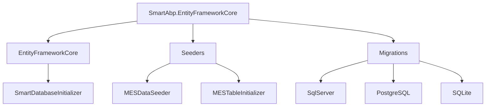
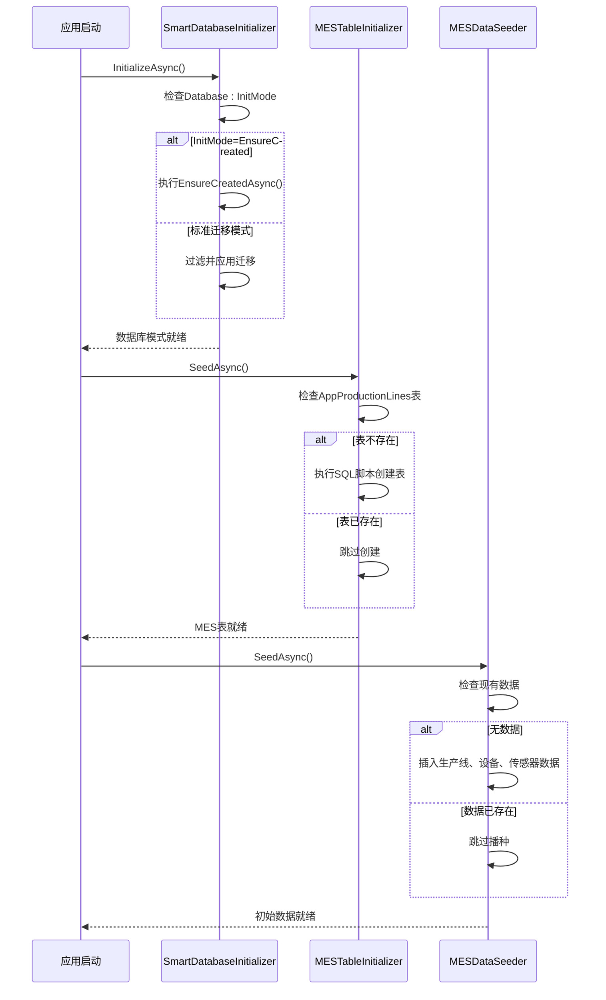
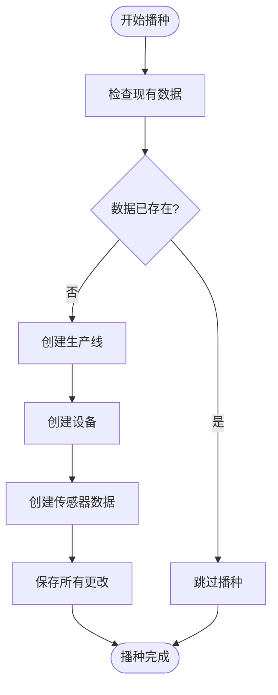
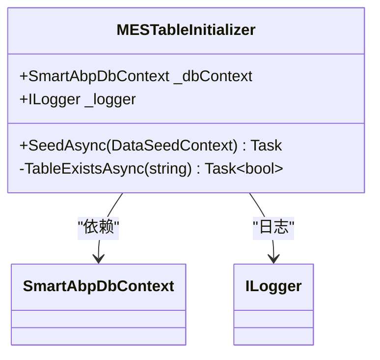
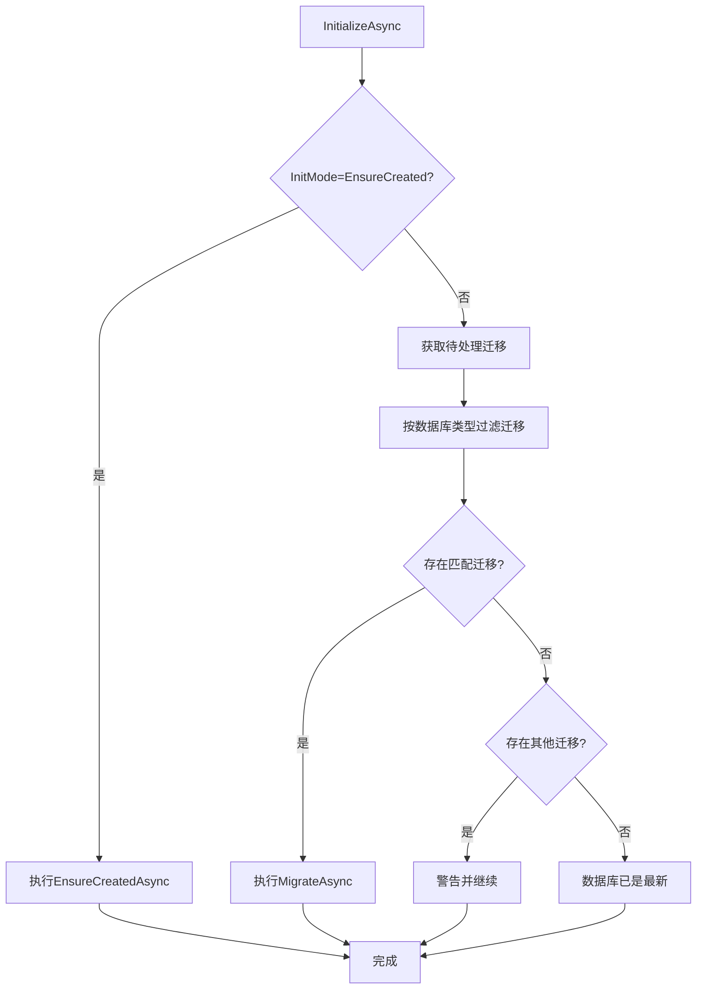
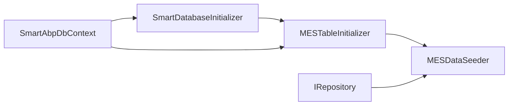

# 数据初始化

<cite>
**本文档引用的文件**  
- [MESDataSeeder.cs](file://src/SmartAbp.EntityFrameworkCore/Seeders/MESDataSeeder.cs)
- [MESTableInitializer.cs](file://src/SmartAbp.EntityFrameworkCore/Seeders/MESTableInitializer.cs)
- [SmartDatabaseInitializer.cs](file://src/SmartAbp.EntityFrameworkCore/EntityFrameworkCore/SmartDatabaseInitializer.cs)
- [20251021_CreateMESTables.sql](file://src/SmartAbp.EntityFrameworkCore/Migrations/SqlServer/20251021_CreateMESTables.sql)
- [Program.cs](file://src/SmartAbp.Web/Program.cs)
</cite>

## 目录
1. [引言](#引言)
2. [项目结构](#项目结构)
3. [核心组件](#核心组件)
4. [架构概述](#架构概述)
5. [详细组件分析](#详细组件分析)
6. [依赖分析](#依赖分析)
7. [性能考虑](#性能考虑)
8. [故障排除指南](#故障排除指南)
9. [结论](#结论)

## 引言
本文档详细解析hxlot项目中的数据库初始化和测试数据播种机制。重点分析MESDataSeeder和MESTableInitializer的实现逻辑，说明如何通过数据播种为低代码模块、MES实体等核心功能提供初始数据。同时，深入探讨SmartDatabaseInitializer在应用启动时的初始化流程，包括数据库创建、模式更新和数据播种的执行顺序，并解释不同环境下的数据初始化策略差异。

## 项目结构
hxlot项目的初始化逻辑主要集中在`src/SmartAbp.EntityFrameworkCore`模块中，涉及数据库上下文、迁移脚本和数据播种器。核心初始化组件位于`Seeders`目录下，而数据库迁移脚本则按数据库类型组织在`Migrations`子目录中。

**图示来源**  
- [MESDataSeeder.cs](file://src/SmartAbp.EntityFrameworkCore/Seeders/MESDataSeeder.cs)
- [MESTableInitializer.cs](file://src/SmartAbp.EntityFrameworkCore/Seeders/MESTableInitializer.cs)
- [SmartDatabaseInitializer.cs](file://src/SmartAbp.EntityFrameworkCore/EntityFrameworkCore/SmartDatabaseInitializer.cs)

**章节来源**  
- [MESDataSeeder.cs](file://src/SmartAbp.EntityFrameworkCore/Seeders/MESDataSeeder.cs)
- [MESTableInitializer.cs](file://src/SmartAbp.EntityFrameworkCore/Seeders/MESTableInitializer.cs)

## 核心组件
本项目的数据初始化由三个核心组件协同完成：`SmartDatabaseInitializer`负责数据库模式的创建与更新，`MESTableInitializer`确保MES专用表的存在，`MESDataSeeder`则负责填充初始业务数据。这些组件通过依赖注入在应用启动时自动执行，形成完整的初始化流水线。

**章节来源**  
- [SmartDatabaseInitializer.cs](file://src/SmartAbp.EntityFrameworkCore/EntityFrameworkCore/SmartDatabaseInitializer.cs#L15-L156)
- [MESTableInitializer.cs](file://src/SmartAbp.EntityFrameworkCore/Seeders/MESTableInitializer.cs#L20-L111)
- [MESDataSeeder.cs](file://src/SmartAbp.EntityFrameworkCore/Seeders/MESDataSeeder.cs#L21-L306)

## 架构概述
hxlot项目采用分层初始化架构，确保数据库在应用启动时处于可用状态。初始化流程始于`SmartDatabaseInitializer`，它根据配置选择合适的初始化策略。随后，`MESTableInitializer`检查并创建MES专用表，最后`MESDataSeeder`填充测试数据。这一流程在开发、测试和生产环境中表现出不同的行为，以适应各环境的需求。

**图示来源**  
- [SmartDatabaseInitializer.cs](file://src/SmartAbp.EntityFrameworkCore/EntityFrameworkCore/SmartDatabaseInitializer.cs#L15-L156)
- [MESTableInitializer.cs](file://src/SmartAbp.EntityFrameworkCore/Seeders/MESTableInitializer.cs#L20-L111)
- [MESDataSeeder.cs](file://src/SmartAbp.EntityFrameworkCore/Seeders/MESDataSeeder.cs#L21-L306)

## 详细组件分析
### MESDataSeeder 分析
`MESDataSeeder`是IDataSeedContributor的实现，负责为MES模块播种初始测试数据。它通过依赖注入获取仓储实例，确保数据一致性。播种过程包含三个主要步骤：创建两条生产线、四台设备和若干传感器数据。在执行前，它会检查是否已有数据存在，避免重复播种。

**图示来源**  
- [MESDataSeeder.cs](file://src/SmartAbp.EntityFrameworkCore/Seeders/MESDataSeeder.cs#L21-L306)

**章节来源**  
- [MESDataSeeder.cs](file://src/SmartAbp.EntityFrameworkCore/Seeders/MESDataSeeder.cs#L21-L306)

### MESTableInitializer 分析
`MESTableInitializer`专门负责MES相关数据库表的初始化。它通过检查`AppProductionLines`表的存在来判断是否需要创建表。如果表不存在，它会读取并执行位于`Migrations/SqlServer/20251021_CreateMESTables.sql`的SQL脚本。该脚本包含创建`AppProductionLines`、`AppEquipments`和`AppSensorData`三张表的完整DDL语句。

**图示来源**  
- [MESTableInitializer.cs](file://src/SmartAbp.EntityFrameworkCore/Seeders/MESTableInitializer.cs#L20-L111)

**章节来源**  
- [MESTableInitializer.cs](file://src/SmartAbp.EntityFrameworkCore/Seeders/MESTableInitializer.cs#L20-L111)

### SmartDatabaseInitializer 分析
`SmartDatabaseInitializer`是整个数据库初始化流程的入口点。它根据配置中的`Database:InitMode`决定初始化策略。若设置为`EnsureCreated`，则直接创建数据库；否则采用EF Core迁移模式。它还实现了智能迁移过滤，确保只应用与当前数据库类型匹配的迁移，避免跨数据库类型的迁移冲突。

**图示来源**  
- [SmartDatabaseInitializer.cs](file://src/SmartAbp.EntityFrameworkCore/EntityFrameworkCore/SmartDatabaseInitializer.cs#L15-L156)

**章节来源**  
- [SmartDatabaseInitializer.cs](file://src/SmartAbp.EntityFrameworkCore/EntityFrameworkCore/SmartDatabaseInitializer.cs#L15-L156)

## 依赖分析
数据初始化组件之间存在明确的依赖关系。`SmartDatabaseInitializer`作为最基础的组件，为后续初始化提供数据库连接。`MESTableInitializer`依赖于已初始化的数据库上下文来执行SQL脚本。`MESDataSeeder`则依赖于EF Core的仓储模式来插入数据。这些组件通过ABP框架的依赖注入系统自动解析和执行。

**图示来源**  
- [SmartDatabaseInitializer.cs](file://src/SmartAbp.EntityFrameworkCore/EntityFrameworkCore/SmartDatabaseInitializer.cs#L15-L156)
- [MESTableInitializer.cs](file://src/SmartAbp.EntityFrameworkCore/Seeders/MESTableInitializer.cs#L20-L111)
- [MESDataSeeder.cs](file://src/SmartAbp.EntityFrameworkCore/Seeders/MESDataSeeder.cs#L21-L306)

**章节来源**  
- [SmartDatabaseInitializer.cs](file://src/SmartAbp.EntityFrameworkCore/EntityFrameworkCore/SmartDatabaseInitializer.cs#L15-L156)
- [MESTableInitializer.cs](file://src/SmartAbp.EntityFrameworkCore/Seeders/MESTableInitializer.cs#L20-L111)
- [MESDataSeeder.cs](file://src/SmartAbp.EntityFrameworkCore/Seeders/MESDataSeeder.cs#L21-L306)

## 性能考虑
数据初始化过程考虑了性能优化。`MESDataSeeder`使用`InsertAsync`配合`autoSave: false`来批量插入数据，最后统一调用`SaveChangesAsync`，减少数据库往返次数。`MESTableInitializer`的SQL脚本按`GO`分隔执行，确保复杂DDL语句的正确执行。`SmartDatabaseInitializer`的迁移过滤机制避免了不必要的迁移检查，提升了初始化速度。

## 故障排除指南
当数据初始化失败时，应首先检查日志输出。`SmartDatabaseInitializer`会记录详细的迁移过程，包括应用的迁移列表。若`MESTableInitializer`报告SQL脚本文件不存在，需确认文件路径是否正确。`MESDataSeeder`的重复执行保护机制可防止数据重复插入，若需强制重新播种，可先清空相关表。

**章节来源**  
- [SmartDatabaseInitializer.cs](file://src/SmartAbp.EntityFrameworkCore/EntityFrameworkCore/SmartDatabaseInitializer.cs#L15-L156)
- [MESTableInitializer.cs](file://src/SmartAbp.EntityFrameworkCore/Seeders/MESTableInitializer.cs#L20-L111)
- [MESDataSeeder.cs](file://src/SmartAbp.EntityFrameworkCore/Seeders/MESDataSeeder.cs#L21-L306)

## 结论
hxlot项目的数据初始化机制设计合理，分层清晰。通过`SmartDatabaseInitializer`、`MESTableInitializer`和`MESDataSeeder`的协同工作，确保了数据库在各种环境下都能正确初始化。该机制支持开发环境的快速迭代和生产环境的稳定部署，为MES系统的可靠运行奠定了坚实基础。