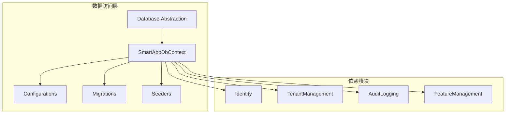
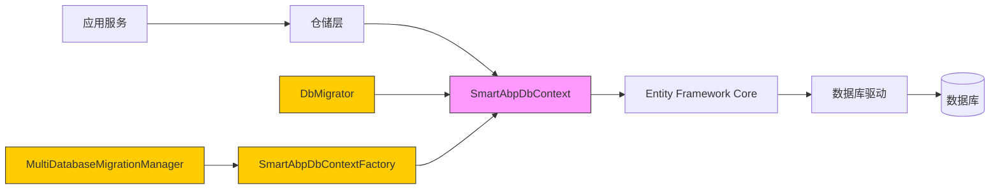
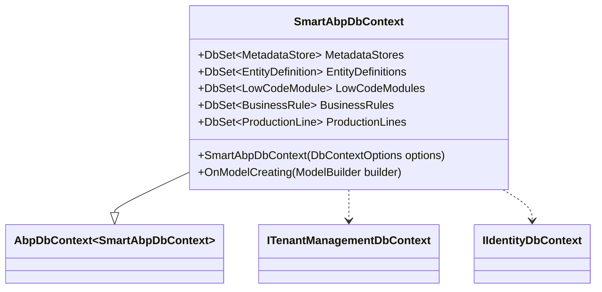
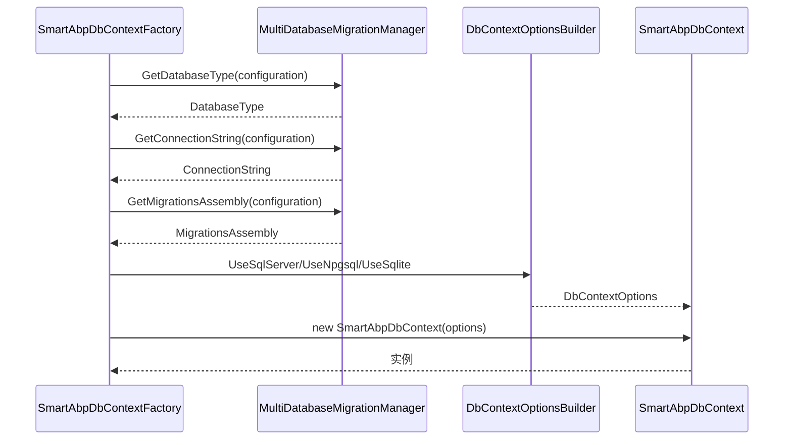
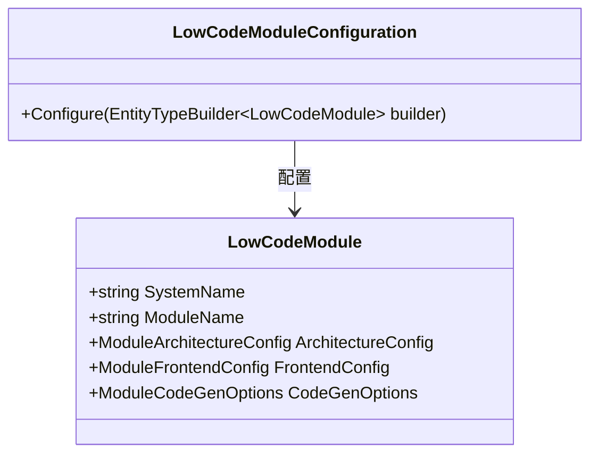
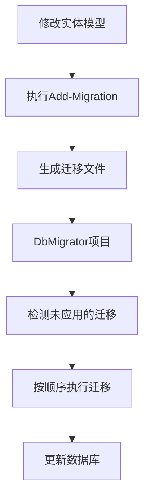
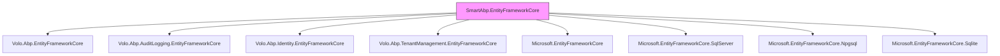

# 数据访问层

<cite>
**本文档引用文件**  
- [SmartAbpDbContext.cs](file://src/SmartAbp.EntityFrameworkCore/EntityFrameworkCore/SmartAbpDbContext.cs)
- [SmartAbpDbContextFactory.cs](file://src/SmartAbp.EntityFrameworkCore/EntityFrameworkCore/SmartAbpDbContextFactory.cs)
- [LowCodeModuleConfiguration.cs](file://src/SmartAbp.EntityFrameworkCore/Configurations/LowCodeModuleConfiguration.cs)
- [SmartAbpConsts.cs](file://src/SmartAbp.Domain/SmartAbpConsts.cs)
- [MultiDatabaseMigrationManager.cs](file://src/SmartAbp.EntityFrameworkCore/EntityFrameworkCore/MultiDatabaseMigrationManager.cs)
- [SmartAbpDbMigratorModule.cs](file://src/SmartAbp.DbMigrator/SmartAbpDbMigratorModule.cs)
- [SmartAbpWebModule.cs](file://src/SmartAbp.Web/SmartAbpHttpApiHostModule.cs)
- [appsettings.json](file://src/SmartAbp.Web/appsettings.json)
- [docker-compose.yml](file://docker-compose.yml)
- [switch-database.sh](file://scripts/database/switch-database.sh)
</cite>

## 目录
1. [简介](#简介)
2. [项目结构](#项目结构)
3. [核心组件](#核心组件)
4. [架构概述](#架构概述)
5. [详细组件分析](#详细组件分析)
6. [依赖分析](#依赖分析)
7. [性能考虑](#性能考虑)
8. [故障排除指南](#故障排除指南)
9. [结论](#结论)

## 简介
hxlot项目的数据访问层基于Entity Framework Core构建，采用ABP框架的模块化设计，实现了统一的数据库上下文管理、多数据库支持、代码优先迁移和测试数据播种机制。本系统通过`SmartAbpDbContext`类集中管理所有实体的映射与配置，支持SQL Server、PostgreSQL和SQLite三种主流数据库，并通过灵活的配置机制实现数据库的无缝切换。数据访问层不仅涵盖了基础的CRUD操作，还针对低代码引擎、业务规则引擎和MES监控等核心业务场景进行了深度优化。

## 项目结构

**图示来源**  
- [SmartAbpDbContext.cs](file://src/SmartAbp.EntityFrameworkCore/EntityFrameworkCore/SmartAbpDbContext.cs)
- [SmartAbpDbContextFactory.cs](file://src/SmartAbp.EntityFrameworkCore/EntityFrameworkCore/SmartAbpDbContextFactory.cs)

**本节来源**  
- [SmartAbpDbContext.cs](file://src/SmartAbp.EntityFrameworkCore/EntityFrameworkCore/SmartAbpDbContext.cs)
- [SmartAbpDbContextFactory.cs](file://src/SmartAbp.EntityFrameworkCore/EntityFrameworkCore/SmartAbpDbContextFactory.cs)

## 核心组件

数据访问层的核心组件包括`SmartAbpDbContext`上下文类、实体配置类、迁移管理器和数据播种器。`SmartAbpDbContext`继承自ABP框架的`AbpDbContext`，实现了`ITenantManagementDbContext`和`IIdentityDbContext`接口，从而能够无缝集成ABP的身份认证和租户管理模块。该上下文通过`OnModelCreating`方法集中配置所有实体的映射关系，包括表名、字段类型、索引和约束等。实体配置采用混合模式，既有直接在`OnModelCreating`中通过Fluent API配置的实体，也有通过独立配置类（如`LowCodeModuleConfiguration`）管理的实体，提高了代码的可维护性。

**本节来源**  
- [SmartAbpDbContext.cs](file://src/SmartAbp.EntityFrameworkCore/EntityFrameworkCore/SmartAbpDbContext.cs)
- [LowCodeModuleConfiguration.cs](file://src/SmartAbp.EntityFrameworkCore/Configurations/LowCodeModuleConfiguration.cs)

## 架构概述

**图示来源**  
- [SmartAbpDbContext.cs](file://src/SmartAbp.EntityFrameworkCore/EntityFrameworkCore/SmartAbpDbContext.cs)
- [SmartAbpDbContextFactory.cs](file://src/SmartAbp.EntityFrameworkCore/EntityFrameworkCore/SmartAbpDbContextFactory.cs)
- [MultiDatabaseMigrationManager.cs](file://src/SmartAbp.EntityFrameworkCore/EntityFrameworkCore/MultiDatabaseMigrationManager.cs)

## 详细组件分析

### SmartAbpDbContext 设计分析

`SmartAbpDbContext`是整个数据访问层的核心，它通过继承ABP框架的`AbpDbContext`获得了多租户、审计日志等企业级功能。该上下文使用`[ReplaceDbContext]`属性替换了ABP的身份认证和租户管理模块的默认上下文，使得这些模块的实体也能被纳入当前上下文的管理范围，从而支持跨模块的JOIN查询。上下文通过`ConnectionStringName("Default")`属性指定使用名为"Default"的连接字符串，该字符串在`appsettings.json`中定义。

**图示来源**  
- [SmartAbpDbContext.cs](file://src/SmartAbp.EntityFrameworkCore/EntityFrameworkCore/SmartAbpDbContext.cs)

#### 多数据库支持机制

系统通过`SmartAbpDbContextFactory`和`MultiDatabaseMigrationManager`实现了多数据库支持。`SmartAbpDbContextFactory`是一个设计时工厂类，用于在开发环境中创建`DbContext`实例。它通过读取配置文件中的数据库类型和连接字符串，动态选择相应的数据库驱动（SQL Server、PostgreSQL或SQLite）。

**图示来源**  
- [SmartAbpDbContextFactory.cs](file://src/SmartAbp.EntityFrameworkCore/EntityFrameworkCore/SmartAbpDbContextFactory.cs)
- [MultiDatabaseMigrationManager.cs](file://src/SmartAbp.EntityFrameworkCore/EntityFrameworkCore/MultiDatabaseMigrationManager.cs)

**本节来源**  
- [SmartAbpDbContextFactory.cs](file://src/SmartAbp.EntityFrameworkCore/EntityFrameworkCore/SmartAbpDbContextFactory.cs)
- [MultiDatabaseMigrationManager.cs](file://src/SmartAbp.EntityFrameworkCore/EntityFrameworkCore/MultiDatabaseMigrationManager.cs)

### 实体配置机制

实体配置采用两种方式：直接配置和独立配置类。对于简单的实体，直接在`OnModelCreating`方法中使用Fluent API进行配置；对于复杂的实体（如`LowCodeModule`），则使用独立的配置类实现`IEntityTypeConfiguration`接口。这种方式提高了代码的可读性和可维护性。

#### 低代码模块实体配置分析

`LowCodeModuleConfiguration`类展示了如何通过独立配置类管理复杂实体。该配置不仅定义了常规的表名和索引，还通过`HasConversion`方法实现了JSON字段的值转换，将复杂的对象（如`ArchitectureConfig`、`FrontendConfig`）序列化为JSON字符串存储在数据库中。

**图示来源**  
- [LowCodeModuleConfiguration.cs](file://src/SmartAbp.EntityFrameworkCore/Configurations/LowCodeModuleConfiguration.cs)

**本节来源**  
- [LowCodeModuleConfiguration.cs](file://src/SmartAbp.EntityFrameworkCore/Configurations/LowCodeModuleConfiguration.cs)

### 代码优先迁移策略

系统采用Entity Framework Core的代码优先迁移策略。迁移文件存储在`Migrations`目录下，分为`SqlServer`、`PostgreSQL`和`SQLite`三个子目录，每个目录包含对应数据库的迁移脚本。迁移过程由`SmartAbp.DbMigrator`项目驱动，该项目在应用启动时自动执行未应用的迁移。

**本节来源**  
- [SmartAbpDbMigratorModule.cs](file://src/SmartAbp.DbMigrator/SmartAbpDbMigratorModule.cs)
- [DbMigratorHostedService.cs](file://src/SmartAbp.DbMigrator/DbMigratorHostedService.cs)

### 数据库初始化与测试数据播种

数据库初始化流程由`SmartAbpWebModule`在应用启动时触发。系统通过`IDbSchemaMigrator`服务执行数据库模式迁移，并通过自定义的播种器添加初始数据。虽然`SmartAbpDataSeeder.cs`文件未找到，但根据ABP框架的惯例，播种器会负责创建默认租户、管理员用户和系统配置。

**本节来源**  
- [SmartAbpWebModule.cs](file://src/SmartAbp.Web/SmartAbpHttpApiHostModule.cs)
- [appsettings.json](file://src/SmartAbp.Web/appsettings.json)

## 依赖分析

**图示来源**  
- [SmartAbp.EntityFrameworkCore.csproj](file://src/SmartAbp.EntityFrameworkCore/SmartAbp.EntityFrameworkCore.csproj)

**本节来源**  
- [SmartAbp.EntityFrameworkCore.csproj](file://src/SmartAbp.EntityFrameworkCore/SmartAbp.EntityFrameworkCore.csproj)

## 性能考虑

数据访问层在设计时充分考虑了性能优化。首先，通过合理的索引设计（如`ProductionLine.Code`的唯一索引、`SensorData.Timestamp`的时间索引）提高了查询效率。其次，外键关系的删除行为被谨慎设置，`Equipment`和`SensorData`对`ProductionLine`的引用采用`DeleteBehavior.Restrict`，避免了级联删除可能引发的性能问题。此外，JSON字段的序列化配置使用了`WriteIndented = false`，减少了存储空间和I/O开销。对于高频率写入的`SensorData`表，建议在生产环境中考虑使用时序数据库或分区表来进一步提升性能。

## 故障排除指南

当遇到数据库相关问题时，可按以下步骤排查：
1. 检查`appsettings.json`中的连接字符串是否正确。
2. 确认`SmartAbp.DbMigrator`项目已成功执行所有迁移。
3. 查看`Logs`目录下的日志文件，定位具体的错误信息。
4. 使用`switch-database.sh`脚本切换数据库类型时，确保目标数据库服务已启动。
5. 若出现迁移冲突，可使用`fix-migration-error.sh`脚本进行修复。

**本节来源**  
- [appsettings.json](file://src/SmartAbp.Web/appsettings.json)
- [switch-database.sh](file://scripts/database/switch-database.sh)
- [fix-migration-error.sh](file://scripts/database/fix-migration-error.sh)

## 结论

hxlot项目的数据访问层设计合理，功能完备。通过`SmartAbpDbContext`统一管理所有实体，结合ABP框架的强大功能，实现了企业级的数据访问能力。多数据库支持机制增强了系统的灵活性和可移植性，代码优先迁移策略保证了数据库模式与代码模型的一致性。未来可进一步优化JSON字段的查询性能，并考虑引入缓存机制以减轻数据库压力。