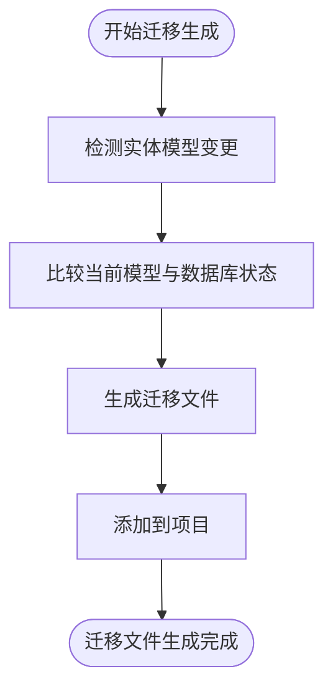
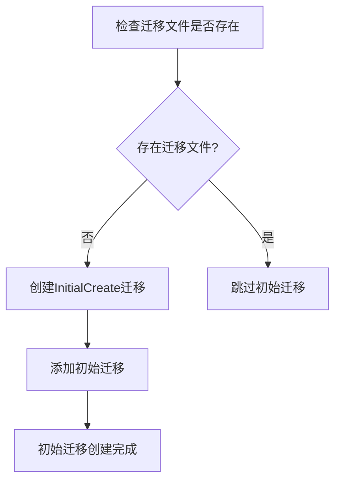
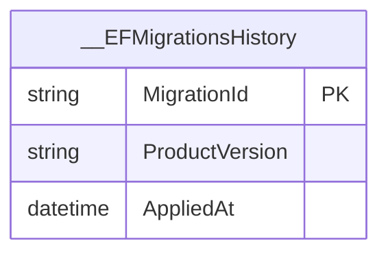
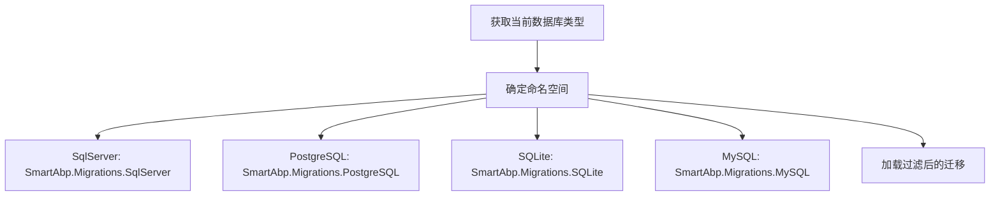
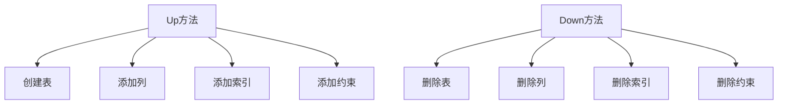
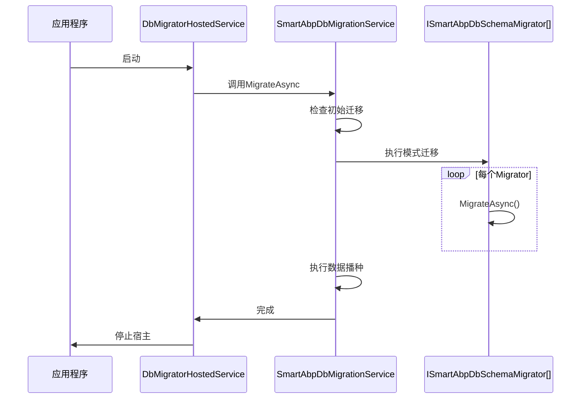

# 迁移管理

<cite>
**本文档引用的文件**
- [SmartAbpDbMigrationService.cs](file://src/SmartAbp.Domain/Data/SmartAbpDbMigrationService.cs)
- [DbMigratorHostedService.cs](file://src/SmartAbp.DbMigrator/DbMigratorHostedService.cs)
- [SmartAbpEntityFrameworkCoreModule.cs](file://src/SmartAbp.EntityFrameworkCore/EntityFrameworkCore/SmartAbpEntityFrameworkCoreModule.cs)
- [FilteringMigrationsAssembly.cs](file://src/SmartAbp.EntityFrameworkCore/EntityFrameworkCore/FilteringMigrationsAssembly.cs)
- [MultiDatabaseMigrationManager.cs](file://src/SmartAbp.EntityFrameworkCore/EntityFrameworkCore/MultiDatabaseMigrationManager.cs)
- [DatabaseType.cs](file://src/SmartAbp.Database.Abstraction/DatabaseType.cs)
- [generate-migrations-all.sh](file://scripts/database/generate-migrations-all.sh)
- [CROSS-PLATFORM-DATABASE-GUIDE.md](file://scripts/database/CROSS-PLATFORM-DATABASE-GUIDE.md)
</cite>

## 目录
1. [引言](#引言)
2. [迁移机制概述](#迁移机制概述)
3. [迁移文件生成原理](#迁移文件生成原理)
4. [InitialCreate迁移分析](#initialcreate迁移分析)
5. [增量迁移管理](#增量迁移管理)
6. [多数据库迁移分支策略](#多数据库迁移分支策略)
7. [Up与Down方法实现](#up与down方法实现)
8. [自动化迁移执行流程](#自动化迁移执行流程)
9. [迁移管理最佳实践](#迁移管理最佳实践)
10. [附录](#附录)

## 引言
hxlot项目采用基于Code-First的数据库迁移机制，通过Entity Framework Core的迁移功能实现数据库模式的版本控制和自动化管理。本文档深入解析迁移管理的核心机制，包括迁移文件的生成、版本控制、多数据库支持以及自动化执行流程，为开发人员提供全面的迁移管理指导。

## 迁移机制概述
hxlot项目使用Entity Framework Core的Code-First迁移机制，将数据库模式变更作为代码进行版本控制。迁移机制的核心是将C#代码中的实体模型变更转换为数据库的DDL（数据定义语言）脚本，确保数据库结构与代码模型保持同步。

迁移机制的关键特性包括：
- **代码即迁移**：每个迁移文件都是C#类，包含Up（应用变更）和Down（回滚变更）方法
- **版本控制**：迁移文件按时间戳命名，形成有序的迁移历史
- **自动化执行**：通过DbMigrator服务在应用启动时自动应用未执行的迁移
- **多数据库支持**：支持SQL Server、PostgreSQL、SQLite等多种数据库

**Section sources**
- [SmartAbpEntityFrameworkCoreModule.cs](file://src/SmartAbp.EntityFrameworkCore/EntityFrameworkCore/SmartAbpEntityFrameworkCoreModule.cs#L1-L137)
- [MultiDatabaseMigrationManager.cs](file://src/SmartAbp.EntityFrameworkCore/EntityFrameworkCore/MultiDatabaseMigrationManager.cs#L1-L160)

## 迁移文件生成原理
迁移文件的生成基于Entity Framework Core的`dotnet ef migrations add`命令，该命令比较当前实体模型与数据库迁移历史，生成相应的变更脚本。

### 迁移生成流程


**Diagram sources**
- [SmartAbpEntityFrameworkCoreModule.cs](file://src/SmartAbp.EntityFrameworkCore/EntityFrameworkCore/SmartAbpEntityFrameworkCoreModule.cs#L1-L137)
- [generate-migrations-all.sh](file://scripts/database/generate-migrations-all.sh#L1-L119)

### 批量迁移生成
项目提供了`generate-migrations-all.sh`脚本，用于为所有支持的数据库生成独立的迁移文件。该脚本通过临时修改配置文件，依次为SQL Server、PostgreSQL和SQLite生成迁移。

```bash
# 生成所有数据库的迁移
bash scripts/database/generate-migrations-all.sh
```

**Section sources**
- [generate-migrations-all.sh](file://scripts/database/generate-migrations-all.sh#L1-L119)
- [CROSS-PLATFORM-DATABASE-GUIDE.md](file://scripts/database/CROSS-PLATFORM-DATABASE-GUIDE.md#L1-L355)

## InitialCreate迁移分析
InitialCreate迁移是数据库迁移的起点，定义了初始的数据库结构。该迁移在项目首次创建时生成，包含所有实体表的创建语句。

### InitialCreate迁移特点
- **首次迁移**：作为迁移历史的第一个条目
- **完整结构**：包含所有实体表、索引、约束的创建语句
- **时间戳命名**：以时间戳开头，确保唯一性
- **跨数据库兼容**：为不同数据库生成相应的SQL语法

### 初始迁移生成
当系统检测到没有迁移文件时，会自动创建InitialCreate迁移：



**Diagram sources**
- [SmartAbpDbMigrationService.cs](file://src/SmartAbp.Domain/Data/SmartAbpDbMigrationService.cs#L18-L225)
- [SmartAbpEntityFrameworkCoreModule.cs](file://src/SmartAbp.EntityFrameworkCore/EntityFrameworkCore/SmartAbpEntityFrameworkCoreModule.cs#L1-L137)

**Section sources**
- [SmartAbpDbMigrationService.cs](file://src/SmartAbp.Domain/Data/SmartAbpDbMigrationService.cs#L18-L225)
- [CROSS-PLATFORM-DATABASE-GUIDE.md](file://scripts/database/CROSS-PLATFORM-DATABASE-GUIDE.md#L1-L355)

## 增量迁移管理
增量迁移用于管理数据库模式的后续变更，每个增量迁移文件对应一次模型变更。

### 增量迁移流程
1. **修改实体模型**：在C#代码中添加、修改或删除实体属性
2. **生成迁移**：运行`dotnet ef migrations add MigrationName`命令
3. **审查迁移**：检查生成的Up和Down方法是否正确
4. **应用迁移**：通过DbMigrator服务应用迁移

### 迁移版本控制
迁移文件按时间戳排序，形成有序的迁移历史。每个迁移都有唯一的ID，存储在数据库的`__EFMigrationsHistory`表中。



**Diagram sources**
- [SmartAbpEntityFrameworkCoreModule.cs](file://src/SmartAbp.EntityFrameworkCore/EntityFrameworkCore/SmartAbpEntityFrameworkCoreModule.cs#L1-L137)
- [CROSS-PLATFORM-DATABASE-GUIDE.md](file://scripts/database/CROSS-PLATFORM-DATABASE-GUIDE.md#L1-L355)

**Section sources**
- [SmartAbpEntityFrameworkCoreModule.cs](file://src/SmartAbp.EntityFrameworkCore/EntityFrameworkCore/SmartAbpEntityFrameworkCoreModule.cs#L1-L137)
- [CROSS-PLATFORM-DATABASE-GUIDE.md](file://scripts/database/CROSS-PLATFORM-DATABASE-GUIDE.md#L1-L355)

## 多数据库迁移分支策略
hxlot项目支持多种数据库，采用分支迁移策略，为不同数据库类型维护独立的迁移文件。

### 迁移分支结构
```
src/SmartAbp.EntityFrameworkCore/Migrations/
├── SqlServer/
│   ├── 20251003161310_InitialCreate.cs
│   └── ...
├── PostgreSQL/
│   ├── 20251007172103_PostgreSQL_InitialCreate.cs
│   └── ...
├── SQLite/
│   └── 20251003040119_InitialSQLite.cs
└── MySQL/
    └── (待添加)
```

### 数据库类型管理
系统通过`DatabaseType`枚举管理支持的数据库类型：

```csharp
public enum DatabaseType
{
    SqlServer,
    PostgreSQL,
    SQLite,
    MySQL
}
```

**Section sources**
- [DatabaseType.cs](file://src/SmartAbp.Database.Abstraction/DatabaseType.cs#L6-L27)
- [CROSS-PLATFORM-DATABASE-GUIDE.md](file://scripts/database/CROSS-PLATFORM-DATABASE-GUIDE.md#L1-L355)

### 迁移过滤机制
`FilteringMigrationsAssembly`类根据当前数据库类型过滤迁移文件，确保只加载对应数据库的迁移：



**Diagram sources**
- [FilteringMigrationsAssembly.cs](file://src/SmartAbp.EntityFrameworkCore/EntityFrameworkCore/FilteringMigrationsAssembly.cs#L1-L107)
- [MultiDatabaseMigrationManager.cs](file://src/SmartAbp.EntityFrameworkCore/EntityFrameworkCore/MultiDatabaseMigrationManager.cs#L1-L160)

## Up与Down方法实现
每个迁移文件包含Up和Down两个核心方法，分别用于应用和回滚数据库变更。

### Up方法
Up方法包含应用迁移所需的SQL操作，通常包括：
- 创建新表
- 添加新列
- 修改列类型
- 添加约束和索引

### Down方法
Down方法包含回滚迁移所需的SQL操作，通常包括：
- 删除新添加的表
- 删除新添加的列
- 恢复列类型
- 删除约束和索引

### 方法实现示例


**Section sources**
- [SmartAbpEntityFrameworkCoreModule.cs](file://src/SmartAbp.EntityFrameworkCore/EntityFrameworkCore/SmartAbpEntityFrameworkCoreModule.cs#L1-L137)
- [CROSS-PLATFORM-DATABASE-GUIDE.md](file://scripts/database/CROSS-PLATFORM-DATABASE-GUIDE.md#L1-L355)

## 自动化迁移执行流程
hxlot项目通过`SmartAbpDbMigrationService`在应用启动时自动执行未应用的迁移。

### 迁移执行流程


**Diagram sources**
- [DbMigratorHostedService.cs](file://src/SmartAbp.DbMigrator/DbMigratorHostedService.cs#L1-L52)
- [SmartAbpDbMigrationService.cs](file://src/SmartAbp.Domain/Data/SmartAbpDbMigrationService.cs#L18-L225)

### 执行步骤
1. **初始化**：创建ABP应用实例
2. **迁移检查**：检查是否需要创建初始迁移
3. **模式迁移**：应用所有未执行的模式变更
4. **数据播种**：执行数据初始化
5. **租户迁移**：如果启用多租户，为每个租户执行迁移
6. **完成**：关闭应用实例

**Section sources**
- [DbMigratorHostedService.cs](file://src/SmartAbp.DbMigrator/DbMigratorHostedService.cs#L1-L52)
- [SmartAbpDbMigrationService.cs](file://src/SmartAbp.Domain/Data/SmartAbpDbMigrationService.cs#L18-L225)

## 迁移管理最佳实践
### 迁移脚本测试
- **本地测试**：在开发环境中测试迁移脚本
- **集成测试**：在CI/CD管道中执行迁移测试
- **回滚测试**：验证Down方法的正确性

### 回滚策略
- **备份优先**：在应用迁移前备份数据库
- **逐步回滚**：按逆序执行Down方法
- **监控验证**：验证回滚后的数据完整性

### 生产环境部署注意事项
- **维护窗口**：在低峰期执行迁移
- **备份验证**：确保备份可用
- **监控告警**：监控迁移执行状态
- **回滚计划**：准备应急回滚方案

### 数据迁移处理
- **分批处理**：大数据量迁移分批执行
- **事务控制**：确保数据一致性
- **错误处理**：捕获并处理迁移异常

**Section sources**
- [SmartAbpDbMigrationService.cs](file://src/SmartAbp.Domain/Data/SmartAbpDbMigrationService.cs#L18-L225)
- [CROSS-PLATFORM-DATABASE-GUIDE.md](file://scripts/database/CROSS-PLATFORM-DATABASE-GUIDE.md#L1-L355)

## 附录
### 数据库类型映射
| 数据库类型 | 连接字符串键 | 迁移命名空间 |
|---------|-----------|-----------|
| SQL Server | LocalDb | SmartAbp.Migrations.SqlServer |
| PostgreSQL | PostgreSQL | SmartAbp.Migrations.PostgreSQL |
| SQLite | Sqlite | SmartAbp.Migrations.SQLite |
| MySQL | MySQL | SmartAbp.Migrations.MySQL |

### 迁移命令参考
```bash
# 生成迁移
dotnet ef migrations add MigrationName --context SmartAbpDbContext --output-dir "Migrations/{Provider}"

# 移除迁移
dotnet ef migrations remove --context SmartAbpDbContext

# 查看迁移状态
dotnet ef database update --context SmartAbpDbContext
```

**Section sources**
- [CROSS-PLATFORM-DATABASE-GUIDE.md](file://scripts/database/CROSS-PLATFORM-DATABASE-GUIDE.md#L1-L355)
- [generate-migrations-all.sh](file://scripts/database/generate-migrations-all.sh#L1-L119)