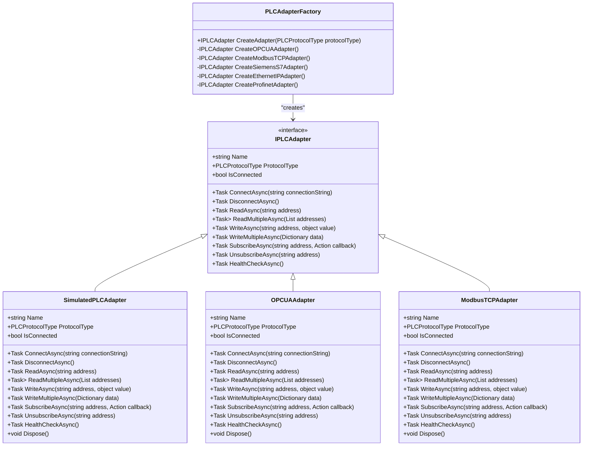
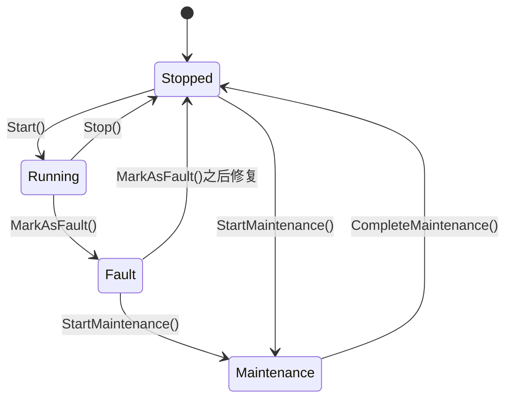

# MES领域模型

<cite>
**Referenced Files in This Document**   
- [Equipment.cs](file://src/SmartAbp.Domain/Entities/MES/Equipment.cs)
- [ProductionLine.cs](file://src/SmartAbp.Domain/Entities/MES/ProductionLine.cs)
- [SensorData.cs](file://src/SmartAbp.Domain/Entities/MES/SensorData.cs)
- [IPLCAdapter.cs](file://src/SmartAbp.Application/MES/PLC/IPLCAdapter.cs)
- [PLCAdapterFactory.cs](file://src/SmartAbp.Application/MES/PLC/PLCAdapterFactory.cs)
</cite>

## 目录
1. [引言](#引言)
2. [设备实体分析](#设备实体分析)
3. [生产线实体分析](#生产线实体分析)
4. [传感器数据实体分析](#传感器数据实体分析)
5. [PLC适配器模式分析](#plc适配器模式分析)
6. [状态图](#状态图)
7. [结论](#结论)

## 引言
本文档详细阐述了hxlot项目中MES（制造执行系统）领域的核心模型设计。重点分析了设备（Equipment）、生产线（ProductionLine）、传感器数据（SensorData）三个核心实体的业务特性，以及PLC适配器模式在工业通信中的应用。通过深入剖析这些组件的属性、行为和相互关系，为系统的开发、维护和扩展提供了清晰的指导。

## 设备实体分析

`Equipment`实体是MES系统中对物理设备的数字化表示，它不仅包含了设备的静态属性，还封装了丰富的业务逻辑，用于管理设备的全生命周期。

该实体具备以下核心特性：

1.  **设备属性**：实体定义了全面的设备信息，包括名称、编号、类型、品牌、型号、序列号和位置等基本信息。这些属性为设备的识别和管理提供了基础数据。

2.  **状态管理**：设备拥有一个明确的状态机，其`Status`属性可以是`running`（运行中）、`stopped`（已停止）、`fault`（故障）或`maintenance`（维护中）。通过`Start()`、`Stop()`、`MarkAsFault()`和`StartMaintenance()`等业务方法，可以安全地在不同状态间转换。例如，`Start()`方法会检查设备是否处于`fault`状态，如果是，则抛出异常阻止启动，确保了业务规则的强制执行。

3.  **维护周期**：实体通过`LastMaintenanceDate`（上次维护日期）、`NextMaintenanceDate`（下次维护日期）和`MaintenanceCycle`（维护周期）三个属性来跟踪和管理维护计划。`CompleteMaintenance()`方法在维护完成后被调用，它会将`Status`重置为`stopped`，并将`NextMaintenanceDate`更新为当前日期加上`MaintenanceCycle`，从而实现了维护周期的自动化计算。

4.  **实时数据与健康度**：设备实体直接存储了从PLC采集的实时数据，如温度、压力、振动、转速、功率等。`UpdateRealtimeData()`方法用于更新这些值，并自动调用`UpdateHealthStatus()`方法。该方法根据预设的阈值（如温度>80°C为严重）来判断设备的`HealthStatus`（健康状态），实现了从原始数据到健康评估的闭环。

**Section sources**
- [Equipment.cs](file://src/SmartAbp.Domain/Entities/MES/Equipment.cs#L10-L409)

## 生产线实体分析

`ProductionLine`实体作为生产流程的核心，不仅是一个简单的容器，更是一个聚合根，负责协调其内部的设备和数据流。

其建模方式和核心特性如下：

1.  **建模方式**：`ProductionLine`被设计为一个聚合根，通过`ICollection<Equipment>`导航属性与多个`Equipment`实体建立一对多的关联关系。这种设计确保了生产线的完整性，所有对生产线内设备的操作都应通过生产线聚合来协调。

2.  **与设备的关联关系**：生产线与设备之间是典型的“整体-部分”关系。一个`ProductionLine`可以包含多个`Equipment`，而每个`Equipment`必须归属于一个`ProductionLine`。这种关系通过`ProductionLineId`外键和`ProductionLine`导航属性在代码中实现。

3.  **生产节拍的计算逻辑**：生产线的生产效率是通过一系列实时统计字段来衡量的，包括`TotalProduction`（总产量）、`DailyProduction`（本日产量）、`CurrentEfficiency`（当前效率）和`QualifiedRate`（合格率）。`UpdateProductionData()`方法是计算生产节拍的核心，它接收来自下层服务的统计结果，并更新这些字段。`ResetDailyProduction()`方法则用于在每日开始时重置日产量计数器，确保统计数据的准确性。

**Section sources**
- [ProductionLine.cs](file://src/SmartAbp.Domain/Entities/MES/ProductionLine.cs#L11-L235)

## 传感器数据实体分析

`SensorData`实体负责记录和管理从工业现场实时采集的传感器数据，是实现数据驱动决策的基础。

其主要功能包括：

1.  **实时数据记录**：实体通过`Value`（数据值）、`Timestamp`（时间戳）和`SensorType`（传感器类型）等字段，精确地记录每一次数据采集。`DataSource`字段标明了数据来源（如PLC采集），`RawData`字段则可以存储完整的原始数据包，便于后续的深度分析。

2.  **历史数据查询**：由于`SensorData`实体继承了审计功能，所有历史数据都被持久化存储。这使得系统可以轻松地查询任意时间段内的传感器数据，支持生成历史趋势图和进行回溯分析。

3.  **趋势分析与告警**：实体内置了数据分析能力。`CheckAlarm()`方法在创建或更新数据时被调用，它会根据`SensorType`和`Value`与预设阈值进行比较，自动判断是否需要触发告警，并通过`SetAlarm()`方法设置`IsAlarm`、`AlarmLevel`和`AlarmMessage`等告警信息。此外，`UpdateStatistics()`方法可以更新`MinValue`、`MaxValue`、`AvgValue`和`StdDeviation`等统计字段，为趋势分析和异常检测提供支持。

**Section sources**
- [SensorData.cs](file://src/SmartAbp.Domain/Entities/MES/SensorData.cs#L10-L263)

## PLC适配器模式分析

在工业通信领域，不同厂商的PLC设备使用不同的通信协议（如OPC UA、Modbus TCP等）。为了屏蔽这些底层差异，系统采用了适配器模式。

1.  **IPLCAdapter接口**：该接口定义了统一的PLC通信契约，包括`ConnectAsync`、`ReadAsync`、`WriteAsync`、`SubscribeAsync`等核心方法。任何具体的PLC适配器都必须实现此接口，从而保证了上层应用代码的稳定性和可移植性。

2.  **适配器模式的应用**：通过`IPLCAdapter`接口，上层业务逻辑（如设备状态监控）无需关心底层使用的是哪种PLC协议。它只需要调用接口定义的方法，即可完成数据读写。这极大地降低了系统的耦合度。

3.  **PLCAdapterFactory工厂**：为了动态创建不同类型的适配器，系统引入了`PLCAdapterFactory`。它根据传入的`PLCProtocolType`枚举值，通过策略模式创建相应的适配器实例。这种“工厂+策略”的组合模式，使得系统具有极强的扩展性，新增一种PLC协议只需实现`IPLCAdapter`接口并注册到工厂中即可。



**Diagram sources **
- [IPLCAdapter.cs](file://src/SmartAbp.Application/MES/PLC/IPLCAdapter.cs#L20-L93)
- [PLCAdapterFactory.cs](file://src/SmartAbp.Application/MES/PLC/PLCAdapterFactory.cs#L39-L52)

**Section sources**
- [IPLCAdapter.cs](file://src/SmartAbp.Application/MES/PLC/IPLCAdapter.cs#L20-L93)
- [PLCAdapterFactory.cs](file://src/SmartAbp.Application/MES/PLC/PLCAdapterFactory.cs#L10-L199)

## 状态图

### 设备生命周期状态图
该状态图展示了设备从待机到运行再到维护的完整生命周期。



**Diagram sources **
- [Equipment.cs](file://src/SmartAbp.Domain/Entities/MES/Equipment.cs#L265-L355)

### 生产线工单流转过程
该流程图描述了生产线上工单的典型流转过程。

```mermaid
flowchart TD
A[工单创建] --> B[分配至生产线]
B --> C{生产线状态}
C --> |Running| D[开始生产]
C --> |Stopped| E[等待启动]
E --> |Start()| D
D --> F[实时监控]
F --> G{是否完成?}
G --> |是| H[工单完成]
G --> |否| F
H --> I[数据归档]
I --> [*]
```

**Diagram sources **
- [ProductionLine.cs](file://src/SmartAbp.Domain/Entities/MES/ProductionLine.cs#L178-L225)

## 结论
hxlot项目的MES领域模型设计充分体现了领域驱动设计（DDD）的思想。通过精心设计的`Equipment`、`ProductionLine`和`SensorData`实体，系统能够准确地映射现实世界的生产场景。同时，采用`IPLCAdapter`接口和工厂模式，有效解决了工业通信的异构性问题，提升了系统的灵活性和可维护性。这些设计为构建一个稳定、高效、可扩展的制造执行系统奠定了坚实的基础。