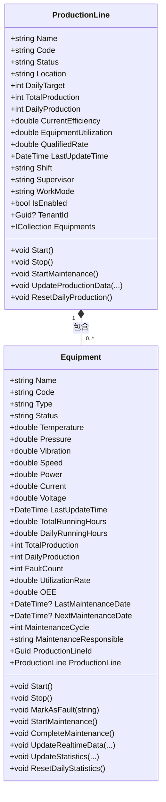
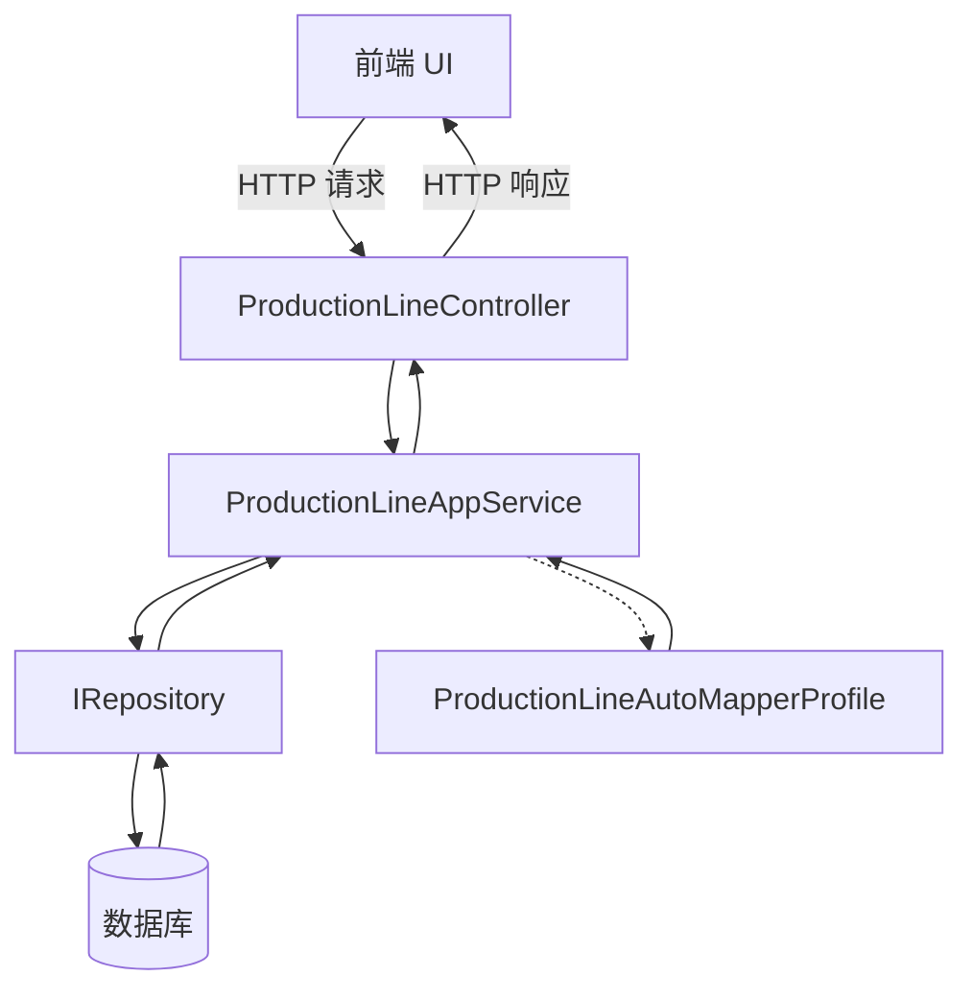

# 生产线实体模型

<cite>
**本文档引用的文件**  
- [ProductionLine.cs](file://src/SmartAbp.Domain/Entities/MES/ProductionLine.cs)
- [Equipment.cs](file://src/SmartAbp.Domain/Entities/MES/Equipment.cs)
- [ProductionLineAppService.cs](file://src/SmartAbp.Application/ProductionLine/ProductionLineAppService.cs)
- [ProductionLineDto.cs](file://src/SmartAbp.Application.Contracts/ProductionLine/ProductionLineDto.cs)
- [ProductionLineAutoMapperProfile.cs](file://src/SmartAbp.Application/ProductionLine/ProductionLineAutoMapperProfile.cs)
- [mes-entities-config.json](file://config/mes-entities-config.json)
</cite>

## 目录
1. [引言](#引言)
2. [生产线实体建模](#生产线实体建模)
3. [与设备的关联关系](#与设备的关联关系)
4. [生产节拍与工单排程](#生产节拍与工单排程)
5. [生产线状态管理](#生产线状态管理)
6. [层级结构与数据访问](#层级结构与数据访问)
7. [应用服务操作示例](#应用服务操作示例)
8. [结论](#结论)

## 引言
本文件详细阐述了hxlot项目中`ProductionLine`（生产线）实体的设计与实现。作为制造执行系统（MES）的核心组成部分，生产线实体不仅承载了基础的生产信息，还通过领域驱动设计（DDD）原则，实现了与设备、传感器等实体的聚合管理。本文档旨在为开发人员和系统架构师提供一个全面的参考，涵盖从数据建模、业务逻辑到应用服务调用的完整链条。

## 生产线实体建模

`ProductionLine` 实体位于 `SmartAbp.Domain.Entities.MES` 命名空间下，是继承自 `FullAuditedAggregateRoot<Guid>` 的聚合根，实现了 `IMultiTenant` 接口以支持多租户。该实体通过丰富的属性对生产线进行建模，主要分为以下几个维度：

- **基本信息**：包括 `Name`（名称）、`Code`（编号）、`Description`（描述）和 `Location`（位置），用于标识和描述生产线。
- **配置信息**：包含 `Shift`（班次）、`Supervisor`（班组长）、`WorkMode`（工作模式）和 `IsEnabled`（是否启用），用于管理生产线的运行配置。
- **生产数据**：实时统计指标，如 `TotalProduction`（总产量）、`DailyProduction`（本日产量）、`CurrentEfficiency`（当前效率）、`EquipmentUtilization`（设备利用率）和 `QualifiedRate`（合格率），用于监控生产绩效。
- **状态信息**：`Status` 属性用于表示生产线的当前状态。

实体的构造函数确保了数据的完整性。无参构造函数用于EF Core的ORM映射，而带参构造函数则用于创建新的生产线实例，并初始化关键属性的默认值，如状态为“stopped”（已停止），启用状态为 `true`。

**Section sources**
- [ProductionLine.cs](file://src/SmartAbp.Domain/Entities/MES/ProductionLine.cs#L11-L176)

## 与设备的关联关系

生产线与设备之间存在明确的一对多（1:N）关联关系。这种关系在领域层通过导航属性和外键来实现。

在 `ProductionLine` 实体中，定义了 `Equipments` 导航属性：
```csharp
public virtual ICollection<Equipment> Equipments { get; set; }
```
该属性是一个 `Equipment` 实体的集合，表示一条生产线可以拥有多个设备。

相应地，在 `Equipment` 实体中，定义了 `ProductionLineId` 外键和 `ProductionLine` 导航属性：
```csharp
public Guid ProductionLineId { get; set; }
public virtual ProductionLine ProductionLine { get; set; }
```
`ProductionLineId` 作为外键，将设备与特定的生产线关联起来。`virtual` 关键字支持延迟加载，当需要访问设备所属的生产线信息时，EF Core 会自动执行数据库查询。

这种设计遵循了聚合根的原则，`ProductionLine` 作为聚合根，负责管理其内部的 `Equipment` 实体的生命周期。对设备的创建、更新和删除操作通常通过生产线聚合根来协调，保证了数据的一致性和事务的完整性。



**Diagram sources**
- [ProductionLine.cs](file://src/SmartAbp.Domain/Entities/MES/ProductionLine.cs#L11-L235)
- [Equipment.cs](file://src/SmartAbp.Domain/Entities/MES/Equipment.cs#L10-L409)

## 生产节拍与工单排程

文档中并未直接提供生产节拍（Takt Time）的计算逻辑。然而，根据实体模型和业务上下文，可以推断出其计算基础。生产节拍通常指生产一件产品所需的时间，计算公式为：`可用生产时间 / 客户需求量`。在本系统中，`DailyTarget`（本日目标产量）是计算节拍的关键输入。系统可能通过配置的班次（`Shift`）和工作模式（`WorkMode`）来确定每日的可用生产时间，进而计算出理论节拍。

关于工单排程，代码库中存在 `ProductionOrderManagement.template.vue` 文件，表明系统具备工单管理功能。虽然具体的排程算法未在提供的代码中详述，但 `MESDataSeeder.cs` 中的种子数据和 `AIFlowController.cs` 中的拓扑排序算法提供了重要线索。`AIFlowController` 中的 `TopologicalSort` 方法使用Kahn算法解析工位之间的依赖关系，这暗示了系统可能采用基于依赖关系的智能排程策略。排程引擎会考虑工单的优先级、所需工位、工位的依赖关系以及当前生产线的负载情况（如 `CurrentEfficiency` 和 `EquipmentUtilization`），来生成最优的生产计划。

## 生产线状态管理

生产线的状态通过 `Status` 属性进行管理，其值为字符串类型，预定义了多种状态，包括：
- `running`：运行中
- `stopped`：已停止
- `maintenance`：维护中

实体提供了明确的业务方法来改变状态，这些方法封装了状态变更的业务规则和副作用：
- `Start()`：将状态设置为 `running`。
- `Stop()`：将状态设置为 `stopped`。
- `StartMaintenance()`：将状态设置为 `maintenance`。

这些方法不仅修改状态，还会自动更新 `LastUpdateTime` 属性，确保了状态变更的时间戳被准确记录。这种将状态变更逻辑封装在领域对象内部的做法，是领域驱动设计的典型实践，它保证了业务规则的集中管理和数据的一致性。

**Section sources**
- [ProductionLine.cs](file://src/SmartAbp.Domain/Entities/MES/ProductionLine.cs#L178-L220)

## 层级结构与数据访问

生产线实体在系统中形成了清晰的层级结构。`ProductionLine` 作为聚合根，是数据访问的入口点。应用服务（Application Service）通过仓储（Repository）与 `ProductionLine` 聚合根进行交互。

数据访问模式遵循ABP框架的 `CrudAppService` 模式。`ProductionLineAppService` 继承自 `CrudAppService<ProductionLine, ProductionLineDto, Guid, ...>`，自动获得了完整的CRUD（创建、读取、更新、删除）功能。该服务通过 `IRepository<ProductionLine, Guid>` 与数据库进行交互。

数据传输通过DTO（Data Transfer Object）模式进行。`ProductionLineDto` 类定义了与前端交互的数据结构，确保了前后端数据的一致性。`AutoMapper` 被用于在 `ProductionLine` 实体和 `ProductionLineDto` 之间进行高效、安全的映射。在 `ProductionLineAutoMapperProfile` 中，可以清晰地看到映射配置，例如在创建新生产线时，会自动忽略审计字段，并为 `Status`、`TotalProduction` 等字段设置默认值。



**Diagram sources**
- [ProductionLineAppService.cs](file://src/SmartAbp.Application/ProductionLine/ProductionLineAppService.cs#L17-L213)
- [ProductionLineAutoMapperProfile.cs](file://src/SmartAbp.Application/ProductionLine/ProductionLineAutoMapperProfile.cs#L11-L74)
- [ProductionLineController.cs](file://src/SmartAbp.HttpApi/Controllers/ProductionLineController.cs#L15-L91)

## 应用服务操作示例

通过 `ProductionLineAppService`，可以方便地操作生产线数据。以下是一些典型操作的代码路径：

- **创建生产线**：调用 `CreateAsync(CreateProductionLineDto input)` 方法。`CreateProductionLineDto` 包含了创建所需的所有信息，如名称、编号、位置、类型和本日目标产量。应用服务会通过 `AutoMapper` 将DTO映射为 `ProductionLine` 实体，并调用仓储的 `InsertAsync` 方法将其持久化。
- **查询生产线列表**：调用 `GetListAsync(GetProductionLineListInput input)` 方法。`GetProductionLineListInput` 支持分页、排序和筛选（通过 `Filter`、`Status`、`Type` 等参数），返回一个 `PagedResultDto<ProductionLineDto>` 对象。
- **更新生产线**：调用 `UpdateAsync(Guid id, UpdateProductionLineDto input)` 方法。此操作会更新指定ID的生产线信息。
- **删除生产线**：调用 `DeleteAsync(Guid id)` 方法。ABP框架默认执行软删除，即标记 `IsDeleted` 字段，而非物理删除数据。

这些操作最终由 `ProductionLineController` 暴露为RESTful API端点，供前端应用调用。

**Section sources**
- [ProductionLineAppService.cs](file://src/SmartAbp.Application/ProductionLine/ProductionLineAppService.cs#L17-L213)
- [ProductionLineDto.cs](file://src/SmartAbp.Application.Contracts/ProductionLine/ProductionLineDto.cs#L11-L116)

## 结论
`ProductionLine` 实体是hxlot项目MES模块的核心，其设计体现了良好的领域驱动设计原则。通过明确定义的属性、封装的业务方法、清晰的聚合关系以及标准化的应用服务层，该实体为生产线的全生命周期管理提供了坚实的基础。系统通过DTO和AutoMapper实现了前后端的解耦，并通过REST API提供了灵活的数据访问能力。未来，可以在此基础上进一步完善生产节拍的计算逻辑和工单排程的智能化算法。