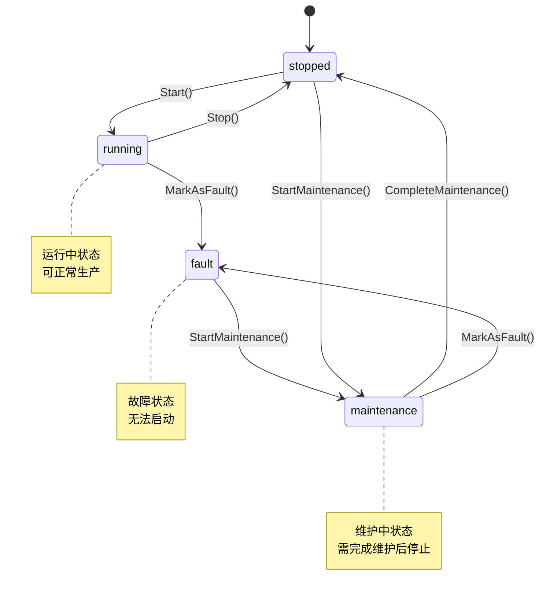
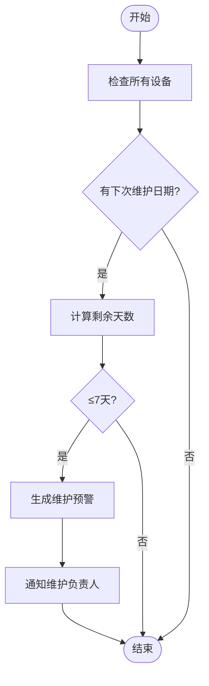
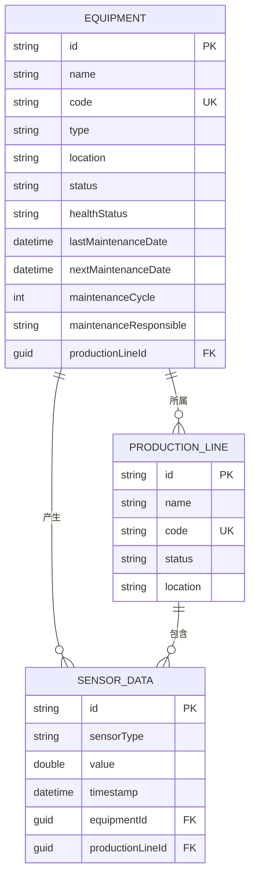
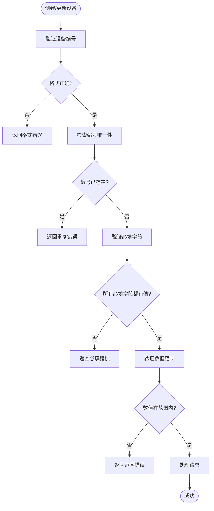

# 设备实体模型

<cite>
**本文档引用文件**  
- [Equipment.cs](file://src/SmartAbp.Domain/Entities/MES/Equipment.cs)
- [EquipmentDto.cs](file://src/SmartAbp.Application.Contracts/Equipment/EquipmentDto.cs)
- [CreateEquipmentDto.cs](file://src/SmartAbp.Application.Contracts/Equipment/CreateEquipmentDto.cs)
- [UpdateEquipmentDto.cs](file://src/SmartAbp.Application.Contracts/Equipment/UpdateEquipmentDto.cs)
- [EquipmentAppService.cs](file://src/SmartAbp.Application/Equipment/EquipmentAppService.cs)
- [EquipmentAutoMapperProfile.cs](file://src/SmartAbp.Application/Equipment/EquipmentAutoMapperProfile.cs)
- [ProductionLine.cs](file://src/SmartAbp.Domain/Entities/MES/ProductionLine.cs)
- [SensorData.cs](file://src/SmartAbp.Domain/Entities/MES/SensorData.cs)
- [equipment.types.ts](file://output/mes-uniapp/types/equipment.types.ts)
</cite>

## 目录
1. [简介](#简介)
2. [核心属性设计](#核心属性设计)
3. [设备状态机实现](#设备状态机实现)
4. [维护周期与预警机制](#维护周期与预警机制)
5. [实体关联关系](#实体关联关系)
6. [CRUD操作与业务验证](#crud操作与业务验证)

## 简介
设备实体是MES系统中的核心领域对象，用于管理生产设备的全生命周期信息。该实体包含设备基本信息、运行状态、维护信息和统计指标，支持与生产线、传感器等实体的关联，实现对设备的全面监控和管理。

**Section sources**
- [Equipment.cs](file://src/SmartAbp.Domain/Entities/MES/Equipment.cs)

## 核心属性设计
设备实体包含以下核心属性：

### 基本信息
- **设备编号**：唯一标识符，格式如"EQ-001"，长度限制50字符，仅允许大写字母、数字和连字符。
- **设备类型**：如焊接机、冲压机等，长度限制100字符。
- **位置信息**：设备所在位置，如"车间A-工位01"，长度限制500字符。
- **责任人**：维护负责人，长度限制100字符。

### 状态信息
- **运行状态**：包括运行中(running)、已停止(stopped)、故障(fault)、维护中(maintenance)。
- **健康状态**：包括健康(healthy)、警告(warning)、严重(critical)。

### 维护信息
- **维护周期**：以天为单位，范围1-365天。
- **上次维护日期**：可为空的日期时间类型。
- **下次维护日期**：根据维护周期自动计算。

**Section sources**
- [Equipment.cs](file://src/SmartAbp.Domain/Entities/MES/Equipment.cs)
- [EquipmentDto.cs](file://src/SmartAbp.Application.Contracts/Equipment/EquipmentDto.cs)
- [CreateEquipmentDto.cs](file://src/SmartAbp.Application.Contracts/Equipment/CreateEquipmentDto.cs)
- [UpdateEquipmentDto.cs](file://src/SmartAbp.Application.Contracts/Equipment/UpdateEquipmentDto.cs)

## 设备状态机实现
设备状态机通过业务方法实现状态转换，确保状态变更的合法性和数据一致性。



**Diagram sources**
- [Equipment.cs](file://src/SmartAbp.Domain/Entities/MES/Equipment.cs)

**Section sources**
- [Equipment.cs](file://src/SmartAbp.Domain/Entities/MES/Equipment.cs)

## 维护周期与预警机制
### 维护周期计算
维护周期以天为单位存储，下次维护日期通过以下公式计算：
```
下次维护日期 = 上次维护日期 + 维护周期
```

### 预警机制
系统通过以下方式实现维护预警：
1. 每日检查所有设备的下次维护日期
2. 当设备距离下次维护日期≤7天时，生成预警
3. 预警信息通过消息中心通知维护负责人



**Diagram sources**
- [Equipment.cs](file://src/SmartAbp.Domain/Entities/MES/Equipment.cs)

**Section sources**
- [Equipment.cs](file://src/SmartAbp.Domain/Entities/MES/Equipment.cs)

## 实体关联关系
设备实体与其他实体存在以下关联关系：



**Diagram sources**
- [Equipment.cs](file://src/SmartAbp.Domain/Entities/MES/Equipment.cs)
- [ProductionLine.cs](file://src/SmartAbp.Domain/Entities/MES/ProductionLine.cs)
- [SensorData.cs](file://src/SmartAbp.Domain/Entities/MES/SensorData.cs)

**Section sources**
- [Equipment.cs](file://src/SmartAbp.Domain/Entities/MES/Equipment.cs)
- [ProductionLine.cs](file://src/SmartAbp.Domain/Entities/MES/ProductionLine.cs)
- [SensorData.cs](file://src/SmartAbp.Domain/Entities/MES/SensorData.cs)

## CRUD操作与业务验证
### CRUD操作接口
设备实体提供标准的CRUD操作接口：

| 操作 | HTTP方法 | 路径 | 说明 |
|------|--------|------|------|
| 创建 | POST | /api/equipment | 创建新设备 |
| 查询 | GET | /api/equipment | 分页查询设备列表 |
| 详情 | GET | /api/equipment/{id} | 获取设备详情 |
| 更新 | PUT | /api/equipment/{id} | 更新设备信息 |
| 删除 | DELETE | /api/equipment/{id} | 删除设备 |

### 业务验证规则
创建和更新设备时执行以下验证规则：



**Diagram sources**
- [EquipmentAppService.cs](file://src/SmartAbp.Application/Equipment/EquipmentAppService.cs)
- [CreateEquipmentDto.cs](file://src/SmartAbp.Application.Contracts/Equipment/CreateEquipmentDto.cs)
- [UpdateEquipmentDto.cs](file://src/SmartAbp.Application.Contracts/Equipment/UpdateEquipmentDto.cs)

**Section sources**
- [EquipmentAppService.cs](file://src/SmartAbp.Application/Equipment/EquipmentAppService.cs)
- [EquipmentAutoMapperProfile.cs](file://src/SmartAbp.Application/Equipment/EquipmentAutoMapperProfile.cs)
- [CreateEquipmentDto.cs](file://src/SmartAbp.Application.Contracts/Equipment/CreateEquipmentDto.cs)
- [UpdateEquipmentDto.cs](file://src/SmartAbp.Application.Contracts/Equipment/UpdateEquipmentDto.cs)