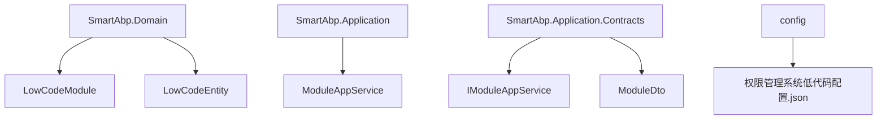
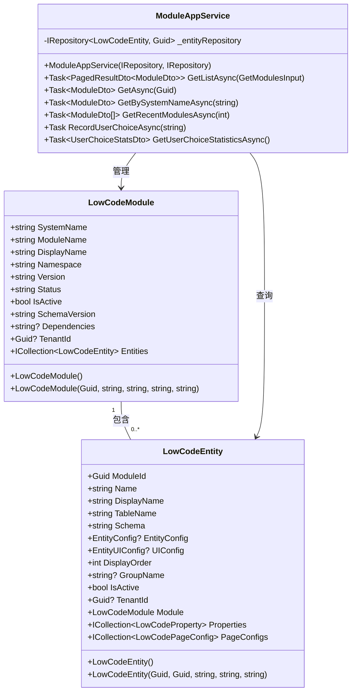
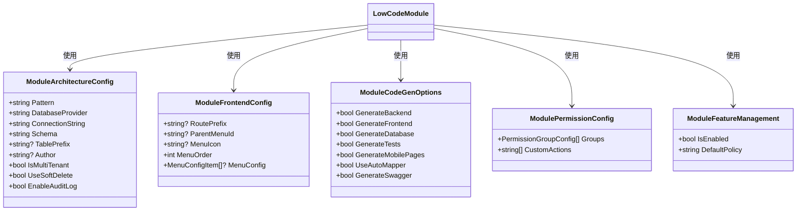
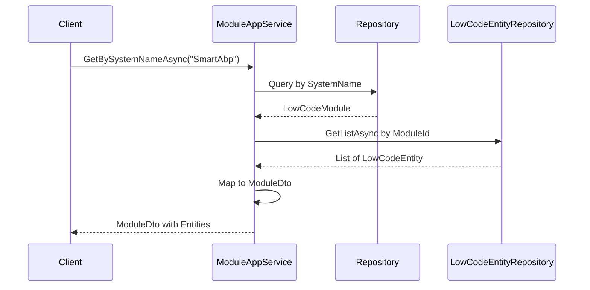
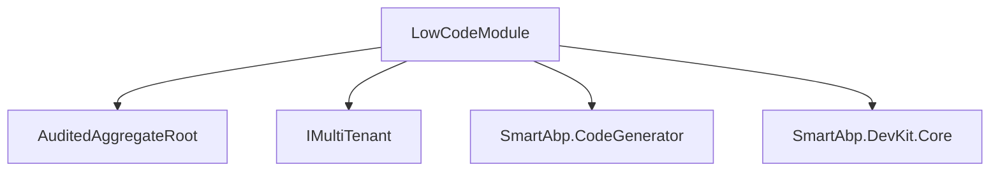

# 低代码模块

<cite>
**本文档引用文件**  
- [LowCodeModule.cs](file://src/SmartAbp.Domain/Entities/LowCode/LowCodeModule.cs)
- [ModuleAppService.cs](file://src/SmartAbp.Application/LowCode/ModuleAppService.cs)
- [IModuleAppService.cs](file://src/SmartAbp.Application.Contracts/LowCode/IModuleAppService.cs)
- [ModuleDto.cs](file://src/SmartAbp.Application.Contracts/LowCode/Dtos/ModuleDto.cs)
- [PageConfigDto.cs](file://src/SmartAbp.Domain.Shared/LowCode/PageConfigDto.cs)
- [权限管理系统低代码配置.json](file://config/权限管理系统低代码配置.json)
</cite>

## 目录
1. [引言](#引言)
2. [项目结构](#项目结构)
3. [核心组件](#核心组件)
4. [架构概述](#架构概述)
5. [详细组件分析](#详细组件分析)
6. [依赖分析](#依赖分析)
7. [性能考虑](#性能考虑)
8. [故障排除指南](#故障排除指南)
9. [结论](#结论)

## 引言
本文档深入解析hxlot项目中低代码模块的设计与实现。重点阐述`LowCodeModule`作为根聚合的设计原理，其作为低代码模块容器的职责，包括模块元数据管理、版本控制和生命周期管理。详细说明模块与实体、页面配置、权限定义等子元素的关系，以及模块级别的配置如何影响代码生成行为。

## 项目结构
低代码模块的核心实现位于`src`目录下的多个项目中，主要包括：
- `SmartAbp.Domain`：定义`LowCodeModule`和`LowCodeEntity`等聚合根实体。
- `SmartAbp.Application`：提供`ModuleAppService`应用服务，处理模块的CRUD操作。
- `SmartAbp.Application.Contracts`：定义`IModuleAppService`接口和`ModuleDto`数据传输对象。
- `config`目录：存放模块的JSON配置文件，如`权限管理系统低代码配置.json`。

**图示来源**
- [LowCodeModule.cs](file://src/SmartAbp.Domain/Entities/LowCode/LowCodeModule.cs)
- [ModuleAppService.cs](file://src/SmartAbp.Application/LowCode/ModuleAppService.cs)
- [IModuleAppService.cs](file://src/SmartAbp.Application.Contracts/LowCode/IModuleAppService.cs)
- [权限管理系统低代码配置.json](file://config/权限管理系统低代码配置.json)

**本节来源**
- [LowCodeModule.cs](file://src/SmartAbp.Domain/Entities/LowCode/LowCodeModule.cs)
- [ModuleAppService.cs](file://src/SmartAbp.Application/LowCode/ModuleAppService.cs)
- [IModuleAppService.cs](file://src/SmartAbp.Application.Contracts/LowCode/IModuleAppService.cs)
- [权限管理系统低代码配置.json](file://config/权限管理系统低代码配置.json)

## 核心组件
`LowCodeModule`是低代码模块的根聚合，负责管理模块的元数据、版本和生命周期。它通过导航属性与`LowCodeEntity`、`LowCodeProperty`和`LowCodePageConfig`等子元素建立关系，形成一个完整的模块结构。

**本节来源**
- [LowCodeModule.cs](file://src/SmartAbp.Domain/Entities/LowCode/LowCodeModule.cs)
- [LowCodeEntity.cs](file://src/SmartAbp.Domain/Entities/LowCode/LowCodeEntity.cs)

## 架构概述
低代码模块采用领域驱动设计（DDD）的聚合根模式，`LowCodeModule`作为根实体，确保了模块内部数据的一致性和完整性。应用服务`ModuleAppService`继承自`CrudAppService`，提供了标准的CRUD操作，并扩展了`GetBySystemNameAsync`等特定方法。

**图示来源**
- [LowCodeModule.cs](file://src/SmartAbp.Domain/Entities/LowCode/LowCodeModule.cs)
- [LowCodeEntity.cs](file://src/SmartAbp.Domain/Entities/LowCode/LowCodeEntity.cs)
- [ModuleAppService.cs](file://src/SmartAbp.Application/LowCode/ModuleAppService.cs)

## 详细组件分析
### LowCodeModule 分析
`LowCodeModule`类定义了模块的核心属性，包括系统名称、模块名称、显示名称、命名空间、版本号等。它还包含多个JSON配置对象，如`ArchitectureConfig`、`FrontendConfig`、`CodeGenOptions`等，用于存储模块的详细配置。

#### 对象导向组件

**图示来源**
- [LowCodeModule.cs](file://src/SmartAbp.Domain/Entities/LowCode/LowCodeModule.cs)

#### API/服务组件

**图示来源**
- [ModuleAppService.cs](file://src/SmartAbp.Application/LowCode/ModuleAppService.cs)
- [IModuleAppService.cs](file://src/SmartAbp.Application.Contracts/LowCode/IModuleAppService.cs)

### 模块间依赖关系处理
模块间的依赖关系通过`Dependencies`属性以JSON数组的形式存储，支持模块间的引用和依赖管理。

**本节来源**
- [LowCodeModule.cs](file://src/SmartAbp.Domain/Entities/LowCode/LowCodeModule.cs)
- [ModuleAppService.cs](file://src/SmartAbp.Application/LowCode/ModuleAppService.cs)

## 依赖分析
低代码模块依赖于ABP框架的核心组件，如`AuditedAggregateRoot`和`IMultiTenant`，并与其他模块如`SmartAbp.CodeGenerator`和`SmartAbp.DevKit.Core`进行集成。

**图示来源**
- [LowCodeModule.cs](file://src/SmartAbp.Domain/Entities/LowCode/LowCodeModule.cs)

**本节来源**
- [LowCodeModule.cs](file://src/SmartAbp.Domain/Entities/LowCode/LowCodeModule.cs)

## 性能考虑
在处理大量模块和实体时，应注意查询性能。`ModuleAppService`中的`GetListAsync`方法使用了分页查询，避免一次性加载过多数据。

## 故障排除指南
当模块创建或更新失败时，应检查`ModuleAppService`的日志输出，确保所有必填字段都已正确设置，并且模块名称和系统名称的唯一性约束未被违反。

**本节来源**
- [ModuleAppService.cs](file://src/SmartAbp.Application/LowCode/ModuleAppService.cs)

## 结论
`LowCodeModule`作为低代码模块的根聚合，提供了强大的元数据管理和代码生成能力。通过合理的架构设计和依赖管理，确保了模块的灵活性和可扩展性。