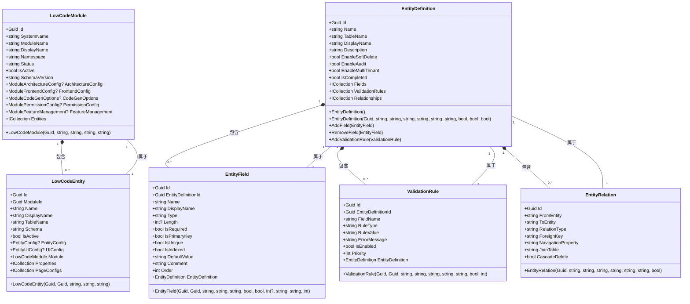

# 低代码领域模型

<cite>
**本文档引用文件**  
- [LowCodeModule.cs](file://src/SmartAbp.Domain/Entities/LowCode/LowCodeModule.cs)
- [LowCodeEntity.cs](file://src/SmartAbp.Domain/Entities/LowCode/LowCodeEntity.cs)
- [EntityDefinition.cs](file://src/SmartAbp.Domain/Entities/LowCode/EntityDefinition.cs)
- [EntityField.cs](file://src/SmartAbp.Domain/Entities/LowCode/EntityField.cs)
- [ValidationRule.cs](file://src/SmartAbp.Domain/Entities/LowCode/ValidationRule.cs)
- [EntityRelation.cs](file://src/SmartAbp.Domain/Entities/LowCode/EntityRelation.cs)
</cite>

## 目录
1. [简介](#简介)
2. [核心聚合根：LowCodeModule](#核心聚合根lowcodemodule)
3. [实体建模核心：EntityDefinition与LowCodeEntity](#实体建模核心entitydefinition与lowcodeentity)
4. [动态字段与验证规则建模](#动态字段与验证规则建模)
5. [实体关系建模](#实体关系建模)
6. [低代码元数据模型UML类图](#低代码元数据模型uml类图)
7. [生命周期与一致性边界](#生命周期与一致性边界)
8. [可视化建模与数据持久化支持](#可视化建模与数据持久化支持)

## 简介
hxlot项目中的低代码领域模型旨在通过领域驱动设计（DDD）实现可视化低代码平台的核心元数据管理。该模型以`LowCodeModule`为根聚合，统一管理模块、实体、字段、验证规则和关系等元数据，支持动态业务模块的建模与代码生成。本模型作为后端单一事实源（SSOT），确保前后端元数据一致性，并为可视化建模工具提供完整的数据结构支持。

## 核心聚合根：LowCodeModule
`LowCodeModule`是低代码系统的根聚合根，代表一个完整的业务模块（如项目管理、设备管理）。它作为模块容器，管理其下所有实体的生命周期和一致性。

该聚合根不仅包含模块的基础信息（系统名称、显示名称、命名空间等），还通过强类型的JSON配置对象管理模块的架构、前端、代码生成、权限和特性管理等配置。这种设计将结构化数据与灵活的JSON配置相结合，既保证了核心数据的完整性，又提供了足够的扩展性。

`LowCodeModule`通过导航属性`Entities`与`LowCodeEntity`形成聚合关系，确保模块内所有实体的数据一致性。任何对模块内实体的修改都必须通过模块聚合根进行，从而维护了聚合边界内的业务规则和不变性。

**本节来源**  
- [LowCodeModule.cs](file://src/SmartAbp.Domain/Entities/LowCode/LowCodeModule.cs#L15-L162)

## 实体建模核心：EntityDefinition与LowCodeEntity
`EntityDefinition`是低代码引擎中实体建模的核心领域对象，对应前端的实体建模界面。它与`LowCodeEntity`共同构成实体元数据的完整表示。

`LowCodeEntity`作为`LowCodeModule`聚合内的实体，主要负责存储实体的基础信息和数据库映射配置，如实体名称、显示名称、表名、Schema等。它通过导航属性`Fields`、`ValidationRules`和`Relationships`与`EntityDefinition`建立关联，形成完整的实体元数据模型。

`EntityDefinition`则作为实体定义的聚合根，直接管理实体字段、验证规则和关系的集合。它提供了`AddField`、`RemoveField`和`AddValidationRule`等方法，封装了实体元数据的变更逻辑，并通过`CheckCompletion`方法确保实体定义的完整性（至少包含一个主键和两个字段）。

这种设计将实体的静态信息（由`LowCodeEntity`管理）与动态元数据（由`EntityDefinition`管理）分离，既满足了聚合根的设计原则，又支持了复杂的实体建模需求。

**本节来源**  
- [LowCodeEntity.cs](file://src/SmartAbp.Domain/Entities/LowCode/LowCodeEntity.cs#L15-L158)
- [EntityDefinition.cs](file://src/SmartAbp.Domain/Entities/LowCode/EntityDefinition.cs#L12-L199)

## 动态字段与验证规则建模
低代码模型通过`EntityField`和`ValidationRule`两个实体实现动态字段和验证规则的建模。

`EntityField`代表实体中的一个字段，包含字段名称、类型、长度、是否必填、是否主键等基本属性。此外，它还包含丰富的UI和数据库配置属性，如`IsVisible`、`IsReadonly`、`IsIndexed`、`ColumnName`等，支持字段在不同场景下的行为控制。

`ValidationRule`则用于定义字段的验证规则，支持多种规则类型（长度、范围、正则表达式、唯一性、自定义等）。每个验证规则包含规则值、错误消息、优先级和触发时机等属性，允许构建复杂的验证逻辑。

`EntityDefinition`通过`ICollection<EntityField>`和`ICollection<ValidationRule>`导航属性管理这些元数据。当添加或移除字段时，`EntityDefinition`会自动调用`CheckCompletion`方法更新实体的完成状态，确保模型的完整性。

这种设计使得低代码平台能够动态构建实体结构，并在运行时生成相应的数据验证逻辑，为前端表单和后端API提供一致的验证体验。

**本节来源**  
- [EntityField.cs](file://src/SmartAbp.Domain/Entities/LowCode/EntityField.cs#L10-L144)
- [ValidationRule.cs](file://src/SmartAbp.Domain/Entities/LowCode/ValidationRule.cs#L10-L93)

## 实体关系建模
`EntityRelation`实体用于建模实体间的关联关系，支持一对一、一对多和多对多三种关系类型。

该实体通过`FromEntity`和`ToEntity`属性定义关系的源和目标实体，通过`RelationType`指定关系类型。对于外键关系，`ForeignKey`属性存储外键字段名，`NavigationProperty`存储导航属性名。对于多对多关系，`JoinTable`属性指定中间表名称。

`EntityRelation`还支持级联删除（`CascadeDelete`）和关系描述（`Description`）等高级特性，满足复杂业务场景的需求。

作为`EntityDefinition`聚合根的一部分，`EntityRelation`的生命周期由`EntityDefinition`管理。这种设计确保了关系元数据的一致性，并支持在代码生成时正确构建实体间的导航属性和外键约束。

**本节来源**  
- [EntityRelation.cs](file://src/SmartAbp.Domain/Entities/LowCode/EntityRelation.cs#L11-L87)

## 低代码元数据模型UML类图

**图表来源**  
- [LowCodeModule.cs](file://src/SmartAbp.Domain/Entities/LowCode/LowCodeModule.cs#L15-L162)
- [LowCodeEntity.cs](file://src/SmartAbp.Domain/Entities/LowCode/LowCodeEntity.cs#L15-L158)
- [EntityDefinition.cs](file://src/SmartAbp.Domain/Entities/LowCode/EntityDefinition.cs#L12-L199)
- [EntityField.cs](file://src/SmartAbp.Domain/Entities/LowCode/EntityField.cs#L10-L144)
- [ValidationRule.cs](file://src/SmartAbp.Domain/Entities/LowCode/ValidationRule.cs#L10-L93)
- [EntityRelation.cs](file://src/SmartAbp.Domain/Entities/LowCode/EntityRelation.cs#L11-L87)

## 生命周期与一致性边界
低代码元数据模型通过明确的聚合边界和生命周期管理确保数据一致性。

`LowCodeModule`作为根聚合根，管理其下所有`LowCodeEntity`的生命周期。对模块的任何修改（如添加、删除实体）都必须通过`LowCodeModule`进行，确保模块内实体的一致性。`LowCodeEntity`作为模块聚合的一部分，不独立存在。

`EntityDefinition`作为实体定义的聚合根，独立管理实体的字段、验证规则和关系。这种设计将实体的静态信息（`LowCodeEntity`）与动态元数据（`EntityDefinition`）分离，既满足了聚合根的设计原则，又支持了复杂的实体建模需求。

`EntityField`、`ValidationRule`和`EntityRelation`作为`EntityDefinition`聚合内的实体，其生命周期由`EntityDefinition`管理。任何对这些元数据的修改都必须通过`EntityDefinition`进行，确保实体定义的完整性。

这种分层的聚合设计有效隔离了不同粒度的业务逻辑，避免了复杂的跨聚合引用，提高了系统的可维护性和可扩展性。

**本节来源**  
- [LowCodeModule.cs](file://src/SmartAbp.Domain/Entities/LowCode/LowCodeModule.cs#L15-L162)
- [LowCodeEntity.cs](file://src/SmartAbp.Domain/Entities/LowCode/LowCodeEntity.cs#L15-L158)
- [EntityDefinition.cs](file://src/SmartAbp.Domain/Entities/LowCode/EntityDefinition.cs#L12-L199)

## 可视化建模与数据持久化支持
低代码领域模型为可视化建模工具提供了完整的数据持久化支持。

`EntityDefinition`类中的`AddField`、`RemoveField`和`AddValidationRule`等方法封装了元数据变更的业务逻辑，确保模型的完整性。`CheckCompletion`方法自动验证实体定义是否满足完成条件（至少一个主键和两个字段），为前端提供了实时的建模反馈。

该模型通过NSwag工具生成前端TypeScript类型，确保前后端元数据结构的一致性。前端可视化建模工具可以直接使用这些类型进行界面渲染和数据绑定，实现所见即所得的建模体验。

在数据持久化方面，模型采用EF Core进行数据库映射。`LowCodeModule`映射到`LC_Modules`表，`LowCodeEntity`映射到`LC_Entities`表，而`EntityField`、`ValidationRule`和`EntityRelation`则分别映射到对应的数据库表。JSON配置字段（如`ArchitectureConfig`、`FrontendConfig`）被序列化为JSON字符串存储，既保持了数据的结构化，又提供了足够的灵活性。

这种设计使得可视化建模工具能够无缝地与后端领域模型集成，实现元数据的实时同步和持久化。

**本节来源**  
- [EntityDefinition.cs](file://src/SmartAbp.Domain/Entities/LowCode/EntityDefinition.cs#L12-L199)
- [EntityField.cs](file://src/SmartAbp.Domain/Entities/LowCode/EntityField.cs#L10-L144)
- [ValidationRule.cs](file://src/SmartAbp.Domain/Entities/LowCode/ValidationRule.cs#L10-L93)
- [EntityRelation.cs](file://src/SmartAbp.Domain/Entities/LowCode/EntityRelation.cs#L11-L87)