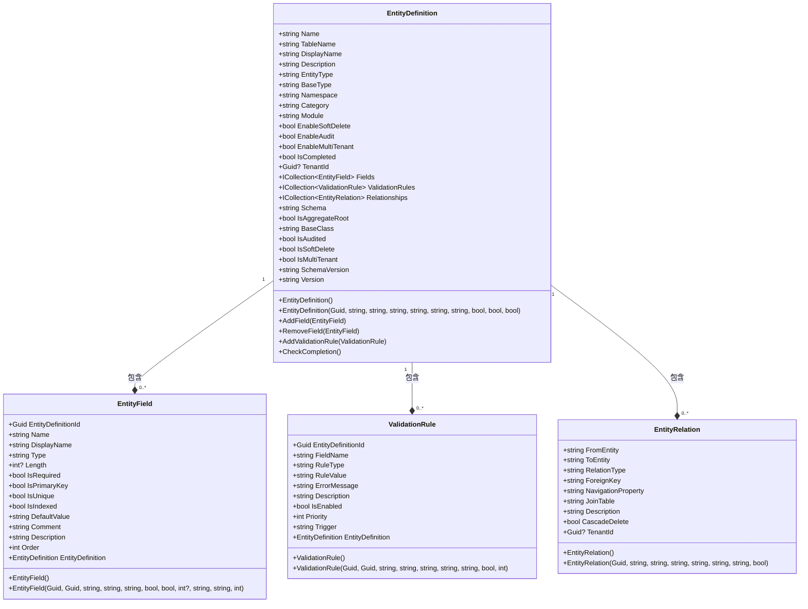
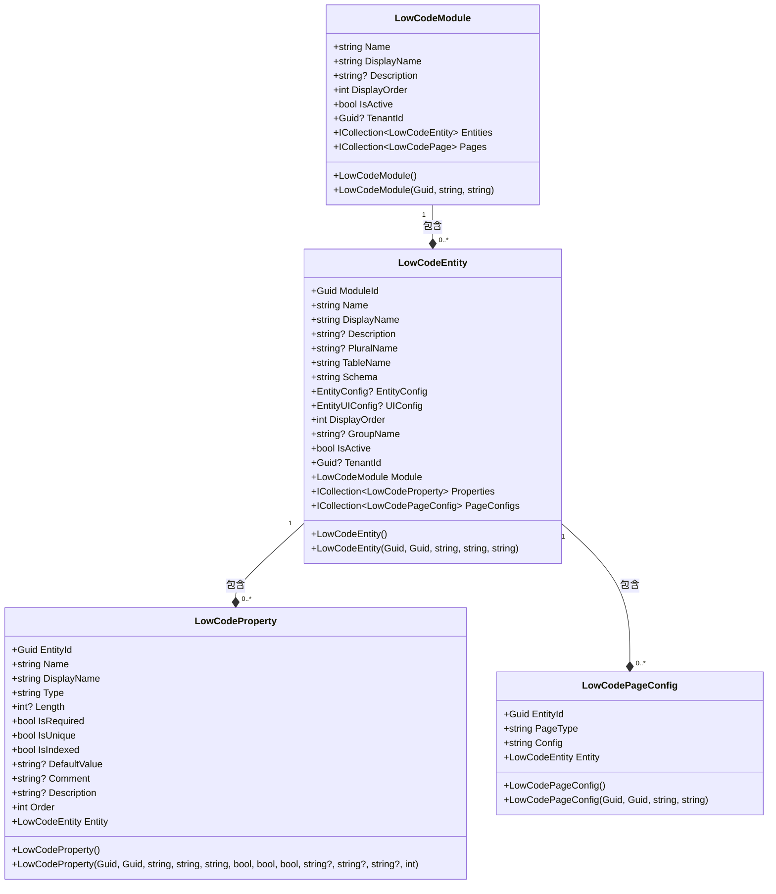
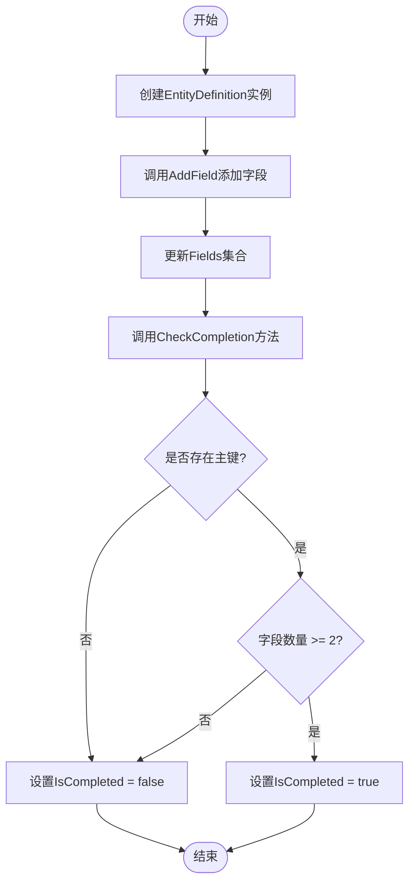
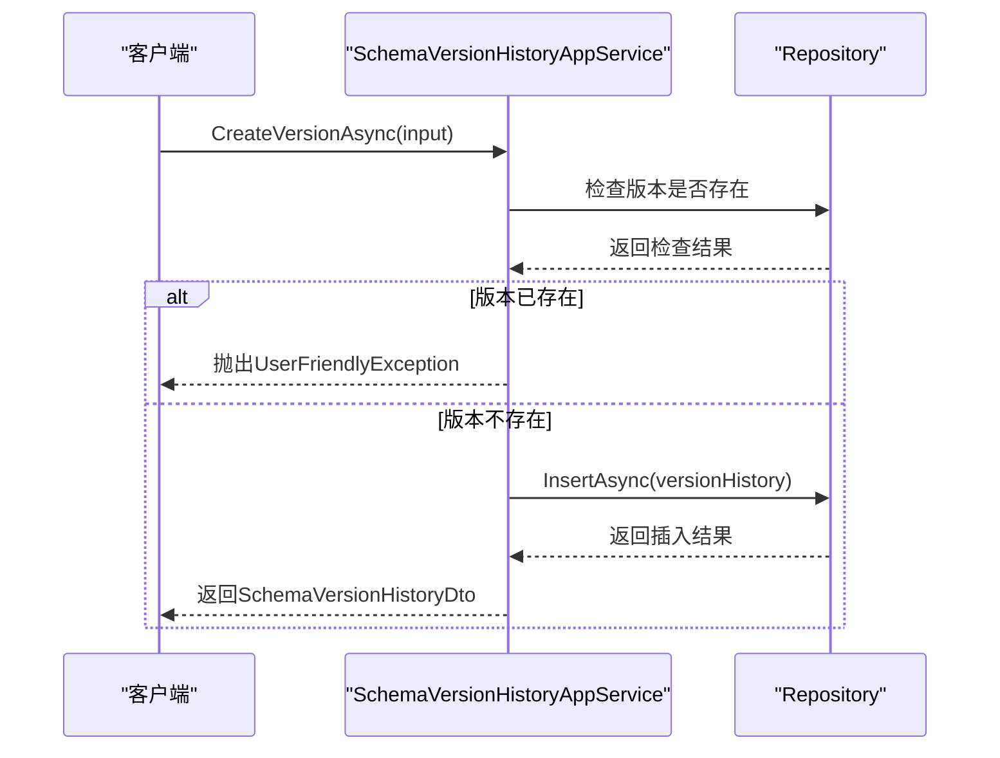
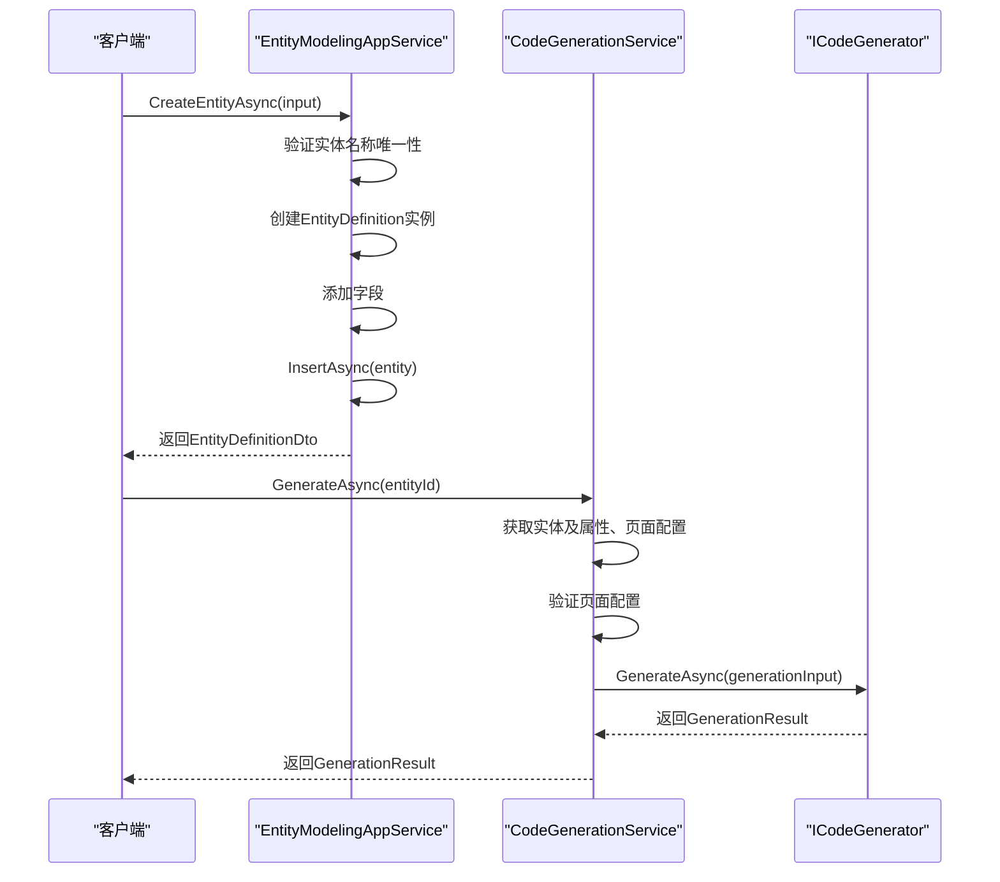

# 实体定义

<cite>
**本文档引用的文件**  
- [EntityDefinition.cs](file://src/SmartAbp.Domain/Entities/LowCode/EntityDefinition.cs)
- [LowCodeEntity.cs](file://src/SmartAbp.Domain/Entities/LowCode/LowCodeEntity.cs)
- [EntityModelingAppService.cs](file://src/SmartAbp.Application/LowCode/EntityModelingAppService.cs)
- [SchemaVersionHistoryAppService.cs](file://src/SmartAbp.Application/LowCode/SchemaVersionHistoryAppService.cs)
- [CodeGenerationService.cs](file://src/SmartAbp.Application/LowCode/CodeGenerationService.cs)
- [Definitions.cs](file://src/SmartAbp.CodeGenerator/Core/Definitions.cs)
- [entity-modeling.ts](file://src/SmartAbp.Vue/src/api/lowcode/entity-modeling.ts)
</cite>

## 目录
1. [引言](#引言)
2. [核心实体模型](#核心实体模型)
3. [EntityDefinition与LowCodeEntity关系解析](#entitydefinition与lowcodeentity关系解析)
4. [实体属性与约束定义](#实体属性与约束定义)
5. [主键、索引与约束配置](#主键索引与约束配置)
6. [实体版本控制与变更追踪](#实体版本控制与变更追踪)
7. [领域模型操作与代码生成](#领域模型操作与代码生成)
8. [结论](#结论)

## 引言

在hxlot项目中，实体定义是低代码平台数据建模的核心组成部分。通过`EntityDefinition`和`LowCodeEntity`两个关键领域实体，系统实现了对业务数据模型的灵活定义与管理。本文档深入解析这两个实体的关系、设计原理及其在代码生成流程中的作用，为开发者提供全面的技术参考。

**本文档引用的文件**  
- [EntityDefinition.cs](file://src/SmartAbp.Domain/Entities/LowCode/EntityDefinition.cs)
- [LowCodeEntity.cs](file://src/SmartAbp.Domain/Entities/LowCode/LowCodeEntity.cs)

## 核心实体模型

hxlot项目采用领域驱动设计（DDD）思想，将实体定义抽象为聚合根，确保数据一致性与业务规则的封装。`EntityDefinition`作为低代码建模的核心实体，承载了业务对象的元数据信息，包括名称、字段、验证规则和关系等。该实体通过导航属性与`EntityField`、`ValidationRule`和`EntityRelation`等子实体建立关联，形成完整的领域模型。

**图表来源**  
- [EntityDefinition.cs](file://src/SmartAbp.Domain/Entities/LowCode/EntityDefinition.cs)
- [EntityField.cs](file://src/SmartAbp.Domain/Entities/LowCode/EntityField.cs)
- [ValidationRule.cs](file://src/SmartAbp.Domain/Entities/LowCode/ValidationRule.cs)
- [EntityRelation.cs](file://src/SmartAbp.Domain/Entities/LowCode/EntityRelation.cs)

## EntityDefinition与LowCodeEntity关系解析

`EntityDefinition`与`LowCodeEntity`是hxlot项目中两个密切相关但职责分离的实体。`EntityDefinition`作为低代码建模的领域聚合根，专注于业务实体的元数据定义，而`LowCodeEntity`则是持久化到数据库的低代码实体记录，用于存储实体的基本信息和配置。

两者通过模块（Module）进行关联，`LowCodeEntity`包含一个`ModuleId`外键，指向其所属的模块，而`EntityDefinition`则通过`Module`属性与模块建立导航关系。这种设计实现了元数据定义与持久化存储的解耦，使得系统可以在不直接影响数据库结构的情况下，灵活地扩展和修改实体定义。

**图表来源**  
- [LowCodeEntity.cs](file://src/SmartAbp.Domain/Entities/LowCode/LowCodeEntity.cs)

## 实体属性与约束定义

`EntityDefinition`实体通过`Fields`集合定义了业务对象的属性列表。每个`EntityField`对象代表一个字段，包含名称、类型、长度、是否必填、是否主键等元数据。系统通过`AddField`和`RemoveField`方法维护字段集合，并在每次修改后调用`CheckCompletion`方法验证实体的完整性。

**图表来源**  
- [EntityDefinition.cs](file://src/SmartAbp.Domain/Entities/LowCode/EntityDefinition.cs)

## 主键、索引与约束配置

在`EntityField`类中，通过布尔属性`IsPrimaryKey`、`IsUnique`和`IsIndexed`分别控制字段的主键、唯一约束和索引创建。这些属性直接影响数据库表结构的生成。例如，当`IsPrimaryKey`为`true`时，该字段将被定义为数据库表的主键；当`IsUnique`为`true`时，将创建唯一约束；当`IsIndexed`为`true`时，将为该字段创建数据库索引。

## 实体版本控制与变更追踪

hxlot项目通过`SchemaVersionHistoryAppService`实现了实体定义的版本控制与变更历史追踪。每次对实体模型的修改都会生成一个新的版本记录，包含版本号、变更类型、变更内容、是否为破坏性变更等信息。系统通过`CreateVersionAsync`方法创建新版本，通过`ReleaseVersionAsync`方法发布版本，并通过`DeprecateVersionAsync`方法弃用旧版本。

**图表来源**  
- [SchemaVersionHistoryAppService.cs](file://src/SmartAbp.Application/LowCode/SchemaVersionHistoryAppService.cs)

## 领域模型操作与代码生成

通过`EntityModelingAppService`提供的应用服务接口，前端可以对实体定义进行增删改查操作。当实体定义完成后，系统会触发代码生成流程。`CodeGenerationService`负责协调代码生成过程，它首先验证页面配置的合法性，然后调用`ICodeGenerator`生成领域层、应用层和前端代码。

**图表来源**  
- [EntityModelingAppService.cs](file://src/SmartAbp.Application/LowCode/EntityModelingAppService.cs)
- [CodeGenerationService.cs](file://src/SmartAbp.Application/LowCode/CodeGenerationService.cs)

## 结论

hxlot项目通过精心设计的`EntityDefinition`和`LowCodeEntity`实体，构建了一个灵活、可扩展的低代码数据建模系统。实体版本控制机制确保了模型变更的可追溯性，而自动化代码生成流程则大大提升了开发效率。这种设计模式为构建复杂的低代码平台提供了坚实的基础。