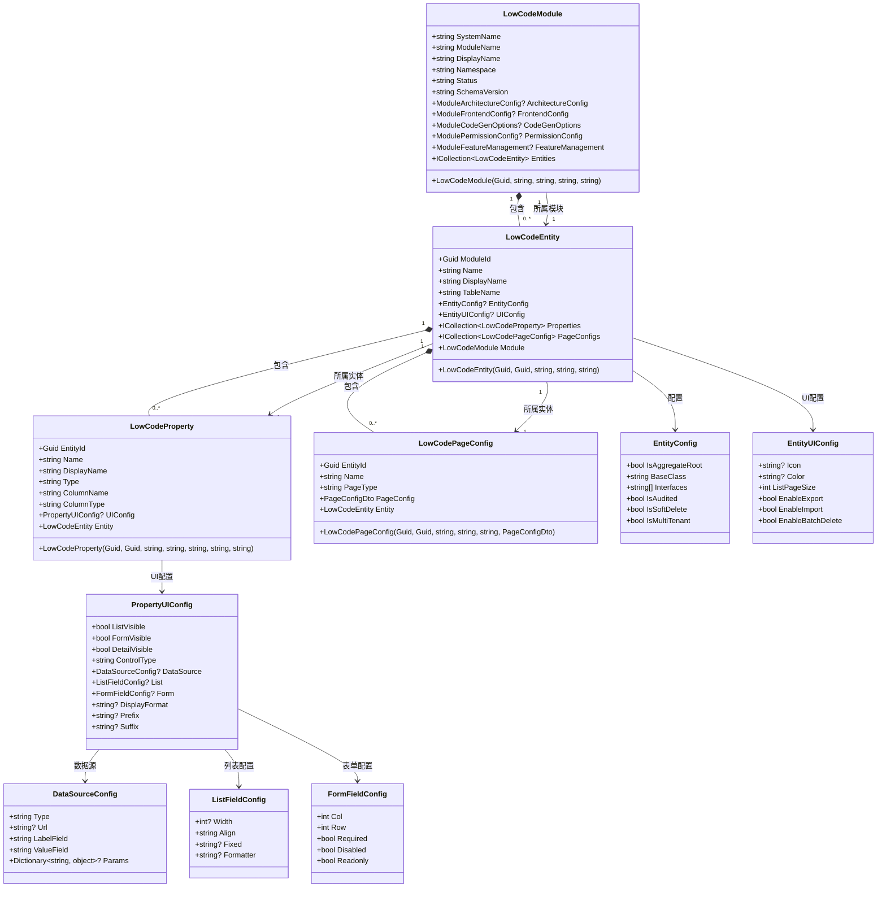
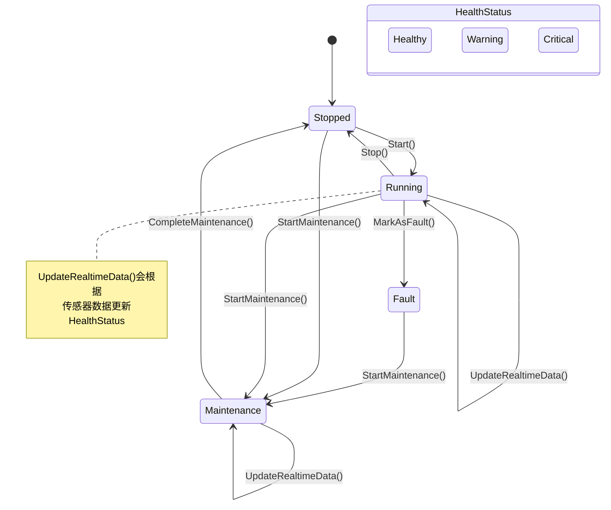
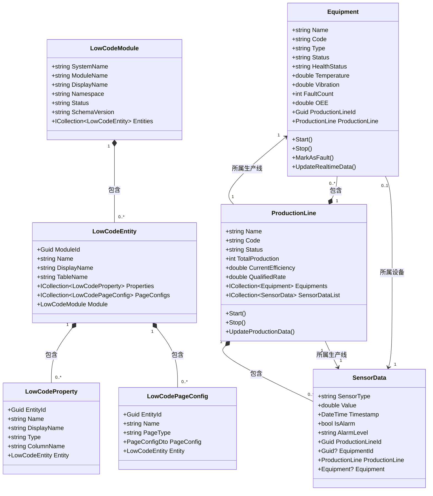

# 领域模型层

<cite>
**本文档引用的文件**   
- [LowCodeModule.cs](file://src/SmartAbp.Domain/Entities/LowCode/LowCodeModule.cs)
- [LowCodeEntity.cs](file://src/SmartAbp.Domain/Entities/LowCode/LowCodeEntity.cs)
- [Equipment.cs](file://src/SmartAbp.Domain/Entities/MES/Equipment.cs)
- [ProductionLine.cs](file://src/SmartAbp.Domain/Entities/MES/ProductionLine.cs)
- [SensorData.cs](file://src/SmartAbp.Domain/Entities/MES/SensorData.cs)
- [LowCodeProperty.cs](file://src/SmartAbp.Domain/Entities/LowCode/LowCodeProperty.cs)
- [LowCodePageConfig.cs](file://src/SmartAbp.Domain/Entities/LowCode/LowCodePageConfig.cs)
</cite>

## 目录
1. [引言](#引言)
2. [低代码领域模型](#低代码领域模型)
   - [LowCodeModule聚合根](#lowcodemodule聚合根)
   - [LowCodeEntity聚合根](#lowcodeentity聚合根)
   - [实体关系与聚合边界](#实体关系与聚合边界)
3. [MES领域模型](#mes领域模型)
   - [Equipment实体](#equipment实体)
   - [ProductionLine实体](#productionline实体)
   - [实体状态管理](#实体状态管理)
4. [领域事件与领域服务](#领域事件与领域服务)
5. [领域模型类图](#领域模型类图)
6. [设备状态转换图](#设备状态转换图)

## 引言
本文档详细阐述hxlot项目领域模型层的设计与实现，重点分析基于领域驱动设计（DDD）的实体建模方法。文档全面解析低代码平台和MES系统的元数据建模，涵盖实体、值对象、聚合根的划分原则，以及领域事件和领域服务的应用。通过类图和状态图直观展示核心实体间的关联关系和状态转换逻辑。

## 低代码领域模型

### LowCodeModule聚合根
`LowCodeModule` 是低代码平台的核心聚合根，代表一个完整的业务模块（如项目管理、设备管理）。该聚合根不仅包含模块的基础信息（系统名称、显示名称、命名空间等），还通过JSON字段存储了丰富的配置信息，包括架构配置、前端配置、代码生成选项、权限配置和特性管理配置。这种设计实现了后端单一事实源（SSOT），确保了前后端配置的一致性。

聚合根的`Status`属性定义了模块的生命周期状态（草稿、已发布、已归档），`SchemaVersion`用于管理模块的元数据版本。`Entities`导航属性形成了与`LowCodeEntity`的聚合关系，体现了模块与实体之间的整体-部分关系。

**本节来源**
- [LowCodeModule.cs](file://src/SmartAbp.Domain/Entities/LowCode/LowCodeModule.cs#L15-L162)

### LowCodeEntity聚合根
`LowCodeEntity` 是另一个关键的聚合根，代表模块内的具体业务实体（如用户、订单）。它与`LowCodeModule`形成了一对多的聚合关系，`ModuleId`作为外键，`Module`作为导航属性。每个实体定义了其在数据库中的映射（表名、Schema）以及基础信息（名称、显示名称）。

该聚合根的核心在于其JSON配置字段`EntityConfig`和`UIConfig`，它们分别存储了实体的领域配置和用户界面配置。`Properties`和`PageConfigs`导航属性将`LowCodeProperty`和`LowCodePageConfig`纳入其聚合边界，确保了实体及其属性、页面配置的数据一致性。

**本节来源**
- [LowCodeEntity.cs](file://src/SmartAbp.Domain/Entities/LowCode/LowCodeEntity.cs#L15-L158)

### 实体关系与聚合边界
低代码领域的实体关系清晰地体现了聚合边界的设计原则。`LowCodeModule`作为顶级聚合根，包含了`LowCodeEntity`的集合。`LowCodeEntity`作为次级聚合根，又包含了`LowCodeProperty`（实体属性）和`LowCodePageConfig`（页面配置）的集合。这种层级结构确保了数据的完整性和一致性，避免了跨聚合的复杂事务。

`LowCodeProperty`实体定义了`LowCodeEntity`的属性，其`UIConfig`字段是一个复杂的值对象，包含了控件类型、显示配置、数据源等信息。`LowCodePageConfig`则是一个独立的聚合根，用于存储完整的页面配置规则，与`LowCodeEntity`形成关联。

**图表来源**
- [LowCodeModule.cs](file://src/SmartAbp.Domain/Entities/LowCode/LowCodeModule.cs#L15-L162)
- [LowCodeEntity.cs](file://src/SmartAbp.Domain/Entities/LowCode/LowCodeEntity.cs#L15-L158)
- [LowCodeProperty.cs](file://src/SmartAbp.Domain/Entities/LowCode/LowCodeProperty.cs#L15-L425)
- [LowCodePageConfig.cs](file://src/SmartAbp.Domain/Entities/LowCode/LowCodePageConfig.cs#L15-L550)

## MES领域模型

### Equipment实体
`Equipment` 实体代表制造执行系统（MES）中的物理设备，如焊接机、冲压机等。它是一个聚合根，继承自`FullAuditedAggregateRoot<Guid>`，具备完整的审计功能。实体包含了设备的静态信息（名称、编号、型号）和动态信息（状态、健康状态、实时传感器数据）。

`Equipment`实体通过`ProductionLineId`外键与`ProductionLine`建立关联，`ProductionLine`是其导航属性。业务方法如`Start()`、`Stop()`、`MarkAsFault()`和`UpdateRealtimeData()`封装了设备的核心业务逻辑，确保了状态转换的正确性。`UpdateHealthStatus()`方法根据传感器数据自动更新设备的健康状态，体现了领域模型的智能性。

**本节来源**
- [Equipment.cs](file://src/SmartAbp.Domain/Entities/MES/Equipment.cs#L10-L409)

### ProductionLine实体
`ProductionLine` 实体是MES领域的另一个聚合根，代表一条完整的生产线。它管理着生产线的静态信息（名称、编号、位置）和动态生产数据（总产量、当前效率、合格率）。与`Equipment`类似，它也具备`Start()`、`Stop()`和`UpdateProductionData()`等业务方法。

`ProductionLine`聚合根通过`Equipments`和`SensorDataList`导航属性，管理着其下属的`Equipment`和`SensorData`实体的集合。这表明`Equipment`和`SensorData`属于`ProductionLine`的聚合边界，它们的生命周期和一致性由`ProductionLine`聚合根来维护。

**本节来源**
- [ProductionLine.cs](file://src/SmartAbp.Domain/Entities/MES/ProductionLine.cs#L11-L235)

### 实体状态管理
MES领域的实体状态管理是其核心功能之一。`Equipment`实体的状态由`Status`属性管理，其可能的值包括"running"（运行中）、"stopped"（已停止）、"fault"（故障）和"maintenance"（维护中）。`HealthStatus`属性则反映了设备的健康状况，分为"healthy"（健康）、"warning"（警告）和"critical"（严重）。

状态的转换由业务方法驱动。例如，`Start()`方法可以将状态从"stopped"变为"running"，但不能从"fault"状态启动，这通过`InvalidOperationException`异常来保证。`MarkAsFault()`方法会将状态设为"fault"，同时将健康状态设为"critical"。`UpdateRealtimeData()`方法在更新传感器数据的同时，会调用`UpdateHealthStatus()`方法，根据预设的阈值（如温度>80°C）自动调整健康状态，实现了状态的自动化管理。

**图表来源**
- [Equipment.cs](file://src/SmartAbp.Domain/Entities/MES/Equipment.cs#L10-L409)

## 领域事件与领域服务
本项目通过领域事件和领域服务来处理复杂的业务逻辑。当`Equipment`的健康状态发生变化或触发告警时，可以发布相应的领域事件（如`EquipmentHealthStatusChangedEvent`或`EquipmentAlarmEvent`）。这些事件可以被其他领域服务（如告警通知服务、维护计划服务）订阅，从而实现松耦合的系统集成。

领域服务（Domain Service）被用于处理那些不适合放在实体或值对象中的操作。例如，一个`ProductionLineOptimizationService`可以分析多条生产线的`SensorData`，计算最优的生产排程，这个服务会协调多个`ProductionLine`和`Equipment`实体来完成复杂的业务流程。领域服务确保了领域模型的纯净性，将复杂的协调逻辑从业务实体中分离出来。

**本节来源**
- [Equipment.cs](file://src/SmartAbp.Domain/Entities/MES/Equipment.cs#L10-L409)
- [ProductionLine.cs](file://src/SmartAbp.Domain/Entities/MES/ProductionLine.cs#L11-L235)
- [SensorData.cs](file://src/SmartAbp.Domain/Entities/MES/SensorData.cs#L78-L88)

## 领域模型类图
以下类图综合展示了低代码领域和MES领域的核心实体及其关系。

**图表来源**
- [LowCodeModule.cs](file://src/SmartAbp.Domain/Entities/LowCode/LowCodeModule.cs#L15-L162)
- [LowCodeEntity.cs](file://src/SmartAbp.Domain/Entities/LowCode/LowCodeEntity.cs#L15-L158)
- [LowCodeProperty.cs](file://src/SmartAbp.Domain/Entities/LowCode/LowCodeProperty.cs#L15-L425)
- [LowCodePageConfig.cs](file://src/SmartAbp.Domain/Entities/LowCode/LowCodePageConfig.cs#L15-L550)
- [Equipment.cs](file://src/SmartAbp.Domain/Entities/MES/Equipment.cs#L10-L409)
- [ProductionLine.cs](file://src/SmartAbp.Domain/Entities/MES/ProductionLine.cs#L11-L235)
- [SensorData.cs](file://src/SmartAbp.Domain/Entities/MES/SensorData.cs#L78-L88)