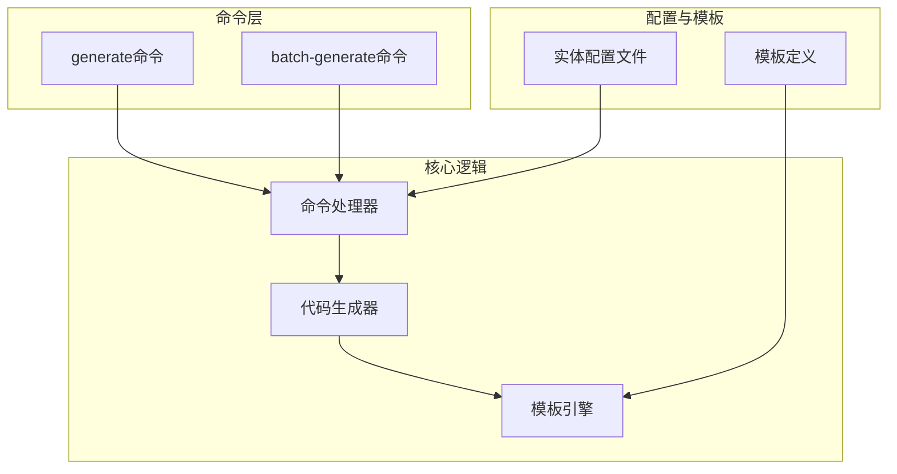
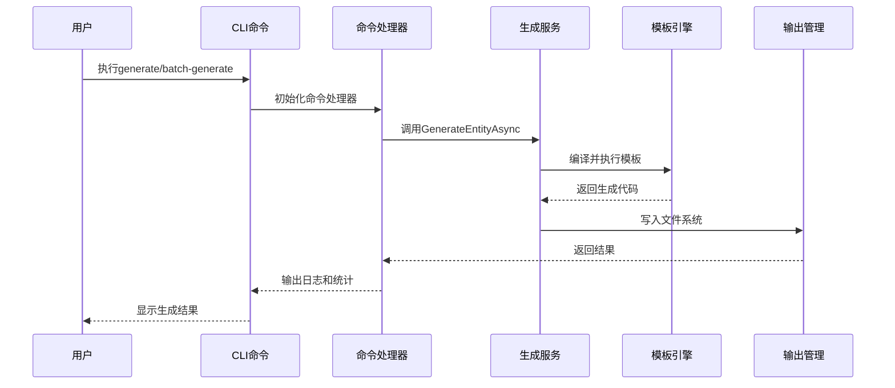
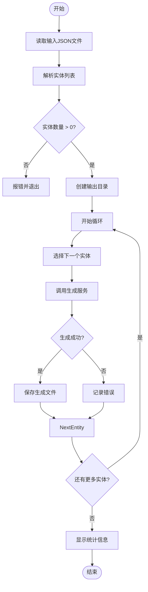
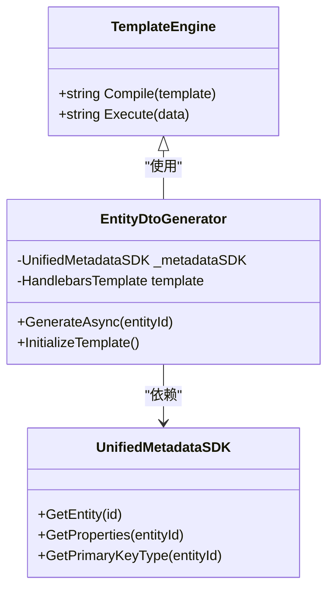
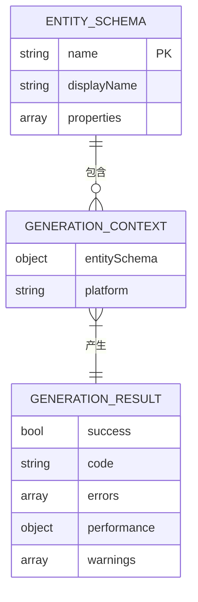

# 代码生成工具

<cite>
**本文档引用文件**  
- [GenerateCommandHandler.cs](file://src/SmartAbp.DevKit.Cli/Commands/GenerateCommandHandler.cs)
- [BatchGenerateCommandHandler.cs](file://src/SmartAbp.DevKit.Cli/Commands/BatchGenerateCommandHandler.cs)
- [EntityDtoGenerator.cs](file://src/SmartAbp.DevKit.Core/Generator/EntityDtoGenerator.cs)
- [template.schema.json](file://templates/template.schema.json)
- [mes-entities-config.json](file://config/mes-entities-config.json)
- [devkit-generate.sh](file://scripts/devkit-generate.sh)
</cite>

## 目录
1. [简介](#简介)
2. [项目结构](#项目结构)
3. [核心组件](#核心组件)
4. [架构概述](#架构概述)
5. [详细组件分析](#详细组件分析)
6. [依赖分析](#依赖分析)
7. [性能考量](#性能考量)
8. [故障排除指南](#故障排除指南)
9. [结论](#结论)

## 简介
hxlot项目中的代码生成工具是一套基于低代码配置的自动化开发系统，旨在通过实体定义文件快速生成前后端代码。该工具支持单个实体的`generate`命令和批量实体的`batch-generate`命令，能够显著提升开发效率。系统采用模块化设计，结合模板引擎与元数据驱动机制，实现跨平台（Web、UniApp、后端等）代码生成。本文档深入解析其核心机制、使用流程、性能优化策略及错误处理方案。

## 项目结构
hxlot项目的代码生成相关模块分布在多个目录中，主要包括命令行接口、核心生成逻辑、模板定义和配置文件。

**Diagram sources**
- [GenerateCommandHandler.cs](file://src/SmartAbp.DevKit.Cli/Commands/GenerateCommandHandler.cs)
- [BatchGenerateCommandHandler.cs](file://src/SmartAbp.DevKit.Cli/Commands/BatchGenerateCommandHandler.cs)
- [EntityDtoGenerator.cs](file://src/SmartAbp.DevKit.Core/Generator/EntityDtoGenerator.cs)

**Section sources**
- [GenerateCommandHandler.cs](file://src/SmartAbp.DevKit.Cli/Commands/GenerateCommandHandler.cs)
- [BatchGenerateCommandHandler.cs](file://src/SmartAbp.DevKit.Cli/Commands/BatchGenerateCommandHandler.cs)
- [mes-entities-config.json](file://config/mes-entities-config.json)

## 核心组件
本工具的核心组件包括命令处理器、实体生成器、模板引擎和配置管理系统。`GenerateCommandHandler`负责处理单个实体的生成请求，而`BatchGenerateCommandHandler`则支持从JSON文件批量生成多个实体。`EntityDtoGenerator`作为示例生成器，展示了如何使用Handlebars模板引擎结合元数据SDK生成DTO类。模板定义遵循`template.schema.json`规范，确保模板的标准化和可维护性。

**Section sources**
- [GenerateCommandHandler.cs](file://src/SmartAbp.DevKit.Cli/Commands/GenerateCommandHandler.cs)
- [BatchGenerateCommandHandler.cs](file://src/SmartAbp.DevKit.Cli/Commands/BatchGenerateCommandHandler.cs)
- [EntityDtoGenerator.cs](file://src/SmartAbp.DevKit.Core/Generator/EntityDtoGenerator.cs)
- [template.schema.json](file://templates/template.schema.json)

## 架构概述
代码生成工具采用分层架构，包含命令解析层、业务逻辑层、生成引擎层和输出管理层。用户通过CLI命令触发生成流程，命令处理器解析输入参数和配置文件，调用核心生成服务。生成服务利用模板引擎和元数据SDK生成代码，最终将结果写入指定输出目录。整个流程支持详细的日志记录、性能监控和错误报告。

**Diagram sources**
- [GenerateCommandHandler.cs](file://src/SmartAbp.DevKit.Cli/Commands/GenerateCommandHandler.cs)
- [BatchGenerateCommandHandler.cs](file://src/SmartAbp.DevKit.Cli/Commands/BatchGenerateCommandHandler.cs)
- [EntityDtoGenerator.cs](file://src/SmartAbp.DevKit.Core/Generator/EntityDtoGenerator.cs)

## 详细组件分析

### generate命令分析
`generate`命令用于生成单个实体的代码。用户需提供输入文件路径、输出目录和目标平台。命令处理器验证参数后，读取实体定义，调用生成服务，并将结果保存到指定位置。支持的平台包括web、dashboard、uniapp和backend，每个平台有特定的提示信息。

**Section sources**
- [GenerateCommandHandler.cs](file://src/SmartAbp.DevKit.Cli/Commands/GenerateCommandHandler.cs)

### batch-generate命令分析
`batch-generate`命令支持从JSON文件批量生成多个实体。系统会遍历所有实体，逐个执行生成流程，并统计成功与失败数量。该命令实现了批量处理的错误隔离机制，单个实体生成失败不会影响其他实体的生成。

**Diagram sources**
- [BatchGenerateCommandHandler.cs](file://src/SmartAbp.DevKit.Cli/Commands/BatchGenerateCommandHandler.cs)

**Section sources**
- [BatchGenerateCommandHandler.cs](file://src/SmartAbp.DevKit.Cli/Commands/BatchGenerateCommandHandler.cs)

### 模板引擎机制
系统使用Handlebars模板引擎实现代码生成。模板定义包含占位符，如`{{EntityName}}`、`{{Namespace}}`等，生成时由实际值替换。模板源码内嵌在生成器代码中，支持循环、条件等逻辑结构，确保生成代码的灵活性和可维护性。

**Diagram sources**
- [EntityDtoGenerator.cs](file://src/SmartAbp.DevKit.Core/Generator/EntityDtoGenerator.cs)

**Section sources**
- [EntityDtoGenerator.cs](file://src/SmartAbp.DevKit.Core/Generator/EntityDtoGenerator.cs)

## 依赖分析
代码生成工具依赖多个核心组件和外部库。主要依赖包括Microsoft.Extensions.Logging用于日志记录，System.Text.Json用于JSON序列化，HandlebarsDotNet作为模板引擎。项目通过DevKitCommandService协调各组件，实现松耦合的设计。

**Diagram sources**
- [GenerateCommandHandler.cs](file://src/SmartAbp.DevKit.Cli/Commands/GenerateCommandHandler.cs)
- [EntityDtoGenerator.cs](file://src/SmartAbp.DevKit.Core/Generator/EntityDtoGenerator.cs)

**Section sources**
- [GenerateCommandHandler.cs](file://src/SmartAbp.DevKit.Cli/Commands/GenerateCommandHandler.cs)
- [EntityDtoGenerator.cs](file://src/SmartAbp.DevKit.Core/Generator/EntityDtoGenerator.cs)

## 性能考量
批量生成命令实现了性能监控功能，记录每个实体的生成耗时和总耗时。系统采用异步编程模型，确保I/O操作不会阻塞主线程。建议在生成大量实体时使用`-v`参数查看详细性能指标，以便优化生成流程。

**Section sources**
- [BatchGenerateCommandHandler.cs](file://src/SmartAbp.DevKit.Cli/Commands/BatchGenerateCommandHandler.cs)
- [GenerateCommandHandler.cs](file://src/SmartAbp.DevKit.Cli/Commands/GenerateCommandHandler.cs)

## 故障排除指南
常见问题包括输入文件不存在、JSON格式错误、实体定义缺失等。系统提供详细的错误日志，帮助用户快速定位问题。对于批量生成，系统会继续处理剩余实体，确保部分成功。建议使用`devkit-generate.sh`脚本进行自动化生成，该脚本包含完整的错误检查和使用说明。

**Section sources**
- [GenerateCommandHandler.cs](file://src/SmartAbp.DevKit.Cli/Commands/GenerateCommandHandler.cs)
- [BatchGenerateCommandHandler.cs](file://src/SmartAbp.DevKit.Cli/Commands/BatchGenerateCommandHandler.cs)
- [devkit-generate.sh](file://scripts/devkit-generate.sh)

## 结论
hxlot项目的代码生成工具通过标准化的配置文件和模板机制，实现了高效、可靠的前后端代码自动生成。`generate`和`batch-generate`命令满足了不同场景下的开发需求，结合详细的日志和错误处理机制，为开发者提供了良好的使用体验。未来可进一步扩展模板库，支持更多平台和框架。