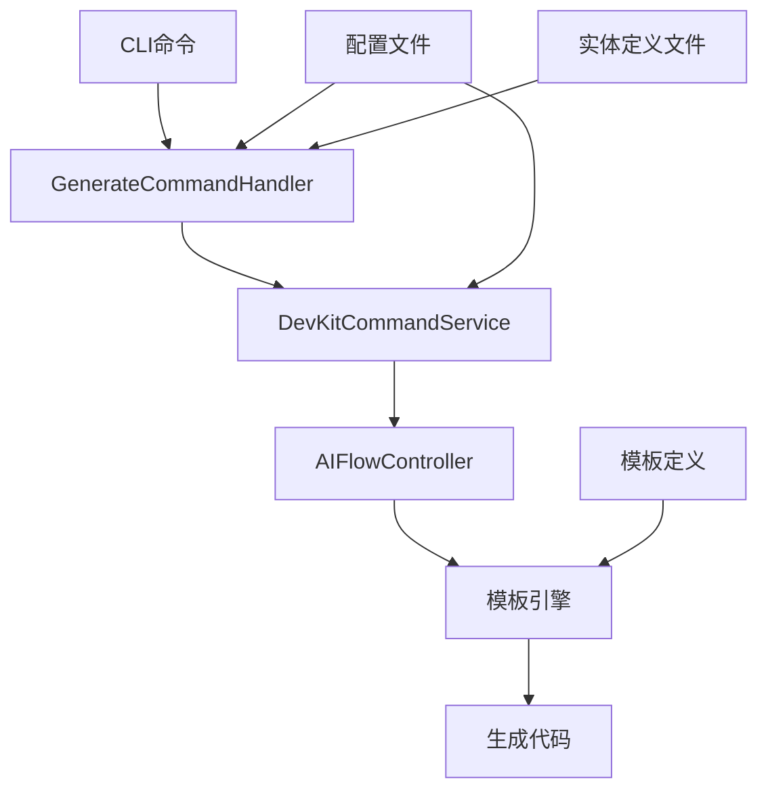
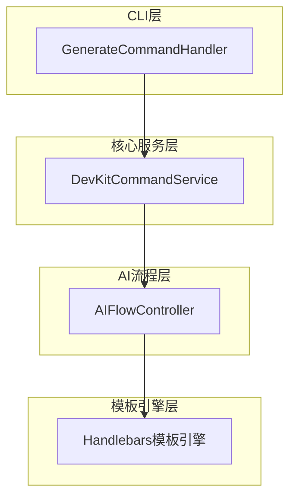
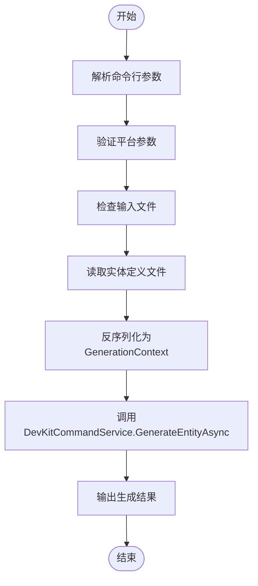
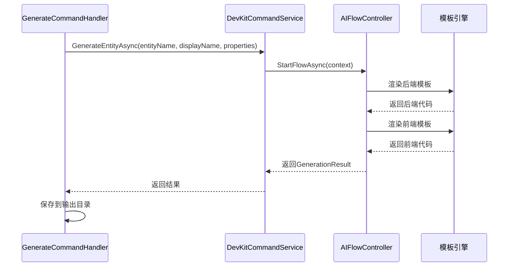
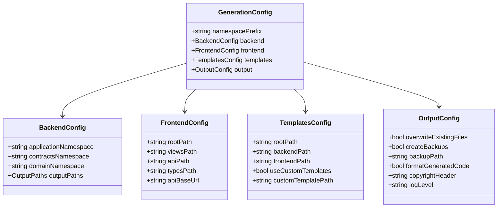
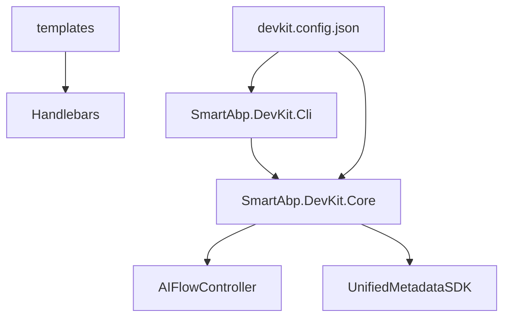

# 单文件生成

<cite>
**本文档中引用的文件**  
- [GenerateCommandHandler.cs](file://src/SmartAbp.DevKit.Cli/Commands/GenerateCommandHandler.cs)
- [devkit.config.json](file://devkit.config.json)
- [SmartAbpDevKitCoreModule.cs](file://src/SmartAbp.DevKit.Core/SmartAbpDevKitCoreModule.cs)
- [index.json](file://templates/index.json)
</cite>

## 目录
1. [简介](#简介)
2. [项目结构](#项目结构)
3. [核心组件](#核心组件)
4. [架构概述](#架构概述)
5. [详细组件分析](#详细组件分析)
6. [依赖分析](#依赖分析)
7. [性能考量](#性能考量)
8. [故障排除指南](#故障排除指南)
9. [结论](#结论)

## 简介
本文档深入解析hxlot项目中单文件代码生成功能的实现机制，重点围绕`generate`命令展开。内容涵盖命令行参数解析、实体定义加载、代码生成流程控制、模板引擎调用逻辑及错误处理机制。同时详细说明生成配置选项（如目标平台、技术栈、输出路径）的使用方法，并提供完整的代码生成示例与验证方案。

## 项目结构
hxlot项目采用模块化设计，代码生成功能主要集中在`src/SmartAbp.DevKit.Cli`和`src/SmartAbp.DevKit.Core`模块中。配置文件位于根目录，模板定义存储在`templates`目录下，生成结果输出至`output`目录。

**Diagram sources**  
- [GenerateCommandHandler.cs](file://src/SmartAbp.DevKit.Cli/Commands/GenerateCommandHandler.cs)
- [SmartAbpDevKitCoreModule.cs](file://src/SmartAbp.DevKit.Core/SmartAbpDevKitCoreModule.cs)

**Section sources**
- [GenerateCommandHandler.cs](file://src/SmartAbp.DevKit.Cli/Commands/GenerateCommandHandler.cs)
- [devkit.config.json](file://devkit.config.json)

## 核心组件
核心组件包括命令处理器`GenerateCommandHandler`、命令服务`DevKitCommandService`、AI流程控制器`AIFlowController`以及统一元数据SDK。这些组件协同工作，完成从输入解析到代码生成的全过程。

**Section sources**
- [GenerateCommandHandler.cs](file://src/SmartAbp.DevKit.Cli/Commands/GenerateCommandHandler.cs)
- [SmartAbpDevKitCoreModule.cs](file://src/SmartAbp.DevKit.Core/SmartAbpDevKitCoreModule.cs)

## 架构概述
系统采用分层架构，CLI层负责接收用户输入，核心服务层处理业务逻辑，AI流程层驱动代码生成，模板引擎层负责具体代码片段的渲染。各层之间通过明确定义的接口进行通信，确保高内聚低耦合。

**Diagram sources**  
- [GenerateCommandHandler.cs](file://src/SmartAbp.DevKit.Cli/Commands/GenerateCommandHandler.cs)
- [SmartAbpDevKitCoreModule.cs](file://src/SmartAbp.DevKit.Core/SmartAbpDevKitCoreModule.cs)

## 详细组件分析

### GenerateCommandHandler分析
`GenerateCommandHandler`是`generate`命令的入口点，负责解析命令行参数、验证输入、调用核心服务并输出结果。

#### 命令行参数解析

**Diagram sources**  
- [GenerateCommandHandler.cs](file://src/SmartAbp.DevKit.Cli/Commands/GenerateCommandHandler.cs)

#### 代码生成流程控制

**Diagram sources**  
- [GenerateCommandHandler.cs](file://src/SmartAbp.DevKit.Cli/Commands/GenerateCommandHandler.cs)
- [SmartAbpDevKitCoreModule.cs](file://src/SmartAbp.DevKit.Core/SmartAbpDevKitCoreModule.cs)

### 配置系统分析
系统通过`devkit.config.json`文件管理全局配置，包括命名空间前缀、前后端路径、模板路径和输出选项。

**Diagram sources**  
- [devkit.config.json](file://devkit.config.json)

**Section sources**
- [devkit.config.json](file://devkit.config.json)

## 依赖分析
系统依赖关系清晰，CLI模块依赖核心服务模块，核心服务模块依赖AI流程控制器和元数据SDK。模板系统独立配置，支持自定义扩展。

**Diagram sources**  
- [GenerateCommandHandler.cs](file://src/SmartAbp.DevKit.Cli/Commands/GenerateCommandHandler.cs)
- [SmartAbpDevKitCoreModule.cs](file://src/SmartAbp.DevKit.Core/SmartAbpDevKitCoreModule.cs)
- [devkit.config.json](file://devkit.config.json)

## 性能考量
系统内置性能指标收集器，可监控代码生成各阶段的执行时间。通过`-v`或`--verbose`参数可查看详细性能数据，包括总耗时和各工作站（Workstation）的处理时间。

**Section sources**
- [SmartAbpDevKitCoreModule.cs](file://src/SmartAbp.DevKit.Core/SmartAbpDevKitCoreModule.cs)

## 故障排除指南
常见问题包括输入文件不存在、平台参数无效、实体Schema缺失等。系统提供详细的错误日志和警告信息，帮助用户快速定位问题。

**Section sources**
- [GenerateCommandHandler.cs](file://src/SmartAbp.DevKit.Cli/Commands/GenerateCommandHandler.cs)

## 结论
hxlot项目的单文件代码生成功能设计合理，实现完整。通过`generate`命令可高效地从单一实体定义生成全栈代码，支持多种目标平台和灵活的配置选项。系统具备良好的错误处理机制和性能监控能力，为开发者提供了强大的低代码开发支持。