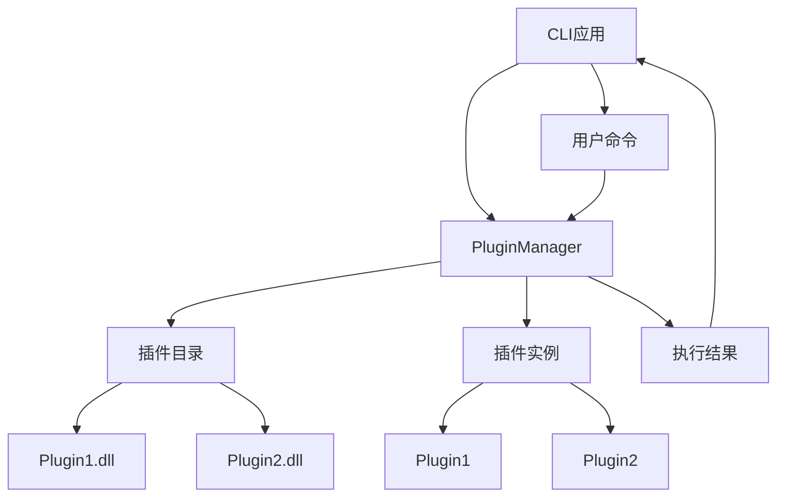
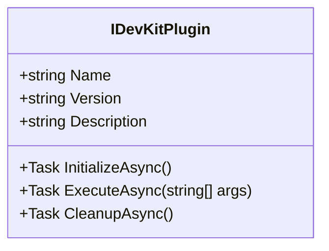
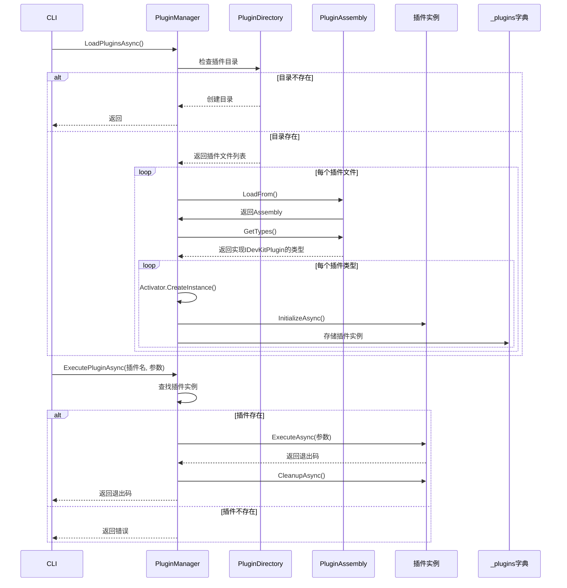
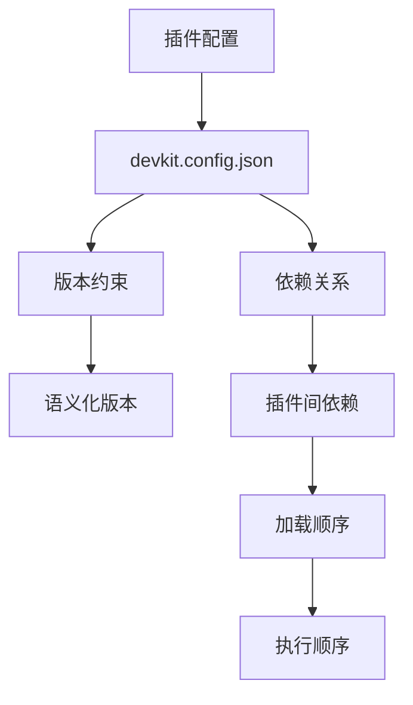
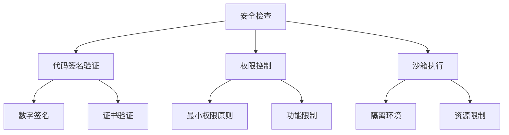

# 工具扩展插件

<cite>
**Referenced Files in This Document**   
- [IDevKitPlugin.cs](file://src/SmartAbp.DevKit.Cli/Plugins/IDevKitPlugin.cs)
- [PluginManager.cs](file://src/SmartAbp.DevKit.Cli/Plugins/PluginManager.cs)
- [devkit.config.json](file://devkit.config.json)
</cite>

## 目录
1. [引言](#引言)
2. [插件系统架构设计](#插件系统架构设计)
3. [IDevKitPlugin接口详解](#idevkitplugin接口详解)
4. [插件注册、加载与执行流程](#插件注册加载与执行流程)
5. [自定义插件开发模板](#自定义插件开发模板)
6. [插件依赖管理与版本控制](#插件依赖管理与版本控制)
7. [插件安全性](#插件安全性)
8. [实际开发案例](#实际开发案例)
9. [结论](#结论)

## 引言
hxlot项目提供了一个强大的工具扩展插件系统，允许开发者通过实现`IDevKitPlugin`接口来扩展CLI工具的功能。该系统设计灵活，支持插件的动态加载、执行和管理，为代码生成、质量检查等任务提供了可扩展的架构。

## 插件系统架构设计

hxlot的插件系统采用经典的插件管理器模式，核心组件包括`IDevKitPlugin`接口和`PluginManager`类。系统通过定义清晰的接口契约，实现了插件与宿主应用的解耦，确保了系统的可扩展性和稳定性。



**Diagram sources**
- [PluginManager.cs](file://src/SmartAbp.DevKit.Cli/Plugins/PluginManager.cs#L14-L156)

**Section sources**
- [PluginManager.cs](file://src/SmartAbp.DevKit.Cli/Plugins/PluginManager.cs#L14-L156)

## IDevKitPlugin接口详解

`IDevKitPlugin`接口是所有插件必须实现的核心契约，定义了插件的基本属性和生命周期方法。



**Diagram sources**
- [IDevKitPlugin.cs](file://src/SmartAbp.DevKit.Cli/Plugins/IDevKitPlugin.cs#L8-L39)

**Section sources**
- [IDevKitPlugin.cs](file://src/SmartAbp.DevKit.Cli/Plugins/IDevKitPlugin.cs#L8-L39)

### 接口成员说明
- **Name**: 插件的唯一标识名称
- **Version**: 插件版本号，用于版本控制
- **Description**: 插件功能描述
- **InitializeAsync()**: 插件初始化方法，在加载时调用
- **ExecuteAsync(args)**: 插件执行方法，接收命令行参数并返回退出码
- **CleanupAsync()**: 插件清理方法，在执行完成后调用

## 插件注册、加载与执行流程

插件系统的生命周期管理由`PluginManager`负责，完整的流程包括加载、注册、执行和清理四个阶段。



**Diagram sources**
- [PluginManager.cs](file://src/SmartAbp.DevKit.Cli/Plugins/PluginManager.cs#L14-L156)

**Section sources**
- [PluginManager.cs](file://src/SmartAbp.DevKit.Cli/Plugins/PluginManager.cs#L14-L156)

### 流程说明
1. **加载阶段**: `PluginManager`扫描`./Plugins`目录下的所有`.dll`文件
2. **注册阶段**: 加载程序集，查找实现`IDevKitPlugin`接口的类型并实例化
3. **执行阶段**: 根据用户命令调用指定插件的`ExecuteAsync`方法
4. **清理阶段**: 执行完成后调用`CleanupAsync`方法进行资源清理

## 自定义插件开发模板

开发自定义插件需要遵循以下步骤和模板：

### 开发步骤
1. 创建新的.NET类库项目
2. 添加对`SmartAbp.DevKit.Cli`的引用
3. 实现`IDevKitPlugin`接口
4. 编译为`.dll`文件
5. 放置到`./Plugins`目录

### 开发模板
```csharp
using System.Threading.Tasks;
using SmartAbp.DevKit.Cli.Plugins;

public class CustomCodeGeneratorPlugin : IDevKitPlugin
{
    public string Name => "CustomCodeGenerator";
    public string Version => "1.0.0";
    public string Description => "自定义代码生成器插件";

    public async Task InitializeAsync()
    {
        // 初始化逻辑
        await Task.CompletedTask;
    }

    public async Task<int> ExecuteAsync(string[] args)
    {
        // 执行逻辑
        return 0;
    }

    public async Task CleanupAsync()
    {
        // 清理逻辑
        await Task.CompletedTask;
    }
}
```

**Section sources**
- [IDevKitPlugin.cs](file://src/SmartAbp.DevKit.Cli/Plugins/IDevKitPlugin.cs#L8-L39)

## 插件依赖管理与版本控制

虽然当前插件系统未直接实现复杂的依赖管理，但通过配置文件和命名约定可以实现基本的版本控制。



**Diagram sources**
- [devkit.config.json](file://devkit.config.json#L1-L38)

**Section sources**
- [devkit.config.json](file://devkit.config.json#L1-L38)

### 版本控制策略
- 采用语义化版本号（SemVer）格式
- 插件名称和版本号作为唯一标识
- 通过配置文件定义版本约束

## 插件安全性

插件系统需要考虑代码签名和权限控制等安全机制。



**Section sources**
- [PluginManager.cs](file://src/SmartAbp.DevKit.Cli/Plugins/PluginManager.cs#L14-L156)

### 安全考虑
- **代码签名**: 验证插件的数字签名，确保来源可信
- **权限控制**: 实施最小权限原则，限制插件的系统访问权限
- **沙箱执行**: 在隔离环境中运行插件，防止恶意代码影响主系统
- **输入验证**: 对插件接收的所有输入进行严格验证

## 实际开发案例

### 自定义代码生成器
实现一个生成Vue组件的插件，可以根据配置自动生成前端代码。

### 质量检查器
开发一个静态代码分析插件，集成到CI/CD流程中，自动检查代码质量。

**Section sources**
- [IDevKitPlugin.cs](file://src/SmartAbp.DevKit.Cli/Plugins/IDevKitPlugin.cs#L8-L39)
- [PluginManager.cs](file://src/SmartAbp.DevKit.Cli/Plugins/PluginManager.cs#L14-L156)

## 结论
hxlot的工具扩展插件系统提供了一个灵活、可扩展的架构，通过`IDevKitPlugin`接口和`PluginManager`类实现了插件的生命周期管理。开发者可以基于此系统开发各种功能插件，扩展CLI工具的能力。未来可以进一步完善依赖管理和安全机制，提升系统的健壮性和安全性。