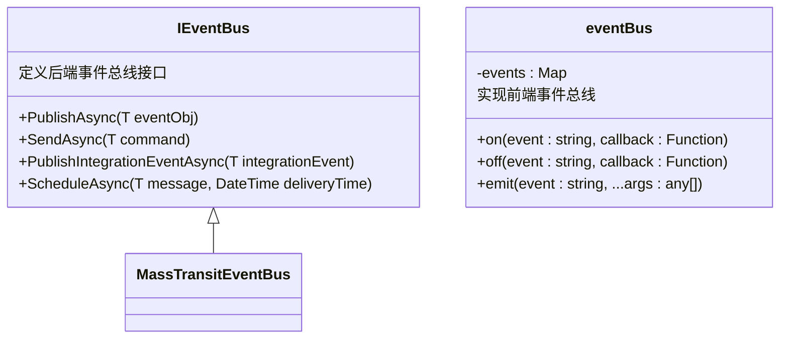
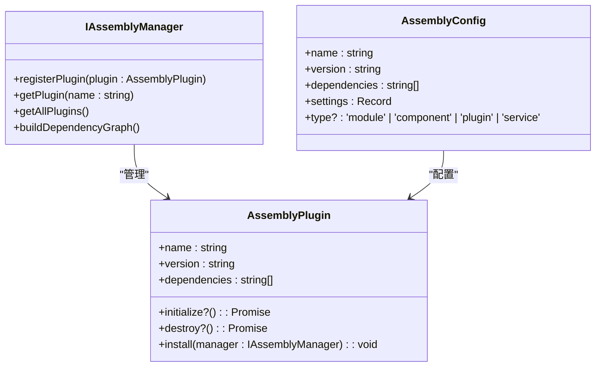
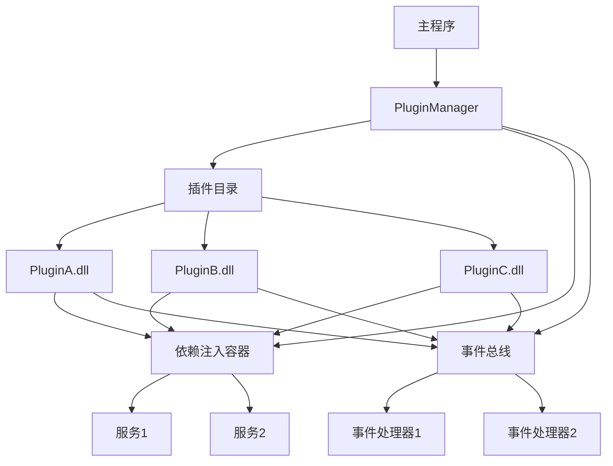

# 插件系统架构

<cite>
**本文档引用的文件**  
- [PluginManager.cs](file://src/SmartAbp.DevKit.Cli/Plugins/PluginManager.cs)
- [plugin-manager.test.ts](file://src/SmartAbp.Vue/packages/lowcode-core/src/__tests__/__tests__/plugin-manager.test.ts)
- [assembly.ts](file://src/SmartAbp.Vue/packages/lowcode-shared/src/types/assembly.ts)
- [MessageQueueGenerator.cs](file://src/SmartAbp.CodeGenerator/Messaging/MessageQueueGenerator.cs)
- [eventBus.js](file://src/SmartAbp.Vue/src/utils/eventBus.js)
</cite>

## 目录
1. [引言](#引言)
2. [插件生命周期管理](#插件生命周期管理)
3. [依赖注入机制](#依赖注入机制)
4. [事件总线集成](#事件总线集成)
5. [PluginManager核心功能](#pluginmanager核心功能)
6. [插件元数据与版本兼容性](#插件元数据与版本兼容性)
7. [系统架构图](#系统架构图)
8. [性能考虑](#性能考虑)
9. [结论](#结论)

## 引言
hxlot项目采用模块化插件架构，支持功能的动态扩展与热插拔。该架构通过`PluginManager`实现插件的发现、加载、初始化和执行，结合依赖注入和事件总线机制，确保各插件与主程序之间的松耦合与高内聚。本文档详细阐述该插件系统的整体设计与实现细节。

## 插件生命周期管理
插件系统定义了完整的生命周期，包括加载、初始化、执行和清理阶段。`PluginManager`负责协调这些阶段，确保插件按正确顺序启动和关闭。

**插件生命周期阶段：**
- **加载（Load）**：扫描插件目录（`./Plugins`），动态加载所有`.dll`文件，并通过反射实例化实现`IDevKitPlugin`接口的类型。
- **初始化（Initialize）**：调用插件的`InitializeAsync`方法，完成其内部配置和资源准备。
- **执行（Execute）**：接收命令行参数，调用指定插件的`ExecuteAsync`方法执行具体功能。
- **清理（Cleanup）**：在应用退出或插件卸载时，调用`CleanupAsync`方法释放资源。

**Section sources**
- [PluginManager.cs](file://src/SmartAbp.DevKit.Cli/Plugins/PluginManager.cs#L34-L156)

## 依赖注入机制
系统通过依赖注入（DI）容器管理组件和服务的生命周期与依赖关系。`PluginManager`自身通过构造函数注入`ILogger<PluginManager>`，实现了日志功能的解耦。插件在初始化时，可以向DI容器注册自身服务，供其他组件使用。

**依赖注入特点：**
- **服务注册**：插件可通过`IServiceCollection`扩展方法注册服务。
- **服务解析**：主程序或其他插件可通过DI容器获取所需服务实例。
- **生命周期管理**：支持瞬态（Transient）、作用域（Scoped）和单例（Singleton）三种生命周期。

**Section sources**
- [PluginManager.cs](file://src/SmartAbp.DevKit.Cli/Plugins/PluginManager.cs#L20-L23)

## 事件总线集成
系统采用事件总线模式实现组件间的异步通信。前端使用`mitt`库实现轻量级事件总线，后端则通过`IEventBus`接口提供基于MassTransit的高性能消息队列支持。

**事件总线功能：**
- **事件发布/订阅**：组件可监听特定事件，并在事件触发时执行回调。
- **跨服务通信**：通过集成事件（Integration Event）实现微服务间的松耦合交互。
- **消息调度**：支持延迟消息和定时任务。

**Diagram sources**
- [eventBus.js](file://src/SmartAbp.Vue/src/utils/eventBus.js#L1-L3)
- [MessageQueueGenerator.cs](file://src/SmartAbp.CodeGenerator/Messaging/MessageQueueGenerator.cs#L225-L259)

## PluginManager核心功能
`PluginManager`是插件系统的核心组件，负责插件的全生命周期管理。

**核心功能包括：**
- **插件发现**：自动扫描`./Plugins`目录下的所有`*Plugin.dll`文件。
- **插件加载**：使用`Assembly.LoadFrom`动态加载程序集，并通过反射创建插件实例。
- **插件注册**：将实例化的插件存储在`_plugins`字典中，以插件名称为键。
- **插件执行**：根据用户输入的插件名称，调用对应插件的`ExecuteAsync`方法。
- **插件清理**：遍历所有已加载插件，调用其`CleanupAsync`方法进行资源释放。

**Section sources**
- [PluginManager.cs](file://src/SmartAbp.DevKit.Cli/Plugins/PluginManager.cs#L34-L156)

## 插件元数据与版本兼容性
插件通过元数据配置文件（如`package.json`或程序集属性）声明其基本信息，包括名称、版本、描述和依赖项。

**元数据配置：**
- **名称（name）**：插件的唯一标识符。
- **版本（version）**：遵循语义化版本控制（SemVer）。
- **依赖（dependencies）**：声明所依赖的其他插件或库及其版本范围。
- **入口点（entry）**：指定插件的主类或模块。

**版本兼容性检查：**
系统在加载插件前会检查其依赖项的版本是否满足要求，避免因版本冲突导致运行时错误。`AssemblyConfig`接口定义了版本和依赖项字段，为兼容性检查提供了数据基础。

**Diagram sources**
- [assembly.ts](file://src/SmartAbp.Vue/packages/lowcode-shared/src/types/assembly.ts#L73-L118)

## 系统架构图
下图展示了插件系统与主程序的交互关系。

**Diagram sources**
- [PluginManager.cs](file://src/SmartAbp.DevKit.Cli/Plugins/PluginManager.cs#L14-L156)
- [eventBus.js](file://src/SmartAbp.Vue/src/utils/eventBus.js#L1-L3)

## 性能考虑
为优化插件系统的性能，采用了以下策略：

**延迟初始化策略：**
- **按需加载**：插件在首次被调用时才进行初始化，避免启动时加载所有插件造成的性能开销。
- **异步加载**：插件加载和初始化过程采用异步方式，防止阻塞主线程。

**内存管理：**
- **资源释放**：通过`CleanupAsync`方法确保插件在卸载时释放所有占用的资源（如文件句柄、网络连接）。
- **弱引用**：在事件总线中使用弱引用，防止因事件监听器未及时清理而导致的内存泄漏。
- **对象池**：对频繁创建和销毁的对象（如消息对象）使用对象池技术，减少GC压力。

**Section sources**
- [PluginManager.cs](file://src/SmartAbp.DevKit.Cli/Plugins/PluginManager.cs#L147-L156)

## 结论
hxlot项目的插件系统通过`PluginManager`实现了灵活、可扩展的架构。该系统具备完善的生命周期管理、依赖注入和事件总线集成，支持插件的动态加载与卸载。通过元数据配置和版本兼容性检查，确保了系统的稳定性和可维护性。同时，延迟初始化和高效的内存管理策略保障了系统的高性能运行。该架构为未来功能的持续集成和扩展提供了坚实的基础。