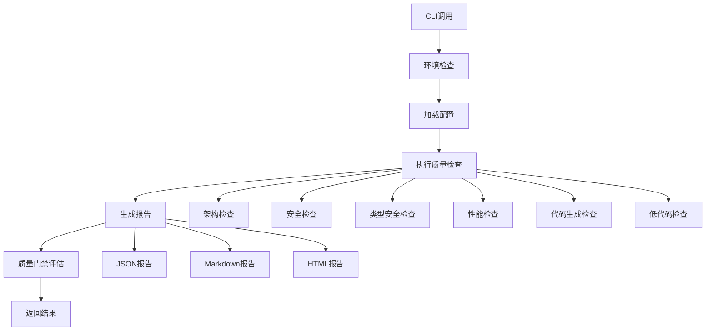
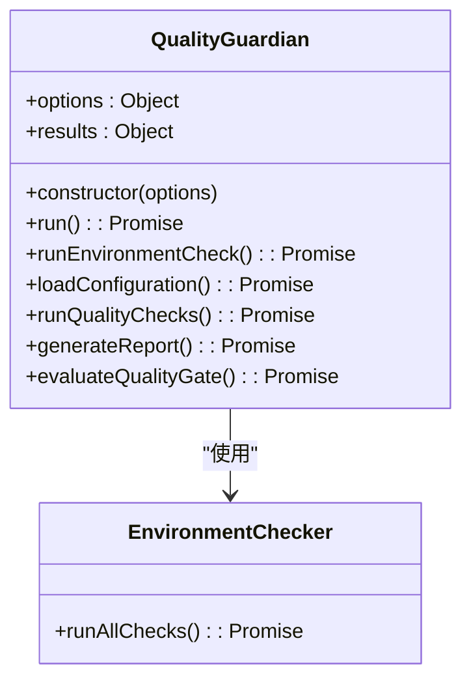
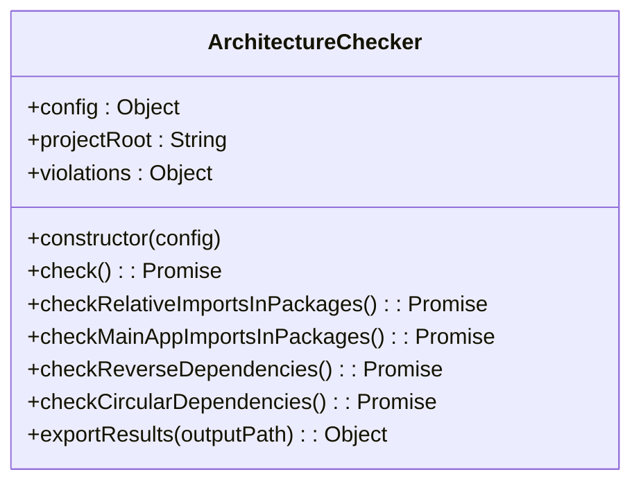
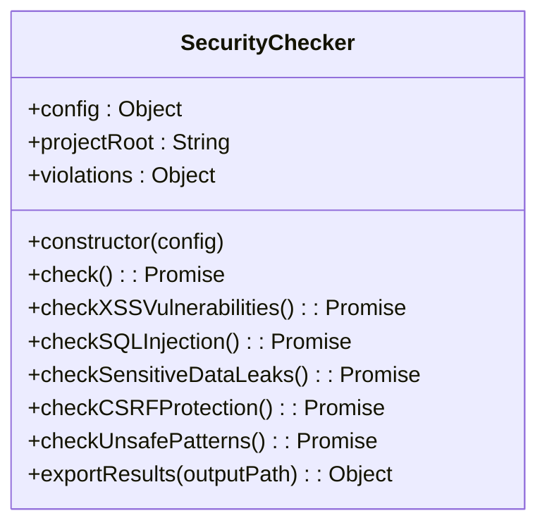
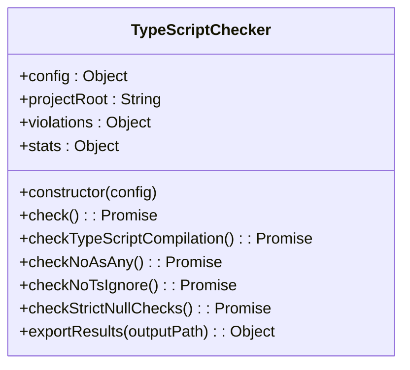
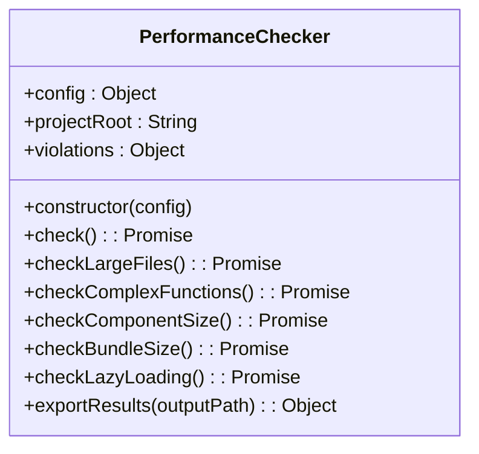
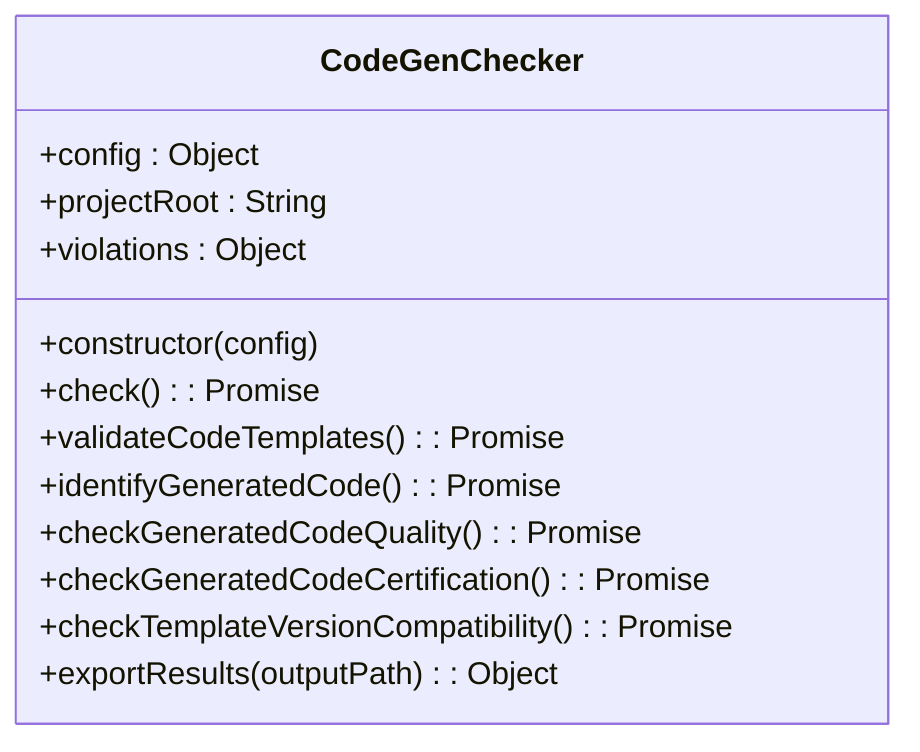
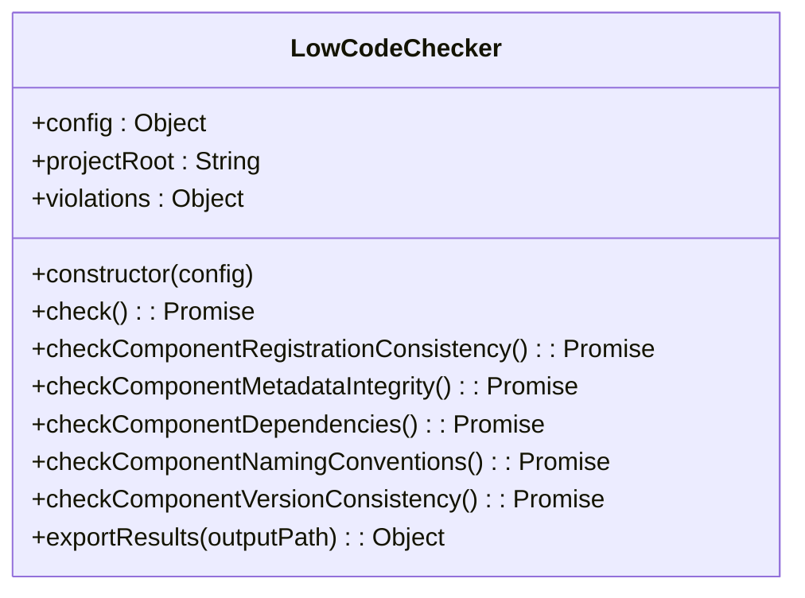
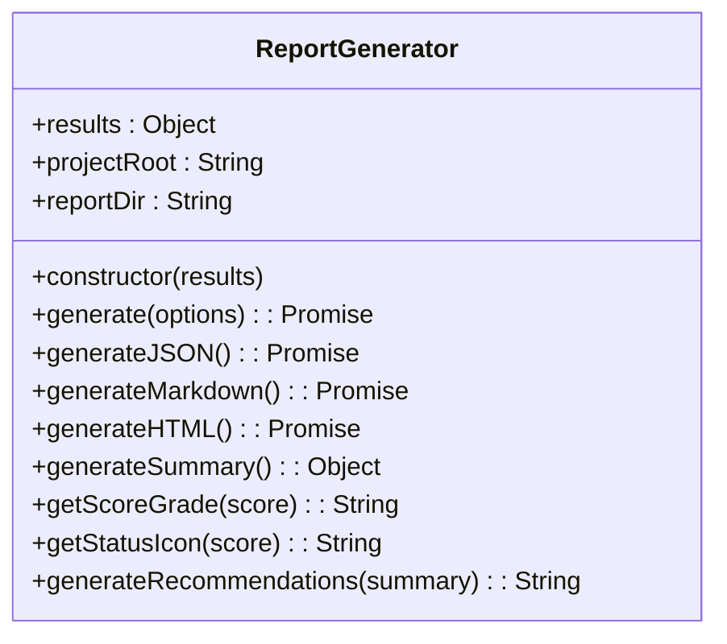
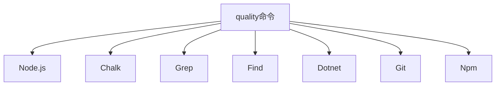

# 质量检查命令

<cite>
**本文档引用的文件**   
- [index.js](file://scripts/quality/index.js)
- [quality-gate.sh](file://scripts/quality/quality-gate.sh)
- [quality-config.json](file://config/quality-config.json)
- [architecture-checker.js](file://scripts/quality/checkers/architecture-checker.js)
- [security-checker.js](file://scripts/quality/checkers/security-checker.js)
- [typescript-checker.js](file://scripts/quality/checkers/typescript-checker.js)
- [performance-checker.js](file://scripts/quality/checkers/performance-checker.js)
- [codegen-checker.js](file://scripts/quality/checkers/codegen-checker.js)
- [lowcode-checker.js](file://scripts/quality/checkers/lowcode-checker.js)
- [report-generator.js](file://scripts/quality/reporters/report-generator.js)
</cite>

## 目录
1. [介绍](#介绍)
2. [项目结构](#项目结构)
3. [核心组件](#核心组件)
4. [架构概述](#架构概述)
5. [详细组件分析](#详细组件分析)
6. [依赖分析](#依赖分析)
7. [性能考虑](#性能考虑)
8. [故障排除指南](#故障排除指南)
9. [结论](#结论)

## 介绍
`quality` 命令是 hxlot 项目中 DevKit CLI 的核心质量检查工具，用于确保代码符合企业级质量标准。该命令通过集成多个检查器，对代码的架构、安全、类型安全、性能等方面进行全面检查，并生成多格式报告。`quality-gate.sh` 脚本进一步封装了 CLI 命令，实现了自动化质量门禁，可在开发环境和 CI/CD 环境中使用。

## 项目结构
`quality` 命令相关的文件主要位于 `scripts/quality` 目录下，包括检查器、报告生成器和工具脚本。配置文件位于 `config` 目录下，报告输出到 `reports/quality` 目录。

```mermaid
graph TB
subgraph "scripts/quality"
index["index.js (主入口)"]
checkers["checkers/ (检查器)"]
reporters["reporters/ (报告生成器)"]
utils["utils/ (工具)"]
scripts["其他脚本"]
end
subgraph "config"
config["quality-config.json"]
rules["quality-rules.json"]
gate["quality-gate.json"]
end
subgraph "reports/quality"
reports["生成的报告文件"]
end
index --> checkers
index --> reporters
index --> config
checkers --> reports
reporters --> reports
scripts --> index
```

**Diagram sources**
- [index.js](file://scripts/quality/index.js)
- [quality-gate.sh](file://scripts/quality/quality-gate.sh)
- [quality-config.json](file://config/quality-config.json)

**Section sources**
- [index.js](file://scripts/quality/index.js)
- [quality-gate.sh](file://scripts/quality/quality-gate.sh)
- [quality-config.json](file://config/quality-config.json)

## 核心组件
`quality` 命令的核心组件包括主入口 `index.js`、多个检查器（如 `architecture-checker.js`、`security-checker.js`）、报告生成器 `report-generator.js` 和配置文件 `quality-config.json`。这些组件协同工作，完成质量检查的全过程。

**Section sources**
- [index.js](file://scripts/quality/index.js)
- [architecture-checker.js](file://scripts/quality/checkers/architecture-checker.js)
- [security-checker.js](file://scripts/quality/checkers/security-checker.js)
- [report-generator.js](file://scripts/quality/reporters/report-generator.js)
- [quality-config.json](file://config/quality-config.json)

## 架构概述
`quality` 命令的架构分为五个阶段：环境检查、配置加载、执行检查、生成报告和质量门禁评估。每个阶段由相应的组件负责，确保检查过程的完整性和准确性。



**Diagram sources**
- [index.js](file://scripts/quality/index.js)
- [report-generator.js](file://scripts/quality/reporters/report-generator.js)

## 详细组件分析

### 主入口分析
`index.js` 是 `quality` 命令的主入口，负责协调各个检查阶段的执行。它通过 `QualityGuardian` 类封装了整个检查流程。

#### 类图


**Diagram sources**
- [index.js](file://scripts/quality/index.js)
- [utils/environment-checker.js](file://scripts/quality/utils/environment-checker.js)

**Section sources**
- [index.js](file://scripts/quality/index.js)

### 检查器分析
`quality` 命令支持多个检查器，每个检查器负责特定维度的质量检查。

#### 架构检查器
`architecture-checker.js` 负责检查代码的架构合规性，包括相对路径引用、主应用引用、逆向依赖和循环依赖。



**Diagram sources**
- [architecture-checker.js](file://scripts/quality/checkers/architecture-checker.js)

#### 安全检查器
`security-checker.js` 负责检查代码的安全性，包括 XSS 漏洞、SQL 注入、敏感信息泄漏等。



**Diagram sources**
- [security-checker.js](file://scripts/quality/checkers/security-checker.js)

#### 类型安全检查器
`typescript-checker.js` 负责检查 TypeScript 代码的类型安全，包括编译错误、`as any` 和 `@ts-ignore` 的使用。



**Diagram sources**
- [typescript-checker.js](file://scripts/quality/checkers/typescript-checker.js)

#### 性能检查器
`performance-checker.js` 负责检查代码的性能问题，包括大文件、复杂函数、大组件和大 Bundle。



**Diagram sources**
- [performance-checker.js](file://scripts/quality/checkers/performance-checker.js)

#### 代码生成检查器
`codegen-checker.js` 负责检查低代码引擎生成的代码质量，包括模板语法、生成代码识别、质量检查和认证标记。



**Diagram sources**
- [codegen-checker.js](file://scripts/quality/checkers/codegen-checker.js)

#### 低代码检查器
`lowcode-checker.js` 负责检查低代码引擎的核心质量，包括组件注册一致性、元数据完整性、依赖关系等。



**Diagram sources**
- [lowcode-checker.js](file://scripts/quality/checkers/lowcode-checker.js)

### 报告生成器分析
`report-generator.js` 负责生成多格式的质量报告，包括 JSON、Markdown 和 HTML。



**Diagram sources**
- [report-generator.js](file://scripts/quality/reporters/report-generator.js)

## 依赖分析
`quality` 命令依赖 Node.js 环境和多个 npm 包，如 `chalk` 用于彩色输出。检查器依赖系统命令如 `grep` 和 `find` 进行文件搜索。`quality-gate.sh` 脚本依赖 `node`、`npm`、`dotnet` 和 `git` 等工具。



**Diagram sources**
- [index.js](file://scripts/quality/index.js)
- [quality-gate.sh](file://scripts/quality/quality-gate.sh)

## 性能考虑
`quality` 命令在执行时会进行大量文件读取和文本搜索操作，可能对性能有一定影响。建议在 CI/CD 环境中使用缓存机制，避免重复检查。对于大型项目，可以考虑分模块检查，减少单次检查的时间。

## 故障排除指南
当 `quality` 命令执行失败时，应首先检查依赖工具是否安装，然后查看具体的错误信息。常见的问题包括缺少 `node` 或 `dotnet` 命令、配置文件缺失、检查器执行错误等。可以通过增加 `--verbose` 参数获取更详细的日志信息。

**Section sources**
- [index.js](file://scripts/quality/index.js)
- [quality-gate.sh](file://scripts/quality/quality-gate.sh)

## 结论
`quality` 命令是 hxlot 项目中不可或缺的质量保障工具，通过集成多个检查器和报告生成器，实现了全面的代码质量检查。`quality-gate.sh` 脚本进一步增强了其自动化能力，可在开发和 CI/CD 环境中使用。通过合理配置和使用，可以有效提升代码质量和开发效率。