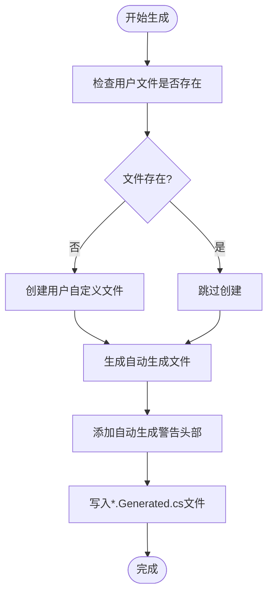
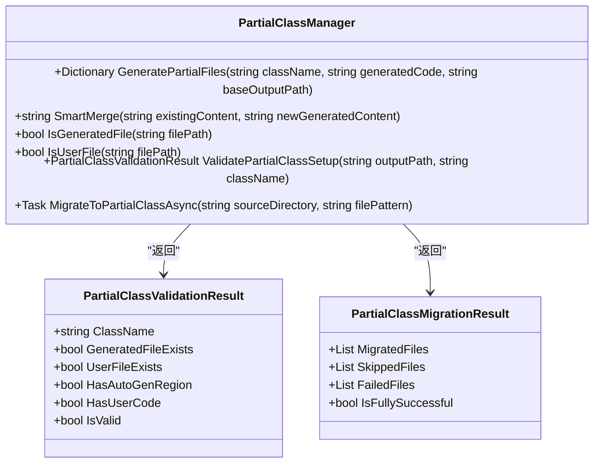
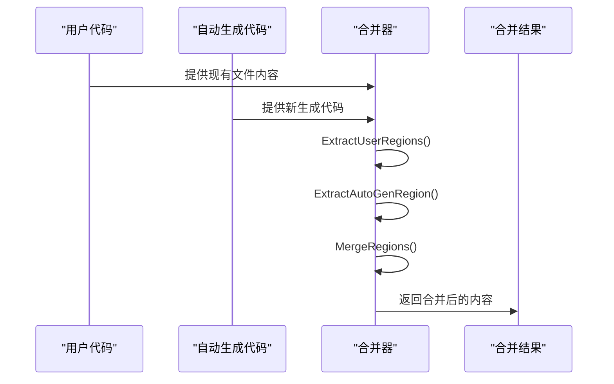
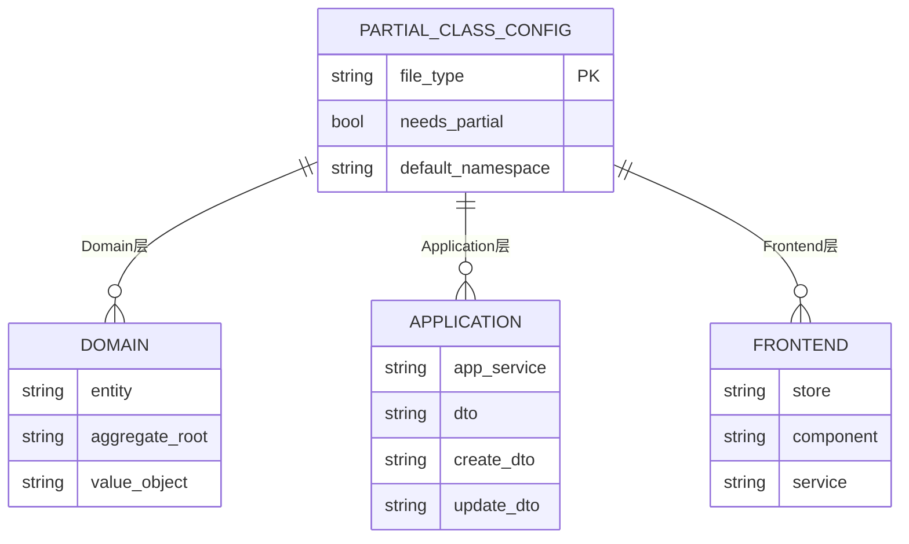
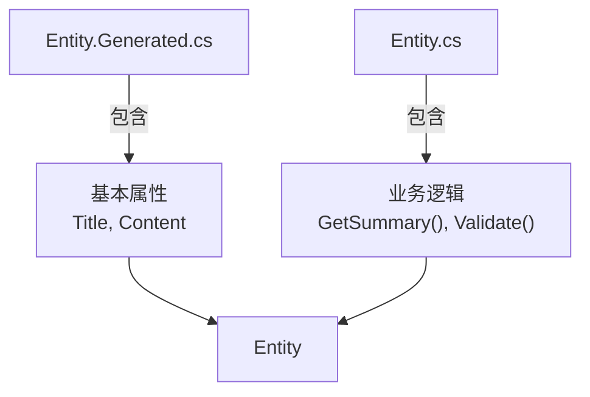
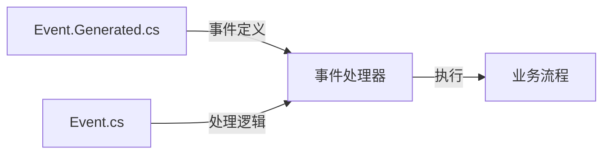
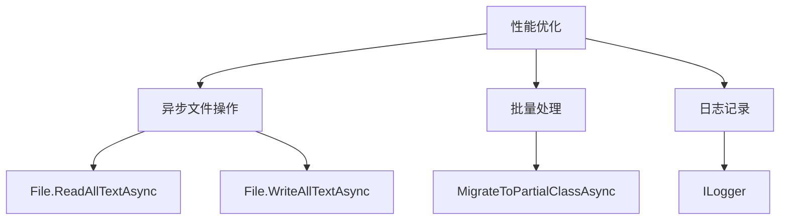
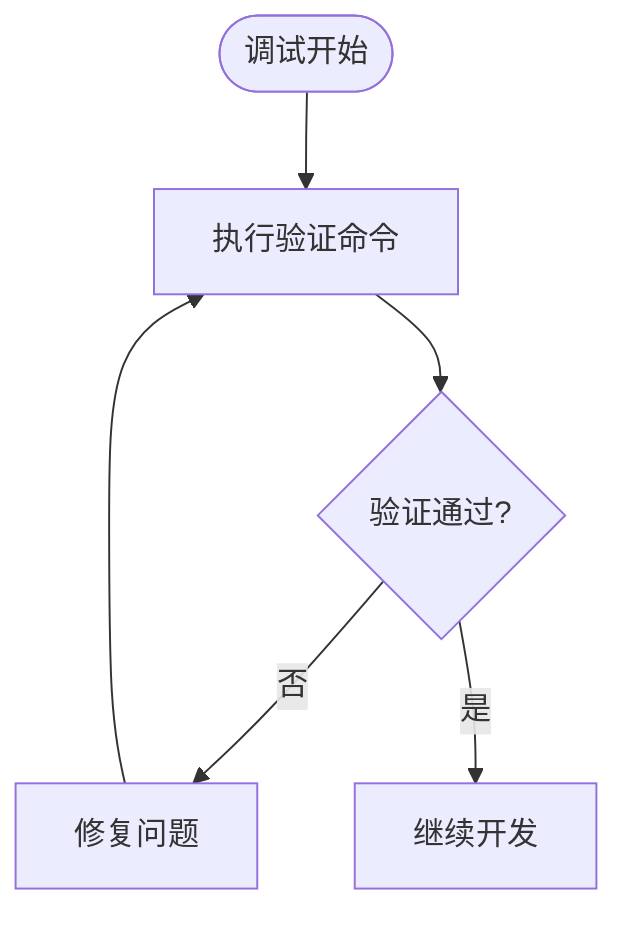

# 部分类生成与合并

<cite>
**Referenced Files in This Document**   
- [PartialClassManager.cs](file://src/SmartAbp.DevKit.Core/CodeMerge/PartialClassManager.cs)
- [PartialClassConfig.cs](file://src/SmartAbp.DevKit.Core/CodeMerge/PartialClassConfig.cs)
- [PartialClassCommandHandler.cs](file://src/SmartAbp.DevKit.Cli/Commands/PartialClassCommandHandler.cs)
</cite>

## 目录
1. [引言](#引言)
2. [部分类生成机制](#部分类生成机制)
3. [合并策略与冲突解决](#合并策略与冲突解决)
4. [配置文件与最佳实践](#配置文件与最佳实践)
5. [实际使用场景](#实际使用场景)
6. [性能考虑与调试技巧](#性能考虑与调试技巧)
7. [结论](#结论)

## 引言

部分类（partial class）机制是hxlot项目中实现代码生成与手动修改共存的核心技术。该机制通过将自动生成的代码和用户自定义代码分离到不同的文件中，解决了代码覆盖问题，确保了开发人员手动编写的代码不会被覆盖。本文档深入探讨了`PartialClassManager`的核心算法、配置方法、使用场景以及性能优化策略。

**Section sources**
- [PartialClassManager.cs](file://src/SmartAbp.DevKit.Core/CodeMerge/PartialClassManager.cs#L1-L402)

## 部分类生成机制

### 文件命名约定

部分类机制采用清晰的文件命名约定来区分自动生成代码和用户自定义代码：

- `Entity.Generated.cs`：自动生成的代码文件，每次代码生成时都会被覆盖
- `Entity.cs`：用户自定义代码文件，永久保留，不会被覆盖
- `EntityDto.Generated.cs`：自动生成的数据传输对象代码
- `EntityDto.cs`：用户自定义的数据传输对象代码

这种命名约定使得开发人员能够立即识别文件的性质和生命周期。

### 代码区域标记

为了进一步增强代码的可读性和安全性，系统使用了特殊的代码区域标记：

- `// ⚙️ 自动生成区域开始 - 请勿修改`：标记自动生成代码的开始
- `// ⚙️ 自动生成区域结束`：标记自动生成代码的结束
- `// ✍️ 用户自定义代码 - 安全保护`：标记用户自定义代码区域

这些标记不仅提供了视觉提示，还被`PartialClassManager`用于智能合并过程中的代码提取。

### 生成流程

`PartialClassManager`的生成流程如下：

**Diagram sources**
- [PartialClassManager.cs](file://src/SmartAbp.DevKit.Core/CodeMerge/PartialClassManager.cs#L70-L100)

**Section sources**
- [PartialClassManager.cs](file://src/SmartAbp.DevKit.Core/CodeMerge/PartialClassManager.cs#L50-L150)

## 合并策略与冲突解决

### 核心算法

`PartialClassManager`的核心算法实现了智能合并策略，确保自动生成代码的更新不会影响用户自定义代码。该算法通过正则表达式提取和重组代码区域来实现合并。

**Diagram sources**
- [PartialClassManager.cs](file://src/SmartAbp.DevKit.Core/CodeMerge/PartialClassManager.cs#L30-L402)

**Section sources**
- [PartialClassManager.cs](file://src/SmartAbp.DevKit.Core/CodeMerge/PartialClassManager.cs#L200-L350)

### 冲突解决机制

冲突解决机制主要通过以下步骤实现：

1. **提取用户代码区域**：使用正则表达式从现有文件中提取用户自定义代码
2. **提取自动生成代码**：从新生成的代码中提取自动生成部分
3. **重组代码**：将新的自动生成代码与提取的用户代码重新组合

**Diagram sources**
- [PartialClassManager.cs](file://src/SmartAbp.DevKit.Core/CodeMerge/PartialClassManager.cs#L200-L270)

## 配置文件与最佳实践

### 配置文件

`PartialClassConfig`类定义了哪些类型的文件需要使用部分类机制：

**Diagram sources**
- [PartialClassConfig.cs](file://src/SmartAbp.DevKit.Core/CodeMerge/PartialClassConfig.cs#L10-L70)

**Section sources**
- [PartialClassConfig.cs](file://src/SmartAbp.DevKit.Core/CodeMerge/PartialClassConfig.cs#L10-L70)

### 最佳实践

1. **命名规范**：遵循`ClassName.Generated.cs`和`ClassName.cs`的命名约定
2. **代码分离**：将业务逻辑扩展放在用户自定义文件中
3. **避免重复**：不要在用户文件中重复自动生成的属性或方法
4. **注释说明**：在用户代码中添加详细的注释说明业务逻辑

## 实际使用场景

### 业务逻辑扩展

部分类机制在业务逻辑扩展中非常有用。例如，可以将实体的基本属性放在自动生成文件中，而将复杂的业务方法放在用户自定义文件中。

**Section sources**
- [PartialClassManager.cs](file://src/SmartAbp.DevKit.Core/CodeMerge/PartialClassManager.cs#L100-L150)

### 事件处理

在事件处理场景中，可以自动生成事件定义，而将具体的处理逻辑放在用户自定义代码中。

**Section sources**
- [PartialClassCommandHandler.cs](file://src/SmartAbp.DevKit.Cli/Commands/PartialClassCommandHandler.cs#L200-L250)

## 性能考虑与调试技巧

### 性能优化

部分类生成的性能优化主要体现在以下几个方面：

1. **异步操作**：使用异步文件操作避免阻塞
2. **批量处理**：支持批量迁移现有代码
3. **日志记录**：详细的日志记录便于性能分析

**Section sources**
- [PartialClassManager.cs](file://src/SmartAbp.DevKit.Core/CodeMerge/PartialClassManager.cs#L300-L400)

### 调试技巧

1. **验证命令**：使用`devkit partial validate`命令验证部分类设置
2. **信息命令**：使用`devkit partial info`查看机制说明
3. **迁移命令**：使用`devkit partial migrate`迁移现有代码

**Section sources**
- [PartialClassCommandHandler.cs](file://src/SmartAbp.DevKit.Cli/Commands/PartialClassCommandHandler.cs#L50-L250)

## 结论

部分类生成与合并机制为hxlot项目提供了一种安全、高效的代码生成解决方案。通过将自动生成代码和用户自定义代码分离，该机制解决了代码覆盖问题，保护了开发人员的手动修改。`PartialClassManager`的智能合并算法确保了代码的完整性和一致性，而丰富的命令行工具则简化了日常开发工作。这种机制不仅提高了开发效率，还增强了代码的可维护性，是现代代码生成系统的重要组成部分。