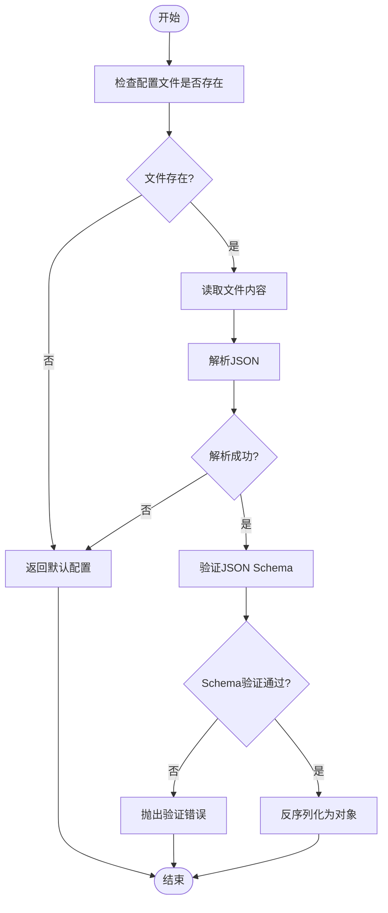

# 配置文件结构

<cite>
**Referenced Files in This Document**   
- [devkit.config.json](file://devkit.config.json)
- [src/SmartAbp.DevKit.Core/Config/DevKitConfig.cs](file://src/SmartAbp.DevKit.Core/Config/DevKitConfig.cs)
- [config/production.json](file://config/production.json)
- [src/SmartAbp.DevKit.Core/Config/LowCodeDirectoryManager.cs](file://src/SmartAbp.DevKit.Core/Config/LowCodeDirectoryManager.cs)
- [smartabp.config.json](file://smartabp.config.json)
</cite>

## 目录
1. [配置文件概述](#配置文件概述)
2. [核心配置项详解](#核心配置项详解)
3. [配置项层级关系与依赖](#配置项层级关系与依赖)
4. [完整配置文件示例](#完整配置文件示例)
5. [环境特定配置](#环境特定配置)
6. [配置验证规则与约束](#配置验证规则与约束)

## 配置文件概述

`devkit.config.json` 是 hxlot 项目的核心配置文件，用于定义代码生成器的运行参数和项目结构。该配置文件采用 JSON 格式，支持多种配置项来控制后端、前端、模板和输出等各个方面。配置文件的设计遵循模块化原则，将不同功能的配置项分组管理，便于维护和扩展。

配置文件的主要作用包括：
- 定义项目命名空间前缀
- 配置后端和前端项目的路径结构
- 管理模板文件的存储位置
- 控制代码生成的输出行为
- 设置 AI 流水线、模板引擎、质量门禁和性能监控等高级功能

**Section sources**
- [devkit.config.json](file://devkit.config.json)
- [src/SmartAbp.DevKit.Core/Config/DevKitConfig.cs](file://src/SmartAbp.DevKit.Core/Config/DevKitConfig.cs)

## 核心配置项详解

### 基础配置
`namespacePrefix` 配置项定义了项目的命名空间前缀，默认值为 "SmartAbp"。该前缀将被用于生成的代码文件中，确保命名空间的一致性和唯一性。

### 后端配置
后端配置项定义了后端项目的结构和命名空间：
- `applicationNamespace`: 应用服务层命名空间，默认为 "Application"
- `contractsNamespace`: 应用服务契约层命名空间，默认为 "Application.Contracts"
- `domainNamespace`: 领域层命名空间，默认为 "Domain.Entities"
- `httpApiNamespace`: HTTP API 层命名空间，默认为 "HttpApi.Controllers"
- `testsNamespace`: 单元测试命名空间，默认为 "Application.Tests"

`outputPaths` 配置项定义了各个后端模块的输出路径，使用 `{NamespacePrefix}` 占位符来动态生成路径。

### 前端配置
前端配置项管理前端项目的结构：
- `rootPath`: 前端项目根路径，默认为 "src/{NamespacePrefix}.Vue"
- `viewsPath`: 视图文件路径，默认为 "src/views"
- `apiPath`: API 客户端路径，默认为 "src/api"
- `typesPath`: 类型定义路径，默认为 "src/types"
- `apiBaseUrl`: API 基础路径前缀，默认为 "/api/app"

### 模板配置
模板配置项控制模板文件的管理和使用：
- `rootPath`: 模板根路径，默认为 "Templates"
- `backendPath`: 后端模板路径，默认为 "Templates/Backend"
- `frontendPath`: 前端模板路径，默认为 "Templates/Frontend"
- `useCustomTemplates`: 是否使用自定义模板，默认为 false
- `customTemplatePath`: 自定义模板路径，默认为 null

### 输出配置
输出配置项控制代码生成的行为：
- `overwriteExistingFiles`: 是否覆盖已存在的文件，默认为 false
- `createBackups`: 是否生成备份，默认为 true
- `backupPath`: 备份路径，默认为 ".backup"
- `formatGeneratedCode`: 是否格式化生成的代码，默认为 true
- `copyrightHeader`: 生成时添加的版权声明，默认为 null
- `logLevel`: 生成日志级别，默认为 "Information"

### AI 流水线配置
AI 流水线配置项管理 AI 相关的功能：
- `timeoutSeconds`: 工位执行超时时间（秒），默认为 30
- `maxRetries`: 最大重试次数，默认为 3
- `circuitBreakerFailureThreshold`: 断路器失败阈值，默认为 5
- `circuitBreakerResetTimeoutSeconds`: 断路器重置超时时间（秒），默认为 30
- `enableMiddlewarePipeline`: 启用中间件管道，默认为 true
- `enableLoggingMiddleware`: 启用日志中间件，默认为 true
- `enablePerformanceMiddleware`: 启用性能监控中间件，默认为 true
- `enableErrorHandlingMiddleware`: 启用错误处理中间件，默认为 true
- `enableValidationMiddleware`: 启用验证中间件，默认为 true
- `enableCachingMiddleware`: 启用缓存中间件，默认为 false

### 模板引擎配置
模板引擎配置项管理模板引擎的行为：
- `cacheSize`: 模板缓存大小（LRU），默认为 1000
- `cacheTTLMinutes`: 模板缓存TTL（分钟），默认为 60
- `enablePrecompilation`: 启用模板预编译，默认为 true
- `templateRootDirectory`: 模板根目录，默认为 "./Templates"

### 质量门禁配置
质量门禁配置项控制代码质量检查：
- `enabled`: 是否启用质量门禁，默认为 true
- `strictMode`: 是否启用严格模式（任何警告都会失败），默认为 false
- `enableMetadataConsistencyCheck`: 元数据一致性检查，默认为 true
- `enableTypeConsistencyCheck`: 类型一致性检查，默认为 true
- `enableTemplateOutputCheck`: 模板输出检查，默认为 true
- `enableCompilationCheck`: 编译检查，默认为 true
- `enableArchitectureConstraintsCheck`: 架构约束检查，默认为 true

### 性能监控配置
性能监控配置项管理性能指标收集：
- `enableMetrics`: 是否启用性能指标收集，默认为 true
- `warningThresholdMs`: 性能警告阈值（毫秒），默认为 5000
- `errorThresholdMs`: 性能错误阈值（毫秒），默认为 10000
- `enableOpenTelemetry`: 启用OpenTelemetry集成，默认为 false
- `openTelemetryEndpoint`: OpenTelemetry端点，默认为 "http://localhost:4317"

**Section sources**
- [devkit.config.json](file://devkit.config.json)
- [src/SmartAbp.DevKit.Core/Config/DevKitConfig.cs](file://src/SmartAbp.DevKit.Core/Config/DevKitConfig.cs)

## 配置项层级关系与依赖

配置文件的结构遵循清晰的层级关系，从顶层的配置类别到具体的配置项，形成了一种树状结构。这种结构有助于理解配置项之间的关系和依赖。

```mermaid
graph TD
A[DevKitConfig] --> B[BackendConfig]
A --> C[FrontendConfig]
A --> D[TemplateConfig]
A --> E[OutputConfig]
A --> F[AIFlowConfigSection]
A --> G[TemplateEngineConfigSection]
A --> H[QualityGateConfigSection]
A --> I[PerformanceConfigSection]
B --> B1[ApplicationNamespace]
B --> B2[ContractsNamespace]
B --> B3[DomainNamespace]
B --> B4[HttpApiNamespace]
B --> B5[TestsNamespace]
B --> B6[OutputPaths]
C --> C1[RootPath]
C --> C2[ViewsPath]
C --> C3[ApiPath]
C --> C4[TypesPath]
C --> C5[ApiBaseUrl]
D --> D1[RootPath]
D --> D2[BackendPath]
D --> D3[FrontendPath]
D --> D4[UseCustomTemplates]
D --> D5[CustomTemplatePath]
E --> E1[OverwriteExistingFiles]
E --> E2[CreateBackups]
E --> E3[BackupPath]
E --> E4[FormatGeneratedCode]
E --> E5[CopyrightHeader]
E --> E6[LogLevel]
F --> F1[TimeoutSeconds]
F --> F2[MaxRetries]
F --> F3[CircuitBreakerFailureThreshold]
F --> F4[CircuitBreakerResetTimeoutSeconds]
F --> F5[EnableMiddlewarePipeline]
F --> F6[EnableLoggingMiddleware]
F --> F7[EnablePerformanceMiddleware]
F --> F8[EnableErrorHandlingMiddleware]
F --> F9[EnableValidationMiddleware]
F --> F10[EnableCachingMiddleware]
G --> G1[CacheSize]
G --> G2[CacheTTLMinutes]
G --> G3[EnablePrecompilation]
G --> G4[TemplateRootDirectory]
H --> H1[Enabled]
H --> H2[StrictMode]
H --> H3[EnableMetadataConsistencyCheck]
H --> H4[EnableTypeConsistencyCheck]
H --> H5[EnableTemplateOutputCheck]
H --> H6[EnableCompilationCheck]
H --> H7[EnableArchitectureConstraintsCheck]
I --> I1[EnableMetrics]
I --> I2[WarningThresholdMs]
I --> I3[ErrorThresholdMs]
I --> I4[EnableOpenTelemetry]
I --> I5[OpenTelemetryEndpoint]
```



**Diagram sources**
- [src/SmartAbp.DevKit.Core/Config/DevKitConfig.cs](file://src/SmartAbp.DevKit.Core/Config/DevKitConfig.cs)

**Section sources**
- [src/SmartAbp.DevKit.Core/Config/DevKitConfig.cs](file://src/SmartAbp.DevKit.Core/Config/DevKitConfig.cs)

## 完整配置文件示例

以下是一个完整的 `devkit.config.json` 配置文件示例：

```json
{
    "namespacePrefix": "SmartAbp",
    "backend": {
        "applicationNamespace": "Application",
        "contractsNamespace": "Application.Contracts",
        "domainNamespace": "Domain.Entities",
        "httpApiNamespace": "HttpApi.Controllers",
        "testsNamespace": "Application.Tests",
        "outputPaths": {
            "Application": "src/{NamespacePrefix}.Application",
            "Contracts": "src/{NamespacePrefix}.Application.Contracts",
            "HttpApi": "src/{NamespacePrefix}.HttpApi",
            "Tests": "src/{NamespacePrefix}.Application.Tests"
        }
    },
    "frontend": {
        "rootPath": "src/{NamespacePrefix}.Vue",
        "viewsPath": "src/views",
        "apiPath": "src/api",
        "typesPath": "src/types",
        "apiBaseUrl": "/api/app"
    },
    "templates": {
        "rootPath": "Templates",
        "backendPath": "Templates/Backend",
        "frontendPath": "Templates/Frontend",
        "useCustomTemplates": false,
        "customTemplatePath": null
    },
    "output": {
        "overwriteExistingFiles": false,
        "createBackups": true,
        "backupPath": ".backup",
        "formatGeneratedCode": true,
        "copyrightHeader": null,
        "logLevel": "Information"
    },
    "DevKit": {
        "AIFlow": {
            "TimeoutSeconds": 30,
            "MaxRetries": 3,
            "CircuitBreakerFailureThreshold": 5,
            "CircuitBreakerResetTimeoutSeconds": 30,
            "EnableMiddlewarePipeline": true,
            "EnableLoggingMiddleware": true,
            "EnablePerformanceMiddleware": true,
            "EnableErrorHandlingMiddleware": true,
            "EnableValidationMiddleware": true,
            "EnableCachingMiddleware": false
        },
        "TemplateEngine": {
            "CacheSize": 1000,
            "CacheTTLMinutes": 60,
            "EnablePrecompilation": true,
            "TemplateRootDirectory": "./Templates"
        },
        "QualityGate": {
            "Enabled": true,
            "StrictMode": false,
            "EnableMetadataConsistencyCheck": true,
            "EnableTypeConsistencyCheck": true,
            "EnableTemplateOutputCheck": true,
            "EnableCompilationCheck": true,
            "EnableArchitectureConstraintsCheck": true
        },
        "Performance": {
            "EnableMetrics": true,
            "WarningThresholdMs": 5000,
            "ErrorThresholdMs": 10000,
            "EnableOpenTelemetry": false,
            "OpenTelemetryEndpoint": "http://localhost:4317"
        }
    }
}
```

**Section sources**
- [devkit.config.json](file://devkit.config.json)

## 环境特定配置

hxlot 项目支持根据不同部署环境定制配置文件。除了主配置文件 `devkit.config.json` 外，还可以使用特定环境的配置文件来覆盖默认设置。

### 生产环境配置

生产环境配置文件 `config/production.json` 包含了针对生产环境的优化设置：

```mermaid
graph TD
A[Production Configuration] --> B[Environment]
A --> C[Performance]
A --> D[Security]
A --> E[Monitoring]
A --> F[Deployment]
A --> G[Backup]
A --> H[Maintenance]
A --> I[Features]
B --> B1[Name: production]
B --> B2[Debug: false]
B --> B3[LogLevel: info]
B --> B4[EnableDetailedErrors: false]
C --> C1[CodeGeneration]
C --> C2[Frontend]
C --> C3[Database]
C --> C4[API]
D --> D1[HTTPS]
D --> D2[CORS]
D --> D3[Authentication]
D --> D4[DataProtection]
D --> D5[ContentSecurityPolicy]
E --> E1[HealthCheck]
E --> E2[Metrics]
E --> E3[Logging]
E --> E4[Tracing]
E --> E5[Alerting]
F --> F1[Platform: kubernetes]
F --> F2[Region: cn-shanghai]
F --> F3[Scaling]
F --> F4[Resources]
F --> F5[Networking]
G --> G1[Enabled: true]
G --> G2[Schedule: 0 2 * * *]
G --> G3[Retention]
G --> G4[Targets]
G --> G5[Storage]
H --> H1[UpdateWindow]
H --> H2[AutoUpdate]
I --> I1[TemplateMarket: true]
I --> I2[IntelligentRecommendation: true]
I --> I3[BusinessRuleEngine: true]
I --> I4[WorkflowEngine: true]
I --> I5[CodeQualityAnalyzer: true]
I --> I6[PerformanceOptimizer: true]
I --> I7[MultiTenancy: true]
I --> I8[Audit: true]
```



**Diagram sources**
- [config/production.json](file://config/production.json)

**Section sources**
- [config/production.json](file://config/production.json)

## 配置验证规则与约束

配置文件的验证规则确保了配置的正确性和一致性。这些规则主要通过 JSON Schema 和代码中的验证逻辑来实现。

### JSON Schema 验证

配置文件的结构遵循 JSON Schema 规范，确保了配置项的类型和格式正确。以下是一些关键的验证规则：

- `ModuleName` 必须是非空字符串，且符合正则表达式 `^[A-Za-z_][A-Za-z0-9_]*$`
- `CurrentLayer` 必须是整数，且只能是 1、2 或 3
- `IsMicroservice` 必须是布尔值
- `Entities` 是一个数组，每个元素必须包含 `EntityName` 属性
- `EntityProperty` 的 `Type` 属性必须是预定义的类型之一：`string`、`int`、`long`、`decimal`、`bool`、`DateTime`、`Guid`

### 代码验证

在代码层面，`DevKitConfig` 类提供了 `Load` 和 `Save` 方法来加载和保存配置文件。这些方法包含了错误处理逻辑，确保在配置文件不存在或格式不正确时能够优雅地处理。



**Diagram sources**
- [src/SmartAbp.DevKit.Core/Config/DevKitConfig.cs](file://src/SmartAbp.DevKit.Core/Config/DevKitConfig.cs)
- [src/SmartAbp.DevKit.Core/Config/LowCodeDirectoryManager.cs](file://src/SmartAbp.DevKit.Core/Config/LowCodeDirectoryManager.cs)

**Section sources**
- [src/SmartAbp.DevKit.Core/Config/DevKitConfig.cs](file://src/SmartAbp.DevKit.Core/Config/DevKitConfig.cs)
- [src/SmartAbp.DevKit.Core/Config/LowCodeDirectoryManager.cs](file://src/SmartAbp.DevKit.Core/Config/LowCodeDirectoryManager.cs)