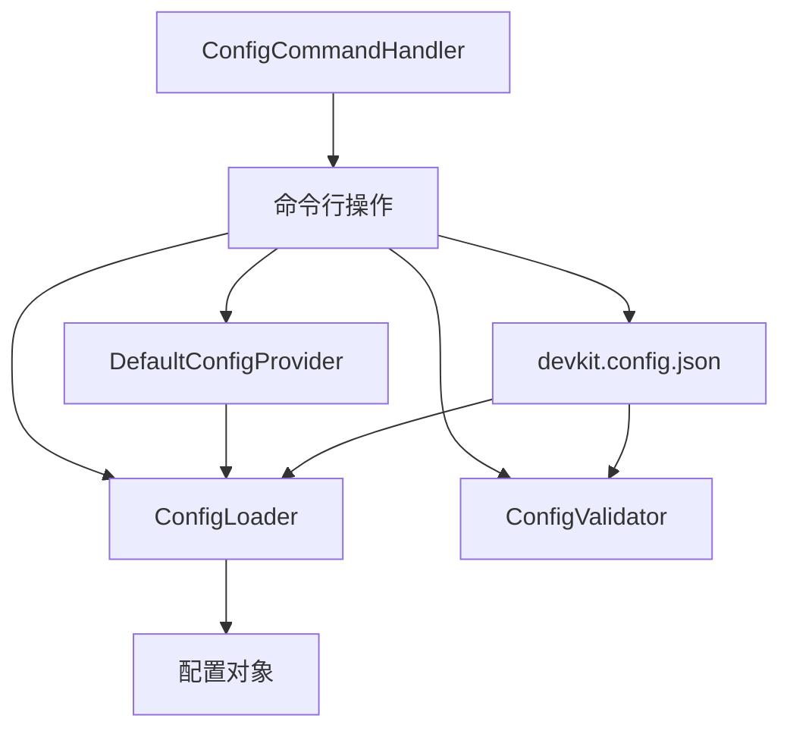
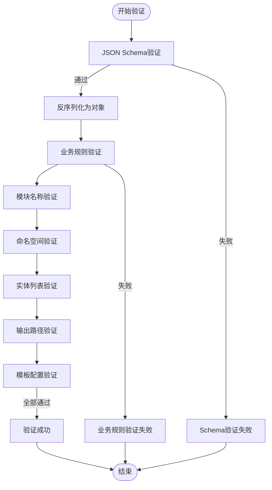
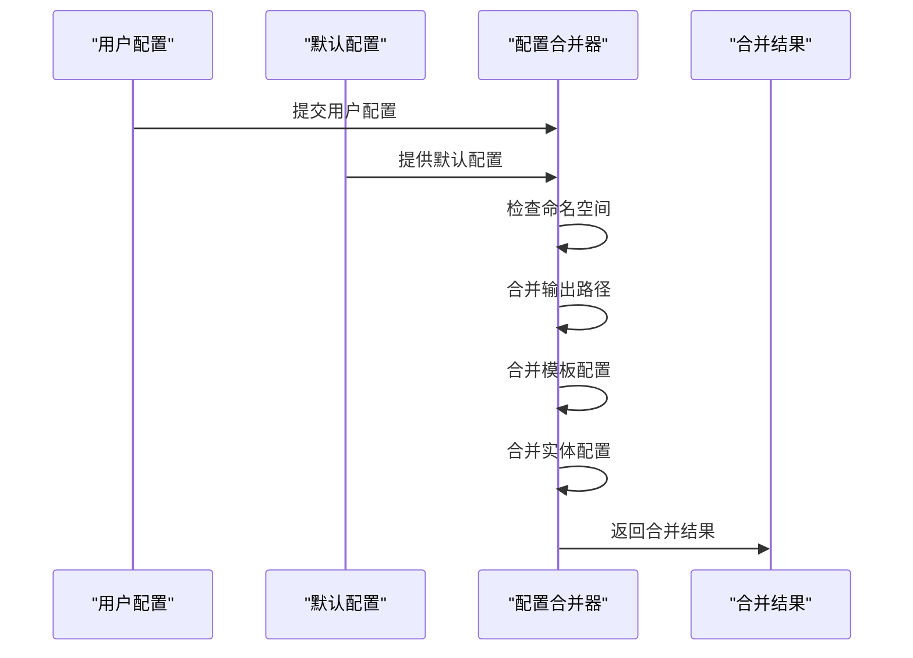
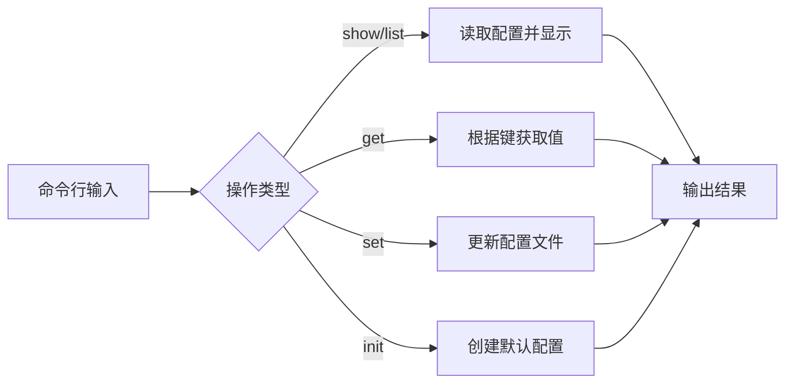

# 配置管理

<cite>
**本文档引用的文件**
- [devkit.config.json](file://devkit.config.json)
- [DevKitConfig.cs](file://src/SmartAbp.DevKit.Core/Config/DevKitConfig.cs)
- [ConfigLoader.cs](file://src/SmartAbp.DevKit.Core/Config/ConfigLoader.cs)
- [DefaultConfigProvider.cs](file://src/SmartAbp.DevKit.Core/Config/DefaultConfigProvider.cs)
- [ConfigValidator.cs](file://src/SmartAbp.DevKit.Core/Config/ConfigValidator.cs)
- [ConfigCommandHandler.cs](file://src/SmartAbp.DevKit.Cli/Commands/ConfigCommandHandler.cs)
- [Program.cs](file://src/SmartAbp.DevKit.Cli/Program.cs)
</cite>

## 目录
1. [项目结构](#项目结构)
2. [配置文件结构详解](#配置文件结构详解)
3. [配置加载与验证机制](#配置加载与验证机制)
4. [默认配置与合并策略](#默认配置与合并策略)
5. [配置版本管理与迁移](#配置版本管理与迁移)
6. [配置安全与加密存储](#配置安全与加密存储)
7. [命令行配置操作](#命令行配置操作)
8. [最佳实践](#最佳实践)

## 项目结构

hxlot项目的配置管理主要围绕`devkit.config.json`文件展开，该文件位于项目根目录。核心配置管理逻辑位于`src/SmartAbp.DevKit.Core/Config`目录下，包括配置加载、验证和默认值提供等功能。命令行工具位于`src/SmartAbp.DevKit.Cli`目录，提供配置的查询、修改等操作。



**图示来源**
- [devkit.config.json](file://devkit.config.json)
- [ConfigLoader.cs](file://src/SmartAbp.DevKit.Core/Config/ConfigLoader.cs)
- [ConfigValidator.cs](file://src/SmartAbp.DevKit.Core/Config/ConfigValidator.cs)
- [DefaultConfigProvider.cs](file://src/SmartAbp.DevKit.Core/Config/DefaultConfigProvider.cs)
- [ConfigCommandHandler.cs](file://src/SmartAbp.DevKit.Cli/Commands/ConfigCommandHandler.cs)

## 配置文件结构详解

`devkit.config.json`文件定义了代码生成的各项配置，主要包括以下几个部分：

### 命名空间前缀
`namespacePrefix`字段定义了项目命名空间的前缀，默认为"SmartAbp"。

### 后端配置
`backend`对象包含后端项目的命名空间和输出路径配置：
- `applicationNamespace`: 应用服务层命名空间
- `contractsNamespace`: 应用服务契约层命名空间
- `domainNamespace`: 领域层命名空间
- `httpApiNamespace`: HTTP API层命名空间
- `testsNamespace`: 单元测试命名空间
- `outputPaths`: 各模块的输出路径

### 前端配置
`frontend`对象包含前端项目的路径配置：
- `rootPath`: 前端项目根路径
- `viewsPath`: 视图文件路径
- `apiPath`: API客户端路径
- `typesPath`: 类型定义路径
- `apiBaseUrl`: API基础路径前缀

### 模板配置
`templates`对象管理模板相关配置：
- `rootPath`: 模板根路径
- `backendPath`: 后端模板路径
- `frontendPath`: 前端模板路径
- `useCustomTemplates`: 是否使用自定义模板
- `customTemplatePath`: 自定义模板路径

### 输出配置
`output`对象控制代码生成的输出行为：
- `overwriteExistingFiles`: 是否覆盖已存在的文件
- `createBackups`: 是否生成备份
- `backupPath`: 备份路径
- `formatGeneratedCode`: 是否格式化生成的代码
- `copyrightHeader`: 生成时添加的版权声明
- `logLevel`: 生成日志级别

### AI流水线配置
`AIFlow`对象配置AI流水线相关参数：
- `timeoutSeconds`: 工位执行超时时间（秒）
- `maxRetries`: 最大重试次数
- `enableMiddlewarePipeline`: 是否启用中间件管道
- `enableLoggingMiddleware`: 是否启用日志中间件
- `enablePerformanceMiddleware`: 是否启用性能监控中间件
- `enableErrorHandlingMiddleware`: 是否启用错误处理中间件
- `enableValidationMiddleware`: 是否启用验证中间件
- `enableCachingMiddleware`: 是否启用缓存中间件

### 质量门禁配置
`QualityGate`对象配置质量检查相关参数：
- `enabled`: 是否启用质量门禁
- `strictMode`: 是否启用严格模式
- `enableMetadataConsistencyCheck`: 是否启用元数据一致性检查
- `enableTypeConsistencyCheck`: 是否启用类型一致性检查
- `enableTemplateOutputCheck`: 是否启用模板输出检查
- `enableCompilationCheck`: 是否启用编译检查
- `enableArchitectureConstraintsCheck`: 是否启用架构约束检查

**配置来源**
- [devkit.config.json](file://devkit.config.json)
- [DevKitConfig.cs](file://src/SmartAbp.DevKit.Core/Config/DevKitConfig.cs)

## 配置加载与验证机制

配置加载和验证是确保配置文件正确性的关键过程，由`ConfigLoader`和`ConfigValidator`两个核心组件协同完成。

### 配置加载流程
配置加载通过`ConfigLoader.LoadConfigAsync`方法实现，主要步骤如下：
1. 确定配置文件路径（默认为`.lowcode/config.json`）
2. 检查配置文件是否存在
3. 读取JSON文件内容
4. 执行JSON Schema验证（如果存在schema文件）
5. 反序列化为配置对象
6. 执行业务规则验证
7. 返回验证通过的配置对象

### 配置验证流程
配置验证由`ConfigValidator`类负责，包含多个层次的验证：



**图示来源**
- [ConfigLoader.cs](file://src/SmartAbp.DevKit.Core/Config/ConfigLoader.cs)
- [ConfigValidator.cs](file://src/SmartAbp.DevKit.Core/Config/ConfigValidator.cs)

## 默认配置与合并策略

系统提供了一套完整的默认配置机制，确保即使用户配置不完整也能正常工作。

### 默认配置提供
`DefaultConfigProvider`类负责提供默认配置值，包括：
- 默认命名空间前缀
- 各模块的默认输出路径
- 模板的默认路径
- 实体和字段的默认配置

### 配置合并策略
当用户配置与默认配置合并时，遵循以下优先级规则：
1. 用户显式配置的值优先
2. 用户未配置的项使用默认值
3. 空值或无效值使用默认值

合并过程是递归进行的，确保每个配置层级都能正确合并。



**图示来源**
- [DefaultConfigProvider.cs](file://src/SmartAbp.DevKit.Core/Config/DefaultConfigProvider.cs)
- [ConfigLoader.cs](file://src/SmartAbp.DevKit.Core/Config/ConfigLoader.cs)

## 配置版本管理与迁移

系统通过`.lowcode-version`文件实现配置版本管理，支持配置的平滑迁移。

### 版本管理机制
- 每个`.lowcode`目录包含一个`.lowcode-version`文件
- 版本号采用语义化版本格式（如"2.0.0"）
- 初始化时创建版本文件
- 支持版本检查和更新

### 迁移策略
当检测到配置版本不兼容时，系统会：
1. 记录警告日志
2. 尝试使用默认配置
3. 提示用户手动更新配置
4. 提供配置升级工具

**配置来源**
- [LowCodeDirectoryManager.cs](file://src/SmartAbp.DevKit.Core/Config/LowCodeDirectoryManager.cs)

## 配置安全与加密存储

虽然当前配置文件以明文JSON格式存储，但系统提供了安全访问的基础框架。

### 安全访问控制
- 配置文件权限设置为仅项目成员可读写
- 敏感信息不应直接存储在配置文件中
- 支持通过环境变量覆盖配置（`DEVKIT_`前缀）

### 加密存储建议
对于需要加密存储的场景，建议：
1. 使用环境变量存储敏感信息
2. 实现自定义配置提供器进行解密
3. 集成密钥管理服务（KMS）
4. 定期轮换加密密钥

**配置来源**
- [Program.cs](file://src/SmartAbp.DevKit.Cli/Program.cs)

## 命令行配置操作

通过`devkit config`命令可以进行配置的查询、修改等操作。

### 支持的操作
- `list/show`: 显示当前配置
- `get`: 获取特定配置项
- `set`: 设置配置项
- `init`: 初始化配置文件

### 操作示例
```bash
# 显示所有配置
devkit config show

# 获取命名空间前缀
devkit config get --key namespacePrefix

# 初始化配置文件
devkit config init
```



**图示来源**
- [ConfigCommandHandler.cs](file://src/SmartAbp.DevKit.Cli/Commands/ConfigCommandHandler.cs)
- [Program.cs](file://src/SmartAbp.DevKit.Cli/Program.cs)

## 最佳实践

### 配置管理最佳实践
1. **版本控制**: 将`devkit.config.json`纳入版本控制
2. **环境分离**: 为不同环境维护不同的配置
3. **定期审查**: 定期审查配置的有效性
4. **文档化**: 记录配置变更的原因和影响

### 安全最佳实践
1. **最小权限**: 配置文件仅对必要人员开放
2. **敏感信息**: 不在配置文件中存储密码等敏感信息
3. **审计日志**: 记录配置变更历史
4. **备份策略**: 定期备份重要配置

### 性能优化
1. **缓存配置**: 在运行时缓存已加载的配置
2. **延迟加载**: 按需加载配置，避免启动时全部加载
3. **监控变更**: 监控配置文件变化，支持热更新

**配置来源**
- [DevKitConfig.cs](file://src/SmartAbp.DevKit.Core/Config/DevKitConfig.cs)
- [ConfigLoader.cs](file://src/SmartAbp.DevKit.Core/Config/ConfigLoader.cs)
- [ConfigCommandHandler.cs](file://src/SmartAbp.DevKit.Cli/Commands/ConfigCommandHandler.cs)