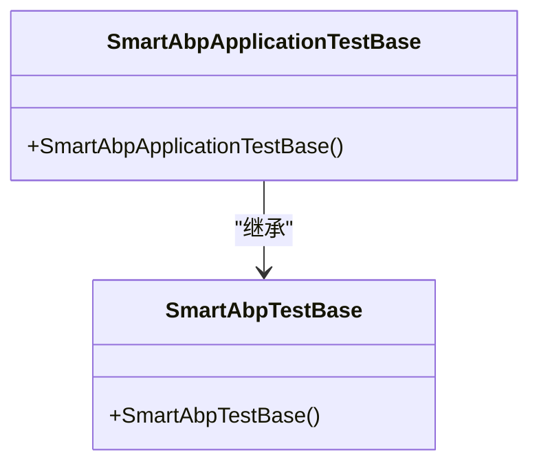
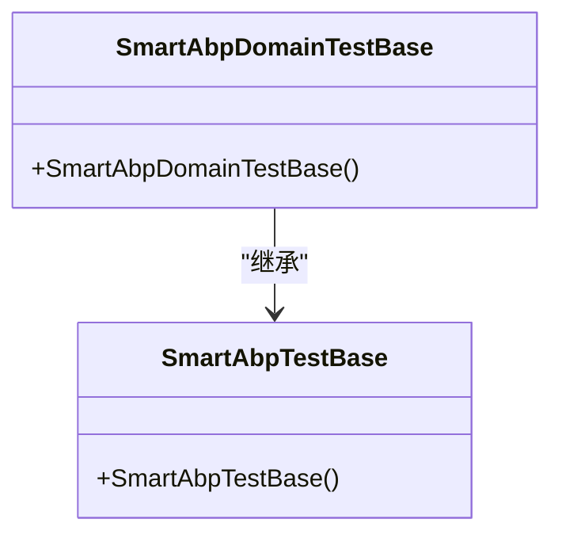
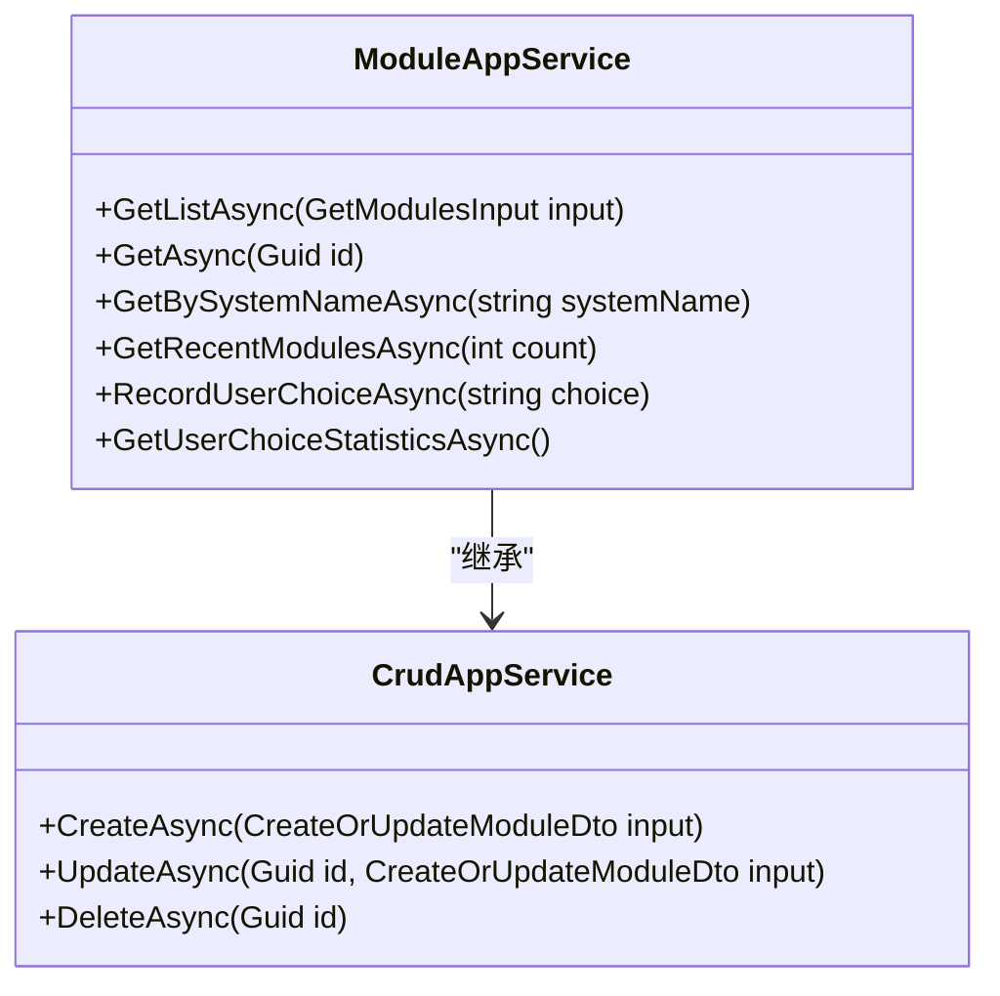
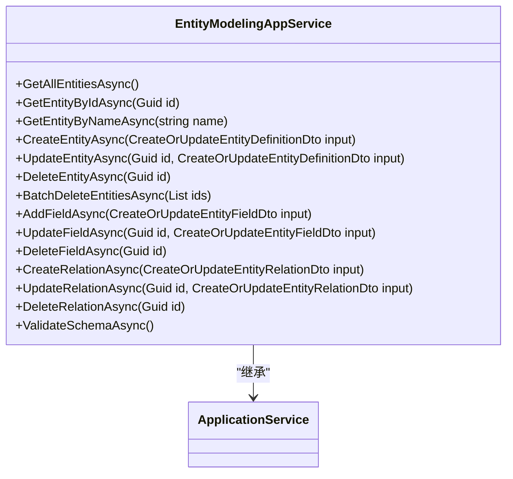

# 单元测试

<cite>
**本文档中引用的文件**  
- [SmartAbpApplicationTestBase.cs](file://src/tests/backend/SmartAbp.Application.Tests/SmartAbpApplicationTestBase.cs)
- [SmartAbpDomainTestBase.cs](file://src/tests/backend/SmartAbp.Domain.Tests/SmartAbpDomainTestBase.cs)
- [ModuleAppService.cs](file://src/SmartAbp.Application/LowCode/ModuleAppService.cs)
- [EntityModelingAppService.cs](file://src/SmartAbp.Application/LowCode/EntityModelingAppService.cs)
</cite>

## 目录
1. [简介](#简介)
2. [测试框架与工具](#测试框架与工具)
3. [测试基类详解](#测试基类详解)
4. [应用服务层测试](#应用服务层测试)
5. [领域层测试](#领域层测试)
6. [低代码核心服务测试](#低代码核心服务测试)
7. [依赖隔离与Mock对象](#依赖隔离与mock对象)
8. [关键场景测试示例](#关键场景测试示例)
9. [测试断言最佳实践](#测试断言最佳实践)
10. [测试性能优化技巧](#测试性能优化技巧)

## 简介
本文档详细介绍了在hxlot项目中如何使用ABP测试框架和xUnit为应用服务层和领域层编写单元测试。重点讲解了测试基类`SmartAbpApplicationTestBase`和`SmartAbpDomainTestBase`的使用方法，以及如何测试`ModuleAppService`、`EntityModelingAppService`等低代码核心服务。文档还涵盖了使用Mock对象隔离依赖、测试业务逻辑、实体验证、权限检查、数据一致性等关键场景的测试示例，并提供了测试断言的最佳实践和测试性能优化技巧。

## 测试框架与工具
hxlot项目采用ABP测试框架和xUnit作为主要的单元测试工具。ABP测试框架提供了丰富的测试基类和工具方法，简化了测试环境的搭建和测试数据的准备。xUnit则提供了强大的断言库和测试生命周期管理功能，支持异步测试和参数化测试。

**Section sources**
- [SmartAbpApplicationTestBase.cs](file://src/tests/backend/SmartAbp.Application.Tests/SmartAbpApplicationTestBase.cs)
- [SmartAbpDomainTestBase.cs](file://src/tests/backend/SmartAbp.Domain.Tests/SmartAbpDomainTestBase.cs)

## 测试基类详解
### SmartAbpApplicationTestBase
`SmartAbpApplicationTestBase`是应用服务层测试的基类，继承自`SmartAbpTestBase`。它为应用服务层的测试提供了必要的依赖注入和测试环境配置。

**Diagram sources**
- [SmartAbpApplicationTestBase.cs](file://src/tests/backend/SmartAbp.Application.Tests/SmartAbpApplicationTestBase.cs#L4-L8)

**Section sources**
- [SmartAbpApplicationTestBase.cs](file://src/tests/backend/SmartAbp.Application.Tests/SmartAbpApplicationTestBase.cs#L4-L8)

### SmartAbpDomainTestBase
`SmartAbpDomainTestBase`是领域层测试的基类，同样继承自`SmartAbpTestBase`。它为领域层的测试提供了必要的依赖注入和测试环境配置。

**Diagram sources**
- [SmartAbpDomainTestBase.cs](file://src/tests/backend/SmartAbp.Domain.Tests/SmartAbpDomainTestBase.cs#L5-L9)

**Section sources**
- [SmartAbpDomainTestBase.cs](file://src/tests/backend/SmartAbp.Domain.Tests/SmartAbpDomainTestBase.cs#L5-L9)

## 应用服务层测试
应用服务层的测试主要集中在`ModuleAppService`和`EntityModelingAppService`上。这些服务提供了低代码核心功能，如模块管理、实体建模等。

### ModuleAppService测试
`ModuleAppService`继承自`CrudAppService`，提供了模块的CRUD操作。测试时需要验证其分页查询、实体加载、用户选择记录等功能。

**Diagram sources**
- [ModuleAppService.cs](file://src/SmartAbp.Application/LowCode/ModuleAppService.cs#L21-L213)

**Section sources**
- [ModuleAppService.cs](file://src/SmartAbp.Application/LowCode/ModuleAppService.cs#L21-L213)

### EntityModelingAppService测试
`EntityModelingAppService`提供了实体建模的管理功能，包括实体定义、字段管理、关系管理等。测试时需要验证其实体创建、更新、删除、架构验证等功能。

**Diagram sources**
- [EntityModelingAppService.cs](file://src/SmartAbp.Application/LowCode/EntityModelingAppService.cs#L18-L351)

**Section sources**
- [EntityModelingAppService.cs](file://src/SmartAbp.Application/LowCode/EntityModelingAppService.cs#L18-L351)

## 领域层测试
领域层的测试主要集中在实体和值对象的验证、业务规则的执行等方面。通过`SmartAbpDomainTestBase`基类，可以方便地进行领域层的单元测试。

## 低代码核心服务测试
低代码核心服务的测试需要特别关注其元数据管理和动态生成能力。通过模拟不同的元数据配置，验证服务的正确性和稳定性。

## 依赖隔离与Mock对象
在单元测试中，使用Mock对象隔离依赖是确保测试独立性和可靠性的关键。通过Mock对象，可以模拟数据库访问、外部服务调用等依赖，专注于业务逻辑的测试。

## 关键场景测试示例
### 实体验证
测试实体的唯一性验证、字段长度验证等。

### 权限检查
测试用户权限的检查和异常处理。

### 数据一致性
测试数据的一致性和完整性，确保业务规则的正确执行。

## 测试断言最佳实践
- 使用具体的断言方法，如`Assert.Equal`、`Assert.True`等。
- 提供清晰的断言消息，便于调试。
- 避免过度断言，只断言必要的结果。

## 测试性能优化技巧
- 使用`[Theory]`和`[InlineData]`进行参数化测试，减少重复代码。
- 使用`[Collection]`属性共享测试上下文，减少初始化开销。
- 避免在测试中进行不必要的数据库操作，使用Mock对象替代。