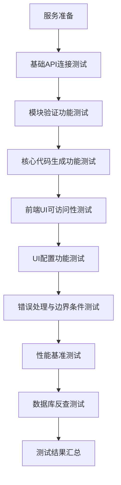
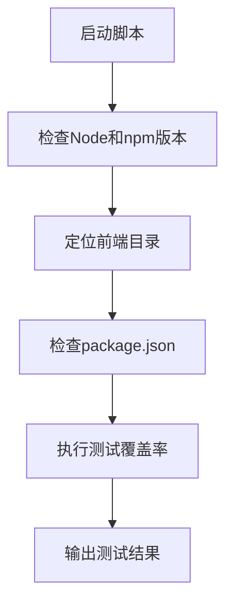
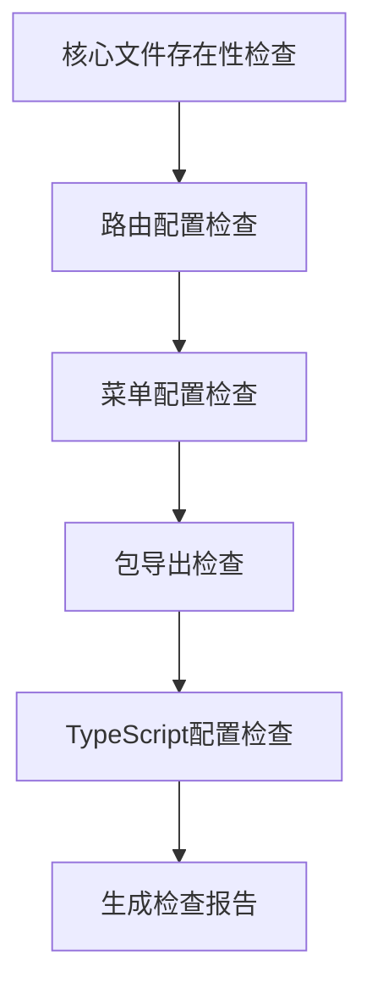
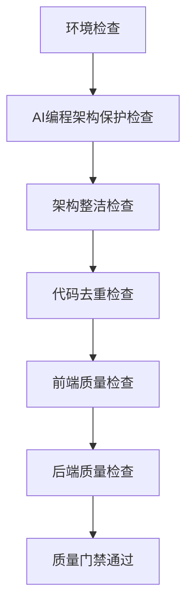

# 测试工具与脚本

<cite>
**本文档引用文件**  
- [smart-full-test.sh](file://scripts/testing/smart-full-test.sh)
- [quick-test.js](file://scripts/testing/quick-test.js)
- [test-core-functionality.js](file://scripts/testing/test-core-functionality.js)
- [test-validation.js](file://scripts/testing/test-validation.js)
- [run-e2e-tests.sh](file://scripts/testing/run-e2e-tests.sh)
- [ci-quality-check.sh](file://scripts/ci-quality-check.sh)
- [api-functionality-test.js](file://scripts/testing/api-functionality-test.js)
</cite>

## 目录
1. [测试工具概览](#测试工具概览)
2. [全量测试套件协调脚本](#全量测试套件协调脚本)
3. [快速测试工具详解](#快速测试工具详解)
4. [测试执行环境与参数说明](#测试执行环境与参数说明)
5. [测试输出解读指南](#测试输出解读指南)
6. [自定义测试脚本最佳实践](#自定义测试脚本最佳实践)
7. [CI/CD流水线集成策略](#cicd流水线集成策略)

## 测试工具概览

hxlot项目提供了一套完整的测试工具链，涵盖从快速验证到全量测试的多种场景。测试脚本主要位于`scripts/testing`目录下，包括`smart-full-test.sh`、`quick-test.js`、`test-core-functionality.js`等核心脚本。这些工具支持从基础API连接测试到复杂端到端验证的完整测试流程，确保低代码生成器各组件的稳定性和可靠性。

**测试工具分类**：
- **全量测试**：`smart-full-test.sh`协调执行完整测试套件
- **快速验证**：`quick-test.js`和`test-core-functionality.js`提供快速功能检查
- **专项测试**：`api-functionality-test.js`等脚本针对特定功能进行验证
- **CI/CD集成**：`ci-quality-check.sh`用于持续集成环境的质量门禁

**Section sources**
- [smart-full-test.sh](file://scripts/testing/smart-full-test.sh#L1-L587)
- [quick-test.js](file://scripts/testing/quick-test.js#L1-L70)
- [test-core-functionality.js](file://scripts/testing/test-core-functionality.js#L1-L85)

## 全量测试套件协调脚本

`smart-full-test.sh`是hxlot项目的核心测试协调脚本，负责执行完整的端到端测试流程。该脚本采用分阶段测试策略，从服务准备到性能基准测试共包含九个阶段，全面验证低代码生成器的各项功能。



**脚本执行流程**：
1. **服务就绪检查**：等待后端API（端口44379）和前端服务（端口11369）启动
2. **基础API测试**：验证连接字符串、菜单树和Schema版本清单等基础API
3. **模块验证测试**：使用测试模块配置验证模块验证和模拟生成功能
4. **核心代码生成**：执行完整的模块代码生成并验证返回结果
5. **前端UI测试**：检查入口选择页、极简模式和专业模式页面的可访问性
6. **UI配置测试**：验证UI配置的保存和获取功能
7. **错误处理测试**：测试对无效和不完整模块配置的拒绝处理
8. **性能基准测试**：测量代码生成性能，目标在30秒内完成
9. **数据库反查测试**：可选测试，验证数据库Schema反查功能

脚本执行完成后会生成详细的Markdown格式测试报告，包含测试结果总览、详细测试结果、性能指标、问题清单和改进建议等内容。

**Diagram sources**
- [smart-full-test.sh](file://scripts/testing/smart-full-test.sh#L1-L587)

**Section sources**
- [smart-full-test.sh](file://scripts/testing/smart-full-test.sh#L1-L587)

## 快速测试工具详解

hxlot项目提供了多个快速测试工具，用于快速验证核心功能的完整性。这些工具设计简洁，执行速度快，适合开发过程中的频繁验证。

### quick-test.js

`quick-test.js`是前端快速测试脚本，主要用于验证前端项目的测试覆盖率。该脚本首先检查Node.js和npm版本，然后切换到前端目录执行`npm run test:coverage`命令。



**脚本特点**：
- 自动检测前端项目路径
- 验证必要的文件和目录存在性
- 执行完整的测试覆盖率分析
- 限制输出行数，避免信息过载

**Section sources**
- [quick-test.js](file://scripts/testing/quick-test.js#L1-L70)

### test-core-functionality.js

`test-core-functionality.js`是核心功能完整性检查脚本，用于验证低代码生成器的关键组件。该脚本通过文件存在性检查、路由配置验证、菜单配置检查、包导出检查和TypeScript配置检查五个维度来评估系统完整性。



**检查内容**：
- **核心文件**：验证`LowCodeStudioView.vue`、`DesignView.vue`等关键文件存在
- **路由配置**：检查`/lowcode`和`/studio`路由是否存在
- **菜单配置**：验证菜单路径配置是否正确
- **包导出**：检查`lowcode-core`、`lowcode-designer`等包的导出文件
- **TypeScript配置**：验证路径映射和`@smartabp/*`别名配置

**Diagram sources**
- [test-core-functionality.js](file://scripts/testing/test-core-functionality.js#L1-L85)

**Section sources**
- [test-core-functionality.js](file://scripts/testing/test-core-functionality.js#L1-L85)

## 测试执行环境与参数说明

### 执行环境配置

hxlot项目的测试脚本需要特定的执行环境配置：

**基础环境要求**：
- Node.js 16+ 和 npm 8+
- .NET 6.0 SDK
- Bash shell（Linux/Mac）或 PowerShell（Windows）
- cURL 工具

**服务端口配置**：
- 后端API服务：`http://localhost:44379`
- 前端开发服务器：`http://localhost:11369`

**环境准备步骤**：
1. 启动后端服务：`cd src/SmartAbp.Web && dotnet run`
2. 启动前端服务：`cd src/SmartAbp.Vue && npm run dev`
3. 等待服务完全启动后执行测试脚本

### 脚本参数说明

#### smart-full-test.sh 参数
- 无命令行参数，通过环境变量和脚本内部配置控制行为
- 测试结果报告自动生成在`docs/testing/reports/`目录下
- 超时时间可修改脚本中的`max_wait`变量（默认300秒）

#### quick-test.js 参数
- 无命令行参数，执行固定测试流程
- 测试输出限制为前100行，可通过修改`limitedOutput`逻辑调整

#### test-core-functionality.js 参数
- 无命令行参数，执行预定义的检查项
- 检查的文件列表在脚本中硬编码定义

**Section sources**
- [smart-full-test.sh](file://scripts/testing/smart-full-test.sh#L1-L587)
- [quick-test.js](file://scripts/testing/quick-test.js#L1-L70)
- [test-core-functionality.js](file://scripts/testing/test-core-functionality.js#L1-L85)

## 测试输出解读指南

### smart-full-test.sh 输出解读

`smart-full-test.sh`的输出分为多个部分，每个部分都有明确的标识和颜色编码：

**输出结构**：
1. **标题区域**：蓝色显示测试名称和时间
2. **阶段标题**：洋红色显示当前测试阶段
3. **测试用例**：绿色表示通过，红色表示失败，黄色表示跳过
4. **汇总结果**：蓝色显示最终测试统计
5. **详细报告**：生成Markdown格式的完整测试报告

**关键指标**：
- **通过率**：`PASSED_TESTS/TOTAL_TESTS`的百分比
- **性能指标**：代码生成耗时（秒）
- **问题清单**：列出所有失败的测试项

### quick-test.js 输出解读

`quick-test.js`的输出相对简洁：

**输出结构**：
1. **启动信息**：显示Node和npm版本
2. **目录检查**：验证前端目录和package.json存在性
3. **测试结果**：显示测试覆盖率输出的前100行
4. **完成状态**：绿色表示成功，红色表示失败

**异常处理**：
- 捕获并显示错误信息
- 输出标准输出和错误输出的详细内容
- 返回非零退出码表示测试失败

### test-core-functionality.js 输出解读

`test-core-functionality.js`的输出采用符号编码：

**输出符号**：
- ✅：检查通过
- ❌：检查失败
- 🚩：检查项

**检查维度**：
- 文件存在性
- 路由配置
- 菜单配置
- 包导出
- TypeScript配置

**Section sources**
- [smart-full-test.sh](file://scripts/testing/smart-full-test.sh#L1-L587)
- [quick-test.js](file://scripts/testing/quick-test.js#L1-L70)
- [test-core-functionality.js](file://scripts/testing/test-core-functionality.js#L1-L85)

## 自定义测试脚本最佳实践

### 脚本设计原则

创建自定义测试脚本应遵循以下最佳实践：

**命名规范**：
- 使用描述性名称，如`test-<功能>-<场景>.js`
- 保持命名一致性，便于识别和管理

**代码结构**：
- 模块化设计，分离关注点
- 使用清晰的函数命名
- 添加详细的注释和文档

**错误处理**：
- 使用try-catch捕获异常
- 提供有意义的错误信息
- 确保脚本在失败时返回适当的退出码

### 示例：自定义API功能测试

```javascript
#!/usr/bin/env node

/**
 * 自定义API功能测试脚本
 * 验证特定API端点的功能
 */

const axios = require('axios');
const chalk = require('chalk');

async function testCustomApi() {
  const endpoints = [
    { name: '自定义API端点', url: 'http://localhost:44379/api/custom' }
  ];

  for (const endpoint of endpoints) {
    try {
      const response = await axios.get(endpoint.url, { timeout: 5000 });
      if (response.status === 200) {
        console.log(`${chalk.green('✅')} ${endpoint.name}: ${response.status}`);
      } else {
        console.log(`${chalk.red('❌')} ${endpoint.name}: ${response.status}`);
      }
    } catch (error) {
      console.log(`${chalk.red('❌')} ${endpoint.name}: ${error.message}`);
    }
  }
}

testCustomApi();
```

**最佳实践要点**：
- 使用`#!/usr/bin/env node`指定解释器
- 添加详细的脚本描述
- 使用颜色编码提高可读性
- 设置合理的超时时间
- 处理网络请求异常

**Section sources**
- [api-functionality-test.js](file://scripts/testing/api-functionality-test.js#L1-L135)
- [test-validation.js](file://scripts/testing/test-validation.js#L1-L121)

## CI/CD流水线集成策略

### ci-quality-check.sh 集成

`ci-quality-check.sh`是hxlot项目CI/CD流水线的核心质量检查脚本，实现了四重质量门禁：



**质量门禁层级**：
1. **第零关：AI编程架构保护**：防止AI编程破坏工程化架构
2. **第一关：架构整洁检查**：确保代码结构符合规范
3. **第二关：代码去重检查**：检测重复的Vue组件
4. **第三关：前端质量检查**：执行TypeScript类型检查、ESLint规范检查和构建编译
5. **第四关：后端质量检查**：执行后端编译和单元测试

### 流水线执行策略

**CI/CD执行流程**：
1. **代码推送**：开发者推送代码到版本库
2. **环境检查**：验证必要的项目文件存在
3. **质量检查**：执行`ci-quality-check.sh`脚本
4. **测试执行**：运行单元测试、集成测试和E2E测试
5. **部署决策**：根据测试结果决定是否部署

**自动化策略**：
- 在Git提交前执行预提交检查
- 在CI流水线中执行完整质量检查
- 在部署前执行生产环境验证
- 定期执行全量测试套件

**Section sources**
- [ci-quality-check.sh](file://scripts/ci-quality-check.sh#L1-L146)
- [run-e2e-tests.sh](file://scripts/testing/run-e2e-tests.sh#L1-L199)