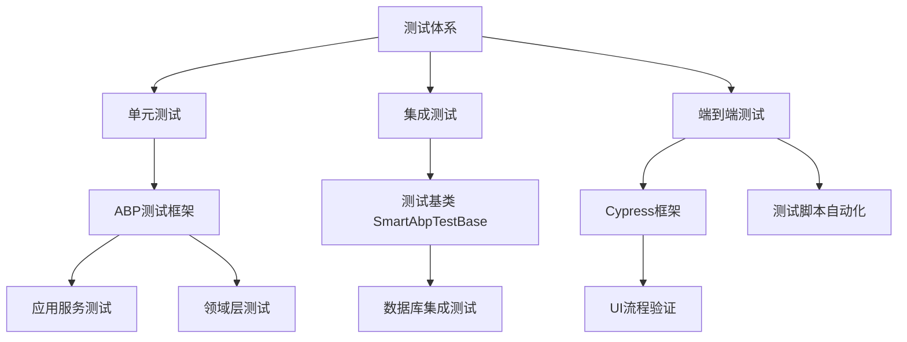
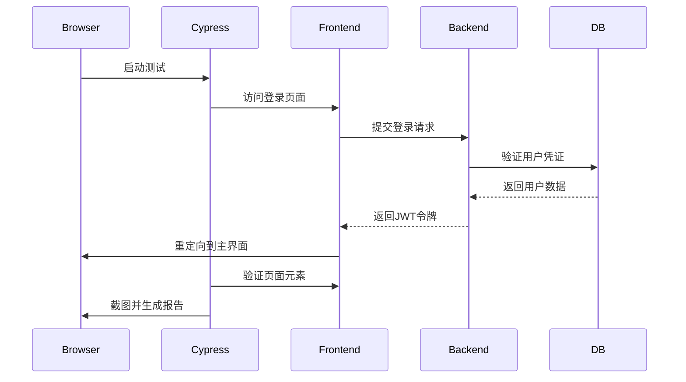
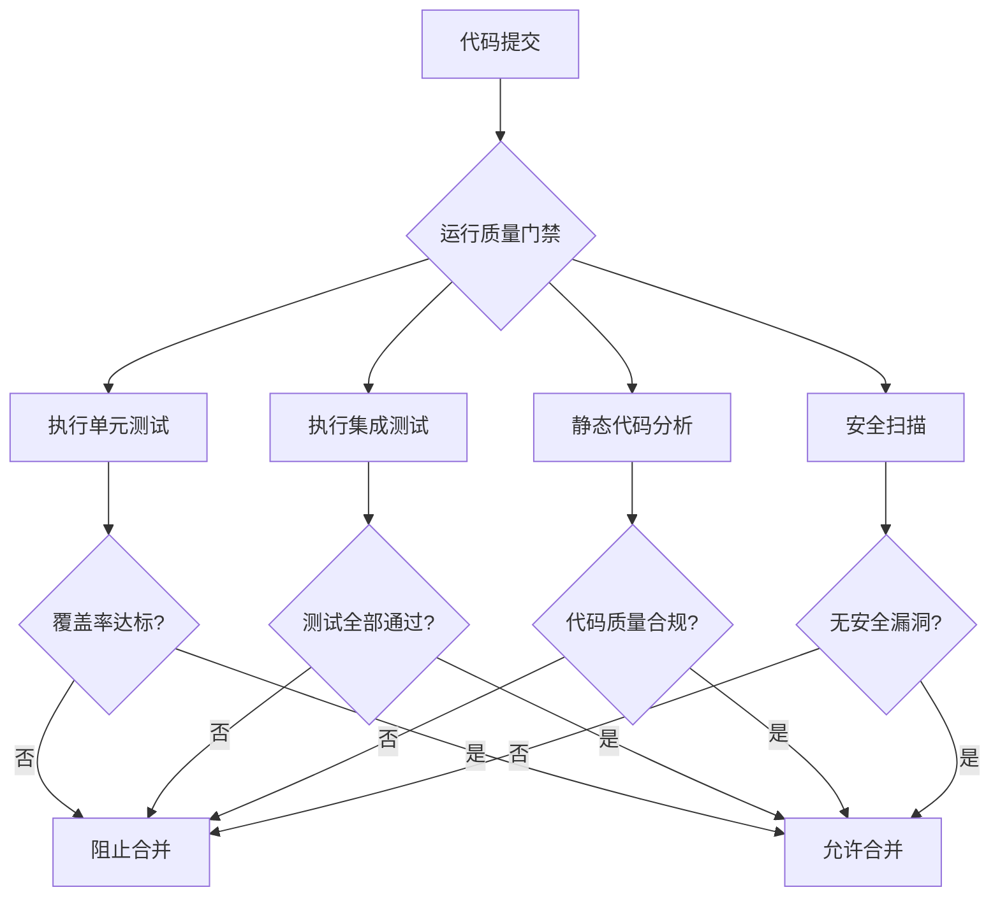

# 测试指南

<cite>
**本文档中引用的文件**  
- [AbpAuditLoggingGeneratorTests.cs](file://tests/backend/SmartAbp.CodeGenerator.Tests/ABP/AbpAuditLoggingGeneratorTests.cs)
- [AbpBackgroundJobGeneratorTests.cs](file://tests/backend/SmartAbp.CodeGenerator.Tests/ABP/AbpBackgroundJobGeneratorTests.cs)
- [AbpModuleGeneratorTests.cs](file://tests/backend/SmartAbp.CodeGenerator.Tests/ABP/AbpModuleGeneratorTests.cs)
- [AbpSettingsGeneratorTests.cs](file://tests/backend/SmartAbp.CodeGenerator.Tests/ABP/AbpSettingsGeneratorTests.cs)
- [FakeTemplateService.cs](file://tests/backend/SmartAbp.CodeGenerator.Tests/ABP/FakeTemplateService.cs)
- [login-test.cy.ts](file://src/SmartAbp.Vue/cypress/e2e/login-test.cy.ts)
- [permission-system.cy.ts](file://src/SmartAbp.Vue/cypress/e2e/permission-system.cy.ts)
- [advanced-form.cy.ts](file://src/SmartAbp.Vue/cypress/e2e/advanced-form.cy.ts)
- [api-integration.cy.ts](file://src/SmartAbp.Vue/cypress/e2e/api-integration.cy.ts)
- [e2e.ts](file://src/SmartAbp.Vue/cypress/support/e2e.ts)
- [component-commands.ts](file://src/SmartAbp.Vue/cypress/support/component-commands.ts)
- [security-alerts.json](file://src/SmartAbp.Vue/cypress/fixtures/security-alerts.json)
- [permission-roles.json](file://src/SmartAbp.Vue/cypress/fixtures/permission-roles.json)
- [LowCodeAutoMapperTests.cs](file://src/SmartAbp.Application.Tests/LowCode/LowCodeAutoMapperTests.cs)
- [SmartAbp.DevKit.Core.Tests.csproj](file://src/SmartAbp.DevKit.Core.Tests/SmartAbp.DevKit.Core.Tests.csproj)
- [QualityGateEnforcerTests.cs](file://src/SmartAbp.DevKit.Core.Tests/Quality/QualityGateEnforcerTests.cs)
- [AIFlowControllerTests.cs](file://src/SmartAbp.DevKit.Core.Tests/AIFlowControllerTests.cs)
- [TemplateManagerTests.cs](file://src/SmartAbp.DevKit.Core.Tests/TemplateManagerTests.cs)
- [quality-gate.sh](file://scripts/quality/quality-gate.sh)
- [gate.js](file://scripts/quality/gate.js)
- [ci-quality-check.sh](file://scripts/ci-quality-check.sh)
- [run-e2e-tests.sh](file://scripts/testing/run-e2e-tests.sh)
- [run-integration-tests.ps1](file://scripts/testing/run-integration-tests.ps1)
- [test-schema-version.cs](file://scripts/test-schema-version.cs)
- [quality-config.json](file://config/quality-config.json)
- [quality-gate.json](file://config/quality-gate.json)
- [quality-rules.json](file://config/quality-rules.json)
- [SmartAbp.Domain.Tests](file://tests/backend/SmartAbp.Domain.Tests)
- [SmartAbp.EntityFrameworkCore.Tests](file://tests/backend/SmartAbp.EntityFrameworkCore.Tests)
- [SmartAbp.Web.Tests](file://tests/backend/SmartAbp.Web.Tests)
- [SmartAbp.HttpApi.Client.ConsoleTestApp](file://tests/backend/SmartAbp.HttpApi.Client.ConsoleTestApp)
- [SmartAbp.TestBase](file://tests/backend/SmartAbp.TestBase)
</cite>

## 目录
1. [简介](#简介)
2. [测试体系架构](#测试体系架构)
3. [单元测试实现](#单元测试实现)
4. [集成测试策略](#集成测试策略)
5. [端到端测试实践](#端到端测试实践)
6. [测试数据管理](#测试数据管理)
7. [测试覆盖率与质量门禁](#测试覆盖率与质量门禁)
8. [测试调试与故障排查](#测试调试与故障排查)
9. [结论](#结论)

## 简介
hxlot项目采用分层测试体系，涵盖单元测试、集成测试和端到端测试，确保代码质量与业务功能的稳定性。本指南详细说明测试框架的使用方法、核心测试场景的实现方式以及质量保障机制。

## 测试体系架构

**Diagram sources**
- [SmartAbp.TestBase](file://tests/backend/SmartAbp.TestBase)
- [SmartAbp.DevKit.Core.Tests](file://src/SmartAbp.DevKit.Core.Tests)

## 单元测试实现

hxlot项目使用ABP框架提供的测试基础设施进行单元测试，主要针对应用服务和领域层逻辑进行验证。测试基类继承自`SmartAbpIntegratedTest<T>`，支持依赖注入和内存数据库环境。

应用服务的单元测试通过模拟依赖服务和验证DTO转换逻辑来确保业务规则的正确性。领域层测试则聚焦于实体行为、业务规则和聚合根的不变性约束。

**Section sources**
- [AbpModuleGeneratorTests.cs](file://tests/backend/SmartAbp.CodeGenerator.Tests/ABP/AbpModuleGeneratorTests.cs)
- [AbpSettingsGeneratorTests.cs](file://tests/backend/SmartAbp.CodeGenerator.Tests/ABP/AbpSettingsGeneratorTests.cs)
- [LowCodeAutoMapperTests.cs](file://src/SmartAbp.Application.Tests/LowCode/LowCodeAutoMapperTests.cs)

## 集成测试策略

集成测试使用`SmartAbpTestBase`作为基类，提供完整的依赖注入容器和测试数据库支持。通过`WithUnitOfWork`包装器确保事务一致性，并利用ABP的测试模块系统初始化必要的服务。

数据库集成测试通过Entity Framework Core的内存数据库或真实数据库实例运行，验证数据访问逻辑、仓储实现和查询性能。测试脚本`test-schema-version.cs`用于验证数据库模式的一致性。

**Section sources**
- [SmartAbp.EntityFrameworkCore.Tests](file://tests/backend/SmartAbp.EntityFrameworkCore.Tests)
- [SmartAbp.Domain.Tests](file://tests/backend/SmartAbp.Domain.Tests)
- [test-schema-version.cs](file://scripts/test-schema-version.cs)

## 端到端测试实践

端到端测试采用Cypress框架，位于`src/SmartAbp.Vue/cypress`目录下，覆盖核心业务流程：

- **登录流程测试**：`login-test.cy.ts`验证用户认证、令牌获取和会话管理
- **权限系统测试**：`permission-system.cy.ts`验证角色分配、权限检查和访问控制
- **表单与组件测试**：`advanced-form.cy.ts`验证复杂表单交互和数据绑定
- **API集成测试**：`api-integration.cy.ts`验证前端与后端API的通信

Cypress测试通过fixture文件（如`security-alerts.json`、`permission-roles.json`）准备测试数据，并利用自定义命令（`component-commands.ts`）封装常用UI操作。

**Diagram sources**
- [login-test.cy.ts](file://src/SmartAbp.Vue/cypress/e2e/login-test.cy.ts)
- [permission-system.cy.ts](file://src/SmartAbp.Vue/cypress/e2e/permission-system.cy.ts)
- [e2e.ts](file://src/SmartAbp.Vue/cypress/support/e2e.ts)

**Section sources**
- [login-test.cy.ts](file://src/SmartAbp.Vue/cypress/e2e/login-test.cy.ts)
- [permission-system.cy.ts](file://src/SmartAbp.Vue/cypress/e2e/permission-system.cy.ts)
- [component-commands.ts](file://src/SmartAbp.Vue/cypress/support/component-commands.ts)

## 测试数据管理

测试数据通过以下方式准备和清理：

1. **Fixture文件**：Cypress使用JSON文件（如`security-alerts.json`）作为测试数据源
2. **测试数据库种子**：集成测试通过`TestDataSeedContributor`初始化测试数据
3. **内存数据库**：单元测试使用EF Core内存数据库，每次测试后自动清理
4. **事务回滚**：集成测试通过`[Rollback]`特性确保测试后数据回滚

测试数据清理策略包括：
- 使用`BeforeEach`和`AfterEach`钩子重置状态
- 利用ABP的`IClearableRepository`接口清除仓储数据
- 在CI环境中运行`run-integration-tests.ps1`前执行数据库清理脚本

**Section sources**
- [security-alerts.json](file://src/SmartAbp.Vue/cypress/fixtures/security-alerts.json)
- [permission-roles.json](file://src/SmartAbp.Vue/cypress/fixtures/permission-roles.json)
- [run-integration-tests.ps1](file://scripts/testing/run-integration-tests.ps1)

## 测试覆盖率与质量门禁

测试覆盖率通过CI/CD流水线中的`ci-quality-check.sh`脚本进行分析，并结合`quality-gate.sh`执行质量门禁检查。配置文件`quality-gate.json`定义了覆盖率阈值、代码复杂度和安全规则。

质量门禁检查包括：
- 单元测试覆盖率不低于80%
- 集成测试通过率100%
- 无高危安全漏洞
- 代码重复率低于5%

**Diagram sources**
- [quality-gate.sh](file://scripts/quality/quality-gate.sh)
- [gate.js](file://scripts/quality/gate.js)
- [quality-gate.json](file://config/quality-gate.json)

**Section sources**
- [quality-gate.sh](file://scripts/quality/quality-gate.sh)
- [ci-quality-check.sh](file://scripts/ci-quality-check.sh)
- [quality-config.json](file://config/quality-config.json)

## 测试调试与故障排查

常见测试失败原因及排查方法：

1. **数据库连接失败**：检查`appsettings.json`中的连接字符串，确保测试数据库已启动
2. **依赖注入错误**：验证模块的`DependsOn`属性是否正确配置
3. **Cypress超时**：调整`cypress.config.ts`中的默认超时设置
4. **权限验证失败**：确保测试用户已分配必要角色，检查`PermissionRequirement`实现
5. **数据不一致**：使用`WithUnitOfWork`确保事务完整性，避免异步操作竞争

调试技巧：
- 使用`Debugger.Launch()`在单元测试中触发调试器
- 在Cypress测试中使用`.pause()`命令逐行调试
- 查看`Logs/logs.txt`中的详细错误日志
- 利用`SmartAbp.TestBase`提供的`GetRequiredService<T>()`方法验证服务注册

**Section sources**
- [Logs/logs.txt](file://Logs/logs.txt)
- [SmartAbp.TestBase](file://tests/backend/SmartAbp.TestBase)
- [cypress.config.ts](file://src/SmartAbp.Vue/cypress.config.ts)

## 结论

hxlot项目的测试体系通过ABP测试框架和Cypress端到端测试的结合，实现了从单元到集成再到UI层的全面覆盖。通过自动化质量门禁和测试数据管理策略，确保了代码质量和业务功能的稳定性。建议持续优化测试覆盖率，完善测试场景，提升整体软件可靠性。