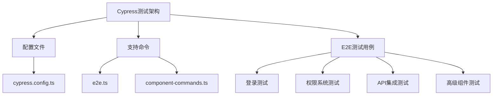
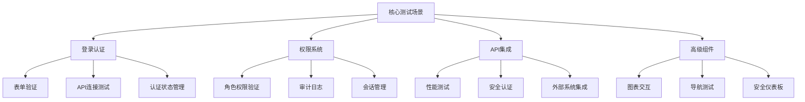
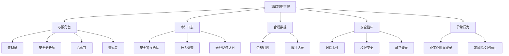
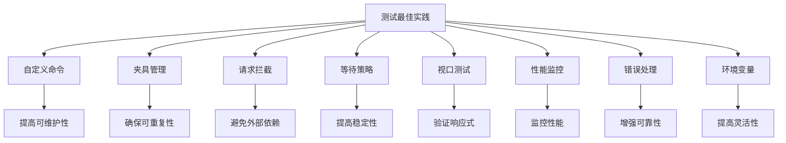

# 端到端测试

<cite>
**本文档引用的文件**  
- [cypress.config.ts](file://src/SmartAbp.Vue/cypress.config.ts)
- [e2e.ts](file://src/SmartAbp.Vue/cypress/support/e2e.ts)
- [login-test.cy.ts](file://src/SmartAbp.Vue/cypress/e2e/login-test.cy.ts)
- [permission-system.cy.ts](file://src/SmartAbp.Vue/cypress/e2e/permission-system.cy.ts)
- [api-integration.cy.ts](file://src/SmartAbp.Vue/cypress/e2e/api-integration.cy.ts)
</cite>

## 目录
1. [项目结构](#项目结构)
2. [Cypress环境配置](#cypress环境配置)
3. [核心测试场景分析](#核心测试场景分析)
4. [登录认证测试](#登录认证测试)
5. [权限系统测试](#权限系统测试)
6. [API集成测试](#api集成测试)
7. [测试数据与夹具管理](#测试数据与夹具管理)
8. [异步操作与等待策略](#异步操作与等待策略)
9. [测试报告与失败处理](#测试报告与失败处理)
10. [最佳实践与优化建议](#最佳实践与优化建议)

## 项目结构

hxlot项目的端到端测试主要集中在`src/SmartAbp.Vue/cypress`目录下，采用Cypress框架进行前端UI和后端API的完整交互测试。测试架构遵循模块化设计，包含E2E测试、支持命令和配置文件三个主要部分。



**Diagram sources**
- [cypress.config.ts](file://src/SmartAbp.Vue/cypress.config.ts)
- [e2e.ts](file://src/SmartAbp.Vue/cypress/support/e2e.ts)

**Section sources**
- [cypress.config.ts](file://src/SmartAbp.Vue/cypress.config.ts)
- [e2e.ts](file://src/SmartAbp.Vue/cypress/support/e2e.ts)

## Cypress环境配置

Cypress测试环境配置在`cypress.config.ts`文件中，包含E2E测试和组件测试的双重配置。配置文件支持环境变量注入，允许在不同部署环境中灵活调整测试参数。

```typescript
export default defineConfig({
  e2e: {
    baseUrl: process.env.CYPRESS_BASE_URL || "http://localhost:11369",
    specPattern: "cypress/e2e/**/*.cy.{js,jsx,ts,tsx}",
    supportFile: "cypress/support/e2e.ts",
    videosFolder: "cypress/videos",
    screenshotsFolder: "cypress/screenshots",
    viewportWidth: 1280,
    viewportHeight: 720,
    video: false,
    screenshotOnRunFailure: true,
    retries: {
      runMode: 2,
      openMode: 0,
    },
    env: {
      COMPONENT_TEST_MODE: true,
      PERFORMANCE_THRESHOLD_MS: 1000,
      ACCESSIBILITY_ENABLED: true,
      API_BASE_URL: process.env.CYPRESS_API_BASE_URL || "https://localhost:44379",
    },
    setupNodeEvents(on, config) {
      on("task", {
        measurePerformance: ({ name, duration }) => {
          console.log(`Performance [${name}]: ${duration}ms`)
          return null
        },
        accessibilityAudit: ({ violations }) => {
          console.log(`Accessibility violations:`, violations)
          return null
        },
      })
    },
  },
  component: {
    devServer: {
      framework: "vue",
      bundler: "vite",
    },
    specPattern: "src/**/*.cy.{js,jsx,ts,tsx}",
    supportFile: "cypress/support/component.ts",
    viewportWidth: 1280,
    viewportHeight: 720,
    video: false,
    screenshotOnRunFailure: true,
    env: {
      COMPONENT_TESTING: true,
      TDD_MODE: true,
      EXPERT_MODE: true,
    },
  },
  defaultCommandTimeout: 10000,
  requestTimeout: 10000,
  responseTimeout: 10000,
  pageLoadTimeout: 30000,
  experimentalStudio: true,
  experimentalWebKitSupport: true,
})
```

**Section sources**
- [cypress.config.ts](file://src/SmartAbp.Vue/cypress.config.ts)

## 核心测试场景分析

hxlot项目的端到端测试覆盖了多个核心业务场景，包括登录认证、权限验证、模块管理、实体建模和代码生成等。测试用例采用行为驱动开发（BDD）风格编写，确保测试的可读性和可维护性。



**Diagram sources**
- [login-test.cy.ts](file://src/SmartAbp.Vue/cypress/e2e/login-test.cy.ts)
- [permission-system.cy.ts](file://src/SmartAbp.Vue/cypress/e2e/permission-system.cy.ts)
- [api-integration.cy.ts](file://src/SmartAbp.Vue/cypress/e2e/api-integration.cy.ts)

## 登录认证测试

登录认证测试用例位于`login-test.cy.ts`文件中，全面验证了用户登录功能的各个方面，包括表单验证、API连接、认证状态管理和用户体验。

```typescript
describe("SmartAbp 登录功能测试", () => {
  beforeEach(() => {
    cy.visit("/test/login")
  })

  it("应该正确加载登录测试页面", () => {
    cy.contains("SmartAbp 登录功能测试").should("be.visible")
    cy.contains("API 连接测试").should("be.visible")
    cy.contains("用户登录测试").should("be.visible")
    cy.contains("认证状态").should("be.visible")
    cy.contains("测试日志").should("be.visible")
  })

  it("应该能够处理登录失败", () => {
    cy.contains("填入无效测试数据").click()
    cy.contains("登录测试").click()
    cy.get(".logs-container", { timeout: 10000 }).within(() => {
      cy.contains("登录失败").should("be.visible")
    })
  })

  it("应该具有响应式设计", () => {
    cy.viewport(1280, 720)
    cy.get(".login-card").should("be.visible")
    cy.viewport(768, 1024)
    cy.get(".login-card").should("be.visible")
    cy.viewport(375, 667)
    cy.get(".login-card").should("be.visible")
  })
})
```

**Section sources**
- [login-test.cy.ts](file://src/SmartAbp.Vue/cypress/e2e/login-test.cy.ts)

## 权限系统测试

权限系统测试是hxlot项目的核心测试之一，位于`permission-system.cy.ts`文件中。测试用例全面覆盖了基于角色的访问控制（RBAC）、审计日志、权限工作流和会话管理等复杂场景。

```typescript
describe("Permission System Integration - End-to-End Tests", () => {
  beforeEach(() => {
    cy.intercept("GET", "/api/auth/roles", { fixture: "permission-roles.json" }).as("getRoles")
    cy.intercept("GET", "/api/audit/logs", { fixture: "audit-logs.json" }).as("getAuditLogs")
    cy.interceptSecurityAPIs()
  })

  describe("Role-Based Access Control (RBAC)", () => {
    describe("Administrator Role Access", () => {
      beforeEach(() => {
        cy.login("admin", "admin123")
      })

      it("should have full access to security dashboard", () => {
        cy.navigateToSecurityDashboard()
        cy.waitForDashboardLoad()
        cy.verifySecurityMetrics()
        cy.verifyComplianceStatus()
        cy.verifyAbnormalBehaviorTable()
      })
    })
  })
})
```

**Section sources**
- [permission-system.cy.ts](file://src/SmartAbp.Vue/cypress/e2e/permission-system.cy.ts)

## API集成测试

API集成测试用例位于`api-integration.cy.ts`文件中，验证了前端应用与后端API的完整交互流程，包括性能测试、安全认证、外部系统集成和健康检查等。

```typescript
describe('API Integration Tests', () => {
  beforeEach(() => {
    cy.window().then((win) => {
      win.localStorage.setItem('access_token', 'test-token-123')
      win.localStorage.setItem('refresh_token', 'refresh-token-456')
    })
  })

  describe('Security and Authentication', () => {
    describe('JWT Token Validation', () => {
      it('should validate JWT token expiration', () => {
        const expiredToken = 'eyJhbGciOiJIUzI1NiIsInR5cCI6IkpXVCJ9.expired.token'
        cy.request({
          method: 'GET',
          url: `${API_BASE}/security/dashboard/metrics`,
          headers: {
            'Authorization': `Bearer ${expiredToken}`
          },
          failOnStatusCode: false
        }).then((response) => {
          expect(response.status).to.eq(401)
          expect(response.body.error).to.eq('Token Expired')
        })
      })
    })
  })
})
```

**Section sources**
- [api-integration.cy.ts](file://src/SmartAbp.Vue/cypress/e2e/api-integration.cy.ts)

## 测试数据与夹具管理

hxlot项目采用Cypress的夹具（fixtures）功能来管理测试数据，确保测试的可重复性和可靠性。测试数据存储在`cypress/fixtures`目录下，包括权限角色、审计日志、合规数据等。



**Diagram sources**
- [permission-roles.json](file://src/SmartAbp.Vue/cypress/fixtures/permission-roles.json)
- [audit-logs.json](file://src/SmartAbp.Vue/cypress/fixtures/audit-logs.json)
- [compliance-data.json](file://src/SmartAbp.Vue/cypress/fixtures/compliance-data.json)
- [security-metrics.json](file://src/SmartAbp.Vue/cypress/fixtures/security-metrics.json)
- [abnormal-behaviors.json](file://src/SmartAbp.Vue/cypress/fixtures/abnormal-behaviors.json)

## 异步操作与等待策略

hxlot项目的端到端测试采用了多种异步操作处理策略，包括显式等待、网络请求拦截和自定义命令，确保测试的稳定性和可靠性。

```typescript
// 使用cy.intercept拦截API请求
cy.intercept("GET", "/api/security/dashboard/metrics", { fixture: "security-metrics.json" }).as(
  "getMetrics",
)

// 使用cy.wait等待请求完成
cy.wait("@getMetrics")

// 使用自定义命令等待仪表板加载
Cypress.Commands.add("waitForDashboardLoad", () => {
  cy.get(".security-dashboard").should("be.visible")
  cy.get('[data-testid="dashboard-loading"]').should("not.exist")
  cy.get(".security-overview").should("be.visible")
})

// 使用cy.tick模拟时间流逝
cy.clock()
cy.tick(30 * 60 * 1000) // 30分钟
```

**Section sources**
- [e2e.ts](file://src/SmartAbp.Vue/cypress/support/e2e.ts)
- [permission-system.cy.ts](file://src/SmartAbp.Vue/cypress/e2e/permission-system.cy.ts)

## 测试报告与失败处理

hxlot项目的Cypress配置包含了完整的测试报告和失败处理机制，包括截图、视频录制、重试机制和性能测量。

```typescript
export default defineConfig({
  e2e: {
    videosFolder: "cypress/videos",
    screenshotsFolder: "cypress/screenshots",
    video: false, // 生产环境禁用视频录制以提高速度
    screenshotOnRunFailure: true,
    retries: {
      runMode: 2, // CI/CD环境中重试2次
      openMode: 0, // 开发模式中不重试
    },
    setupNodeEvents(on, config) {
      on("task", {
        measurePerformance: ({ name, duration }) => {
          console.log(`Performance [${name}]: ${duration}ms`)
          return null
        },
      })
    },
  },
})
```

**Section sources**
- [cypress.config.ts](file://src/SmartAbp.Vue/cypress.config.ts)

## 最佳实践与优化建议

基于hxlot项目的端到端测试实践，总结出以下最佳实践和优化建议：

1. **使用自定义命令**：通过Cypress.Commands.add创建可重用的自定义命令，提高测试代码的可维护性。
2. **合理使用夹具**：使用fixtures目录管理测试数据，确保测试的可重复性。
3. **网络请求拦截**：使用cy.intercept拦截API请求，避免依赖外部服务的不稳定性。
4. **适当的等待策略**：避免使用cy.wait(ms)，优先使用cy.wait("@alias")或条件等待。
5. **视口测试**：使用cy.viewport测试不同设备尺寸下的响应式设计。
6. **性能监控**：在关键流程中添加性能测量任务，监控应用性能。
7. **错误处理**：为关键操作添加错误处理和重试机制，提高测试稳定性。
8. **环境变量**：使用环境变量配置不同环境的测试参数，提高测试的灵活性。



**Diagram sources**
- [e2e.ts](file://src/SmartAbp.Vue/cypress/support/e2e.ts)
- [cypress.config.ts](file://src/SmartAbp.Vue/cypress.config.ts)