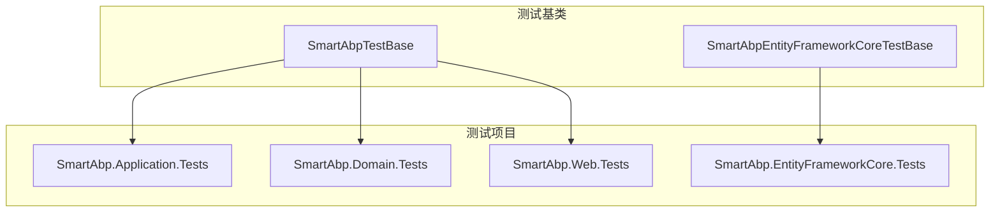
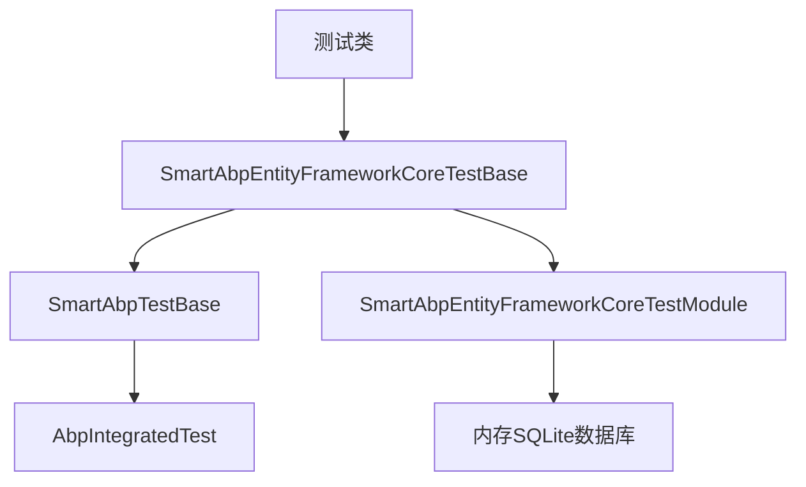
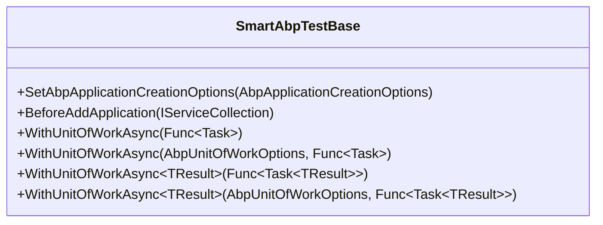
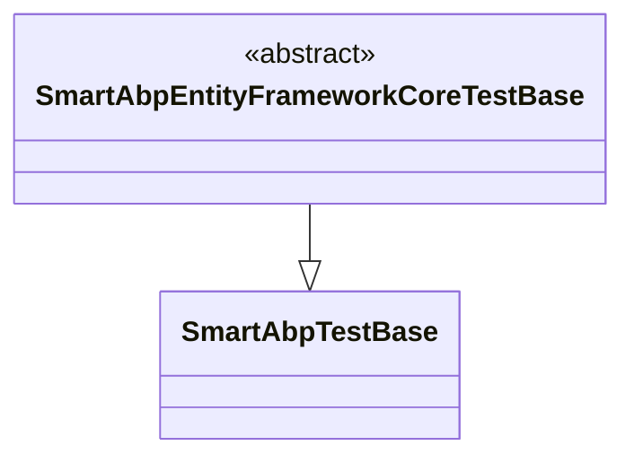
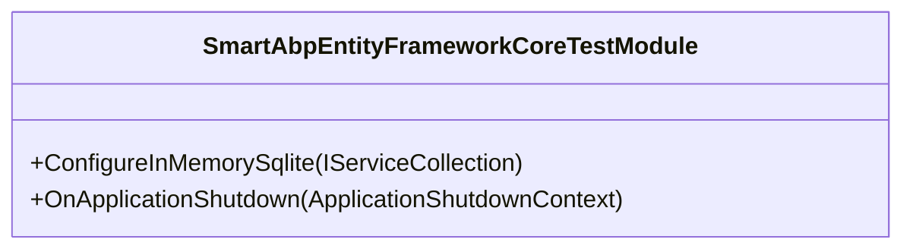
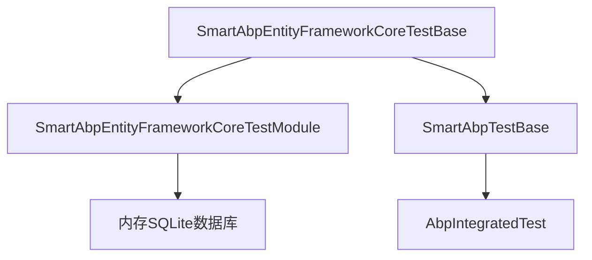

# 集成测试

<cite>
**本文档引用的文件**  
- [SmartAbpEntityFrameworkCoreTestBase.cs](file://src/tests/backend/SmartAbp.EntityFrameworkCore.Tests/EntityFrameworkCore/SmartAbpEntityFrameworkCoreTestBase.cs)
- [SmartAbpDbContext.cs](file://src/SmartAbp.EntityFrameworkCore/EntityFrameworkCore/SmartAbpDbContext.cs)
- [SmartAbpEntityFrameworkCoreTestModule.cs](file://src/tests/backend/SmartAbp.EntityFrameworkCore.Tests/EntityFrameworkCore/SmartAbpEntityFrameworkCoreTestModule.cs)
- [SmartAbpTestBase.cs](file://src/tests/backend/SmartAbp.TestBase/SmartAbpTestBase.cs)
- [SmartAbpApplicationModule.cs](file://src/SmartAbp.Application/SmartAbpApplicationModule.cs)
- [Phase1IntegrationTests.cs](file://src/tests/backend/SmartAbp.Application.Tests/Integration/Phase1IntegrationTests.cs)
- [CodeGenerationAppService.cs](file://src/SmartAbp.CodeGenerator/Services/CodeGenerationAppService.cs)
- [test-permission-system-generation.js](file://test/权限管理系统生成测试.js)
- [test-database-adapter.cs](file://test-database-adapter.cs)
</cite>

## 目录
1. [引言](#引言)
2. [项目结构](#项目结构)
3. [核心组件](#核心组件)
4. [架构概述](#架构概述)
5. [详细组件分析](#详细组件分析)
6. [依赖分析](#依赖分析)
7. [性能考虑](#性能考虑)
8. [故障排除指南](#故障排除指南)
9. [结论](#结论)

## 引言
本文档详细阐述了hxlot项目中集成测试的实现策略，重点涵盖跨层组件的集成测试方法，包括应用服务、领域层和数据访问层的协同工作。文档介绍了如何使用`SmartAbpEntityFrameworkCoreTestBase`进行数据库集成测试，展示了从模块创建到代码输出验证的全流程集成测试案例。同时，提供了多数据库适配（SQL Server、PostgreSQL）的测试策略，并包含了测试数据隔离、事务管理和测试清理的最佳实践。最后，文档解释了如何验证生成的前后端代码的正确性和完整性。

## 项目结构
hxlot项目的集成测试主要集中在`src/tests/backend`目录下，该目录包含了多个测试项目，如`SmartAbp.Application.Tests`、`SmartAbp.Domain.Tests`、`SmartAbp.EntityFrameworkCore.Tests`等。这些测试项目分别针对应用层、领域层和数据访问层进行测试。测试基类`SmartAbpTestBase`和`SmartAbpEntityFrameworkCoreTestBase`位于`SmartAbp.TestBase`和`SmartAbp.EntityFrameworkCore.Tests`项目中，为其他测试类提供基础支持。

**图表来源**
- [SmartAbpTestBase.cs](file://src/tests/backend/SmartAbp.TestBase/SmartAbpTestBase.cs)
- [SmartAbpEntityFrameworkCoreTestBase.cs](file://src/tests/backend/SmartAbp.EntityFrameworkCore.Tests/EntityFrameworkCore/SmartAbpEntityFrameworkCoreTestBase.cs)

**章节来源**
- [SmartAbpTestBase.cs](file://src/tests/backend/SmartAbp.TestBase/SmartAbpTestBase.cs)
- [SmartAbpEntityFrameworkCoreTestBase.cs](file://src/tests/backend/SmartAbp.EntityFrameworkCore.Tests/EntityFrameworkCore/SmartAbpEntityFrameworkCoreTestBase.cs)

## 核心组件
集成测试的核心组件包括`SmartAbpTestBase`、`SmartAbpEntityFrameworkCoreTestBase`和`SmartAbpEntityFrameworkCoreTestModule`。`SmartAbpTestBase`是所有集成测试的基类，提供了配置服务、管理事务和执行单元工作的方法。`SmartAbpEntityFrameworkCoreTestBase`继承自`SmartAbpTestBase`，专门用于数据库集成测试。`SmartAbpEntityFrameworkCoreTestModule`是测试模块，配置了内存数据库和相关服务。

**章节来源**
- [SmartAbpTestBase.cs](file://src/tests/backend/SmartAbp.TestBase/SmartAbpTestBase.cs)
- [SmartAbpEntityFrameworkCoreTestBase.cs](file://src/tests/backend/SmartAbp.EntityFrameworkCore.Tests/EntityFrameworkCore/SmartAbpEntityFrameworkCoreTestBase.cs)
- [SmartAbpEntityFrameworkCoreTestModule.cs](file://src/tests/backend/SmartAbp.EntityFrameworkCore.Tests/EntityFrameworkCore/SmartAbpEntityFrameworkCoreTestModule.cs)

## 架构概述
hxlot项目的集成测试架构基于ABP框架的集成测试机制，使用内存数据库进行测试，确保测试的隔离性和可重复性。测试基类`SmartAbpTestBase`通过`AbpIntegratedTest<TStartupModule>`提供集成测试支持，`SmartAbpEntityFrameworkCoreTestBase`在此基础上进一步配置了内存SQLite数据库。测试模块`SmartAbpEntityFrameworkCoreTestModule`负责配置数据库连接和相关服务。

**图表来源**
- [SmartAbpTestBase.cs](file://src/tests/backend/SmartAbp.TestBase/SmartAbpTestBase.cs)
- [SmartAbpEntityFrameworkCoreTestBase.cs](file://src/tests/backend/SmartAbp.EntityFrameworkCore.Tests/EntityFrameworkCore/SmartAbpEntityFrameworkCoreTestBase.cs)
- [SmartAbpEntityFrameworkCoreTestModule.cs](file://src/tests/backend/SmartAbp.EntityFrameworkCore.Tests/EntityFrameworkCore/SmartAbpEntityFrameworkCoreTestModule.cs)

## 详细组件分析
### SmartAbpTestBase 分析
`SmartAbpTestBase`是所有集成测试的基类，提供了配置服务、管理事务和执行单元工作的方法。它通过`SetAbpApplicationCreationOptions`方法配置使用Autofac作为依赖注入容器，并通过`BeforeAddApplication`方法配置配置服务。`WithUnitOfWorkAsync`方法用于在事务中执行操作。

**图表来源**
- [SmartAbpTestBase.cs](file://src/tests/backend/SmartAbp.TestBase/SmartAbpTestBase.cs)

### SmartAbpEntityFrameworkCoreTestBase 分析
`SmartAbpEntityFrameworkCoreTestBase`继承自`SmartAbpTestBase`，专门用于数据库集成测试。它通过继承`SmartAbpEntityFrameworkCoreTestModule`来配置内存数据库和相关服务。

**图表来源**
- [SmartAbpEntityFrameworkCoreTestBase.cs](file://src/tests/backend/SmartAbp.EntityFrameworkCore.Tests/EntityFrameworkCore/SmartAbpEntityFrameworkCoreTestBase.cs)

### SmartAbpEntityFrameworkCoreTestModule 分析
`SmartAbpEntityFrameworkCoreTestModule`是测试模块，配置了内存数据库和相关服务。它通过`ConfigureInMemorySqlite`方法配置内存SQLite数据库，并通过`OnApplicationShutdown`方法在应用关闭时释放数据库连接。

**图表来源**
- [SmartAbpEntityFrameworkCoreTestModule.cs](file://src/tests/backend/SmartAbp.EntityFrameworkCore.Tests/EntityFrameworkCore/SmartAbpEntityFrameworkCoreTestModule.cs)

**章节来源**
- [SmartAbpEntityFrameworkCoreTestModule.cs](file://src/tests/backend/SmartAbp.EntityFrameworkCore.Tests/EntityFrameworkCore/SmartAbpEntityFrameworkCoreTestModule.cs)

## 依赖分析
集成测试的依赖关系主要体现在测试基类和测试模块之间的依赖。`SmartAbpEntityFrameworkCoreTestBase`依赖于`SmartAbpEntityFrameworkCoreTestModule`来配置内存数据库和相关服务。`SmartAbpTestBase`依赖于ABP框架的`AbpIntegratedTest<TStartupModule>`来提供集成测试支持。

**图表来源**
- [SmartAbpEntityFrameworkCoreTestBase.cs](file://src/tests/backend/SmartAbp.EntityFrameworkCore.Tests/EntityFrameworkCore/SmartAbpEntityFrameworkCoreTestBase.cs)
- [SmartAbpEntityFrameworkCoreTestModule.cs](file://src/tests/backend/SmartAbp.EntityFrameworkCore.Tests/EntityFrameworkCore/SmartAbpEntityFrameworkCoreTestModule.cs)
- [SmartAbpTestBase.cs](file://src/tests/backend/SmartAbp.TestBase/SmartAbpTestBase.cs)

**章节来源**
- [SmartAbpEntityFrameworkCoreTestBase.cs](file://src/tests/backend/SmartAbp.EntityFrameworkCore.Tests/EntityFrameworkCore/SmartAbpEntityFrameworkCoreTestBase.cs)
- [SmartAbpEntityFrameworkCoreTestModule.cs](file://src/tests/backend/SmartAbp.EntityFrameworkCore.Tests/EntityFrameworkCore/SmartAbpEntityFrameworkCoreTestModule.cs)
- [SmartAbpTestBase.cs](file://src/tests/backend/SmartAbp.TestBase/SmartAbpTestBase.cs)

## 性能考虑
集成测试使用内存数据库，确保了测试的快速执行和隔离性。`SmartAbpEntityFrameworkCoreTestModule`通过`ConfigureInMemorySqlite`方法配置内存SQLite数据库，避免了外部数据库的依赖，提高了测试的可重复性和执行速度。

## 故障排除指南
在进行集成测试时，可能会遇到数据库连接问题、事务管理问题或测试数据隔离问题。建议使用内存数据库进行测试，确保测试的隔离性和可重复性。同时，确保测试类正确继承`SmartAbpEntityFrameworkCoreTestBase`，并正确配置测试模块。

**章节来源**
- [SmartAbpEntityFrameworkCoreTestBase.cs](file://src/tests/backend/SmartAbp.EntityFrameworkCore.Tests/EntityFrameworkCore/SmartAbpEntityFrameworkCoreTestBase.cs)
- [SmartAbpEntityFrameworkCoreTestModule.cs](file://src/tests/backend/SmartAbp.EntityFrameworkCore.Tests/EntityFrameworkCore/SmartAbpEntityFrameworkCoreTestModule.cs)

## 结论
hxlot项目的集成测试通过`SmartAbpTestBase`和`SmartAbpEntityFrameworkCoreTestBase`提供了强大的支持，确保了跨层组件的协同工作。使用内存数据库进行测试，保证了测试的隔离性和可重复性。通过合理的依赖管理和事务管理，确保了测试的稳定性和可靠性。