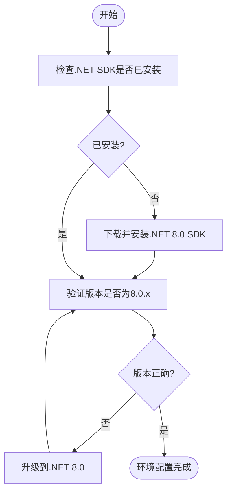
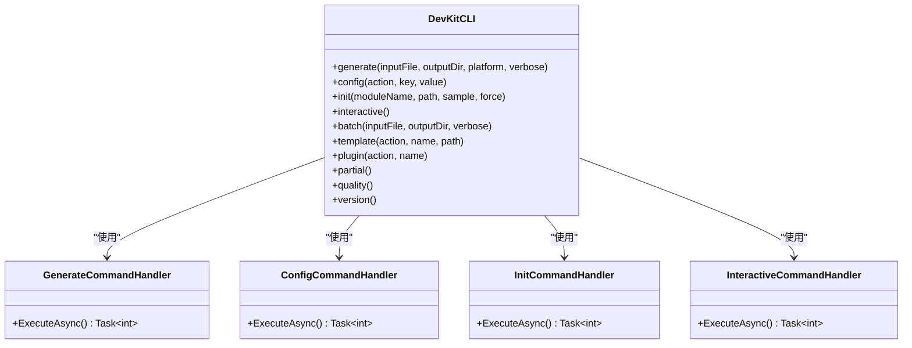
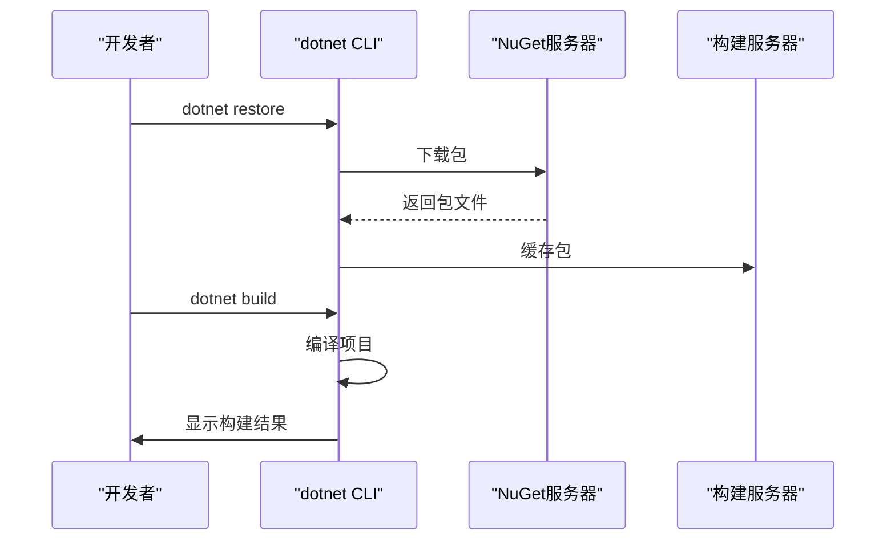
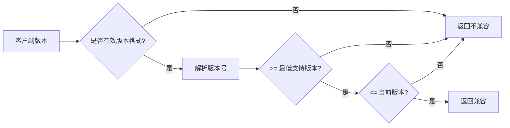

# .NET开发环境配置

<cite>
**本文档引用文件**  
- [README.md](file://README.md)
- [NuGet.Config](file://NuGet.Config)
- [src/SmartAbp.DevKit.Cli/Program.cs](file://src/SmartAbp.DevKit.Cli/Program.cs)
- [src/SmartAbp.Vue/vite.config.ts](file://src/SmartAbp.Vue/vite.config.ts)
- [scripts/database/verify-database-config.sh](file://scripts/database/verify-database-config.sh)
- [scripts/quality/utils/environment-checker.js](file://scripts/quality/utils/environment-checker.js)
- [src/SmartAbp.CodeGenerator/Services/SolutionIntegrationService.cs](file://src/SmartAbp.CodeGenerator/Services/SolutionIntegrationService.cs)
- [src/SmartAbp.CodeGenerator/Services/CICDTemplateService.cs](file://src/SmartAbp.CodeGenerator/Services/CICDTemplateService.cs)
- [src/SmartAbp.Application/LowCode/Services/SchemaVersionService.cs](file://src/SmartAbp.Application/LowCode/Services/SchemaVersionService.cs)
</cite>

## 目录
1. [简介](#简介)
2. [项目结构](#项目结构)
3. [.NET SDK安装与验证](#net-sdk安装与验证)
4. global.json文件作用说明
5. [开发工具配置](#开发工具配置)
6. [ABP CLI工具使用](#abp-cli工具使用)
7. [NuGet包恢复](#nuget包恢复)
8. [项目编译与调试](#项目编译与调试)
9. [常见问题解决方案](#常见问题解决方案)
10. [附录](#附录)

## 简介
hxlot项目是一个基于ABP vNext框架的企业级应用，集成了Vue.js作为前端SPA（单页应用）。项目采用前后端分离架构，提供了完整的开发、构建和部署解决方案。本指南详细说明了如何配置.NET开发环境，包括SDK安装、工具使用、项目构建等关键步骤。

## 项目结构
项目采用模块化设计，主要包含以下目录：
- **src**: 源代码目录，包含SmartAbp.Web、SmartAbp.Vue等核心项目
- **scripts**: 各类脚本文件，包括数据库、质量检查、测试等
- **config**: 配置文件目录
- **tools**: 开发工具和分析工具
- **templates**: 代码模板目录

**Section sources**
- [README.md](file://README.md)

## .NET SDK安装与验证
### SDK版本要求
根据项目配置，推荐安装.NET 8.0或更高版本。项目中的CI/CD配置明确指定了8.0.x版本。

### 安装步骤
1. 访问[.NET官网](https://dot.net)下载并安装.NET 8.0 SDK
2. 安装完成后，打开命令行工具验证安装

### 版本验证
使用以下命令验证.NET SDK版本：
```bash
dotnet --version
```
预期输出应为8.0.x版本号。项目中的环境检查脚本会自动检测.NET版本并给出相应提示。



**Diagram sources**
- [scripts/quality/utils/environment-checker.js](file://scripts/quality/utils/environment-checker.js)
- [scripts/database/verify-database-config.sh](file://scripts/database/verify-database-config.sh)

**Section sources**
- [scripts/quality/utils/environment-checker.js](file://scripts/quality/utils/environment-checker.js)
- [scripts/database/verify-database-config.sh](file://scripts/database/verify-database-config.sh)

## global.json文件作用说明
虽然项目中未直接发现global.json文件，但根据ABP项目惯例和.NET开发最佳实践，global.json用于锁定SDK版本，确保团队成员使用统一的开发环境。

### 主要功能
1. **SDK版本约束**: 指定项目使用的.NET SDK版本，避免因版本差异导致的构建问题
2. **工具版本管理**: 可以指定dotnet工具的版本
3. **构建一致性**: 确保所有开发人员和CI/CD环境使用相同的SDK版本

### 配置示例
```json
{
  "sdk": {
    "version": "8.0.100",
    "rollForward": "latestPatch"
  }
}
```

## 开发工具配置
### Visual Studio 2022配置
1. 安装Visual Studio 2022并确保包含.NET 8.0开发工作负载
2. 打开SmartAbp.sln解决方案文件
3. 配置启动项目为SmartAbp.Web
4. 设置调试环境为IIS Express或Kestrel

### VS Code配置
1. 安装C#扩展（由Microsoft提供）
2. 安装NuGet Package Manager扩展
3. 配置launch.json用于调试
4. 使用集成终端进行dotnet命令操作

### 前端开发服务器配置
在src/SmartAbp.Vue/vite.config.ts中配置了开发服务器：
- 端口：9001
- 代理：将API请求代理到后端服务（https://localhost:9002）
- 构建输出：指向SmartAbp.Web/wwwroot/dist

**Section sources**
- [src/SmartAbp.Vue/vite.config.ts](file://src/SmartAbp.Vue/vite.config.ts)
- [README.md](file://README.md)

## ABP CLI工具使用
### 工具安装
项目包含自定义的DevKit CLI工具，位于src/SmartAbp.DevKit.Cli目录。该工具基于System.CommandLine构建，提供了一系列代码生成和管理命令。

### 主要命令
- **generate**: 生成代码
- **config**: 配置管理
- **init**: 初始化项目
- **interactive**: 交互式代码生成
- **batch**: 批量生成实体
- **template**: 模板管理
- **plugin**: 插件管理
- **partial**: Partial类管理
- **quality**: 质量门禁检查
- **version**: 显示版本信息

### 使用示例
```bash
# 生成代码
dotnet run --project src/SmartAbp.DevKit.Cli -- generate -i input.json -o ./output -p web

# 交互式生成
dotnet run --project src/SmartAbp.DevKit.Cli -- interactive

# 查看版本
dotnet run --project src/SmartAbp.DevKit.Cli -- version
```



**Diagram sources**
- [src/SmartAbp.DevKit.Cli/Program.cs](file://src/SmartAbp.DevKit.Cli/Program.cs)

**Section sources**
- [src/SmartAbp.DevKit.Cli/Program.cs](file://src/SmartAbp.DevKit.Cli/Program.cs)

## NuGet包恢复
### 包源配置
项目根目录下的NuGet.Config文件配置了包源映射和警告处理策略：
```xml
<configuration>
  <packageSourceMapping>
    <!-- 开发期间禁用漏洞警告作为错误 -->
  </packageSourceMapping>
  <config>
    <add key="TreatWarningsAsErrors" value="false" />
  </config>
</configuration>
```

### 恢复依赖
使用以下命令恢复所有项目的NuGet包：
```bash
dotnet restore
```
此命令会读取所有.csproj文件并下载所需的NuGet包。项目中的CI/CD配置也包含了restore步骤。

**Section sources**
- [NuGet.Config](file://NuGet.Config)
- [src/SmartAbp.CodeGenerator/Services/GitOpsWorkflowService.cs](file://src/SmartAbp.CodeGenerator/Services/GitOpsWorkflowService.cs)

## 项目编译与调试
### 编译流程
1. 恢复NuGet包：`dotnet restore`
2. 构建项目：`dotnet build -c Release`
3. 运行质量检查：`dotnet format --verify-no-changes`

### 调试配置
#### 后端调试
1. 在Visual Studio中设置SmartAbp.Web为启动项目
2. 配置appsettings.json中的连接字符串
3. 启动调试（F5）

#### 前端调试
1. 启动后端服务
2. 在另一个终端中启动前端开发服务器：
```bash
cd src/SmartAbp.Vue
npm run dev
```
3. 访问https://localhost:44300进行集成调试

### CI/CD集成
项目中的CICD模板服务生成了Azure DevOps和GitLab CI配置，均包含以下阶段：
- Build: 使用UseDotNet@2任务指定8.0.x版本
- Restore: 执行dotnet restore
- Build: 执行dotnet build --configuration Release
- Test: 执行dotnet test（可选）



**Diagram sources**
- [src/SmartAbp.CodeGenerator/Services/CICDTemplateService.cs](file://src/SmartAbp.CodeGenerator/Services/CICDTemplateService.cs)
- [src/SmartAbp.CodeGenerator/Services/GitOpsWorkflowService.cs](file://src/SmartAbp.CodeGenerator/Services/GitOpsWorkflowService.cs)

**Section sources**
- [src/SmartAbp.CodeGenerator/Services/SolutionIntegrationService.cs](file://src/SmartAbp.CodeGenerator/Services/SolutionIntegrationService.cs)
- [src/SmartAbp.CodeGenerator/Services/CICDTemplateService.cs](file://src/SmartAbp.CodeGenerator/Services/CICDTemplateService.cs)

## 常见问题解决方案
### SDK版本不匹配
**问题**: 开发环境中的.NET SDK版本与项目要求不符
**解决方案**:
1. 使用`dotnet --list-sdks`查看已安装的SDK
2. 安装指定版本的.NET 8.0 SDK
3. 在项目根目录创建global.json文件锁定版本

### NuGet源配置错误
**问题**: 无法恢复NuGet包，出现源错误
**解决方案**:
1. 检查NuGet.Config文件配置
2. 使用`dotnet nuget list source`查看当前源
3. 使用`dotnet nuget add source`添加缺失的源
4. 清除本地缓存：`dotnet nuget locals all --clear`

### 项目引用问题
**问题**: 项目间引用无法正确解析
**解决方案**:
1. 使用SolutionIntegrationService中的方法添加项目引用
2. 确保所有项目都已添加到解决方案文件中
3. 使用`dotnet sln add`命令手动添加项目

### 版本兼容性问题
项目中实现了版本兼容性检查机制，用于验证客户端版本是否与服务端兼容：
- 客户端版本必须 >= 最低支持版本
- 客户端版本必须 <= 当前版本



**Diagram sources**
- [src/SmartAbp.Application/LowCode/Services/SchemaVersionService.cs](file://src/SmartAbp.Application/LowCode/Services/SchemaVersionService.cs)

**Section sources**
- [src/SmartAbp.Application/LowCode/Services/SchemaVersionService.cs](file://src/SmartAbp.Application/LowCode/Services/SchemaVersionService.cs)

## 附录
### 快速启动脚本
项目提供了多种启动方式：
- **Windows批处理**: `./start-dev.bat`
- **PowerShell**: `./start-dev.ps1`
- **手动启动**: 分别启动后端和前端服务

### 访问地址
- **后端API**: https://localhost:44300
- **前端开发服务器**: http://localhost:9001
- **集成访问**: https://localhost:44300

### 文档参考
- [README.md](file://README.md): 项目主文档
- [doc/](file://doc/): 详细设计文档
- [scripts/](file://scripts/): 各类实用脚本