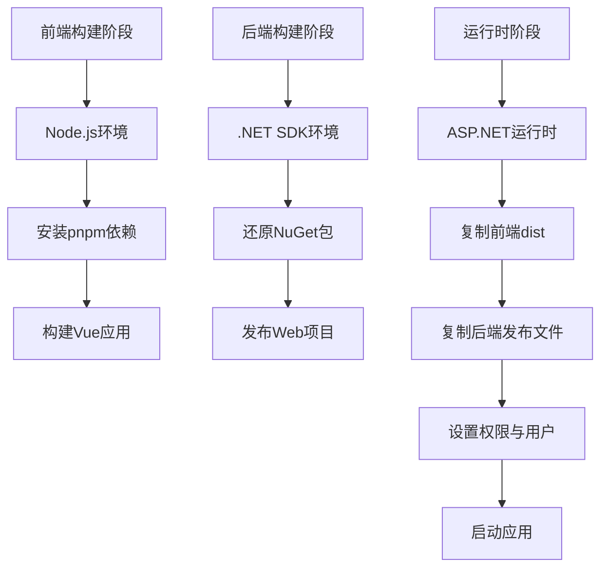
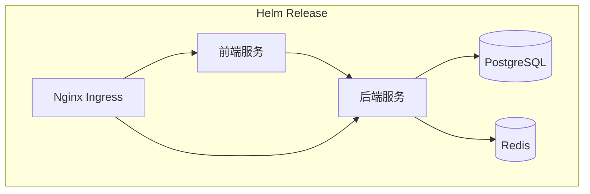

# 容器化部署环境配置

<cite>
**本文档引用文件**  
- [docker-compose.yml](file://docker-compose.yml)
- [docker-compose.dev.yml](file://docker-compose.dev.yml)
- [Dockerfile](file://Dockerfile)
- [deployment/k8s/helm/smartabp/Chart.yaml](file://deployment/k8s/helm/smartabp/Chart.yaml)
- [deployment/k8s/helm/smartabp/values.yaml](file://deployment/k8s/helm/smartabp/values.yaml)
- [scripts/dev/start-dev.bat](file://scripts/dev/start-dev.bat)
- [scripts/dev/start-dev-simple.bat](file://scripts/dev/start-dev-simple.bat)
</cite>

## 目录
1. [简介](#简介)
2. [开发环境启动配置](#开发环境启动配置)
3. [Docker多阶段构建与镜像优化](#docker多阶段构建与镜像优化)
4. [Helm Chart部署配置](#helm-chart部署配置)
5. [开发脚本执行流程](#开发脚本执行流程)
6. [Kubernetes开发环境搭建](#kubernetes开发环境搭建)
7. [常见问题与解决方案](#常见问题与解决方案)
8. [总结](#总结)

## 简介
hxlot项目采用现代化容器化部署架构，支持本地Docker开发、Kubernetes生产部署及自动化脚本管理。本文档详细说明容器化环境的配置方法，涵盖Docker Compose、多阶段构建、Helm Chart及开发脚本等内容，为开发与运维提供完整指导。

## 开发环境启动配置

### docker-compose.yml 生产环境配置
`docker-compose.yml`定义了生产级容器编排方案，包含Web应用、数据库、缓存、搜索引擎及监控组件。该配置采用企业级安全策略，如密码加密、资源限制和健康检查机制。

**核心服务配置：**
- **smartabp-web**：基于Dockerfile构建，映射8080端口，依赖数据库与缓存服务
- **sqlserver**：使用SQL Server 2022镜像，持久化数据卷
- **redis**：配置密码保护，用于会话缓存
- **elasticsearch**：单节点集群，关闭安全认证以提升开发效率
- **nginx**：反向代理，支持HTTPS与SSL证书挂载
- **prometheus & grafana**：集成监控系统，可视化应用性能指标

**网络与存储：**
- 自定义桥接网络 `smartabp-network`，子网为 `172.20.0.0/16`
- 多个本地数据卷用于持久化数据库、日志和上传文件

**Section sources**
- [docker-compose.yml](file://docker-compose.yml#L1-L175)

### docker-compose.dev.yml 开发环境配置
`docker-compose.dev.yml`专为开发环境设计，包含调试与管理工具，提升开发效率。

**开发专用服务：**
- **开发数据库**：sqlserver-dev，端口映射为1434，便于与生产环境隔离
- **Redis Commander**：图形化Redis管理界面，运行于8083端口
- **pgAdmin**：数据库管理工具，支持多数据库连接
- **Mailhog**：邮件测试工具，捕获并展示应用发送的邮件
- **MinIO**：对象存储模拟器，兼容S3 API
- **Jaeger**：分布式链路追踪系统，用于性能分析

**资源优化：**
- Elasticsearch内存限制为256MB，适应开发机资源
- 所有服务使用独立数据卷，避免环境冲突

**Section sources**
- [docker-compose.dev.yml](file://docker-compose.dev.yml#L1-L190)

## Docker多阶段构建与镜像优化

### 多阶段构建策略
`Dockerfile`采用三阶段构建策略，分离前端构建、后端构建与运行时环境，显著减小最终镜像体积。



**Diagram sources**
- [Dockerfile](file://Dockerfile#L1-L80)

### 镜像优化技巧
1. **基础镜像选择**：使用Alpine版本镜像（如`node:18-alpine`、`redis:7-alpine`）减小体积
2. **分层缓存**：依赖文件提前复制，利用Docker缓存机制加速构建
3. **权限安全**：创建专用用户`smartabp`，避免以root运行容器
4. **健康检查**：配置HTTP健康检查，确保Kubernetes正确识别服务状态
5. **环境变量注入**：通过ENV指令设置运行时配置，支持环境差异化部署

**Section sources**
- [Dockerfile](file://Dockerfile#L1-L80)

## Helm Chart部署配置

### Chart.yaml 基础信息
`Chart.yaml`定义Helm Chart元数据，包含名称、版本、维护者及依赖项。

**关键配置：**
- **名称**：smartabp-lowcode-engine
- **版本**：1.0.0
- **依赖**：Bitnami提供的PostgreSQL和Redis Chart
- **维护者**：SmartAbp Team

**Section sources**
- [deployment/k8s/helm/smartabp/Chart.yaml](file://deployment/k8s/helm/smartabp/Chart.yaml#L1-L47)

### values.yaml 企业级配置
`values.yaml`提供细粒度的Kubernetes部署配置，支持生产环境的高可用与安全性。

**核心配置模块：**

#### 前端服务配置
- **副本数**：3个Pod，支持高可用
- **资源限制**：CPU 500m，内存512Mi
- **自动伸缩**：基于CPU和内存使用率动态调整
- **安全上下文**：非root用户运行，禁用特权模式
- **Ingress**：配置TLS终止与Nginx重写规则

#### 后端服务配置
- **数据库连接**：指向PostgreSQL服务，使用加密密码
- **健康探针**：60秒初始延迟，避免启动失败
- **环境变量**：明确设置生产环境与CORS策略

#### 数据库与缓存
- **PostgreSQL**：20Gi持久化存储，每日备份
- **Redis**：768MB内存限制，LRU淘汰策略

#### 监控与安全
- **Prometheus ServiceMonitor**：启用指标采集
- **网络策略**：默认启用，限制Pod间通信
- **RBAC**：创建服务账户与角色绑定



**Diagram sources**
- [deployment/k8s/helm/smartabp/values.yaml](file://deployment/k8s/helm/smartabp/values.yaml#L1-L472)

**Section sources**
- [deployment/k8s/helm/smartabp/values.yaml](file://deployment/k8s/helm/smartabp/values.yaml#L1-L472)

## 开发脚本执行流程

### start-dev.bat 详细启动流程
`start-dev.bat`为Windows平台提供的完整开发启动脚本，具备环境检测与用户提示功能。

**执行流程：**
1. 设置项目根目录路径
2. 验证后端（SmartAbp.Web）与前端（SmartAbp.Vue）目录存在
3. 检查.NET和Node.js环境
4. 若前端依赖未安装，则自动执行`npm install`
5. 分别启动后端（dotnet run）和前端（npm run dev）服务
6. 提供访问地址与默认登录信息

**用户友好特性：**
- 彩色输出与图标提示
- 错误处理与下载链接指引
- 启动后显示完整使用说明

**Section sources**
- [scripts/dev/start-dev.bat](file://scripts/dev/start-dev.bat#L1-L105)

### start-dev-simple.bat 简化启动流程
`start-dev-simple.bat`为轻量级启动脚本，适用于快速调试。

**执行流程：**
1. 清理9001和9002端口占用进程
2. 启动后端服务，监听9002端口
3. 5秒延迟后启动前端服务，监听9001端口
4. 显示访问地址

**适用场景：**
- 快速验证代码变更
- CI/CD流水线中的自动化测试
- 资源受限环境

**Section sources**
- [scripts/dev/start-dev-simple.bat](file://scripts/dev/start-dev-simple.bat#L1-L25)

## Kubernetes开发环境搭建

### 部署步骤
1. **安装Helm**：确保Helm 3已安装并配置仓库
2. **准备集群**：确保Kubernetes集群可用，kubectl已配置
3. **部署依赖**：
   ```bash
   helm repo add bitnami https://charts.bitnami.com/bitnami
   ```
4. **部署SmartAbp**：
   ```bash
   helm install smartabp ./deployment/k8s/helm/smartabp
   ```
5. **验证部署**：
   ```bash
   kubectl get pods -l app=smartabp
   kubectl port-forward svc/smartabp-frontend 8080:80
   ```

### 开发模式配置
在`values.yaml`中启用开发模式：
```yaml
development:
  enabled: true
  debug:
    enabled: true
```

此配置将：
- 禁用部分生产级安全策略
- 启用调试端口暴露
- 增加日志级别

## 常见问题与解决方案

### 镜像拉取失败
**现象**：`Failed to pull image`  
**解决方案**：
1. 检查Docker Hub网络连接
2. 配置镜像加速器（如阿里云）
3. 使用`global.imageRegistry`指定私有仓库
4. 手动拉取镜像：`docker pull mcr.microsoft.com/mssql/server:2022-latest`

### 容器启动异常
**现象**：容器反复重启  
**排查步骤**：
1. 查看日志：`docker logs <container_name>`
2. 检查端口占用：`netstat -ano | findstr :<port>`
3. 验证数据库连接字符串
4. 确保数据卷权限正确

### 数据库初始化失败
**解决方案**：
1. 清除数据卷：`docker-compose down -v`
2. 重新启动：`docker-compose up`
3. 检查`SmartAbp.DbMigrator`是否正确执行迁移

### 前端无法访问后端API
**原因**：CORS配置或代理问题  
**解决方案**：
1. 检查`App__CorsOrigins`配置
2. 确保开发环境API地址正确
3. 在`start-dev.bat`中验证端口映射

## 总结
hxlot项目提供了完整的容器化部署解决方案，从本地开发到生产环境均有详细配置。通过Docker Compose实现本地环境快速搭建，利用Helm Chart实现Kubernetes的标准化部署，配合多阶段构建优化镜像性能。开发脚本进一步简化了启动流程，提升了开发效率。建议在生产环境中根据实际资源情况调整`values.yaml`中的资源限制与副本数，确保系统稳定运行。