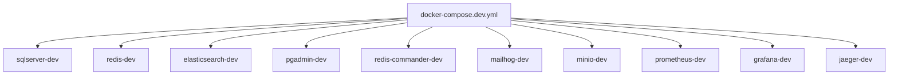
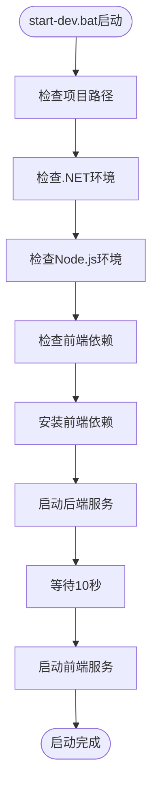
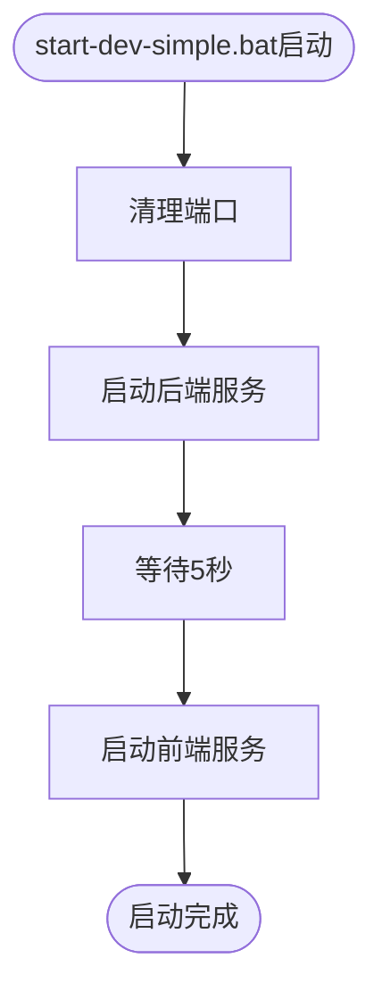

# 环境搭建

<cite>
**本文档引用的文件**  
- [docker-compose.dev.yml](file://docker-compose.dev.yml)
- [start-dev.bat](file://scripts/dev/start-dev.bat)
- [start-dev-simple.bat](file://scripts/dev/start-dev-simple.bat)
- [clean-ports.ps1](file://scripts/dev/clean-ports.ps1)
- [README.md](file://scripts/database/README.md)
- [CROSS-PLATFORM-DATABASE-GUIDE.md](file://scripts/database/CROSS-PLATFORM-DATABASE-GUIDE.md)
</cite>

## 目录
1. [开发环境依赖安装](#开发环境依赖安装)
2. [开发数据库容器配置](#开发数据库容器配置)
3. [开发启动脚本解析](#开发启动脚本解析)
4. [环境变量与端口配置](#环境变量与端口配置)
5. [跨平台差异化配置](#跨平台差异化配置)
6. [常见问题诊断与修复](#常见问题诊断与修复)

## 开发环境依赖安装

### .NET 8 SDK 安装
hxlot项目基于.NET 8构建，需安装.NET 8 SDK。安装步骤如下：
1. 访问 [.NET 下载页面](https://dotnet.microsoft.com/download)
2. 选择对应操作系统的.NET 8 SDK版本
3. 下载并运行安装程序
4. 验证安装：在终端执行 `dotnet --version`，应返回8.0.x版本号

### Node.js 18+ 安装
前端使用Vue.js框架，需Node.js 18或更高版本。安装步骤如下：
1. 访问 [Node.js 官网](https://nodejs.org/)
2. 下载LTS版本（建议18.x或更高）
3. 运行安装程序并完成安装
4. 验证安装：在终端执行 `node --version` 和 `npm --version`

### pnpm 包管理器安装
项目使用pnpm作为包管理器，安装命令如下：
```bash
npm install -g pnpm
```
验证安装：执行 `pnpm --version` 检查版本信息。

### Docker Desktop 安装
开发数据库通过Docker容器管理，需安装Docker Desktop：
1. 访问 [Docker 官网](https://www.docker.com/products/docker-desktop)
2. 下载并安装对应操作系统的Docker Desktop
3. 启动Docker Desktop并确保服务正常运行
4. 验证安装：执行 `docker --version` 和 `docker-compose --version`

**Section sources**
- [README.md](file://README.md#L100-L120)

## 开发数据库容器配置

### docker-compose.dev.yml 配置解析
`docker-compose.dev.yml` 文件定义了开发环境所需的多个服务容器，包括数据库、缓存、搜索和监控组件。



**Diagram sources**
- [docker-compose.dev.yml](file://docker-compose.dev.yml#L1-L191)

### 启动开发数据库服务
使用以下命令启动所有开发数据库服务：
```bash
docker-compose -f docker-compose.dev.yml up -d
```
该命令将以后台模式启动所有定义的服务容器。

### 数据库服务详情
| 服务名称 | 端口映射 | 用途 |
|--------|--------|------|
| sqlserver-dev | 1434:1433 | SQL Server开发数据库 |
| redis-dev | 6380:6379 | Redis缓存服务 |
| elasticsearch-dev | 9201:9200 | Elasticsearch搜索服务 |
| pgadmin-dev | 8082:80 | PostgreSQL管理工具 |
| redis-commander-dev | 8083:8081 | Redis管理工具 |
| mailhog-dev | 1025:1025, 8025:8025 | 邮件测试工具 |
| minio-dev | 9000:9000, 9001:9001 | 对象存储服务 |
| prometheus-dev | 9091:9090 | 监控数据收集 |
| grafana-dev | 3001:3000 | 监控数据可视化 |
| jaeger-dev | 16686:16686 | 分布式追踪 |

**Section sources**
- [docker-compose.dev.yml](file://docker-compose.dev.yml#L1-L191)

## 开发启动脚本解析

### start-dev.bat 脚本工作原理
`start-dev.bat` 是主要的开发环境启动脚本，提供完整的环境检查和服务启动功能。



**Diagram sources**
- [start-dev.bat](file://scripts/dev/start-dev.bat#L1-L106)

#### 执行流程
1. 设置项目根目录和前后端路径
2. 验证路径是否存在
3. 检查.NET和Node.js环境
4. 检查并安装前端依赖（如不存在）
5. 启动后端ASP.NET Core服务
6. 等待10秒让后端服务启动
7. 启动前端Vue.js服务
8. 显示访问地址和登录信息

### start-dev-simple.bat 脚本工作原理
`start-dev-simple.bat` 是简化版启动脚本，提供基础的环境检查和快速启动。



**Diagram sources**
- [start-dev-simple.bat](file://scripts/dev/start-dev-simple.bat#L1-L26)

#### 执行流程
1. 清理指定端口（9001, 9002）
2. 启动后端服务（端口9002）
3. 等待5秒
4. 启动前端服务（端口9001）
5. 显示访问地址

**Section sources**
- [start-dev.bat](file://scripts/dev/start-dev.bat#L1-L106)
- [start-dev-simple.bat](file://scripts/dev/start-dev-simple.bat#L1-L26)
- [README.md](file://scripts/dev/README.md#L6-L66)

## 环境变量与端口配置

### 环境变量配置
项目通过环境变量进行配置管理。开发环境的环境变量主要在 `appsettings.json` 文件中配置。

#### 数据库类型配置
```json
{
  "Database": {
    "Type": "Auto"
  }
}
```
- **Auto模式**：根据操作系统自动选择数据库
  - Windows → SQL Server LocalDB
  - macOS → PostgreSQL
  - Linux → PostgreSQL

#### 连接字符串配置
不同数据库的连接字符串配置示例：

**PostgreSQL**:
```json
{
  "ConnectionStrings": {
    "PostgreSQL": "Host=localhost;Port=5432;Database=smartabp;Username=smartabp_user;Password=SmartAbp123!;Include Error Detail=true;Search Path=public"
  }
}
```

**SQL Server**:
```json
{
  "ConnectionStrings": {
    "LocalDb": "Server=(localdb)\\MSSQLLocalDB;Database=SmartAbp;Trusted_Connection=True;TrustServerCertificate=true"
  }
}
```

### 端口冲突解决方案
开发环境使用多个端口，可能与其他服务冲突。以下是主要端口及其解决方案：

| 服务 | 端口 | 冲突解决方案 |
|-----|-----|-------------|
| 后端API | 44379 | 修改 `start-dev.bat` 中的 `--urls` 参数 |
| 前端开发 | 11369 | 修改 `src/SmartAbp.Vue/vite.config.ts` 中的端口 |
| SQL Server | 1434 | 修改 `docker-compose.dev.yml` 中的端口映射 |
| Redis | 6380 | 修改 `docker-compose.dev.yml` 中的端口映射 |
| PostgreSQL | 5432 | 修改 `docker-compose.dev.yml` 中的端口映射 |

#### 端口清理脚本
使用 `clean-ports.ps1` 脚本清理占用的端口：
```powershell
.\scripts\dev\clean-ports.ps1
```
该脚本会检查并终止占用5173、5000、5001、7296等端口的进程。

**Section sources**
- [CROSS-PLATFORM-DATABASE-GUIDE.md](file://scripts/database/CROSS-PLATFORM-DATABASE-GUIDE.md#L1-L441)
- [clean-ports.ps1](file://scripts/dev/clean-ports.ps1#L1-L144)

## 跨平台差异化配置

### Windows 配置指南
Windows开发环境推荐使用SQL Server LocalDB。

#### 安装SQL Server LocalDB
1. 通过Visual Studio安装：选择"数据存储和处理"工作负载
2. 或单独安装：下载并运行 [SQL Server Express](https://go.microsoft.com/fwlink/?linkid=866662)

#### 运行设置脚本
```powershell
cd scripts\database
.\setup-windows-sqlserver.ps1
```
该脚本会自动检查环境、更新配置并运行数据库迁移。

### macOS 配置指南
macOS开发环境推荐使用PostgreSQL。

#### 安装PostgreSQL
```bash
# 使用Homebrew安装
brew install postgresql@16

# 启动PostgreSQL服务
brew services start postgresql@16
```

#### 运行设置脚本
```bash
cd scripts/database
./setup-mac-postgresql.sh
```
该脚本会自动创建用户、数据库并生成迁移文件。

### Linux 配置指南
Linux开发环境推荐使用PostgreSQL。

#### 安装PostgreSQL
```bash
# Ubuntu/Debian
sudo apt update
sudo apt install postgresql postgresql-contrib
sudo systemctl start postgresql
sudo systemctl enable postgresql
```

#### 创建数据库和用户
```bash
sudo -u postgres psql
CREATE USER smartabp_user WITH PASSWORD 'SmartAbp123!';
CREATE DATABASE smartabp OWNER smartabp_user;
GRANT ALL PRIVILEGES ON DATABASE smartabp TO smartabp_user;
\q
```

#### 运行数据库迁移
```bash
cd src/SmartAbp.DbMigrator
dotnet run
```

**Section sources**
- [CROSS-PLATFORM-DATABASE-GUIDE.md](file://scripts/database/CROSS-PLATFORM-DATABASE-GUIDE.md#L1-L441)
- [README.md](file://scripts/database/README.md#L1-L269)

## 常见问题诊断与修复

### 数据库连接失败
#### 问题现象
应用程序无法连接到数据库，出现连接超时或认证失败错误。

#### 诊断步骤
1. 检查数据库容器是否正常运行：
   ```bash
   docker-compose -f docker-compose.dev.yml ps
   ```
2. 检查连接字符串配置是否正确
3. 验证数据库服务状态

#### 修复方法
- **PostgreSQL连接失败**：
  ```bash
  # 检查服务状态
  brew services list | grep postgresql
  # 重启服务
  brew services restart postgresql@16
  ```
  
- **SQL Server连接失败**：
  ```powershell
  # 检查LocalDB状态
  SqlLocalDB.exe info MSSQLLocalDB
  # 重启LocalDB
  SqlLocalDB.exe stop MSSQLLocalDB
  SqlLocalDB.exe start MSSQLLocalDB
  ```

### 端口占用问题
#### 问题现象
启动服务时提示端口已被占用。

#### 诊断步骤
1. 检查端口占用情况：
   ```bash
   # Windows
   netstat -ano | findstr :44379
   
   # macOS/Linux
   lsof -i :44379
   ```
2. 识别占用端口的进程

#### 修复方法
1. 使用 `clean-ports.ps1` 脚本清理端口
2. 或手动终止占用端口的进程
3. 修改服务配置使用其他端口

### 前端依赖安装失败
#### 问题现象
`npm install` 或 `pnpm install` 命令执行失败。

#### 修复方法
1. 清理缓存：
   ```bash
   npm cache clean --force
   ```
2. 使用国内镜像源：
   ```bash
   npm config set registry https://registry.npmmirror.com
   ```
3. 重新安装依赖

### 后端服务启动失败
#### 问题现象
`dotnet run` 命令执行失败，出现编译错误或运行时异常。

#### 诊断步骤
1. 检查.NET SDK版本是否正确
2. 验证项目文件完整性
3. 检查依赖包是否完整

#### 修复方法
1. 清理并重新构建：
   ```bash
   dotnet clean
   dotnet build
   ```
2. 恢复NuGet包：
   ```bash
   dotnet restore
   ```

**Section sources**
- [CROSS-PLATFORM-DATABASE-GUIDE.md](file://scripts/database/CROSS-PLATFORM-DATABASE-GUIDE.md#L1-L441)
- [clean-ports.ps1](file://scripts/dev/clean-ports.ps1#L1-L144)
- [README.md](file://scripts/database/README.md#L1-L269)