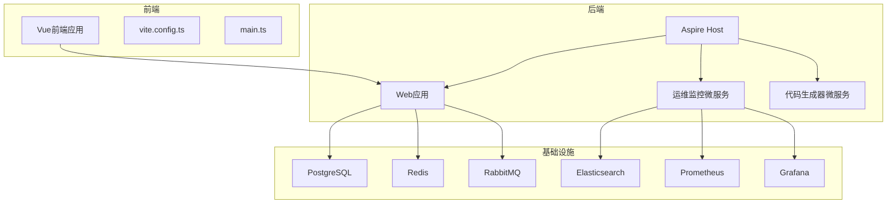
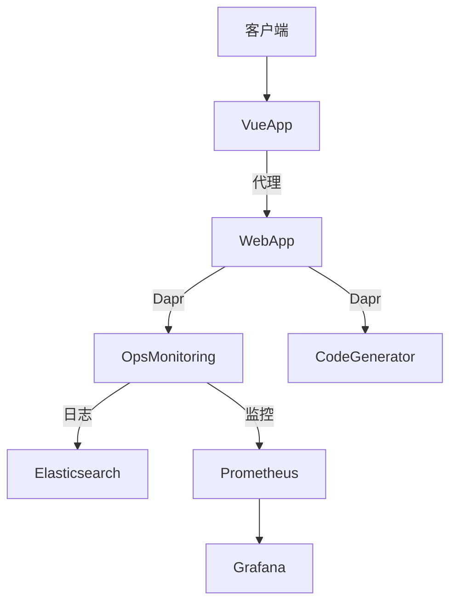
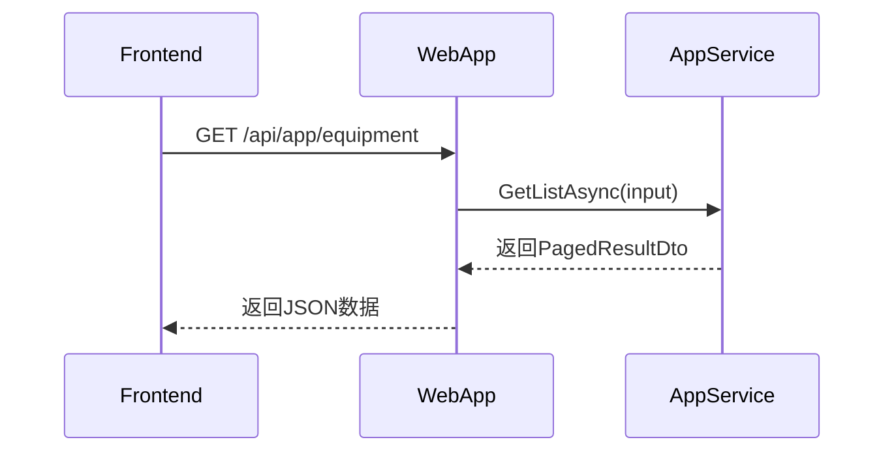
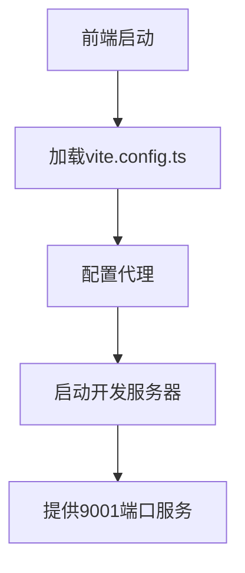
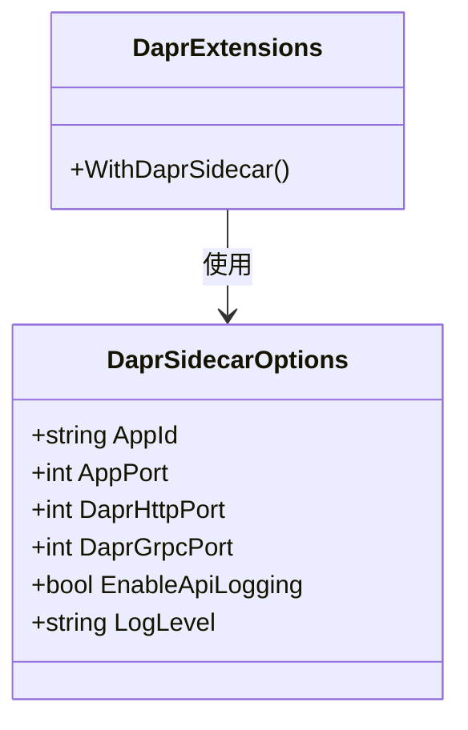

# 前后端联调

<cite>
**本文档引用文件**  
- [Program.cs](file://src/SmartAbp.AspireHost/Program.cs)
- [appsettings.json](file://src/SmartAbp.AspireHost/appsettings.json)
- [main.ts](file://src/SmartAbp.Vue/src/main.ts)
- [vite.config.ts](file://src/SmartAbp.Vue/vite.config.ts)
- [EquipmentController.cs](file://src/SmartAbp.HttpApi/Controllers/EquipmentController.cs)
- [equipment-api.ts](file://output/mes-uniapp/api/equipment-api.ts)
- [EquipmentAppService.cs](file://src/SmartAbp.Application/Equipment/EquipmentAppService.cs)
- [request.ts](file://output/mes-uniapp/utils/request.ts)
- [SmartAbpHttpApiClientModule.cs](file://src/SmartAbp.HttpApi.Client/SmartAbpHttpApiClientModule.cs)
- [Program.cs](file://src/SmartAbp.Web/Program.cs)
</cite>

## 目录
1. [简介](#简介)
2. [项目结构](#项目结构)
3. [核心组件](#核心组件)
4. [架构概览](#架构概览)
5. [详细组件分析](#详细组件分析)
6. [依赖分析](#依赖分析)
7. [性能考量](#性能考量)
8. [故障排查指南](#故障排查指南)
9. [结论](#结论)

## 简介
本文档详细说明了hxlot项目中前后端联调的完整流程。涵盖Visual Studio调试.NET后端服务、VS Code调试TypeScript前端代码、Aspire Host微服务调试配置，以及常见接口联调问题的排查方法。

## 项目结构
hxlot项目采用前后端分离架构，前端基于Vue技术栈，后端为.NET微服务架构，通过Aspire Host进行服务编排与调试。



**图示来源**  
- [Program.cs](file://src/SmartAbp.AspireHost/Program.cs)
- [vite.config.ts](file://src/SmartAbp.Vue/vite.config.ts)

**本节来源**  
- [Program.cs](file://src/SmartAbp.AspireHost/Program.cs)
- [vite.config.ts](file://src/SmartAbp.Vue/vite.config.ts)

## 核心组件
系统核心包括Aspire Host服务编排、Vue前端应用、.NET后端服务及基础设施组件。各组件通过Dapr Sidecar实现服务间通信，前端通过代理配置与后端交互。

**本节来源**  
- [Program.cs](file://src/SmartAbp.AspireHost/Program.cs)
- [main.ts](file://src/SmartAbp.Vue/src/main.ts)

## 架构概览
系统采用微服务架构，Aspire Host负责服务发现与编排，前端通过Vite代理与后端通信，后端服务间通过Dapr实现分布式调用。



**图示来源**  
- [Program.cs](file://src/SmartAbp.AspireHost/Program.cs)
- [vite.config.ts](file://src/SmartAbp.Vue/vite.config.ts)

## 详细组件分析

### .NET后端调试配置
在Visual Studio中调试.NET后端服务，需配置启动项目为SmartAbp.AspireHost，并设置断点于关键业务逻辑处。

#### 断点设置与变量监视
在`EquipmentAppService.cs`中设置断点，可监视设备管理相关操作的输入参数与执行流程。



**图示来源**  
- [EquipmentController.cs](file://src/SmartAbp.HttpApi/Controllers/EquipmentController.cs)
- [EquipmentAppService.cs](file://src/SmartAbp.Application/Equipment/EquipmentAppService.cs)

**本节来源**  
- [EquipmentController.cs](file://src/SmartAbp.HttpApi/Controllers/EquipmentController.cs)
- [EquipmentAppService.cs](file://src/SmartAbp.Application/Equipment/EquipmentAppService.cs)

### Vue前端调试方法
使用VS Code调试TypeScript前端代码，需配置launch.json以支持源码映射与组件状态检查。

#### 源码映射与API追踪
`vite.config.ts`中配置了生产环境的hidden sourcemap，开发时可直接在浏览器中调试TypeScript源码。



**图示来源**  
- [vite.config.ts](file://src/SmartAbp.Vue/vite.config.ts)

**本节来源**  
- [vite.config.ts](file://src/SmartAbp.Vue/vite.config.ts)
- [main.ts](file://src/SmartAbp.Vue/src/main.ts)

### Aspire Host微服务调试
Aspire Host提供完整的微服务调试环境，支持服务发现、分布式追踪与跨服务断点。

#### 服务发现与分布式追踪
`Program.cs`中通过`DistributedApplication.CreateBuilder`定义服务拓扑，Dapr Sidecar实现服务间追踪。



**图示来源**  
- [Program.cs](file://src/SmartAbp.AspireHost/Program.cs)

**本节来源**  
- [Program.cs](file://src/SmartAbp.AspireHost/Program.cs)

## 依赖分析
系统依赖关系清晰，前端依赖后端API，后端服务间通过Dapr通信，基础设施组件为各服务提供支持。

```mermaid
dependencyDiagram
VueApp --> WebApp : HTTP
WebApp --> OpsMonitoring : Dapr
WebApp --> CodeGenerator : Dapr
WebApp --> Postgres : ADO.NET
WebApp --> Redis : StackExchange.Redis
OpsMonitoring --> Elasticsearch : NEST
OpsMonitoring --> Prometheus : Metrics
```

**图示来源**  
- [Program.cs](file://src/SmartAbp.AspireHost/Program.cs)
- [vite.config.ts](file://src/SmartAbp.Vue/vite.config.ts)

**本节来源**  
- [Program.cs](file://src/SmartAbp.AspireHost/Program.cs)
- [vite.config.ts](file://src/SmartAbp.Vue/vite.config.ts)

## 性能考量
生产环境启用Brotli压缩，代码分割策略优化加载性能，日志系统分级存储以平衡性能与可观测性。

**本节来源**  
- [vite.config.ts](file://src/SmartAbp.Vue/vite.config.ts)
- [Program.cs](file://src/SmartAbp.Web/Program.cs)

## 故障排查指南

### CORS配置问题
前端通过`vite.config.ts`中的proxy配置解决开发环境CORS问题，生产环境由后端统一处理。

**本节来源**  
- [vite.config.ts](file://src/SmartAbp.Vue/vite.config.ts)

### 认证令牌传递
`request.ts`中自动从storage读取token并注入Authorization头，确保API调用的身份验证。

**本节来源**  
- [request.ts](file://output/mes-uniapp/utils/request.ts)

### 数据序列化问题
后端使用Abp框架的DTO自动映射，前端通过TypeScript接口定义保证类型安全。

**本节来源**  
- [SmartAbpHttpApiClientModule.cs](file://src/SmartAbp.HttpApi.Client/SmartAbpHttpApiClientModule.cs)
- [equipment-api.ts](file://output/mes-uniapp/api/equipment-api.ts)

## 结论
hxlot项目通过Aspire Host实现高效的微服务调试，前后端分离架构配合完善的工具链，确保了开发调试的高效性与稳定性。