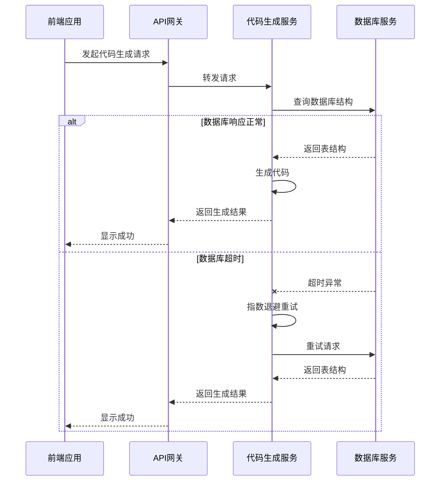
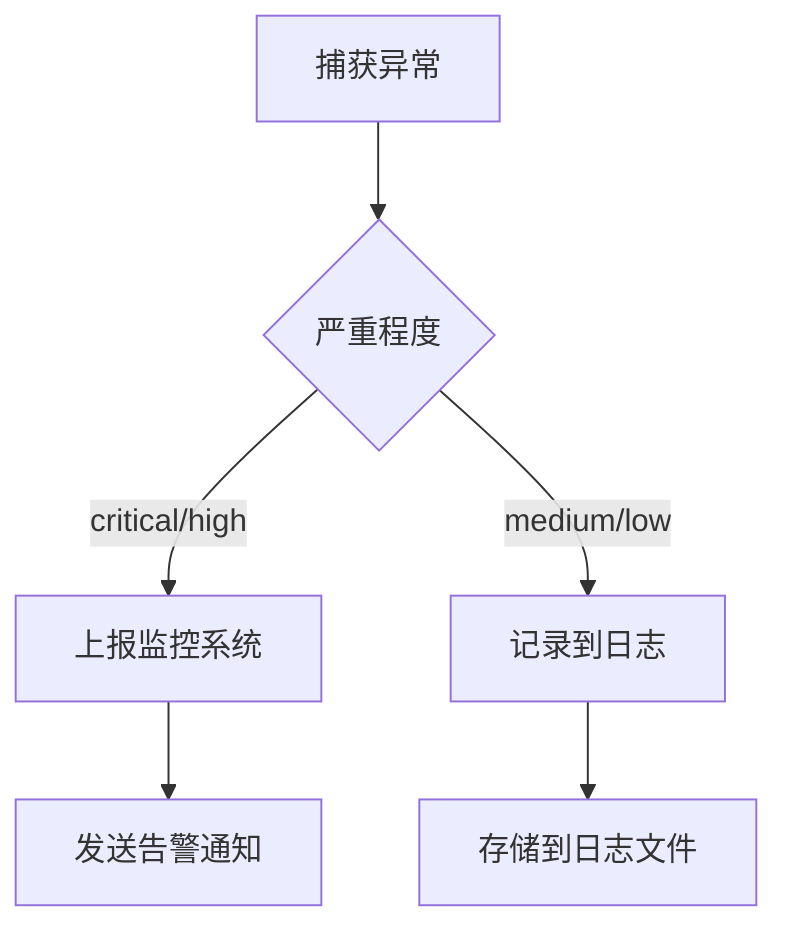

# 异常排查

<cite>
**本文档引用文件**  
- [ErrorLogIntegration.ts](file://src\SmartAbp.Vue\packages\lowcode-shared\src\logging\ErrorLogIntegration.ts)
- [GlobalErrorHandler.ts](file://src\SmartAbp.Vue\packages\lowcode-shared\src\error\GlobalErrorHandler.ts)
- [SystemReliabilityEngine.cs](file://src\SmartAbp.CodeGenerator\Core\Reliability\SystemReliabilityEngine.cs)
- [CodeGenerationAppService.cs](file://src\SmartAbp.CodeGenerator\Services\CodeGenerationAppService.cs)
- [ResourceAvailabilityChecker.cs](file://src\SmartAbp.CodeGenerator\Core\Reliability\ResourceAvailabilityChecker.cs)
</cite>

## 目录
1. [引言](#引言)
2. [常见异常分析](#常见异常分析)
3. [分布式系统异常传播与处理](#分布式系统异常传播与处理)
4. [调试工具与断点设置](#调试工具与断点设置)
5. [异常日志记录最佳实践](#异常日志记录最佳实践)
6. [可复现测试用例构建](#可复现测试用例构建)
7. [结论](#结论)

## 引言
hxlot项目是一个复杂的低代码开发平台，集成了前后端代码生成、数据库迁移、权限管理等核心功能。在高并发、分布式环境下，异常处理的健壮性直接关系到系统的稳定性和用户体验。本文档旨在深入分析项目中的异常排查机制，涵盖从堆栈跟踪分析、分布式异常传播、调试工具使用到日志记录和测试用例构建的完整流程，为开发团队提供系统性的异常处理指导。

## 常见异常分析

### NullReferenceException
在.NET后端服务中，`NullReferenceException`是常见的运行时异常。通过分析`CodeGenerationAppService.cs`中的代码，发现其通过`Check.NotNull`方法在方法入口处进行参数空值检查，这是一种主动防御性编程策略。例如，在`GenerateModuleAsync`方法中，对输入参数`input`和`input.Entities`进行非空验证，避免了后续操作中潜在的空引用异常。此外，系统可靠性引擎`SystemReliabilityEngine.cs`通过五层防护机制，在执行操作前进行输入验证，进一步降低了此类异常的发生概率。

### 数据库并发冲突
数据库并发冲突通常发生在多个事务同时修改同一数据时。项目通过`ResourceAvailabilityChecker.cs`中的`CheckDatabaseConnectionAsync`方法模拟数据库连接检查，确保数据库服务的可用性。在实际业务逻辑中，`CodeGenerationAppService.cs`通过`OrchestrateDatabaseMigrationAsync`方法协调数据库迁移，利用EF Core的迁移命令执行机制，确保数据库结构变更的原子性和一致性。当迁移失败时，系统会捕获`InvalidOperationException`并记录详细的错误日志，便于后续排查。

### API调用超时
API调用超时是分布式系统中的常见问题。项目在`SystemReliabilityEngine.cs`中实现了第五层防护机制——异常恢复机制，通过指数退避算法进行重试。`CalculateExponentialBackoff`方法根据重试次数计算延迟时间（100ms, 200ms, 400ms），避免了因瞬时网络抖动导致的失败。同时，`TimeoutDto`类定义了超时控制策略，允许配置超时时间和超时后的行为，为API调用提供了灵活的超时处理方案。

**Section sources**
- [CodeGenerationAppService.cs](file://src\SmartAbp.CodeGenerator\Services\CodeGenerationAppService.cs#L1263-L1285)
- [SystemReliabilityEngine.cs](file://src\SmartAbp.CodeGenerator\Core\Reliability\SystemReliabilityEngine.cs#L48-L80)
- [ResourceAvailabilityChecker.cs](file://src\SmartAbp.CodeGenerator\Core\Reliability\ResourceAvailabilityChecker.cs#L184-L210)

## 分布式系统异常传播与处理

### 异常传播机制
在hxlot项目中，异常传播遵循分层处理原则。前端通过`GlobalErrorHandler.ts`捕获未处理的Promise拒绝和JavaScript错误，并将其标准化为`StandardError`对象。后端服务则通过ABP框架的`AbpException`进行异常封装，确保异常信息的一致性。当异常发生时，系统会通过事件总线（如`ModuleGenerationFailedEvent`）发布失败事件，实现异常的跨服务传播。

### 处理模式
项目采用了多种异常处理模式：
- **重试模式**：通过`ExecuteWithAutoRecovery`方法实现，对可重试异常（如`TimeoutException`）进行有限次数的重试。
- **熔断模式**：`CircuitBreakerDto`定义了熔断器配置，当失败率达到阈值时，自动切断服务，防止雪崩效应。
- **降级模式**：`RecoveryStrategy`枚举定义了`fallback`策略，当验证失败时提供默认值或备用逻辑。
- **隔离模式**：`BulkheadDto`通过限制最大并发数和队列大小，实现舱壁隔离，防止一个服务的故障影响整个系统。

**Diagram sources**
- [GlobalErrorHandler.ts](file://src\SmartAbp.Vue\packages\lowcode-shared\src\error\GlobalErrorHandler.ts#L96-L471)
- [SystemReliabilityEngine.cs](file://src\SmartAbp.CodeGenerator\Core\Reliability\SystemReliabilityEngine.cs#L48-L80)

## 调试工具与断点设置

### 断点设置策略
在Visual Studio或VS Code中，建议在以下关键位置设置断点：
1. **异常入口点**：在`GlobalErrorHandler.handleError`方法的第一行设置断点，捕获所有未处理的异常。
2. **核心业务逻辑**：在`CodeGenerationAppService.GenerateModuleAsync`方法的开始处设置断点，监控模块生成的全过程。
3. **数据库操作**：在`OrchestrateDatabaseMigrationAsync`方法中设置断点，检查数据库迁移命令的执行情况。
4. **异常恢复点**：在`SystemReliabilityEngine.ExecuteWithAutoRecovery`方法中设置断点，观察重试机制的触发条件和执行流程。

### 上下文分析
利用调试器的“局部变量”和“调用堆栈”窗口，可以深入分析异常上下文。例如，当`NullReferenceException`发生时，检查调用堆栈可以定位到具体的代码行，而局部变量窗口则显示了当时所有变量的值，帮助判断哪个对象为null。此外，可以通过“即时窗口”执行表达式，动态验证修复方案的有效性。

**Section sources**
- [GlobalErrorHandler.ts](file://src\SmartAbp.Vue\packages\lowcode-shared\src\error\GlobalErrorHandler.ts#L96-L471)
- [CodeGenerationAppService.cs](file://src\SmartAbp.CodeGenerator\Services\CodeGenerationAppService.cs#L1263-L1285)

## 异常日志记录最佳实践

### 日志结构化
项目采用结构化日志记录，通过`ErrorLogEntry`接口定义了统一的日志格式，包含错误ID、日志级别、消息、分类、严重程度、上下文、堆栈、恢复状态和时间戳。这种结构化的日志便于后续的搜索、分析和可视化。

### 日志级别映射
`ErrorLogIntegration.ts`中的`mapSeverityToLogLevel`方法将错误严重程度映射到日志级别：
- `critical` -> `fatal`
- `high` -> `error`
- `medium` -> `warn`
- `low` -> `info`

这确保了不同严重程度的异常能够被正确地记录和告警。

### 监控集成
对于严重错误（`critical`或`high`），系统会通过`reportCriticalError`方法上报到监控系统。虽然当前实现仅为控制台输出，但预留了集成Sentry、Datadog等外部监控服务的接口，便于未来扩展。

**Diagram sources**
- [ErrorLogIntegration.ts](file://src\SmartAbp.Vue\packages\lowcode-shared\src\logging\ErrorLogIntegration.ts#L38-L271)

## 可复现测试用例构建

### 测试用例设计
为了验证异常修复方案，需要构建可复现的测试用例。例如，针对数据库并发冲突，可以设计以下测试场景：
1. **并发迁移测试**：启动多个线程同时调用`OrchestrateDatabaseMigrationAsync`，验证数据库锁机制的有效性。
2. **网络超时测试**：使用工具模拟网络延迟，测试`ExecuteWithAutoRecovery`的重试机制是否正常工作。
3. **资源不足测试**：限制系统内存或磁盘空间，验证`ResourceAvailabilityChecker`能否正确检测并处理资源不足的情况。

### 自动化测试
项目提供了`EnterpriseTestingFramework.cs`作为测试框架，支持分布式锁测试和性能基准测试。通过`GetConnectionStringNamesAsync`等无需授权的接口，可以方便地进行数据库连接测试，确保测试环境的独立性和可重复性。

**Section sources**
- [ResourceAvailabilityChecker.cs](file://src\SmartAbp.CodeGenerator\Core\Reliability\ResourceAvailabilityChecker.cs#L184-L210)
- [EnterpriseTestingFramework.cs](file://src\SmartAbp.Application\Permissions\Testing\EnterpriseTestingFramework.cs#L674-L702)

## 结论
hxlot项目通过多层次的防护机制和完善的异常处理策略，构建了一个健壮的低代码开发平台。从前端的全局错误处理器到后端的系统可靠性引擎，从结构化的日志记录到可复现的测试用例，形成了一个完整的异常排查和处理闭环。开发团队应充分利用这些机制，遵循最佳实践，确保系统的稳定性和可靠性。