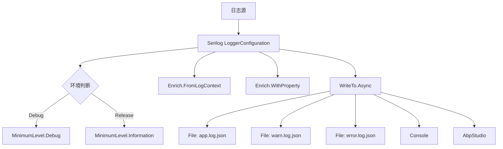
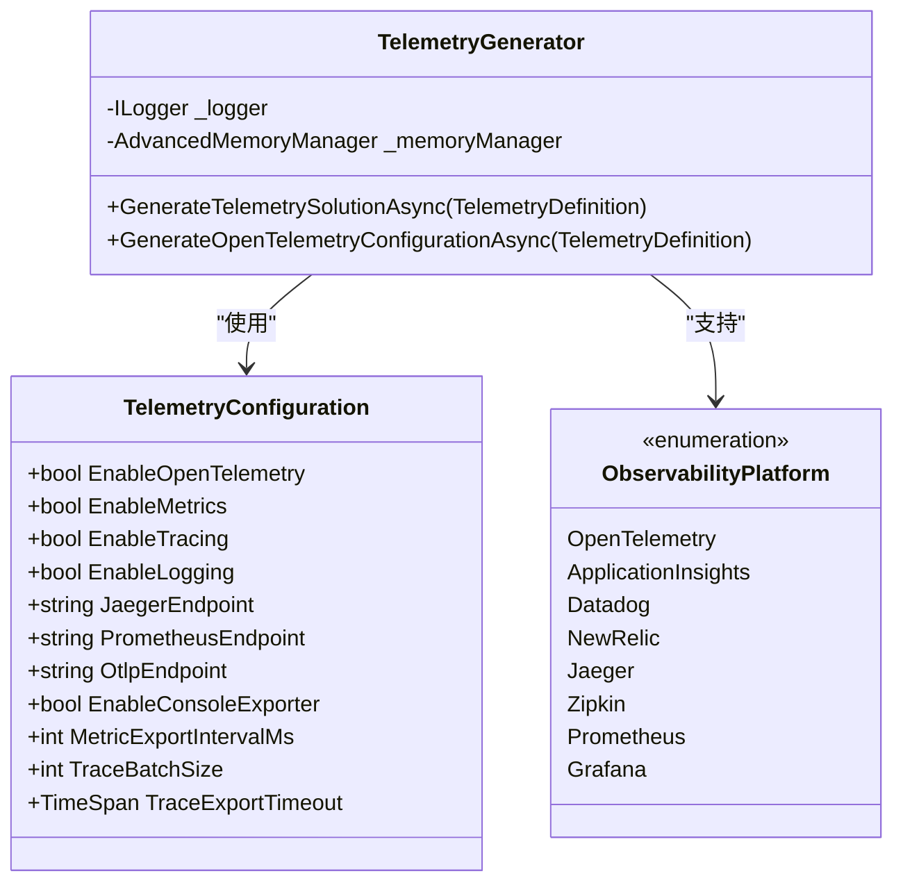
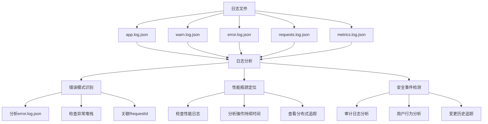

# 日志分析

<cite>
**本文档中引用的文件**  
- [Program.cs](file://src/SmartAbp.Web/Program.cs)
- [EnterpriseLoggingService.cs](file://src/SmartAbp.Application/Permissions/Logging/EnterpriseLoggingService.cs)
- [TelemetryGenerator.cs](file://src/SmartAbp.CodeGenerator/Telemetry/TelemetryGenerator.cs)
- [TelemetryDefinitions.cs](file://src/SmartAbp.CodeGenerator/Telemetry/TelemetryDefinitions.cs)
- [Program.cs](file://src/SmartAbp.OpsManagement.Service/Host/Program.cs)
- [appsettings.json](file://src/SmartAbp.AspireHost/appsettings.json)
</cite>

## 目录
1. [简介](#简介)
2. [Serilog结构化日志配置与使用](#serilog结构化日志配置与使用)
3. [Application Insights集成方法](#application-insights集成方法)
4. [日志文件分析技巧](#日志文件分析技巧)
5. [日志聚合与查询最佳实践](#日志聚合与查询最佳实践)
6. [日志告警与自动化响应](#日志告警与自动化响应)
7. [结论](#结论)

## 简介
hxlot项目采用Serilog作为核心日志框架，结合OpenTelemetry实现全面的可观测性。系统通过结构化日志记录、分布式追踪和性能监控，为云端监控和异常追踪提供坚实基础。本项目在多个服务中配置了精细化的日志策略，包括Web应用、运维管理微服务和代码生成器，确保关键操作和异常能够被有效捕获和分析。

## Serilog结构化日志配置与使用

hxlot项目中的日志系统基于Serilog实现，支持结构化日志记录、多目标输出和灵活的级别控制。在`SmartAbp.Web`和`SmartAbp.OpsManagement.Service`等核心服务中，通过`Program.cs`文件配置了完整的日志管道。

日志级别根据环境自动调整：在调试模式下记录Debug级别日志，生产环境则以Information为最低级别。系统通过`MinimumLevel.Override`方法对特定命名空间进行级别覆盖，例如将`Microsoft`和`Microsoft.EntityFrameworkCore`的日志级别设置为Information和Warning，以减少噪音。

日志输出目标包括：
- **文件输出**：按天滚动的JSON格式日志文件，包括应用日志(app.log.json)、警告日志(warn.log.json)和错误日志(error.log.json)
- **控制台输出**：用于开发和调试
- **ABP Studio集成**：通过`AbpStudio`扩展方法与开发环境集成

日志文件采用紧凑的JSON格式(`CompactJsonFormatter`)，便于后续的机器解析和聚合分析。每个日志文件都有独立的保留策略，错误日志保留30天，警告日志保留21天，应用日志保留14天。

**Diagram sources**
- [Program.cs](file://src/SmartAbp.Web/Program.cs#L61-L102)

**Section sources**
- [Program.cs](file://src/SmartAbp.Web/Program.cs#L50-L120)
- [Program.cs](file://src/SmartAbp.OpsManagement.Service/Host/Program.cs#L50-L100)

## Application Insights集成方法

虽然当前代码中未直接实现Application Insights集成，但系统架构为云监控和异常追踪提供了完善的扩展能力。`EnterpriseLoggingService`类中定义了`LogProvider`枚举，明确包含了`ApplicationInsights`作为日志提供程序选项，表明系统设计上支持Azure Monitor服务。

通过`TelemetryGenerator`和`TelemetryDefinitions`组件，项目实现了基于OpenTelemetry的标准监控解决方案。该方案支持多种可观测性平台，包括Application Insights、Datadog、NewRelic等。`TelemetryConfiguration`类中的`ObservabilityPlatform`枚举明确列出了Application Insights作为可选平台。

要集成Application Insights，可以通过以下步骤：
1. 在`TelemetryConfiguration`中启用`EnableLogging`
2. 配置OTLP(OpenTelemetry Protocol)端点指向Application Insights
3. 在`OpenTelemetryConfiguration`中添加OTLP导出器
4. 配置服务名称和版本信息

系统还支持通过连接字符串配置监控端点，如`JaegerEndpoint`、`PrometheusEndpoint`和`OtlpEndpoint`，这为连接到Azure Application Insights提供了标准化的配置方式。

**Diagram sources**
- [TelemetryDefinitions.cs](file://src/SmartAbp.CodeGenerator/Telemetry/TelemetryDefinitions.cs#L44-L94)
- [TelemetryGenerator.cs](file://src/SmartAbp.CodeGenerator/Telemetry/TelemetryGenerator.cs#L13-L573)

**Section sources**
- [TelemetryDefinitions.cs](file://src/SmartAbp.CodeGenerator/Telemetry/TelemetryDefinitions.cs#L40-L135)
- [TelemetryGenerator.cs](file://src/SmartAbp.CodeGenerator/Telemetry/TelemetryGenerator.cs#L50-L100)

## 日志文件分析技巧

hxlot项目的日志系统设计支持高效的问题诊断和性能分析。通过多维度的日志分类和结构化数据，可以快速识别关键错误模式、定位性能瓶颈和检测安全事件。

### 关键错误模式识别
系统将日志按严重程度分离到不同文件，便于针对性分析：
- `error.log.json`：包含所有Error和Critical级别日志，是故障排查的首要目标
- `warn.log.json`：记录潜在问题，如性能超过阈值、第三方服务响应慢等
- `requests.log.json`：记录所有HTTP请求，便于分析请求失败模式

通过分析错误日志中的堆栈跟踪和上下文属性，可以快速定位异常根源。`EnterpriseLoggingService`中的`LogEntry`模型包含`RequestId`、`UserId`等关键属性，支持跨服务的请求追踪。

### 性能瓶颈定位
系统实现了多层次的性能监控：
1. **性能日志**：`EnterpriseLoggingService`提供`LogPerformanceAsync`方法，记录操作执行时间
2. **指标监控**：通过`TelemetryService`收集操作计数器和持续时间直方图
3. **分布式追踪**：使用`ActivitySource`实现跨服务调用链追踪

性能阈值可配置，默认为1000毫秒。当操作执行时间超过阈值时，系统会自动记录警告日志，便于及时发现性能退化。

### 安全事件检测
审计日志功能记录关键业务操作，包括：
- 用户身份信息(UserId, UserName)
- 操作类型(Action)
- 实体变更(EntityType, EntityId, OldValue, NewValue)
- 客户端信息(IpAddress, UserAgent)

这些结构化数据可用于检测异常登录、权限滥用和数据篡改等安全事件。

**Diagram sources**
- [EnterpriseLoggingService.cs](file://src/SmartAbp.Application/Permissions/Logging/EnterpriseLoggingService.cs#L44-L150)

**Section sources**
- [EnterpriseLoggingService.cs](file://src/SmartAbp.Application/Permissions/Logging/EnterpriseLoggingService.cs#L30-L500)

## 日志聚合与查询最佳实践

hxlot项目采用集中式日志管理策略，通过标准化的JSON格式和统一的目录结构，为日志聚合和查询提供了良好基础。

### 日志聚合策略
1. **统一日志目录**：通过`LOG_ROOT`环境变量或配置文件指定日志根目录
2. **服务隔离**：每个服务有独立的子目录，如`web`、`ops-management`
3. **结构化格式**：使用Compact JSON格式，便于ELK等工具解析

### 查询最佳实践
1. **时间范围过滤**：始终指定时间范围以提高查询效率
2. **级别过滤**：根据问题类型选择适当日志级别
3. **关键字搜索**：利用结构化字段进行精确查询，如`RequestId`、`UserId`
4. **关联分析**：通过`CorrelationId`关联跨服务的日志条目

系统支持多种查询场景：
- **故障排查**：通过错误日志和堆栈跟踪定位问题
- **性能分析**：结合性能日志和分布式追踪分析慢操作
- **业务审计**：查询特定用户或操作的审计日志
- **安全分析**：检测异常登录模式和权限变更

## 日志告警与自动化响应

hxlot项目的监控体系支持基于日志的告警和自动化响应机制。虽然具体告警规则未在代码中实现，但系统提供了完善的基础设施。

### 告警触发条件
1. **错误率上升**：单位时间内Error日志数量超过阈值
2. **性能退化**：关键操作平均响应时间持续增加
3. **异常模式**：检测到特定异常类型或安全事件
4. **服务不可用**：健康检查日志显示服务异常

### 自动化响应
系统可通过以下方式实现自动化：
1. **Dapr集成**：利用Dapr的发布/订阅模式触发告警处理
2. **健康检查**：通过`HealthCheckDefinition`配置健康检查点
3. **事件驱动**：基于日志事件触发自动化工作流

`TelemetryGenerator`生成的代码包含完整的可观测性仪表板，可作为告警和响应的可视化界面。

## 结论
hxlot项目构建了现代化的日志和监控体系，基于Serilog和OpenTelemetry实现了结构化日志记录、分布式追踪和性能监控。系统设计充分考虑了云端监控和异常追踪的需求，为Application Insights等云服务集成提供了良好支持。通过合理的日志分类、结构化数据和集中管理，项目具备了强大的问题诊断和性能分析能力。建议进一步完善告警规则和自动化响应机制，以实现更主动的系统监控和故障预防。