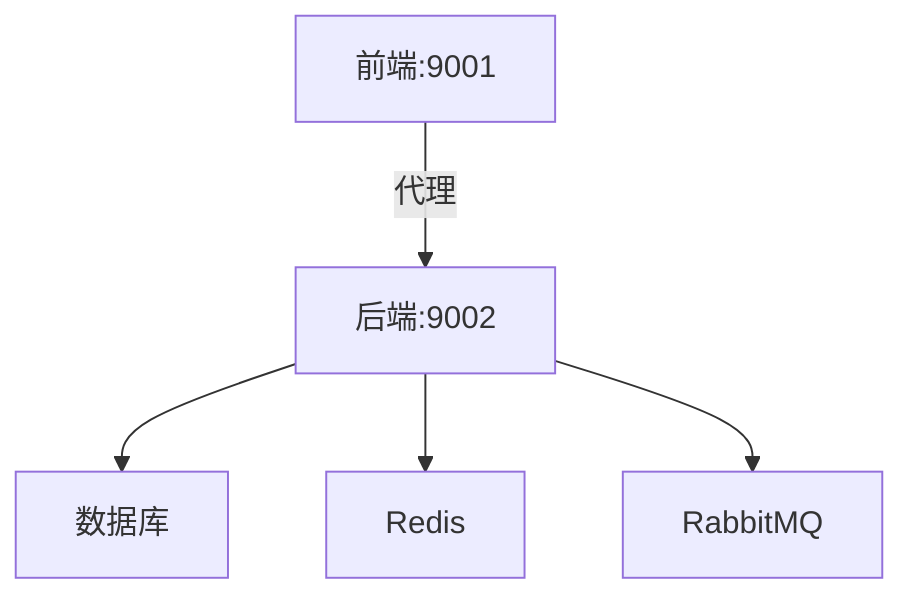
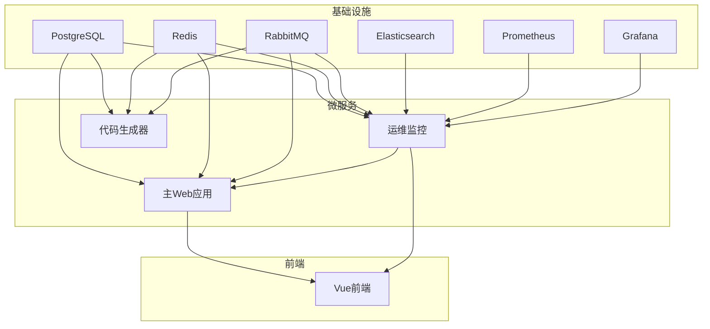
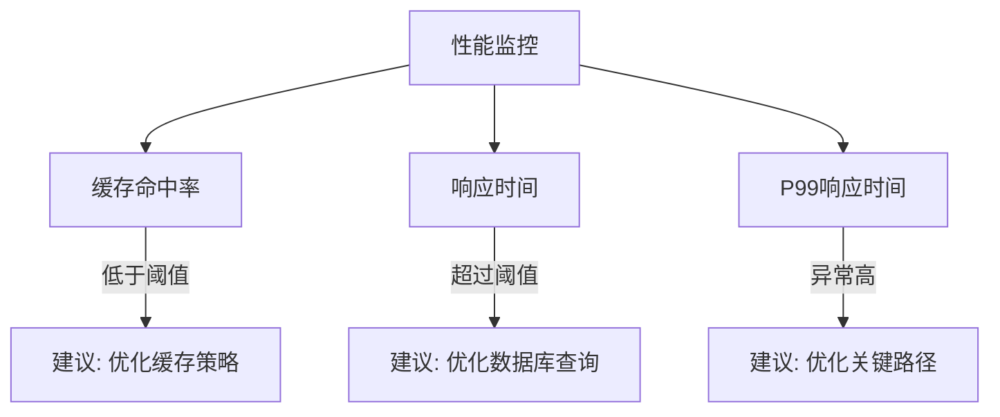
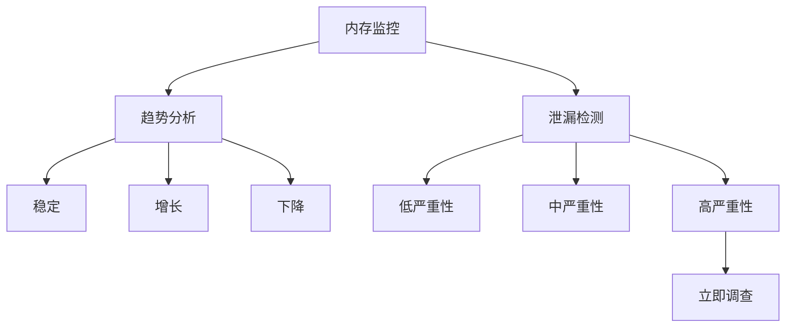
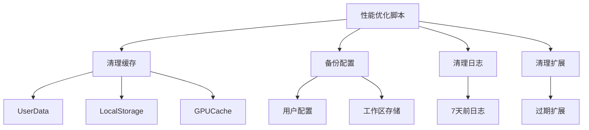

# 调试技巧

<cite>
**本文档引用的文件**  
- [Program.cs](file://src/SmartAbp.AspireHost/Program.cs)
- [Program.cs](file://src/SmartAbp.Web/Program.cs)
- [vite.config.ts](file://src/SmartAbp.Vue/vite.config.ts)
- [package.json](file://src/SmartAbp.Vue/package.json)
- [mes-fullstack-config.json](file://config/mes-fullstack-config.json)
- [cursor-performance-optimizer.ps1](file://scripts/tools/cursor-performance-optimizer.ps1)
- [EnterpriseAnalyticsService.cs](file://src/SmartAbp.Application/Permissions/Analytics/EnterpriseAnalyticsService.cs)
- [PermissionPerformanceMonitor.cs](file://src/SmartAbp.Application/Permissions/Performance/PermissionPerformanceMonitor.cs)
- [MemoryManagementService.cs](file://src/SmartAbp.Application/Permissions/Memory/MemoryManagementService.cs)
- [GlobalMemoryMonitor.ts](file://src/SmartAbp.Vue/packages/lowcode-shared/src/memory/GlobalMemoryMonitor.ts)
</cite>

## 目录
1. [前后端联调指南](#前后端联调指南)
2. [Aspire Host微服务调试](#aspire-host微服务调试)
3. 日志分析技巧
4. 性能瓶颈与内存泄漏检测
5. 常见异常堆栈分析
6. 开发工具性能优化

## 前后端联调指南

### .NET后端调试（Visual Studio）

在Visual Studio中调试.NET后端服务时，需确保项目启动配置正确。`SmartAbp.Web`项目的`Program.cs`文件中配置了固定端口9002（HTTP）和9003（HTTPS），确保前端能够通过代理访问后端API。

**调试步骤：**
1. 打开`SmartAbp.sln`解决方案
2. 将`SmartAbp.Web`设为启动项目
3. 启动调试（F5）
4. 检查控制台输出确认服务已监听9002端口
5. 使用Postman或Swagger测试API端点

### TypeScript前端调试（VS Code）

前端项目位于`SmartAbp.Vue`目录，使用Vite构建。`vite.config.ts`中配置了代理规则，将`/api`、`/connect`等请求转发至`https://localhost:9002`。

**调试配置：**
- 启动命令：`npm run dev`
- 开发服务器端口：9001
- 代理目标：https://localhost:9002
- 环境变量：`VITE_API_BASE_URL=http://localhost:9002`

**VS Code调试技巧：**
1. 安装Vue Language Features (Volar)扩展
2. 配置`launch.json`启用Chrome调试
3. 使用`console.log`或断点调试Vue组件
4. 利用Vue Devtools检查组件状态

**Section sources**
- [vite.config.ts](file://src/SmartAbp.Vue/vite.config.ts#L200-L250)
- [package.json](file://src/SmartAbp.Vue/package.json#L10-L20)

## Aspire Host微服务调试

`SmartAbp.AspireHost`项目使用.NET Aspire框架管理微服务拓扑。`Program.cs`定义了多个基础设施和微服务组件。

**调试步骤：**
1. 在Visual Studio中打开`SmartAbp.AspireHost`项目
2. 设置为启动项目
3. 启动调试，Aspire将自动启动所有依赖服务
4. 检查Dapr Sidecar是否正常启动（端口3500-3502）
5. 访问http://localhost:9001查看前端应用

**关键配置：**
- Dapr AppId: smartabp-web, smartabp-ops-monitoring
- 健康检查端点：/health
- 服务间通信通过Dapr服务调用

**Diagram sources**
- [Program.cs](file://src/SmartAbp.AspireHost/Program.cs#L1-L186)

**Section sources**
- [Program.cs](file://src/SmartAbp.AspireHost/Program.cs#L1-L186)

## 日志分析技巧

### Serilog日志配置

后端使用Serilog进行结构化日志记录。`SmartAbp.Web`的`Program.cs`中配置了多个日志输出：

- `app.log.json`：信息级别以上日志
- `warn.log.json`：警告级别日志
- `error.log.json`：错误级别日志
- `requests.log.json`：请求日志

日志文件位于`log/web/`目录下，按天滚动，保留14天。

### Application Insights集成

通过`AbpStudio`接收器将日志发送到Application Insights。关键日志字段包括：
- `Application`: SmartAbp.Web
- `CorrelationId`: 请求关联ID
- `MachineName`: 主机名
- `OperationId`: 操作ID

**日志分析技巧：**
1. 使用Kibana查询ELK中的日志
2. 在Application Insights中创建仪表板
3. 设置日志告警规则
4. 分析错误堆栈跟踪

**Section sources**
- [Program.cs](file://src/SmartAbp.Web/Program.cs#L1-L141)

## 性能瓶颈与内存泄漏检测

### 性能瓶颈分析

`PermissionPerformanceMonitor`服务提供性能监控功能，可识别以下瓶颈：

**检测指标：**
- 缓存命中率 < 90%
- 平均响应时间 > 1000ms
- P99响应时间 > 2000ms

**Section sources**
- [PermissionPerformanceMonitor.cs](file://src/SmartAbp.Application/Permissions/Performance/PermissionPerformanceMonitor.cs#L183-L270)

### 内存泄漏检测

后端和前端均实现了内存泄漏检测机制。

**后端检测（MemoryManagementService）：**
- 监控组件内存分配
- 分析内存增长趋势
- 检测可疑组件（>100MB）
- 预测达到临界阈值时间

**前端检测（GlobalMemoryMonitor）：**
- 监控内存使用率
- 检测异常增长（>1MB/秒）
- 提供修复建议
- 支持自动垃圾回收

**检测阈值：**
- 内存增长 > 10MB/小时：中等严重性
- 内存增长 > 50MB/小时：高严重性
- 内存增长 > 100MB/小时：危急

**Section sources**
- [MemoryManagementService.cs](file://src/SmartAbp.Application/Permissions/Memory/MemoryManagementService.cs#L622-L728)
- [GlobalMemoryMonitor.ts](file://src/SmartAbp.Vue/packages/lowcode-shared/src/memory/GlobalMemoryMonitor.ts#L515-L552)

## 常见异常堆栈分析

### 后端常见异常

**数据库连接异常：**
- 检查`appsettings.json`中的连接字符串
- 验证PostgreSQL服务是否运行
- 检查防火墙设置

**Dapr通信异常：**
- 确认Dapr Sidecar已启动
- 检查AppId配置是否正确
- 验证网络连通性

**内存溢出异常：**
- 分析`MemoryManagementService`的检测结果
- 检查可疑组件的内存使用
- 优化大对象分配

### 前端常见异常

**模块解析错误：**
- 检查`vite.config.ts`中的别名配置
- 验证包路径是否正确
- 清理`node_modules`后重新安装

**跨域问题：**
- 确认Vite代理配置正确
- 检查后端CORS设置
- 验证请求头是否包含必要信息

**Section sources**
- [EnterpriseAnalyticsService.cs](file://src/SmartAbp.Application/Permissions/Analytics/EnterpriseAnalyticsService.cs#L831-L1316)

## 开发工具性能优化

### Cursor IDE优化

使用`cursor-performance-optimizer.ps1`脚本优化Cursor IDE性能：

**优化建议：**
1. 每周运行一次清理脚本
2. 禁用不必要的扩展
3. 关闭不使用的标签页
4. 确保至少5GB可用磁盘空间
5. 定期重启IDE

**脚本参数：**
- `-Deep`：深度清理模式
- `-Backup`：备份重要配置
- `-DryRun`：预演模式
- `-Restart`：清理后重启

**Section sources**
- [cursor-performance-optimizer.ps1](file://scripts/tools/cursor-performance-optimizer.ps1#L1-L436)