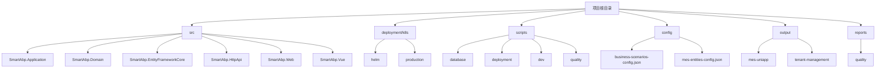
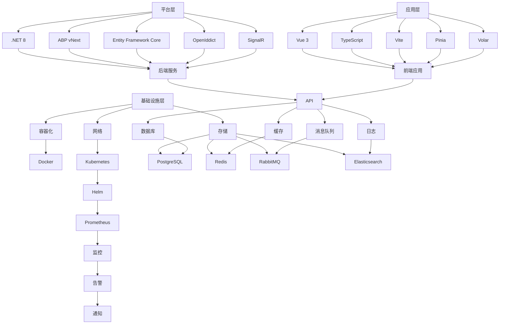

# 技术栈

<cite>
**本文档中引用的文件**  
- [SmartAbp.Domain.csproj](file://src/SmartAbp.Domain/SmartAbp.Domain.csproj)
- [SmartAbp.EntityFrameworkCore.csproj](file://src/SmartAbp.EntityFrameworkCore/SmartAbp.EntityFrameworkCore.csproj)
- [SmartAbp.Application.csproj](file://src/SmartAbp.Application/SmartAbp.Application.csproj)
- [SmartAbp.HttpApi.csproj](file://src/SmartAbp.HttpApi/SmartAbpHttpApiModule.cs)
- [SmartAbp.AspireHost.csproj](file://src/SmartAbp.AspireHost/SmartAbp.AspireHost.csproj)
- [SmartAbp.Web.csproj](file://src/SmartAbp.Web/SmartAbpWebAutoMapperProfile.cs)
- [SmartAbp.Vue/package.json](file://src/SmartAbp.Vue/package.json)
- [SmartAbp.Vue/vite.config.ts](file://src/SmartAbp.Vue/vite.config.ts)
- [SmartAbp.Vue/tsconfig.json](file://src/SmartAbp.Vue/tsconfig.json)
- [SmartAbp.Vue/main.ts](file://src/SmartAbp.Vue/src/main.ts)
- [SmartAbp.Vue/volar.config.js](file://src/SmartAbp.Vue/volar.config.js)
- [docker-compose.yml](file://docker-compose.yml)
- [deployment/k8s/helm/smartabp](file://deployment/k8s/helm/smartabp)
</cite>

## 目录
1. [引言](#引言)
2. [项目结构](#项目结构)
3. [后端技术栈](#后端技术栈)
4. [前端技术栈](#前端技术栈)
5. [DevOps技术栈](#devops技术栈)
6. [技术栈协同工作原理](#技术栈协同工作原理)
7. [技术栈分层图](#技术栈分层图)
8. [可扩展性、安全性和性能支持](#可扩展性安全性与性能支持)
9. [结论](#结论)

## 引言
hxlot项目是一个现代化的全栈应用，采用了一系列先进的技术栈来构建一个可扩展、安全且高性能的系统。本文档全面介绍了该项目的技术栈，包括后端、前端和DevOps技术，以及它们如何协同工作以支持项目的可扩展性、安全性和性能目标。

## 项目结构
hxlot项目的目录结构清晰地划分了不同的功能模块和技术组件。主要目录包括：
- `src`：包含所有源代码，分为多个子项目如`SmartAbp.Application`、`SmartAbp.Domain`等。
- `deployment/k8s`：Kubernetes部署配置文件，使用Helm进行管理。
- `scripts`：各种脚本，用于数据库初始化、性能测试等。
- `config`：配置文件，包括业务场景、MES实体等配置。
- `output`：输出文件，如API定义和模块元数据。
- `reports`：质量报告和分析结果。

这种结构化的组织方式有助于团队成员快速定位和理解各个组件的功能和依赖关系。

**图源**
- [项目结构](file://README.md)

## 后端技术栈

### .NET 8
hxlot项目采用了最新的.NET 8作为后端开发框架。.NET 8带来了显著的性能提升和新特性，如原生AOT编译、改进的垃圾回收机制和更好的容器支持。这些特性使得应用程序在运行时更加高效，同时降低了资源消耗。

### ABP vNext框架
ABP（ASP.NET Boilerplate）vNext是一个开源的应用程序框架，旨在简化企业级应用的开发。它提供了丰富的模块化架构，支持多租户、权限管理、审计日志等功能。hxlot项目利用ABP vNext来构建可扩展和可维护的后端服务。

### Entity Framework Core
Entity Framework Core是.NET平台上的一个轻量级、可扩展的对象关系映射（ORM）框架。hxlot项目使用EF Core来处理数据访问层，支持多种数据库，包括PostgreSQL、SQL Server和SQLite。通过Code First方法，开发者可以更专注于业务逻辑而不是数据库细节。

### OpenIddict身份认证
OpenIddict是一个基于ASP.NET Core的OAuth 2.0和OpenID Connect服务器实现。hxlot项目使用OpenIddict来提供安全的身份验证和授权服务。它支持多种授权流程，如密码流、刷新令牌流和客户端凭据流，确保了系统的安全性。

### SignalR实时通信
SignalR是ASP.NET Core的一个库，用于实现实时Web功能。hxlot项目利用SignalR来实现实时数据推送，例如通知、聊天和实时监控。SignalR支持WebSocket、Server-Sent Events和长轮询等多种传输协议，确保了在不同环境下的兼容性和性能。

**章节来源**
- [SmartAbp.Domain.csproj](file://src/SmartAbp.Domain/SmartAbp.Domain.csproj)
- [SmartAbp.EntityFrameworkCore.csproj](file://src/SmartAbp.EntityFrameworkCore/SmartAbp.EntityFrameworkCore.csproj)
- [SmartAbp.Application.csproj](file://src/SmartAbp.Application/SmartAbp.Application.csproj)
- [SmartAbp.HttpApi.csproj](file://src/SmartAbp.HttpApi/SmartAbpHttpApiModule.cs)
- [SmartAbp.AspireHost.csproj](file://src/SmartAbp.AspireHost/SmartAbp.AspireHost.csproj)
- [SmartAbp.Web.csproj](file://src/SmartAbp.Web/SmartAbpWebAutoMapperProfile.cs)

## 前端技术栈

### Vue 3
Vue 3是Vue.js的最新版本，引入了许多新特性和性能优化。hxlot项目使用Vue 3来构建用户界面，利用其组合式API和响应式系统来提高开发效率和应用性能。Vue 3还支持TypeScript，增强了类型安全。

### TypeScript
TypeScript是一种静态类型的JavaScript超集，提供了更好的类型检查和开发体验。hxlot项目广泛使用TypeScript来编写前端代码，确保了代码的健壮性和可维护性。通过类型定义，开发者可以在编译时发现潜在的错误。

### Vite构建工具
Vite是一个现代化的前端构建工具，由Vue.js作者尤雨溪开发。它利用浏览器原生ES模块导入功能，实现了极快的冷启动和热更新。hxlot项目使用Vite来加速开发流程，提高了开发者的生产力。

### Pinia状态管理
Pinia是Vue 3的官方状态管理库，取代了Vuex。它提供了更简洁的API和更好的TypeScript支持。hxlot项目使用Pinia来管理应用的状态，确保了状态的一致性和可预测性。Pinia还支持插件系统，如`pinia-plugin-persistedstate`，用于持久化存储状态。

### Volar工具支持
Volar是专为Vue 3设计的VS Code扩展，提供了强大的语言支持和开发工具。hxlot项目使用Volar来增强开发体验，包括智能感知、代码补全和错误提示。Volar还支持TypeScript，确保了类型安全。

**章节来源**
- [SmartAbp.Vue/package.json](file://src/SmartAbp.Vue/package.json)
- [SmartAbp.Vue/vite.config.ts](file://src/SmartAbp.Vue/vite.config.ts)
- [SmartAbp.Vue/tsconfig.json](file://src/SmartAbp.Vue/tsconfig.json)
- [SmartAbp.Vue/main.ts](file://src/SmartAbp.Vue/src/main.ts)
- [SmartAbp.Vue/volar.config.js](file://src/SmartAbp.Vue/volar.config.js)

## DevOps技术栈

### Kubernetes
Kubernetes是一个开源的容器编排平台，用于自动化部署、扩展和管理容器化应用。hxlot项目使用Kubernetes来管理微服务的生命周期，确保了高可用性和弹性伸缩。通过Kubernetes，团队可以轻松地部署和管理复杂的分布式系统。

### Helm
Helm是Kubernetes的包管理器，用于简化应用的部署和管理。hxlot项目使用Helm来定义和部署Kubernetes资源，如Deployment、Service和ConfigMap。Helm Chart使得部署过程更加标准化和可重复。

### Docker
Docker是一个容器化平台，允许开发者将应用及其依赖打包成一个可移植的容器。hxlot项目使用Docker来构建和运行微服务，确保了环境的一致性和隔离性。通过Docker，团队可以在不同的环境中快速部署和测试应用。

### Prometheus监控
Prometheus是一个开源的监控系统，用于收集和查询指标数据。hxlot项目使用Prometheus来监控系统的健康状况和性能指标。通过Prometheus，团队可以实时了解系统的运行状态，并及时发现和解决问题。

**章节来源**
- [docker-compose.yml](file://docker-compose.yml)
- [deployment/k8s/helm/smartabp](file://deployment/k8s/helm/smartabp)

## 技术栈协同工作原理
hxlot项目的技术栈通过紧密集成和协同工作，形成了一个高效、可靠和可扩展的系统。以下是各技术组件如何协同工作的概述：

1. **后端服务**：.NET 8和ABP vNext框架提供了强大的后端支持，Entity Framework Core负责数据访问，OpenIddict处理身份认证，SignalR实现实时通信。
2. **前端应用**：Vue 3和TypeScript构建了现代化的用户界面，Vite加速了开发流程，Pinia管理应用状态，Volar提供了开发工具支持。
3. **DevOps**：Kubernetes和Helm管理微服务的部署和扩展，Docker确保了环境的一致性，Prometheus监控系统的健康状况。

这些技术组件通过API和消息队列等方式进行通信，形成了一个松耦合但高度协同的系统。

## 技术栈分层图
以下是一个技术栈分层图，展示了从基础设施到应用层的完整技术堆栈：

**图源**
- [技术栈分层图](file://README.md)

## 可扩展性安全性与性能支持
hxlot项目的技术栈设计充分考虑了可扩展性、安全性和性能需求：

- **可扩展性**：通过Kubernetes和Helm，系统可以轻松地水平扩展，应对高并发请求。微服务架构使得每个服务可以独立部署和扩展。
- **安全性**：OpenIddict提供了强大的身份认证和授权机制，确保了系统的安全性。Docker和Kubernetes的隔离特性进一步增强了安全性。
- **性能**：.NET 8和Vue 3的性能优化，结合Vite的快速构建和热更新，确保了应用的高性能。Prometheus监控系统帮助团队及时发现和解决性能瓶颈。

## 结论
hxlot项目通过采用一系列先进的技术栈，成功构建了一个可扩展、安全且高性能的全栈应用。后端技术栈提供了强大的服务支持，前端技术栈提升了用户体验，DevOps技术栈确保了系统的稳定性和可靠性。这些技术组件的协同工作，使得hxlot项目能够满足复杂的企业级需求。