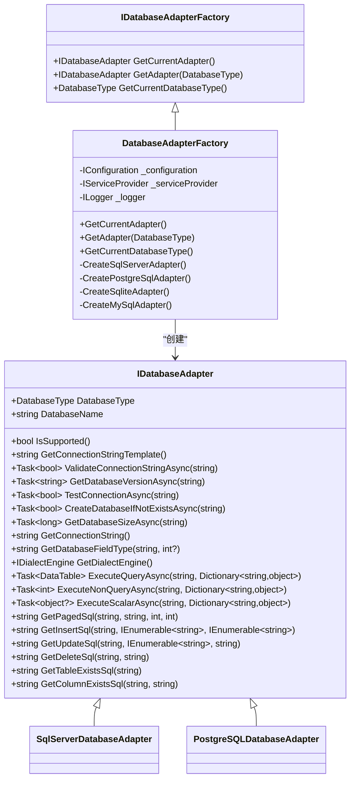
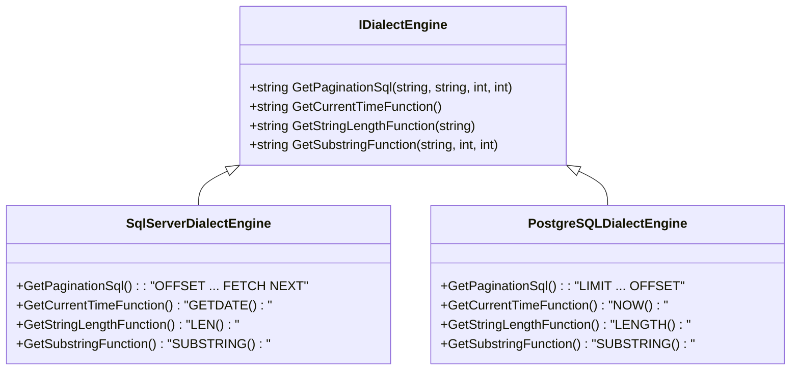
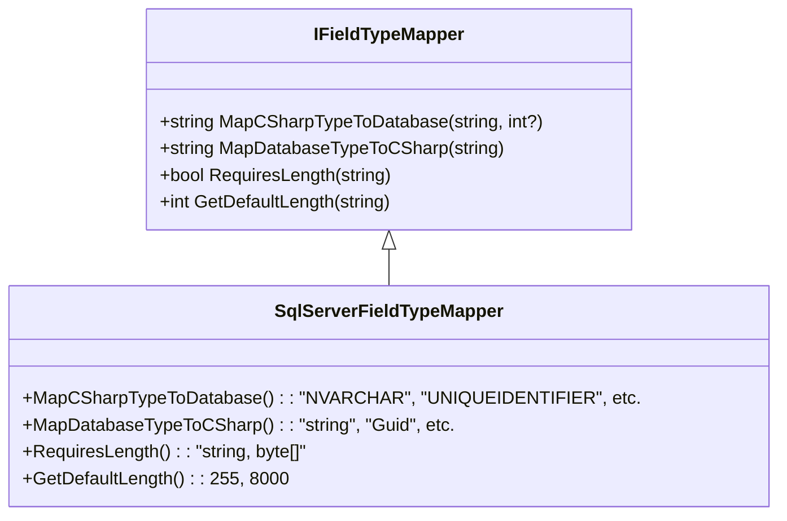
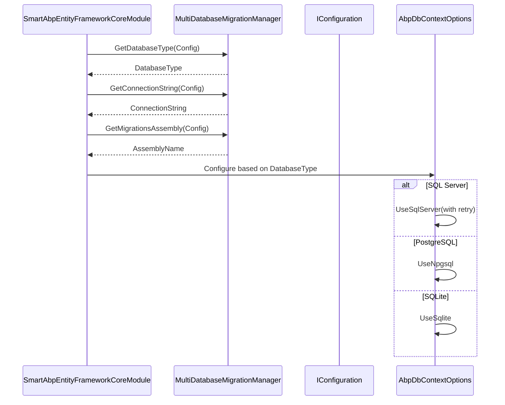

# 多数据库支持

<cite>
**本文档引用的文件**  
- [IDatabaseAdapter.cs](file://src/SmartAbp.Database.Abstraction/Adapters/IDatabaseAdapter.cs)
- [DatabaseAdapterFactory.cs](file://src/SmartAbp.Database.Abstraction/Adapters/Implementations/DatabaseAdapterFactory.cs)
- [IDialectEngine.cs](file://src/SmartAbp.Database.Abstraction/Dialects/IDialectEngine.cs)
- [IFieldTypeMapper.cs](file://src/SmartAbp.Database.Abstraction/Mappers/IFieldTypeMapper.cs)
- [SmartAbpEntityFrameworkCoreModule.cs](file://src/SmartAbp.EntityFrameworkCore/EntityFrameworkCore/SmartAbpEntityFrameworkCoreModule.cs)
- [docker-compose.databases.yml](file://docker-compose.databases.yml)
- [SqlServerDialectEngine.cs](file://src/SmartAbp.Database.Abstraction/Dialects/Implementations/SqlServerDialectEngine.cs)
- [PostgreSQLDialectEngine.cs](file://src/SmartAbp.Database.Abstraction/Dialects/Implementations/PostgreSQLDialectEngine.cs)
- [SqlServerFieldTypeMapper.cs](file://src/SmartAbp.Database.Abstraction/Mappers/Implementations/SqlServerFieldTypeMapper.cs)
- [MultiDatabaseMigrationManager.cs](file://src/SmartAbp.EntityFrameworkCore/EntityFrameworkCore/MultiDatabaseMigrationManager.cs)
</cite>

## 目录
1. [引言](#引言)
2. [核心抽象接口设计](#核心抽象接口设计)
3. [数据库适配器工厂机制](#数据库适配器工厂机制)
4. [数据库方言差异处理](#数据库方言差异处理)
5. [字段类型映射机制](#字段类型映射机制)
6. [EF Core模块服务注册](#ef-core模块服务注册)
7. [多数据库开发环境配置](#多数据库开发环境配置)
8. [数据库切换配置步骤](#数据库切换配置步骤)
9. [结论](#结论)

## 引言
hxlot项目通过一套灵活的抽象层实现了对多种数据库的无缝支持。该设计允许系统在SQL Server、PostgreSQL、MySQL和SQLite之间动态切换，而无需修改核心业务逻辑。本文档深入解析其架构设计，涵盖接口定义、工厂模式、方言处理、类型映射及容器化开发环境配置。

## 核心抽象接口设计

hxlot项目定义了三个核心抽象接口，构成了多数据库支持的基础：

- **`IDatabaseAdapter`**：数据库适配器接口，封装了与特定数据库交互的所有操作，包括连接管理、SQL执行、元数据查询等。
- **`IDialectEngine`**：SQL方言引擎接口，负责处理不同数据库在SQL语法上的差异，如分页、函数调用等。
- **`IFieldTypeMapper`**：字段类型映射接口，实现C#类型与数据库字段类型的双向映射。

这些接口通过依赖注入机制解耦，确保了系统的可扩展性和可维护性。

**本节来源**  
- [IDatabaseAdapter.cs](file://src/SmartAbp.Database.Abstraction/Adapters/IDatabaseAdapter.cs)
- [IDialectEngine.cs](file://src/SmartAbp.Database.Abstraction/Dialects/IDialectEngine.cs)
- [IFieldTypeMapper.cs](file://src/SmartAbp.Database.Abstraction/Mappers/IFieldTypeMapper.cs)

## 数据库适配器工厂机制

`DatabaseAdapterFactory` 是实现多数据库动态创建的核心组件。它根据配置文件中的 `Database:Type` 值，通过策略模式返回对应的适配器实例。



**图示来源**  
- [DatabaseAdapterFactory.cs](file://src/SmartAbp.Database.Abstraction/Adapters/Implementations/DatabaseAdapterFactory.cs)
- [IDatabaseAdapter.cs](file://src/SmartAbp.Database.Abstraction/Adapters/IDatabaseAdapter.cs)

## 数据库方言差异处理

不同数据库在SQL语法上存在显著差异，`IDialectEngine` 接口通过具体实现来处理这些差异。例如，分页语法在SQL Server和PostgreSQL中完全不同：



**图示来源**  
- [SqlServerDialectEngine.cs](file://src/SmartAbp.Database.Abstraction/Dialects/Implementations/SqlServerDialectEngine.cs)
- [PostgreSQLDialectEngine.cs](file://src/SmartAbp.Database.Abstraction/Dialects/Implementations/PostgreSQLDialectEngine.cs)

## 字段类型映射机制

`IFieldTypeMapper` 接口负责将通用的C#类型转换为特定数据库的数据类型。例如，C#的 `Guid` 类型在SQL Server中映射为 `UNIQUEIDENTIFIER`，而在PostgreSQL中映射为 `uuid`。



**图示来源**  
- [IFieldTypeMapper.cs](file://src/SmartAbp.Database.Abstraction/Mappers/IFieldTypeMapper.cs)
- [SqlServerFieldTypeMapper.cs](file://src/SmartAbp.Database.Abstraction/Mappers/Implementations/SqlServerFieldTypeMapper.cs)

## EF Core模块服务注册

`SmartAbpEntityFrameworkCoreModule` 模块根据当前数据库类型动态注册不同的EF Core服务。通过 `MultiDatabaseMigrationManager` 读取配置，决定使用 `UseSqlServer`、`UseNpgsql` 或 `UseSqlite`。



**图示来源**  
- [SmartAbpEntityFrameworkCoreModule.cs](file://src/SmartAbp.EntityFrameworkCore/EntityFrameworkCore/SmartAbpEntityFrameworkCoreModule.cs)
- [MultiDatabaseMigrationManager.cs](file://src/SmartAbp.EntityFrameworkCore/EntityFrameworkCore/MultiDatabaseMigrationManager.cs)

## 多数据库开发环境配置

`docker-compose.databases.yml` 文件定义了完整的多数据库开发环境，包含：

- **PostgreSQL**: 端口 5432，用于生产环境模拟
- **MySQL**: 端口 3306，用于高性价比场景
- **SQL Server**: 端口 1433，用于企业级应用
- **管理工具**: pgAdmin 和 phpMyAdmin 分别用于PostgreSQL和MySQL的可视化管理

启动命令：
```bash
docker-compose -f docker-compose.databases.yml up -d
```

每个服务均配置了健康检查和初始化脚本，确保容器启动后数据库已正确初始化。

**本节来源**  
- [docker-compose.databases.yml](file://docker-compose.databases.yml)

## 数据库切换配置步骤

1. **修改配置文件**：在 `appsettings.json` 中设置：
   ```json
   {
     "Database": {
       "Type": "PostgreSQL"
     }
   }
   ```
   支持值：`SqlServer`、`PostgreSQL`、`MySQL`、`SQLite`

2. **配置连接字符串**：在 `ConnectionStrings` 中添加对应数据库的连接字符串：
   ```json
   "ConnectionStrings": {
     "PostgreSQL": "Host=localhost;Port=5432;Database=smartabp;Username=smartabp_user;Password=SmartAbp@2025"
   }
   ```

3. **验证配置**：确保 `MultiDatabaseMigrationManager` 能正确解析配置并加载对应迁移程序集。

4. **注意事项**：
   - MySQL和SQLite适配器目前处于开发阶段，建议生产环境使用SQL Server或PostgreSQL。
   - 切换数据库后需重新运行迁移命令以创建对应数据库结构。
   - 不同数据库的性能特征不同，需根据实际负载进行调优。

**本节来源**  
- [MultiDatabaseMigrationManager.cs](file://src/SmartAbp.EntityFrameworkCore/EntityFrameworkCore/MultiDatabaseMigrationManager.cs)
- [DatabaseAdapterFactory.cs](file://src/SmartAbp.Database.Abstraction/Adapters/Implementations/DatabaseAdapterFactory.cs)

## 结论
hxlot项目通过 `IDatabaseAdapter`、`IDialectEngine` 和 `IFieldTypeMapper` 三大抽象接口，结合工厂模式和依赖注入，实现了灵活的多数据库支持。开发者可通过简单配置在不同数据库间切换，同时系统通过 `docker-compose` 提供了完整的开发环境支持，极大提升了开发效率和部署灵活性。