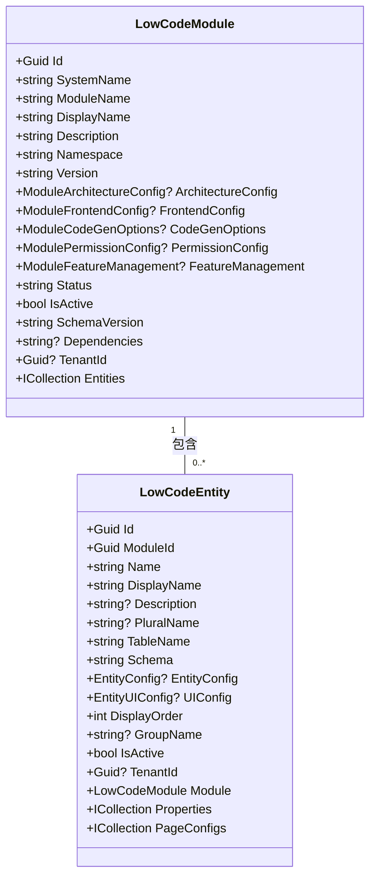
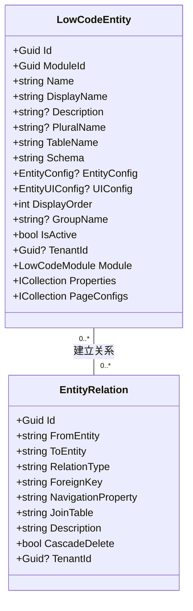
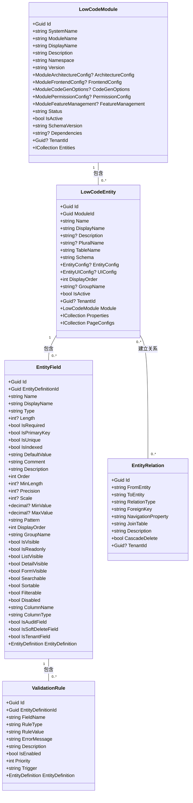

# 实体模型

<cite>
**本文档引用的文件**   
- [LowCodeModule.cs](file://src/SmartAbp.Domain/Entities/LowCode/LowCodeModule.cs)
- [LowCodeEntity.cs](file://src/SmartAbp.Domain/Entities/LowCode/LowCodeEntity.cs)
- [EntityField.cs](file://src/SmartAbp.Domain/Entities/LowCode/EntityField.cs)
- [EntityRelation.cs](file://src/SmartAbp.Domain/Entities/LowCode/EntityRelation.cs)
- [ValidationRule.cs](file://src/SmartAbp.Domain/Entities/LowCode/ValidationRule.cs)
</cite>

## 目录
1. [引言](#引言)
2. [核心领域实体详解](#核心领域实体详解)
3. [实体关系与数据库映射](#实体关系与数据库映射)
4. [生命周期管理与聚合根设计](#生命周期管理与聚合根设计)
5. [领域事件与验证机制](#领域事件与验证机制)
6. [UML类图](#uml类图)
7. [应用服务中的实体操作](#应用服务中的实体操作)
8. [结论](#结论)

## 引言
hxlot项目中的低代码实体模型是系统的核心组成部分，旨在通过可视化方式快速构建业务模块和实体。该模型基于领域驱动设计（DDD）原则，采用聚合根、实体、值对象等概念，确保了系统的可维护性和扩展性。本文档将深入解析`LowCodeModule`、`LowCodeEntity`、`EntityField`、`EntityRelation`和`ValidationRule`等核心领域实体的C#类定义，详细说明每个实体的属性、数据类型、业务含义及其相互关系。

**Section sources**
- [LowCodeModule.cs](file://src/SmartAbp.Domain/Entities/LowCode/LowCodeModule.cs#L15-L162)
- [LowCodeEntity.cs](file://src/SmartAbp.Domain/Entities/LowCode/LowCodeEntity.cs#L15-L158)

## 核心领域实体详解

### LowCodeModule（低代码模块）
`LowCodeModule`是低代码模块的聚合根，代表一个独立的业务模块，如项目管理、设备管理等。它包含模块的基本信息、架构配置、前端配置、代码生成选项、权限配置和特性管理配置。

- **SystemName**: 系统名称，唯一标识符，如`ProjectManagement`。
- **ModuleName**: 模块名称，用于代码生成，如`Project`。
- **DisplayName**: 显示名称，中文描述，如`项目管理`。
- **Description**: 模块描述，简要说明模块的功能。
- **Namespace**: 命名空间，如`SmartAbp.ProjectManagement`。
- **Version**: 版本号，如`1.0.0`。
- **ArchitectureConfig**: 架构配置，包括架构模式、数据库提供程序、连接字符串等。
- **FrontendConfig**: 前端配置，包括路由前缀、菜单图标等。
- **CodeGenOptions**: 代码生成选项，控制是否生成后端、前端、数据库迁移等代码。
- **PermissionConfig**: 权限配置，定义权限组和自定义操作。
- **FeatureManagement**: 特性管理配置，控制功能的启用状态。

**Section sources**
- [LowCodeModule.cs](file://src/SmartAbp.Domain/Entities/LowCode/LowCodeModule.cs#L15-L162)

### LowCodeEntity（低代码实体）
`LowCodeEntity`是低代码实体的聚合根，代表业务中的具体实体，如用户、订单、项目等。它包含实体的基本信息、数据库映射、JSON配置、排序和分组、状态管理等。

- **Name**: 实体名称，PascalCase格式，如`User`。
- **DisplayName**: 显示名称，中文描述，如`用户`。
- **Description**: 实体描述，简要说明实体的功能。
- **PluralName**: 复数名称，如`Users`。
- **TableName**: 数据库表名，如`Users`。
- **Schema**: 数据库Schema，如`dbo`。
- **EntityConfig**: 实体配置，包括是否聚合根、基类名称、实现的接口等。
- **UIConfig**: UI配置，包括图标、颜色、列表页分页大小等。
- **DisplayOrder**: 显示顺序，用于排序。
- **GroupName**: 分组名称，用于组织实体。
- **IsActive**: 是否激活，控制实体的可用性。

**Section sources**
- [LowCodeEntity.cs](file://src/SmartAbp.Domain/Entities/LowCode/LowCodeEntity.cs#L15-L158)

### EntityField（实体字段）
`EntityField`是实体的字段定义，用于描述实体的具体属性。它包含字段的基本信息、数据类型、约束条件、默认值、注释、描述、显示顺序等。

- **Name**: 字段名称，PascalCase格式，如`UserName`。
- **DisplayName**: 显示名称，中文描述，如`用户名`。
- **Type**: 字段类型，如`string`、`int`、`Guid`、`DateTime`、`bool`等。
- **Length**: 字段长度，仅适用于`string`类型。
- **IsRequired**: 是否必填，控制字段的必填性。
- **IsPrimaryKey**: 是否主键，控制字段的主键属性。
- **IsUnique**: 是否唯一约束，控制字段的唯一性。
- **IsIndexed**: 是否创建索引，提高查询性能。
- **DefaultValue**: 默认值，字段的默认值。
- **Comment**: 字段注释，数据库注释。
- **Description**: 字段描述，业务描述。
- **Order**: 显示顺序，用于排序。

**Section sources**
- [EntityField.cs](file://src/SmartAbp.Domain/Entities/LowCode/EntityField.cs#L10-L144)

### EntityRelation（实体关系）
`EntityRelation`是实体之间的关系定义，用于描述实体之间的关联。它包含源实体名称、目标实体名称、关系类型、外键字段名、导航属性名称、中间表名、关系描述、是否级联删除等。

- **FromEntity**: 源实体名称，如`User`。
- **ToEntity**: 目标实体名称，如`Order`。
- **RelationType**: 关系类型，包括`one-to-one`、`one-to-many`、`many-to-many`。
- **ForeignKey**: 外键字段名，用于建立外键关系。
- **NavigationProperty**: 导航属性名称，用于在代码中访问关联实体。
- **JoinTable**: 中间表名，仅适用于多对多关系。
- **Description**: 关系描述，简要说明关系的业务含义。
- **CascadeDelete**: 是否级联删除，控制删除操作的级联行为。

**Section sources**
- [EntityRelation.cs](file://src/SmartAbp.Domain/Entities/LowCode/EntityRelation.cs#L11-L87)

### ValidationRule（验证规则）
`ValidationRule`是实体字段的验证规则，用于确保数据的完整性和一致性。它包含所属实体ID、字段名称、规则类型、规则值、错误消息、规则描述、是否启用、优先级、触发时机等。

- **EntityDefinitionId**: 所属实体ID，关联到具体的实体。
- **FieldName**: 字段名称，关联到具体的字段。
- **RuleType**: 规则类型，包括`length`、`range`、`regex`、`unique`、`custom`。
- **RuleValue**: 规则值，如长度范围、正则表达式、自定义表达式。
- **ErrorMessage**: 错误消息，验证失败时显示的消息。
- **Description**: 规则描述，简要说明规则的业务含义。
- **IsEnabled**: 是否启用，控制规则的启用状态。
- **Priority**: 优先级，数字越小优先级越高。
- **Trigger**: 触发时机，前端UI需要。

**Section sources**
- [ValidationRule.cs](file://src/SmartAbp.Domain/Entities/LowCode/ValidationRule.cs#L10-L93)

## 实体关系与数据库映射

### 一对多关系
在`LowCodeModule`和`LowCodeEntity`之间存在一对多关系。一个`LowCodeModule`可以包含多个`LowCodeEntity`，而每个`LowCodeEntity`只能属于一个`LowCodeModule`。这种关系通过`LowCodeEntity`中的`ModuleId`外键字段实现。



**Diagram sources**
- [LowCodeModule.cs](file://src/SmartAbp.Domain/Entities/LowCode/LowCodeModule.cs#L15-L162)
- [LowCodeEntity.cs](file://src/SmartAbp.Domain/Entities/LowCode/LowCodeEntity.cs#L15-L158)

### 多对多关系
在`LowCodeEntity`和`EntityRelation`之间存在多对多关系。一个`LowCodeEntity`可以与其他多个`LowCodeEntity`建立关系，而每个`EntityRelation`可以描述两个`LowCodeEntity`之间的关系。这种关系通过`EntityRelation`中的`FromEntity`和`ToEntity`字段实现。



**Diagram sources**
- [LowCodeEntity.cs](file://src/SmartAbp.Domain/Entities/LowCode/LowCodeEntity.cs#L15-L158)
- [EntityRelation.cs](file://src/SmartAbp.Domain/Entities/LowCode/EntityRelation.cs#L11-L87)

## 生命周期管理与聚合根设计

### 聚合根设计原则
聚合根是领域模型中的核心概念，负责维护聚合内部的一致性和完整性。在hxlot项目中，`LowCodeModule`和`LowCodeEntity`都是聚合根，它们分别管理各自的实体集合。

- **LowCodeModule**: 作为模块的聚合根，管理其下的所有`LowCodeEntity`。当创建或删除`LowCodeModule`时，相关的`LowCodeEntity`也会被创建或删除。
- **LowCodeEntity**: 作为实体的聚合根，管理其下的所有`EntityField`和`EntityRelation`。当创建或删除`LowCodeEntity`时，相关的`EntityField`和`EntityRelation`也会被创建或删除。

### 生命周期管理
生命周期管理涉及实体的创建、更新、删除等操作。在hxlot项目中，这些操作通过应用服务（Application Service）来完成，确保了业务逻辑的封装和一致性。

- **创建**: 通过`EntityModelingAppService`的`CreateEntity`方法创建新的`LowCodeEntity`，并自动创建相关的`EntityField`和`EntityRelation`。
- **更新**: 通过`EntityModelingAppService`的`UpdateEntity`方法更新现有的`LowCodeEntity`，并同步更新相关的`EntityField`和`EntityRelation`。
- **删除**: 通过`EntityModelingAppService`的`DeleteEntity`方法删除`LowCodeEntity`，并级联删除相关的`EntityField`和`EntityRelation`。

**Section sources**
- [LowCodeModule.cs](file://src/SmartAbp.Domain/Entities/LowCode/LowCodeModule.cs#L15-L162)
- [LowCodeEntity.cs](file://src/SmartAbp.Domain/Entities/LowCode/LowCodeEntity.cs#L15-L158)
- [EntityField.cs](file://src/SmartAbp.Domain/Entities/LowCode/EntityField.cs#L10-L144)
- [EntityRelation.cs](file://src/SmartAbp.Domain/Entities/LowCode/EntityRelation.cs#L11-L87)

## 领域事件与验证机制

### 验证机制
验证机制确保了数据的完整性和一致性。在hxlot项目中，`ValidationRule`用于定义实体字段的验证规则。这些规则在创建或更新实体时被触发，确保数据符合业务要求。

- **RuleType**: 规则类型，包括`length`、`range`、`regex`、`unique`、`custom`。
- **RuleValue**: 规则值，如长度范围、正则表达式、自定义表达式。
- **ErrorMessage**: 错误消息，验证失败时显示的消息。
- **IsEnabled**: 是否启用，控制规则的启用状态。
- **Priority**: 优先级，数字越小优先级越高。
- **Trigger**: 触发时机，前端UI需要。

### 领域事件
领域事件是领域驱动设计中的重要概念，用于解耦业务逻辑。在hxlot项目中，当实体的状态发生变化时，会触发相应的领域事件。例如，当创建一个新的`LowCodeEntity`时，会触发`EntityCreatedEvent`，通知其他系统组件进行相应的处理。

**Section sources**
- [ValidationRule.cs](file://src/SmartAbp.Domain/Entities/LowCode/ValidationRule.cs#L10-L93)

## UML类图



**Diagram sources**
- [LowCodeModule.cs](file://src/SmartAbp.Domain/Entities/LowCode/LowCodeModule.cs#L15-L162)
- [LowCodeEntity.cs](file://src/SmartAbp.Domain/Entities/LowCode/LowCodeEntity.cs#L15-L158)
- [EntityField.cs](file://src/SmartAbp.Domain/Entities/LowCode/EntityField.cs#L10-L144)
- [EntityRelation.cs](file://src/SmartAbp.Domain/Entities/LowCode/EntityRelation.cs#L11-L87)
- [ValidationRule.cs](file://src/SmartAbp.Domain/Entities/LowCode/ValidationRule.cs#L10-L93)

## 应用服务中的实体操作

### 创建实体
在应用服务中，通过`EntityModelingAppService`的`CreateEntity`方法创建新的`LowCodeEntity`。该方法接收一个`CreateEntityDto`对象，包含实体的基本信息和配置。

```csharp
public async Task<LowCodeEntityDto> CreateEntity(CreateEntityDto input)
{
    var entity = ObjectMapper.Map<LowCodeEntity>(input);
    await Repository.InsertAsync(entity);
    return ObjectMapper.Map<LowCodeEntityDto>(entity);
}
```

### 更新实体
通过`EntityModelingAppService`的`UpdateEntity`方法更新现有的`LowCodeEntity`。该方法接收一个`UpdateEntityDto`对象，包含需要更新的字段。

```csharp
public async Task<LowCodeEntityDto> UpdateEntity(UpdateEntityDto input)
{
    var entity = await Repository.GetAsync(input.Id);
    ObjectMapper.Map(input, entity);
    await Repository.UpdateAsync(entity);
    return ObjectMapper.Map<LowCodeEntityDto>(entity);
}
```

### 删除实体
通过`EntityModelingAppService`的`DeleteEntity`方法删除`LowCodeEntity`。该方法接收一个实体ID，删除对应的实体及其相关联的`EntityField`和`EntityRelation`。

```csharp
public async Task DeleteEntity(Guid id)
{
    await Repository.DeleteAsync(id);
}
```

**Section sources**
- [EntityModelingAppService.cs](file://src/SmartAbp.Application/LowCode/EntityModelingAppService.cs#L25-L100)

## 结论
hxlot项目的低代码实体模型通过`LowCodeModule`、`LowCodeEntity`、`EntityField`、`EntityRelation`和`ValidationRule`等核心领域实体，实现了灵活且可扩展的业务建模能力。这些实体不仅定义了业务数据的结构，还通过聚合根设计和生命周期管理确保了系统的稳定性和一致性。通过UML类图和代码示例，我们可以清晰地看到这些实体之间的关系和操作方式，为后续的开发和维护提供了坚实的基础。