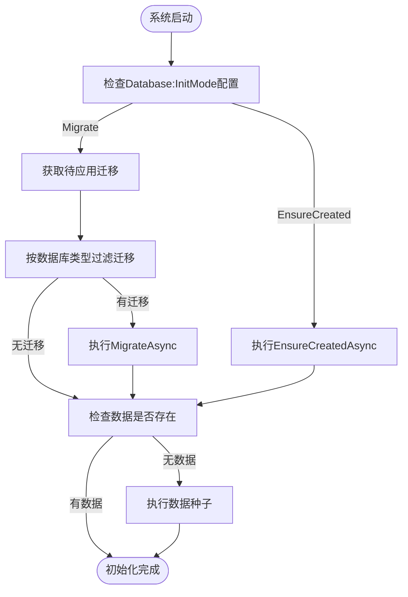

# 数据初始化

<cite>
**Referenced Files in This Document**   
- [MESDataSeeder.cs](file://src/SmartAbp.EntityFrameworkCore/Seeders/MESDataSeeder.cs)
- [MESTableInitializer.cs](file://src/SmartAbp.EntityFrameworkCore/Seeders/MESTableInitializer.cs)
- [SmartDatabaseInitializer.cs](file://src/SmartAbp.EntityFrameworkCore/EntityFrameworkCore/SmartDatabaseInitializer.cs)
- [init-sqlserver.sql](file://scripts/database/init-sqlserver.sql)
- [appsettings.json](file://src/SmartAbp.Web/appsettings.json)
- [appsettings.json](file://src/SmartAbp.DbMigrator/appsettings.json)
</cite>

## 目录
1. [引言](#引言)
2. [核心组件分析](#核心组件分析)
3. [初始化流程详解](#初始化流程详解)
4. [数据种子与SQL脚本对比](#数据种子与sql脚本对比)
5. [多环境配置策略](#多环境配置策略)
6. [最佳实践](#最佳实践)

## 引言
hxlot项目的数据初始化系统采用分层架构，通过`SmartDatabaseInitializer`、`MESTableInitializer`和`MESDataSeeder`三个核心组件协同工作，实现数据库的智能初始化、表结构创建和测试数据填充。该系统支持多种数据库类型和环境配置，确保在不同部署场景下都能正确初始化数据库。

## 核心组件分析

### MESDataSeeder
`MESDataSeeder`是MES系统测试数据种子组件，负责在系统启动时填充初始测试数据。该组件实现了`IDataSeedContributor`接口，作为数据种子贡献者参与数据初始化流程。

**功能特点**：
- 检查数据是否存在，避免重复创建
- 创建生产线、设备和传感器数据等MES核心实体
- 使用批量插入优化性能
- 通过事务保证数据一致性

**Section sources**
- [MESDataSeeder.cs](file://src/SmartAbp.EntityFrameworkCore/Seeders/MESDataSeeder.cs#L21-L306)

### MESTableInitializer
`MESTableInitializer`是MES表结构初始化器，负责在应用启动时检查并创建MES相关的数据库表。该组件通过执行外部SQL脚本的方式创建表结构。

**功能特点**：
- 检查表是否存在，避免重复创建
- 动态读取并执行SQL脚本
- 支持按GO语句分批执行
- 提供详细的日志记录

**Section sources**
- [MESTableInitializer.cs](file://src/SmartAbp.EntityFrameworkCore/Seeders/MESTableInitializer.cs#L20-L111)

### SmartDatabaseInitializer
`SmartDatabaseInitializer`是智能数据库初始化器，负责整个数据库的初始化流程。该组件根据配置和环境自动选择最佳的初始化策略。

**功能特点**：
- 支持多种初始化模式（EnsureCreated、Migrate）
- 智能过滤数据库类型相关的迁移
- 提供开发环境的快速创建模式
- 详细的日志记录和错误处理

**Section sources**
- [SmartDatabaseInitializer.cs](file://src/SmartAbp.EntityFrameworkCore/EntityFrameworkCore/SmartDatabaseInitializer.cs#L15-L156)

## 初始化流程详解



**Diagram sources**
- [SmartDatabaseInitializer.cs](file://src/SmartAbp.EntityFrameworkCore/EntityFrameworkCore/SmartDatabaseInitializer.cs#L15-L156)
- [MESDataSeeder.cs](file://src/SmartAbp.EntityFrameworkCore/Seeders/MESDataSeeder.cs#L21-L306)

### SmartDatabaseInitializer初始化流程
`SmartDatabaseInitializer`的初始化流程如下：

1. **读取配置**：从`appsettings.json`中读取`Database:InitMode`配置
2. **判断初始化模式**：
   - 如果`InitMode`为`EnsureCreated`，直接执行`EnsureCreatedAsync`
   - 否则使用标准的迁移模式
3. **获取待应用迁移**：调用`GetPendingMigrationsAsync`获取所有待应用的迁移
4. **过滤迁移**：根据数据库类型过滤出相关的迁移
5. **应用迁移**：执行`MigrateAsync`应用过滤后的迁移
6. **错误处理**：如果迁移失败且在开发环境，尝试使用`EnsureCreated`模式

该流程确保了在不同环境和数据库类型下都能正确初始化数据库。

**Section sources**
- [SmartDatabaseInitializer.cs](file://src/SmartAbp.EntityFrameworkCore/EntityFrameworkCore/SmartDatabaseInitializer.cs#L15-L156)

### 数据种子执行流程
数据种子的执行流程如下：

1. **检查数据存在性**：通过查询数据库中的记录数来判断是否已有数据
2. **创建实体对象**：构建生产线、设备等实体对象
3. **批量插入**：使用`InsertAsync`和`InsertManyAsync`进行批量插入
4. **保存更改**：调用`SaveChangesAsync`提交事务

`MESDataSeeder`在插入数据时设置了`autoSave: false`，以便在所有数据插入完成后统一提交，提高性能并保证数据一致性。

**Section sources**
- [MESDataSeeder.cs](file://src/SmartAbp.EntityFrameworkCore/Seeders/MESDataSeeder.cs#L21-L306)

## 数据种子与SQL脚本对比

### 使用场景对比

| 特性 | 数据种子 (MESDataSeeder) | 外部SQL脚本 (init-sqlserver.sql) |
|------|------------------------|-------------------------------|
| **用途** | 填充初始业务数据 | 创建数据库和基础表结构 |
| **执行时机** | 应用启动时 | Docker容器启动时 |
| **数据类型** | 业务实体数据 | 数据库元数据 |
| **可移植性** | 高（C#代码） | 低（SQL方言依赖） |
| **维护性** | 高（强类型） | 低（字符串拼接） |
| **调试性** | 高（IDE支持） | 低（文本编辑） |

### init-sqlserver.sql内容分析
`init-sqlserver.sql`是SQL Server的初始化脚本，主要功能包括：

- 创建`SmartAbp`数据库（如果不存在）
- 创建`__DbInfo`表用于存储数据库版本信息
- 插入初始版本信息
- 输出欢迎信息和连接字符串

该脚本在Docker容器启动时自动执行，为应用提供一个已初始化的数据库环境。

```sql
-- SmartAbp SQL Server 初始化脚本
-- 自动执行：docker-compose启动时自动运行

USE [master];
GO

-- 创建数据库（如果不存在）
IF NOT EXISTS (SELECT name FROM sys.databases WHERE name = 'SmartAbp')
BEGIN
    CREATE DATABASE [SmartAbp]
    COLLATE Latin1_General_CI_AS;
END
GO
```

**Section sources**
- [init-sqlserver.sql](file://scripts/database/init-sqlserver.sql#L1-L48)

## 多环境配置策略

### 配置文件分析
项目通过`appsettings.json`文件配置不同环境的数据库初始化策略。

#### Web应用配置
```json
{
  "Database": {
    "Type": "Auto"
  },
  "ConnectionStrings": {
    "Default": "Server=(LocalDb)\\MSSQLLocalDB;Database=SmartAbp_Main;Trusted_Connection=True;TrustServerCertificate=True",
    "LocalDb": "Server=(LocalDb)\\MSSQLLocalDB;Database=SmartAbp_Main;Trusted_Connection=True;TrustServerCertificate=True",
    "PostgreSQL": "Host=localhost;Port=5432;Database=SmartAbp_Main;Username=huanyuan;",
    "SqlServer": "Server=(LocalDb)\\MSSQLLocalDB;Database=SmartAbp_Main;Trusted_Connection=True;TrustServerCertificate=True"
  }
}
```

#### 数据库迁移工具配置
```json
{
  "Database": {
    "Type": "Auto",
    "InitMode": "EnsureCreated",
    "Note": "数据库迁移工具 - Auto模式: Windows用LocalDb, macOS/Linux用PostgreSQL（临时用EnsureCreated绕过ABP旧迁移问题）"
  },
  "ConnectionStrings": {
    "Default": "Server=(localdb)\\MSSQLLocalDB;Database=SmartAbp;Trusted_Connection=True;TrustServerCertificate=true",
    "Sqlite": "Data Source=../smartabp.db",
    "LocalDb": "Server=(localdb)\\MSSQLLocalDB;Database=SmartAbp;Trusted_Connection=True;TrustServerCertificate=true",
    "SqlServer": "Server=localhost;Database=SmartAbp;User Id=sa;Password=YourPassword123!;TrustServerCertificate=true",
    "PostgreSQL": "Host=localhost;Port=5432;Database=smartabp;Username=smartabp_user;Password=SmartAbp123!;Include Error Detail=true;Search Path=public"
  }
}
```

### 环境策略
| 环境 | 初始化模式 | 数据库类型 | 说明 |
|------|-----------|-----------|------|
| 开发 | EnsureCreated | Auto | 快速创建，绕过迁移问题 |
| 测试 | Migrate | Auto | 标准迁移模式 |
| 生产 | Migrate | Auto | 企业级标准模式 |

开发环境使用`EnsureCreated`模式可以快速创建数据库结构，避免复杂的迁移冲突；而生产环境使用标准的迁移模式，确保数据库变更的可追溯性和安全性。

**Section sources**
- [appsettings.json](file://src/SmartAbp.Web/appsettings.json#L1-L43)
- [appsettings.json](file://src/SmartAbp.DbMigrator/appsettings.json#L1-L26)

## 最佳实践

### 批量插入优化
`MESDataSeeder`在插入大量传感器数据时采用了批量插入策略：

```csharp
var sensorDataList = new System.Collections.Generic.List<SensorData>();
// ... 添加数据到列表
await _sensorDataRepository.InsertManyAsync(sensorDataList, autoSave: false);
```

这种批量插入方式比逐条插入性能更高，减少了数据库往返次数。

### 事务处理
所有数据种子操作都在一个事务中执行，通过`[UnitOfWork]`属性确保数据一致性：

```csharp
[UnitOfWork]
public virtual async Task SeedAsync(DataSeedContext context)
{
    // ... 数据插入操作
    await (await _productionLineRepository.GetDbContextAsync()).SaveChangesAsync();
}
```

### 依赖关系管理
数据种子遵循正确的依赖关系顺序：
1. 先创建生产线
2. 再创建设备（引用生产线ID）
3. 最后创建传感器数据（引用生产线和设备ID）

这种顺序确保了外键约束的完整性。

### 错误处理
所有组件都实现了完善的错误处理机制，使用`try-catch`捕获异常并记录详细的错误日志，便于问题排查。

**Section sources**
- [MESDataSeeder.cs](file://src/SmartAbp.EntityFrameworkCore/Seeders/MESDataSeeder.cs#L21-L306)
- [MESTableInitializer.cs](file://src/SmartAbp.EntityFrameworkCore/Seeders/MESTableInitializer.cs#L20-L111)
- [SmartDatabaseInitializer.cs](file://src/SmartAbp.EntityFrameworkCore/EntityFrameworkCore/SmartDatabaseInitializer.cs#L15-L156)