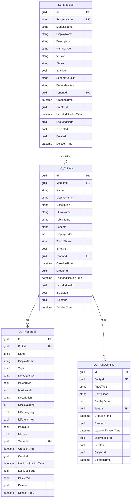

# 数据库设计

<cite>
**本文档引用的文件**
- [LowCodeModule.cs](file://src/SmartAbp.Domain/Entities/LowCode/LowCodeModule.cs)
- [LowCodeEntity.cs](file://src/SmartAbp.Domain/Entities/LowCode/LowCodeEntity.cs)
- [LowCodeModuleConfiguration.cs](file://src/SmartAbp.EntityFrameworkCore/Configurations/LowCodeModuleConfiguration.cs)
- [LowCodeEntityConfiguration.cs](file://src/SmartAbp.EntityFrameworkCore/Configurations/LowCodeEntityConfiguration.cs)
- [SmartAbpDbContext.cs](file://src/SmartAbp.EntityFrameworkCore/EntityFrameworkCore/SmartAbpDbContext.cs)
- [DatabaseType.cs](file://src/SmartAbp.Database.Abstraction/DatabaseType.cs)
- [PostgreSQLDatabaseAdapter.cs](file://src/SmartAbp.Database.Abstraction/Adapters/Implementations/PostgreSQLDatabaseAdapter.cs)
- [SqlServerDatabaseAdapter.cs](file://src/SmartAbp.Database.Abstraction/Adapters/Implementations/SqlServerDatabaseAdapter.cs)
- [SmartAbpDbMigrationService.cs](file://src/SmartAbp.Domain/Data/SmartAbpDbMigrationService.cs)
- [PostgreSQLDialectEngine.cs](file://src/SmartAbp.Database.Abstraction/Dialects/Implementations/PostgreSQLDialectEngine.cs)
- [SqlServerDialectEngine.cs](file://src/SmartAbp.Database.Abstraction/Dialects/Implementations/SqlServerDialectEngine.cs)
</cite>

## 目录
1. [引言](#引言)
2. [核心实体设计](#核心实体设计)
3. [Fluent API 配置](#fluent-api-配置)
4. [数据库迁移工作流程](#数据库迁移工作流程)
5. [多数据库支持机制](#多数据库支持机制)
6. [数据种子与初始化](#数据种子与初始化)
7. [数据库ER图](#数据库er图)

## 引言
本文档详细阐述了hxlot项目中基于Entity Framework Core的代码优先（Code-First）数据库设计。该设计以`LowCodeModule`和`LowCodeEntity`为核心，构建了一个灵活、可扩展的低代码平台数据模型。通过使用Fluent API进行精细的配置，实现了对数据库表结构、索引、外键和数据类型的精确控制。系统支持SQL Server和PostgreSQL等多种数据库，并通过自动化迁移和数据种子机制确保了数据库的可维护性和一致性。

## 核心实体设计

### LowCodeModule 实体
`LowCodeModule`实体是低代码模块的聚合根，对应数据库中的`LC_Modules`表。它定义了低代码模块的核心元数据和配置。

**表结构与字段约束**

| 字段名 | 数据类型 | 约束 | 说明 |
| :--- | :--- | :--- | :--- |
| Id | UNIQUEIDENTIFIER | PRIMARY KEY | 聚合根ID，继承自AuditedAggregateRoot |
| SystemName | NVARCHAR(100) | NOT NULL, UNIQUE | 系统名称，唯一标识符 |
| ModuleName | NVARCHAR(100) | NOT NULL | 模块名称，用于代码生成 |
| DisplayName | NVARCHAR(200) | NOT NULL | 显示名称，中文 |
| Description | NVARCHAR(500) | NULL | 模块描述 |
| Namespace | NVARCHAR(200) | NOT NULL | .NET命名空间 |
| Version | NVARCHAR(20) | NOT NULL | 模块版本号 |
| Status | NVARCHAR(20) | NOT NULL | 模块状态 (Draft, Published, Archived) |
| IsActive | BIT | NOT NULL | 是否激活 |
| SchemaVersion | NVARCHAR(20) | NULL | Schema版本号 |
| Dependencies | NVARCHAR(2000) | NULL | JSON格式的模块依赖列表 |
| TenantId | UNIQUEIDENTIFIER | NULL | 多租户支持 |
| CreationTime | DATETIME2 | NOT NULL | 创建时间，继承自AuditedAggregateRoot |
| CreatorId | UNIQUEIDENTIFIER | NULL | 创建者ID，继承自AuditedAggregateRoot |
| LastModificationTime | DATETIME2 | NULL | 最后修改时间，继承自AuditedAggregateRoot |
| LastModifierId | UNIQUEIDENTIFIER | NULL | 最后修改者ID，继承自AuditedAggregateRoot |
| IsDeleted | BIT | NOT NULL | 软删除标志，继承自ISoftDelete |
| DeleterId | UNIQUEIDENTIFIER | NULL | 删除者ID，继承自ISoftDelete |
| DeletionTime | DATETIME2 | NULL | 删除时间，继承自ISoftDelete |

**JSON配置字段**
该实体包含多个以JSON格式存储的复杂配置对象，通过EF Core的值转换器（Value Converter）进行序列化和反序列化：
- `ArchitectureConfig`: 架构配置，包含数据库提供程序、连接字符串、Schema等。
- `FrontendConfig`: 前端配置，包含路由、菜单、图标等。
- `CodeGenOptions`: 代码生成选项，控制后端、前端、测试代码的生成。
- `PermissionConfig`: 权限配置，定义权限组和自定义操作。
- `FeatureManagement`: 特性管理配置，用于功能开关。

**Section sources**
- [LowCodeModule.cs](file://src/SmartAbp.Domain/Entities/LowCode/LowCodeModule.cs#L15-L162)

### LowCodeEntity 实体
`LowCodeEntity`实体是低代码业务实体的聚合根，对应数据库中的`LC_Entities`表。它定义了业务实体的结构和行为。

**表结构与字段约束**

| 字段名 | 数据类型 | 约束 | 说明 |
| :--- | :--- | :--- | :--- |
| Id | UNIQUEIDENTIFIER | PRIMARY KEY | 聚合根ID，继承自AuditedAggregateRoot |
| ModuleId | UNIQUEIDENTIFIER | NOT NULL, FOREIGN KEY | 所属模块ID，外键关联`LC_Modules` |
| Name | NVARCHAR(100) | NOT NULL | 实体名称 (PascalCase) |
| DisplayName | NVARCHAR(200) | NOT NULL | 显示名称，中文 |
| Description | NVARCHAR(500) | NULL | 实体描述 |
| PluralName | NVARCHAR(100) | NULL | 复数名称 |
| TableName | NVARCHAR(100) | NOT NULL | 数据库表名 |
| Schema | NVARCHAR(50) | NOT NULL | 数据库Schema |
| DisplayOrder | INT | NOT NULL | 显示顺序 |
| GroupName | NVARCHAR(100) | NULL | 分组名称 |
| IsActive | BIT | NOT NULL | 是否激活 |
| TenantId | UNIQUEIDENTIFIER | NULL | 多租户支持 |
| CreationTime | DATETIME2 | NOT NULL | 创建时间，继承自AuditedAggregateRoot |
| CreatorId | UNIQUEIDENTIFIER | NULL | 创建者ID，继承自AuditedAggregateRoot |
| LastModificationTime | DATETIME2 | NULL | 最后修改时间，继承自AuditedAggregateRoot |
| LastModifierId | UNIQUEIDENTIFIER | NULL | 最后修改者ID，继承自AuditedAggregateRoot |
| IsDeleted | BIT | NOT NULL | 软删除标志，继承自ISoftDelete |
| DeleterId | UNIQUEIDENTIFIER | NULL | 删除者ID，继承自ISoftDelete |
| DeletionTime | DATETIME2 | NULL | 删除时间，继承自ISoftDelete |

**JSON配置字段**
- `EntityConfig`: 实体配置，定义是否为聚合根、基类、接口、审计、软删除等特性。
- `UIConfig`: UI配置，定义图标、颜色、分页大小、导出导入功能等。

**Section sources**
- [LowCodeEntity.cs](file://src/SmartAbp.Domain/Entities/LowCode/LowCodeEntity.cs#L15-L158)

## Fluent API 配置

### LowCodeModuleConfiguration
`LowCodeModuleConfiguration`类使用Fluent API对`LowCodeModule`实体进行配置。

**主键与表名**
- 通过`builder.ToTable("LC_Modules")`显式指定表名。
- 主键`Id`由基类`AuditedAggregateRoot<Guid>`定义。

**值转换器 (Value Converters)**
为所有JSON配置属性配置了值转换器，使用`System.Text.Json`进行序列化和反序列化，并采用驼峰命名策略：
```csharp
builder.Property(e => e.ArchitectureConfig)
    .HasConversion(
        v => v == null ? null : JsonSerializer.Serialize(v, jsonOptions),
        v => string.IsNullOrEmpty(v) ? null : JsonSerializer.Deserialize<ModuleArchitectureConfig>(v, jsonOptions));
```

**索引配置**
- `IX_LC_Modules_SystemName_ModuleName`: 在`SystemName`, `ModuleName`, `TenantId`上创建唯一复合索引，确保模块名称在租户内唯一。
- `IX_LC_Modules_Status`: 在`Status`字段上创建索引，优化状态查询。
- `IX_LC_Modules_IsActive`: 在`IsActive`字段上创建索引，优化激活状态查询。

**关系配置**
- `HasMany(e => e.Entities)`: 配置与`LowCodeEntity`的1对多关系。
- `WithOne(e => e.Module)`: 指定`LowCodeEntity`中的导航属性。
- `HasForeignKey(e => e.ModuleId)`: 指定外键。
- `OnDelete(DeleteBehavior.Cascade)`: 配置级联删除，删除模块时自动删除其所有实体。

**Section sources**
- [LowCodeModuleConfiguration.cs](file://src/SmartAbp.EntityFrameworkCore/Configurations/LowCodeModuleConfiguration.cs#L1-L80)

### LowCodeEntityConfiguration
`LowCodeEntityConfiguration`类对`LowCodeEntity`实体进行配置。

**主键与表名**
- 通过`builder.ToTable("LC_Entities")`指定表名。

**值转换器 (Value Converters)**
为`EntityConfig`和`UIConfig`属性配置了与`LowCodeModuleConfiguration`相同的JSON序列化/反序列化逻辑。

**索引配置**
- `IX_LC_Entities_ModuleId_Name`: 在`ModuleId`, `Name`, `TenantId`上创建唯一复合索引，确保实体名称在模块内唯一。
- `IX_LC_Entities_DisplayOrder`: 在`DisplayOrder`字段上创建索引，优化排序查询。
- `IX_LC_Entities_IsActive`: 在`IsActive`字段上创建索引。

**关系配置**
- `HasOne(e => e.Module)`: 配置与`LowCodeModule`的多对1关系。
- `HasMany(e => e.Properties)`: 配置与`LowCodeProperty`的1对多关系，外键为`EntityId`。
- `HasMany(e => e.PageConfigs)`: 配置与`LowCodePageConfig`的1对多关系，外键为`EntityId`。
- 所有关系均配置为`OnDelete(DeleteBehavior.Cascade)`。

**Section sources**
- [LowCodeEntityConfiguration.cs](file://src/SmartAbp.EntityFrameworkCore/Configurations/LowCodeEntityConfiguration.cs#L1-L75)

## 数据库迁移工作流程

### 迁移机制
项目采用Entity Framework Core的Code-First迁移机制。当实体模型发生变化时，通过命令行工具`dotnet ef migrations add <MigrationName>`生成迁移文件。这些文件记录了从当前数据库状态到新状态所需的SQL操作。

**迁移文件结构**
迁移文件包含`Up()`和`Down()`两个方法：
- `Up()`: 应用迁移，执行数据库变更（如创建表、添加列）。
- `Down()`: 回滚迁移，撤销`Up()`方法的操作。

### 工作流程与最佳实践
1. **模型变更**: 开发人员修改`LowCodeModule`或`LowCodeEntity`等实体类。
2. **生成迁移**: 运行`dotnet ef migrations add AddNewFieldToModule`命令，EF Core比较当前模型与上次迁移的模型，生成新的迁移文件。
3. **审查迁移**: 仔细检查生成的SQL脚本，确保其正确性和安全性。
4. **应用迁移**: 在开发和测试环境中运行`dotnet ef database update`，将变更应用到数据库。
5. **版本控制**: 将迁移文件提交到Git，确保所有团队成员同步。
6. **生产部署**: 在生产环境部署时，通过CI/CD管道或手动执行`update-database`命令应用迁移。

**最佳实践**
- **原子性**: 每个迁移应只包含一个逻辑变更。
- **不可变性**: 一旦迁移被推送到共享仓库，就不应修改，应通过创建新的迁移来修正。
- **测试**: 在应用迁移前，在测试数据库上进行充分测试。
- **备份**: 在生产环境应用迁移前，务必备份数据库。

**Section sources**
- [SmartAbpDbMigrationService.cs](file://src/SmartAbp.Domain/Data/SmartAbpDbMigrationService.cs#L41-L82)

## 多数据库支持机制

### 实现架构
项目通过`SmartAbp.Database.Abstraction`模块实现了对多种数据库的支持，核心是**适配器模式**。

**核心组件**
- `DatabaseType` 枚举: 定义了支持的数据库类型（SqlServer, PostgreSQL, SQLite, MySQL）。
- `IDatabaseAdapter` 接口: 定义了数据库操作的契约，如`TestConnectionAsync`, `CreateDatabaseIfNotExistsAsync`。
- `IDialectEngine` 接口: 定义了SQL方言相关的操作，如分页、获取当前时间函数。
- `DatabaseAdapterFactory`: 根据配置创建相应的数据库适配器。

### SQL Server 与 PostgreSQL 支持
系统原生支持SQL Server和PostgreSQL。

**SQL Server 实现**
- `SqlServerDatabaseAdapter`: 实现`IDatabaseAdapter`，处理SQL Server特有的连接和管理操作。
- `SqlServerDialectEngine`: 实现`IDialectEngine`，提供SQL Server的SQL方言，例如：
  - 分页: `OFFSET {skip} ROWS FETCH NEXT {take} ROWS ONLY`
  - 当前时间: `GETUTCDATE()`

**PostgreSQL 实现**
- `PostgreSQLDatabaseAdapter`: 实现`IDatabaseAdapter`，处理PostgreSQL的数据库创建（通过连接到`postgres`数据库）。
- `PostgreSQLDialectEngine`: 实现`IDialectEngine`，提供PostgreSQL的SQL方言，例如：
  - 分页: `LIMIT {take} OFFSET {skip}`
  - 当前时间: `NOW()`

**配置与切换**
数据库类型在`appsettings.json`中通过`Database:Type`配置项指定。`DatabaseAdapterFactory`根据此配置返回相应的适配器实例，实现了无缝的数据库切换。

**Section sources**
- [DatabaseType.cs](file://src/SmartAbp.Database.Abstraction/DatabaseType.cs#L0-L28)
- [PostgreSQLDatabaseAdapter.cs](file://src/SmartAbp.Database.Abstraction/Adapters/Implementations/PostgreSQLDatabaseAdapter.cs#L78-L91)
- [DatabaseAdapterFactory.cs](file://src/SmartAbp.Database.Abstraction/Adapters/Implementations/DatabaseAdapterFactory.cs#L39-L73)
- [PostgreSQLDialectEngine.cs](file://src/SmartAbp.Database.Abstraction/Dialects/Implementations/PostgreSQLDialectEngine.cs#L0-L37)

## 数据种子与初始化

### 数据种子 (Data Seeding)
数据种子用于在数据库创建或迁移后，填充初始的、必需的参考数据。

**实现方式**
在`SmartAbpDbContext`的`OnModelCreating`方法中，通过`builder.Entity<T>().HasData(...)`方法定义种子数据。这些数据在`dotnet ef database update`时自动插入。

**示例**
```csharp
builder.Entity<LowCodeModule>().HasData(
    new LowCodeModule(
        Guid.Parse("..."),
        "SystemManagement",
        "System",
        "系统管理",
        "SmartAbp.SystemManagement")
    {
        Status = "Published",
        IsActive = true
    }
);
```

### 初始化脚本
除了EF Core的种子机制，项目还提供了独立的初始化脚本，位于`scripts/database/`目录下。

**初始化脚本**
- `init-sqlserver.sql`: 为SQL Server初始化数据库、用户和权限。
- `init-postgres.sql`: 为PostgreSQL执行相同操作。
- `init-mysql.sql`: 为MySQL执行相同操作。

**使用方法**
这些脚本通常在首次部署或需要完全重置数据库时使用，通过数据库客户端工具（如`sqlcmd`或`psql`）直接执行。

**Section sources**
- [SmartAbpDbContext.cs](file://src/SmartAbp.EntityFrameworkCore/EntityFrameworkCore/SmartAbpDbContext.cs#L200-L205)

## 数据库ER图



**Diagram sources**
- [LowCodeModule.cs](file://src/SmartAbp.Domain/Entities/LowCode/LowCodeModule.cs#L15-L162)
- [LowCodeEntity.cs](file://src/SmartAbp.Domain/Entities/LowCode/LowCodeEntity.cs#L15-L158)
- [LowCodeProperty.cs](file://src/SmartAbp.Domain/Entities/LowCode/LowCodeProperty.cs#L15-L175)
- [LowCodePageConfig.cs](file://src/SmartAbp.Domain/Entities/LowCode/LowCodePageConfig.cs#L15-L106)