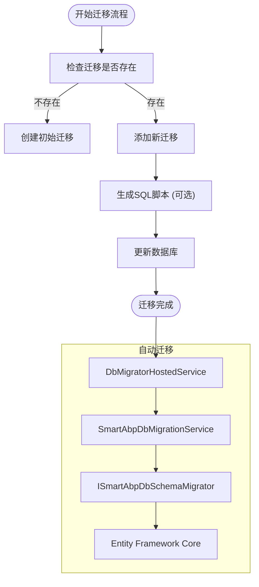
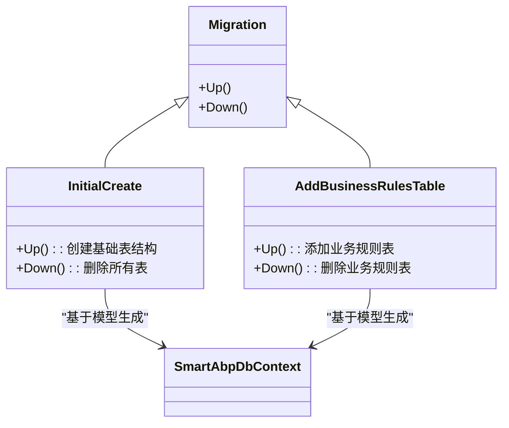
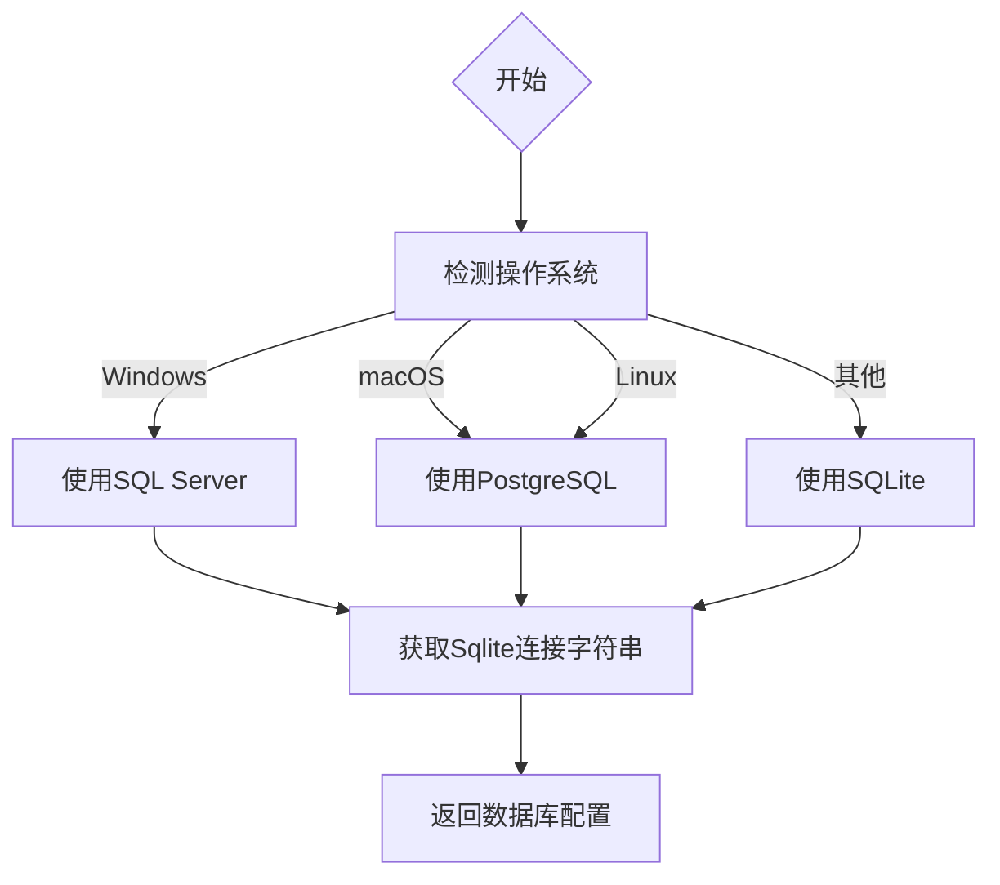
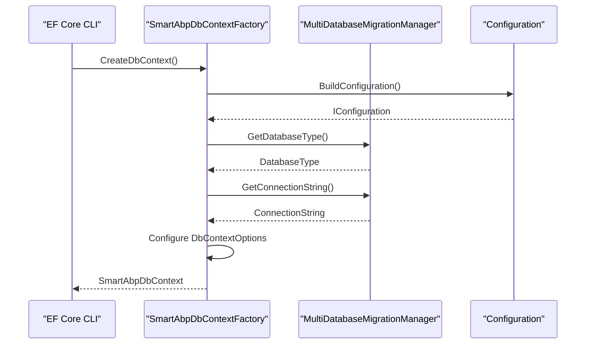

# 迁移与版本控制

<cite>
**本文档中引用的文件**  
- [MultiDatabaseMigrationManager.cs](file://src/SmartAbp.EntityFrameworkCore/EntityFrameworkCore/MultiDatabaseMigrationManager.cs)
- [SmartAbpDbContextFactory.cs](file://src/SmartAbp.EntityFrameworkCore/EntityFrameworkCore/SmartAbpDbContextFactory.cs)
- [SmartAbpDbContext.cs](file://src/SmartAbp.EntityFrameworkCore/EntityFrameworkCore/SmartAbpDbContext.cs)
- [SmartAbpDbMigrationService.cs](file://src/SmartAbp.Domain/Data/SmartAbpDbMigrationService.cs)
- [DbMigratorHostedService.cs](file://src/SmartAbp.DbMigrator/DbMigratorHostedService.cs)
- [Program.cs](file://src/SmartAbp.DbMigrator/Program.cs)
- [CodeGenerationAppService.cs](file://src/SmartAbp.CodeGenerator/Services/CodeGenerationAppService.cs)
</cite>

## 目录
1. [引言](#引言)
2. [数据库迁移工作流程](#数据库迁移工作流程)
3. [迁移文件结构与Up/Down方法解析](#迁移文件结构与updown方法解析)
4. [多数据库迁移管理](#多数据库迁移管理)
5. [设计时上下文工厂的作用](#设计时上下文工厂的作用)
6. [迁移部署最佳实践](#迁移部署最佳实践)
7. [总结](#总结)

## 引言
hxlot项目采用Entity Framework Core进行数据库迁移与版本控制，支持SQL Server、SQLite、PostgreSQL和MySQL等多种数据库。本项目通过`Add-Migration`和`Update-Database`命令实现数据库变更的自动化管理，并结合ABP框架的模块化架构，实现了跨数据库平台的无缝迁移。系统通过`MultiDatabaseMigrationManager`统一管理不同数据库提供程序的迁移逻辑，确保在不同环境下的兼容性和一致性。

## 数据库迁移工作流程
hxlot项目的数据库迁移流程由代码生成服务驱动，完整流程如下：

1. **创建迁移**：调用`dotnet ef migrations add [Name]`命令生成新的迁移文件
2. **生成脚本**：可选择生成幂等SQL脚本用于生产环境部署
3. **更新数据库**：执行`dotnet ef database update`应用迁移
4. **自动迁移**：在应用启动时通过`DbMigratorHostedService`自动执行迁移

该流程在`CodeGenerationAppService`中通过进程调用实现，支持在代码生成过程中自动触发数据库迁移。

**Diagram sources**
- [CodeGenerationAppService.cs](file://src/SmartAbp.CodeGenerator/Services/CodeGenerationAppService.cs#L1182-L1261)
- [SmartAbpDbMigrationService.cs](file://src/SmartAbp.Domain/Data/SmartAbpDbMigrationService.cs#L41-L82)
- [DbMigratorHostedService.cs](file://src/SmartAbp.DbMigrator/DbMigratorHostedService.cs#L25-L45)

**Section sources**
- [CodeGenerationAppService.cs](file://src/SmartAbp.CodeGenerator/Services/CodeGenerationAppService.cs#L1182-L1261)
- [SmartAbpDbMigrationService.cs](file://src/SmartAbp.Domain/Data/SmartAbpDbMigrationService.cs#L41-L82)

## 迁移文件结构与Up/Down方法解析
迁移文件包含`Up`和`Down`两个核心方法，分别用于应用和回滚数据库变更。

- **Up方法**：定义正向迁移操作，如创建表、添加列、修改约束等
- **Down方法**：定义逆向操作，用于回滚到上一版本

系统通过`SmartAbpDbContext`中的`OnModelCreating`方法定义实体模型，EF Core根据模型差异自动生成相应的SQL语句。迁移文件中的SQL语句严格对应实体模型的变更，确保数据结构的一致性。

**Diagram sources**
- [SmartAbpDbContext.cs](file://src/SmartAbp.EntityFrameworkCore/EntityFrameworkCore/SmartAbpDbContext.cs#L0-L461)
- [MultiDatabaseMigrationManager.cs](file://src/SmartAbp.EntityFrameworkCore/EntityFrameworkCore/MultiDatabaseMigrationManager.cs#L12-L146)

**Section sources**
- [SmartAbpDbContext.cs](file://src/SmartAbp.EntityFrameworkCore/EntityFrameworkCore/SmartAbpDbContext.cs#L0-L461)

## 多数据库迁移管理
hxlot项目通过`MultiDatabaseMigrationManager`实现多数据库支持，该类提供以下核心功能：

1. **数据库类型检测**：支持自动模式，根据操作系统选择合适的数据库
2. **连接字符串管理**：智能获取对应数据库的连接字符串
3. **迁移程序集管理**：统一管理迁移文件的程序集名称

自动检测逻辑如下：
- Windows系统：使用SQL Server LocalDB
- macOS系统：使用PostgreSQL
- Linux系统：使用PostgreSQL
- 其他系统：默认使用SQLite

**Diagram sources**
- [MultiDatabaseMigrationManager.cs](file://src/SmartAbp.EntityFrameworkCore/EntityFrameworkCore/MultiDatabaseMigrationManager.cs#L12-L146)

**Section sources**
- [MultiDatabaseMigrationManager.cs](file://src/SmartAbp.EntityFrameworkCore/EntityFrameworkCore/MultiDatabaseMigrationManager.cs#L12-L146)

## 设计时上下文工厂的作用
`SmartAbpDbContextFactory`实现了`IDesignTimeDbContextFactory`接口，在设计时（如执行迁移命令时）提供数据库上下文实例。

其主要作用包括：
1. **构建配置**：从DbMigrator项目的appsettings.json读取配置
2. **智能数据库选择**：利用`MultiDatabaseMigrationManager`确定数据库类型
3. **连接字符串解析**：获取正确的数据库连接信息
4. **上下文配置**：根据数据库类型配置相应的DbContext

该工厂确保在开发工具（如Package Manager Console）中执行迁移命令时，能够正确识别当前环境的数据库配置。

**Diagram sources**
- [SmartAbpDbContextFactory.cs](file://src/SmartAbp.EntityFrameworkCore/EntityFrameworkCore/SmartAbpDbContextFactory.cs#L10-L54)
- [MultiDatabaseMigrationManager.cs](file://src/SmartAbp.EntityFrameworkCore/EntityFrameworkCore/MultiDatabaseMigrationManager.cs#L12-L146)

**Section sources**
- [SmartAbpDbContextFactory.cs](file://src/SmartAbp.EntityFrameworkCore/EntityFrameworkCore/SmartAbpDbContextFactory.cs#L10-L54)

## 迁移部署最佳实践
### 开发到生产环境迁移策略
1. **迁移脚本审查**：在应用迁移前，使用`dotnet ef migrations script`生成SQL脚本进行审查
2. **测试环境验证**：在预发布环境验证迁移脚本的正确性
3. **备份策略**：生产环境迁移前必须进行完整数据库备份
4. **回滚计划**：准备对应的`Down`迁移脚本作为回滚方案

### 自动化迁移流程
系统通过`DbMigratorHostedService`在应用启动时自动执行迁移，确保数据库结构始终与代码模型保持同步。该服务在`Program.cs`中注册为托管服务，随应用启动自动运行。

**Diagram sources**
- [DbMigratorHostedService.cs](file://src/SmartAbp.DbMigrator/DbMigratorHostedService.cs#L25-L45)
- [Program.cs](file://src/SmartAbp.DbMigrator/Program.cs#L20-L35)
- [SmartAbpDbMigrationService.cs](file://src/SmartAbp.Domain/Data/SmartAbpDbMigrationService.cs#L41-L82)

**Section sources**
- [DbMigratorHostedService.cs](file://src/SmartAbp.DbMigrator/DbMigratorHostedService.cs#L25-L45)
- [Program.cs](file://src/SmartAbp.DbMigrator/Program.cs#L20-L35)

## 总结
hxlot项目建立了完善的数据库迁移与版本控制系统，通过`MultiDatabaseMigrationManager`实现了多数据库支持，利用`SmartAbpDbContextFactory`确保设计时上下文的正确配置。迁移流程从开发到生产环境形成了完整的闭环，结合自动化迁移服务和严格的审查机制，保障了数据库变更的安全性和可靠性。建议在生产环境部署时始终遵循先审查后执行的原则，并做好充分的备份和回滚准备。