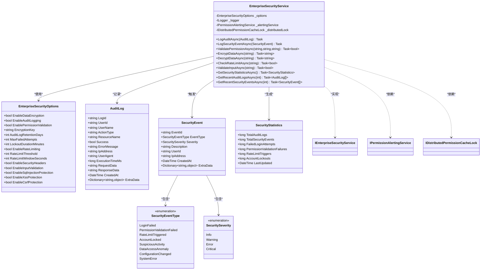

# 安全服务

<cite>
**本文档中引用的文件**
- [EnterpriseSecurityService.cs](file://src/SmartAbp.Application/Permissions/Security/EnterpriseSecurityService.cs)
- [PermissionAlertingService.cs](file://src/SmartAbp.Application/Permissions/Alerting/PermissionAlertingService.cs)
- [DistributedPermissionCacheLock.cs](file://src/SmartAbp.Application/Permissions/Cache/DistributedPermissionCacheLock.cs)
</cite>

## 目录
1. [简介](#简介)
2. [核心功能详解](#核心功能详解)
3. [依赖注入与生命周期管理](#依赖注入与生命周期管理)
4. [与其他组件的集成](#与其他组件的集成)
5. [安全策略动态加载与配置热更新](#安全策略动态加载与配置热更新)
6. [使用示例](#使用示例)
7. [类图](#类图)

## 简介
`EnterpriseSecurityService` 是 hxlot 项目中的企业级安全服务核心组件，负责提供全面的安全保障功能。该服务实现了身份验证、授权检查和安全策略执行等关键功能，确保系统在高并发、多租户环境下的安全性与稳定性。通过模块化设计和依赖注入机制，该服务能够灵活集成到不同业务场景中，并支持动态配置更新和热部署。

**Section sources**
- [EnterpriseSecurityService.cs](file://src/SmartAbp.Application/Permissions/Security/EnterpriseSecurityService.cs#L19-L95)

## 核心功能详解

### 身份验证与权限检查
`EnterpriseSecurityService` 提供了细粒度的权限验证功能，支持基于用户、资源和操作的三元组权限控制模型。服务通过 `ValidatePermissionAsync` 方法实现权限校验，结合分布式锁机制确保在高并发场景下的数据一致性。

权限验证过程中，服务会记录详细的审计日志，并在验证失败时触发安全事件告警。同时支持最大失败尝试次数限制和账户锁定机制，防止暴力破解攻击。

### 安全策略执行
该服务实现了多种安全策略的执行，包括：
- **数据加密**：使用 AES 算法对敏感数据进行加密存储
- **速率限制**：基于时间窗口的请求频率控制，防止 DDoS 攻击
- **输入验证**：SQL 注入和 XSS 攻击防护
- **审计日志**：完整的操作审计功能，支持日志保留策略

所有安全策略均可通过配置选项进行启用或禁用，提供了灵活的安全控制能力。

**Section sources**
- [EnterpriseSecurityService.cs](file://src/SmartAbp.Application/Permissions/Security/EnterpriseSecurityService.cs#L402-L860)

## 依赖注入与生命周期管理

### 依赖注入配置
`EnterpriseSecurityService` 通过扩展方法 `AddEnterpriseSecurityService` 提供了便捷的依赖注入配置。服务支持两种注册方式：默认配置注册和自定义配置注册。

服务采用单例模式（Singleton）生命周期管理，确保在整个应用程序生命周期内只有一个实例存在，提高了性能并保证了状态一致性。

### 依赖关系
服务依赖以下关键组件：
- `IOptions<EnterpriseSecurityOptions>`：安全配置选项
- `ILogger<EnterpriseSecurityService>`：日志记录器
- `IPermissionAlertingService`：告警服务
- `IDistributedPermissionCacheLock`：分布式锁服务

这些依赖通过构造函数注入，符合依赖注入最佳实践。

**Section sources**
- [EnterpriseSecurityService.cs](file://src/SmartAbp.Application/Permissions/Security/EnterpriseSecurityService.cs#L412-L422)
- [EnterpriseSecurityService.cs](file://src/SmartAbp.Application/Permissions/Security/EnterpriseSecurityService.cs#L800-L906)

## 与其他组件的集成

### 与审计组件的集成
安全服务与审计系统深度集成，通过 `LogAuditAsync` 方法将所有安全相关操作记录到审计日志中。审计日志包含操作类型、资源名称、执行结果等详细信息，并支持敏感数据加密存储。

### 与合规性组件的集成
服务产生的安全事件会触发合规性检查流程。当检测到高风险安全事件时，系统会自动生成合规性报告，并通知相关人员进行处理。

### 与告警系统的集成
通过 `IPermissionAlertingService` 接口，安全服务能够将严重级别的安全事件实时推送到告警系统。告警级别根据安全事件的严重程度自动确定，确保关键问题能够及时得到处理。

**Section sources**
- [EnterpriseSecurityService.cs](file://src/SmartAbp.Application/Permissions/Security/EnterpriseSecurityService.cs#L402-L860)
- [PermissionAlertingService.cs](file://src/SmartAbp.Application/Permissions/Alerting/PermissionAlertingService.cs#L258-L339)

## 安全策略动态加载与配置热更新

### 动态加载机制
安全策略配置通过 `IOptions<EnterpriseSecurityOptions>` 实现动态加载。配置更改后，无需重启应用程序即可生效，支持热更新。

配置选项包括：
- 数据加密开关
- 审计日志保留天数
- 速率限制阈值
- 输入验证规则

### 配置热更新实现
系统采用配置监视机制，当配置文件发生变化时，自动重新加载配置并应用到运行时环境。这种机制确保了安全策略的灵活性和实时性，能够在不中断服务的情况下调整安全策略。

**Section sources**
- [EnterpriseSecurityService.cs](file://src/SmartAbp.Application/Permissions/Security/EnterpriseSecurityService.cs#L19-L95)

## 使用示例

### 在应用服务中调用安全检查
```csharp
public class MyApplicationService : IMyApplicationService
{
    private readonly IEnterpriseSecurityService _securityService;

    public MyApplicationService(IEnterpriseSecurityService securityService)
    {
        _securityService = securityService;
    }

    public async Task DoSensitiveOperation(string userId, string resourceId)
    {
        // 检查权限
        var hasPermission = await _securityService.ValidatePermissionAsync(userId, resourceId, "write");
        if (!hasPermission)
        {
            throw new UnauthorizedAccessException("权限不足");
        }

        // 检查速率限制
        var isRateLimited = await _securityService.CheckRateLimitAsync($"user:{userId}");
        if (!isRateLimited)
        {
            throw new InvalidOperationException("请求过于频繁");
        }

        // 执行敏感操作
        // ...
    }
}
```

### 记录审计日志
```csharp
var auditLog = new AuditLog
{
    UserId = "user123",
    UserName = "张三",
    ActionType = "Update",
    ResourceName = "Product",
    Success = true,
    RequestData = "{'name': '新产品'}",
    ResponseData = "{'id': '123', 'name': '新产品'}"
};

await _securityService.LogAuditAsync(auditLog);
```

**Section sources**
- [EnterpriseSecurityService.cs](file://src/SmartAbp.Application/Permissions/Security/EnterpriseSecurityService.cs#L402-L860)

## 类图



**Diagram sources**
- [EnterpriseSecurityService.cs](file://src/SmartAbp.Application/Permissions/Security/EnterpriseSecurityService.cs#L19-L906)
- [PermissionAlertingService.cs](file://src/SmartAbp.Application/Permissions/Alerting/PermissionAlertingService.cs#L258-L339)
- [DistributedPermissionCacheLock.cs](file://src/SmartAbp.Application/Permissions/Cache/DistributedPermissionCacheLock.cs#L13-L23)