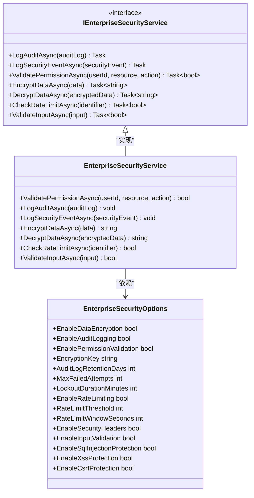
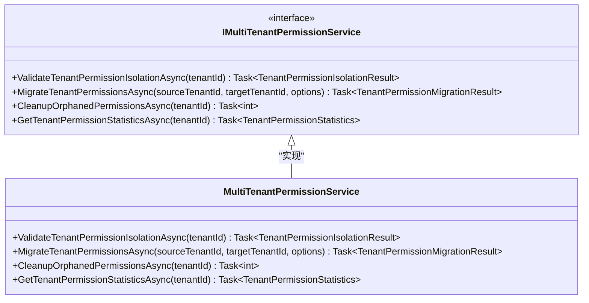
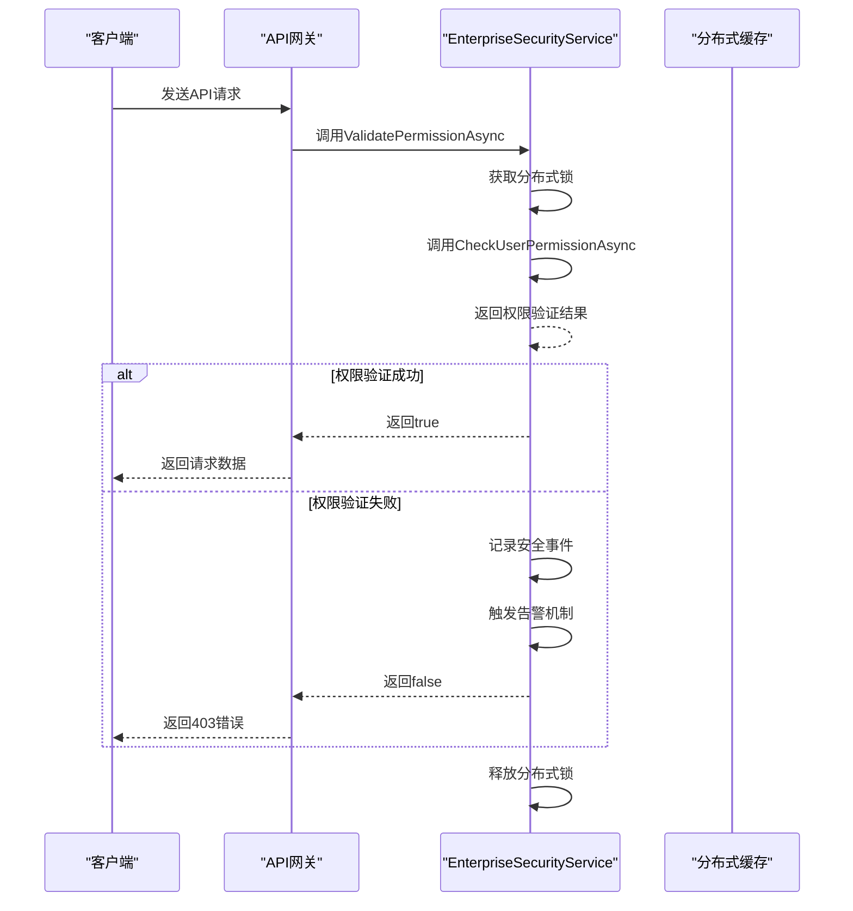
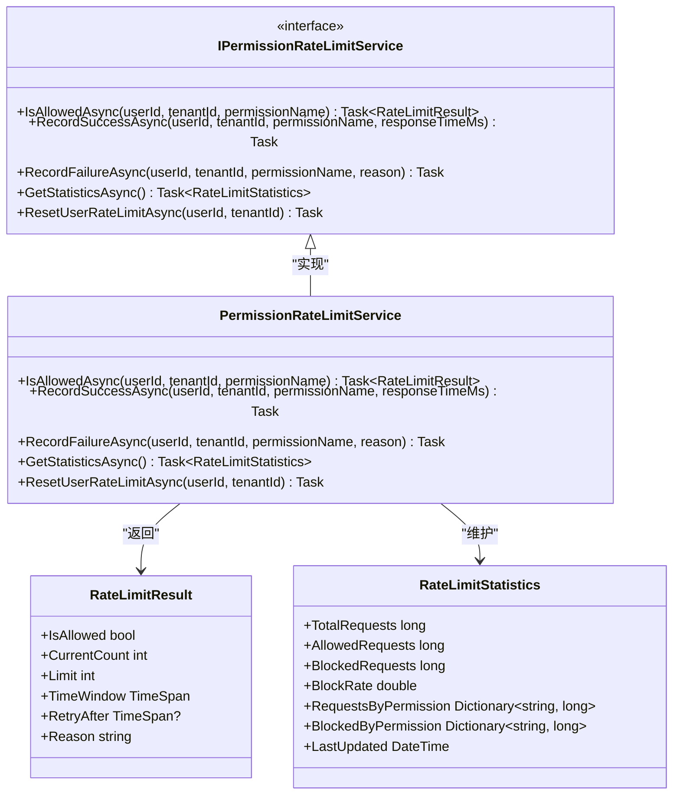
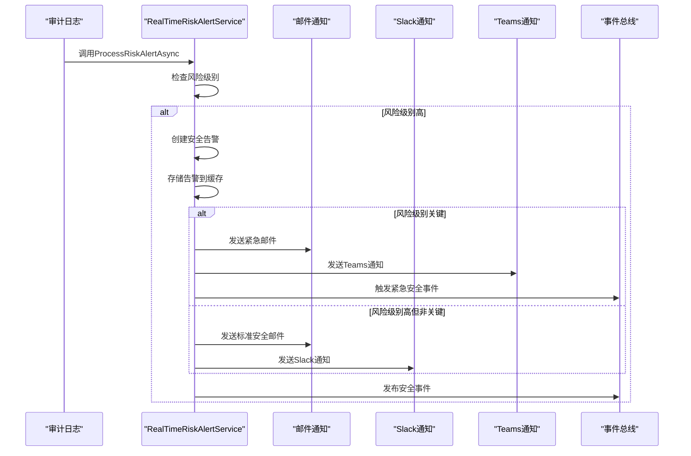
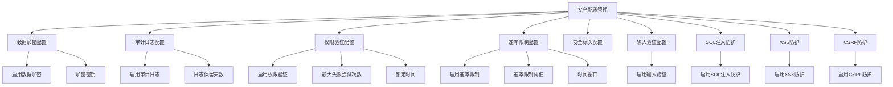
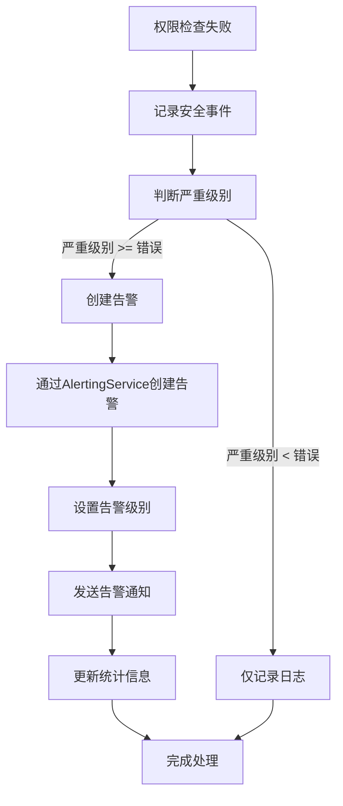
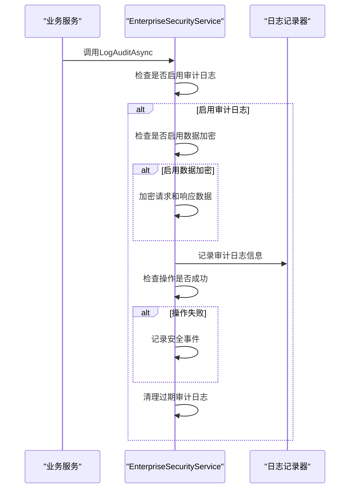
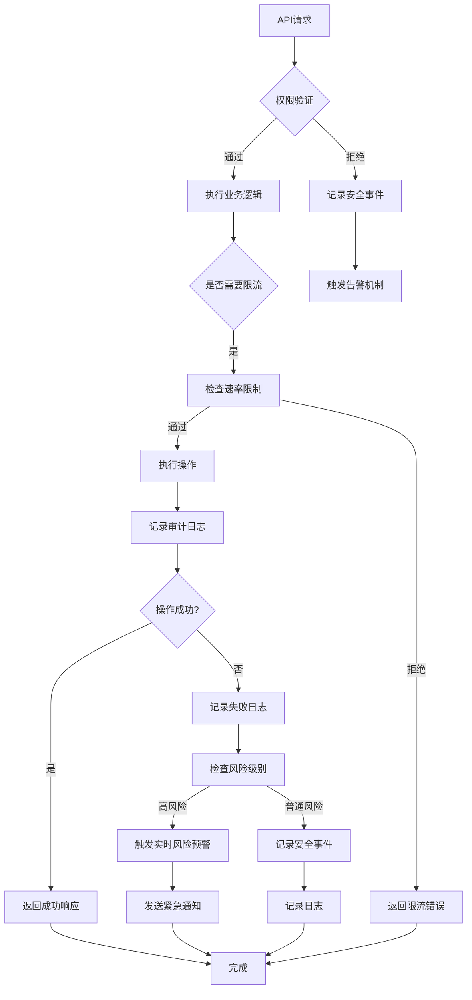

# 安全管理

<cite>
**Referenced Files in This Document**   
- [EnterpriseSecurityService.cs](file://src/SmartAbp.Application/Permissions/Security/EnterpriseSecurityService.cs)
- [PermissionRateLimitService.cs](file://src/SmartAbp.Application/Permissions/Security/PermissionRateLimitService.cs)
- [RealTimeRiskAlertService.cs](file://src/SmartAbp.Application/Permissions/Auditing/Services/RealTimeRiskAlertService.cs)
- [MultiTenantPermissionService.cs](file://src/SmartAbp.PermissionManagement.Service/Application/MultiTenant/MultiTenantPermissionService.cs)
</cite>

## 目录
1. [安全管理](#安全管理)
2. [核心安全服务实现](#核心安全服务实现)
3. [权限检查执行流程](#权限检查执行流程)
4. [限流与风险预警机制](#限流与风险预警机制)
5. [企业级安全配置管理](#企业级安全配置管理)
6. [权限检查失败处理](#权限检查失败处理)
7. [安全审计日志生成](#安全审计日志生成)
8. [安全管理流程图](#安全管理流程图)

## 安全管理

hxlot项目的安全管理采用企业级安全架构，通过`EnterpriseSecurityService`、`PermissionRateLimitService`和`RealTimeRiskAlertService`三个核心服务构建了完整的安全防护体系。系统实现了权限继承引擎、角色管理机制和多租户隔离策略，确保企业级应用的安全性。权限检查从API请求到验证的完整流程经过精心设计，结合限流机制和实时风险预警功能，形成了多层次的安全控制体系。

**Section sources**
- [EnterpriseSecurityService.cs](file://src/SmartAbp.Application/Permissions/Security/EnterpriseSecurityService.cs#L402-L860)
- [PermissionRateLimitService.cs](file://src/SmartAbp.Application/Permissions/Security/PermissionRateLimitService.cs#L89-L378)
- [RealTimeRiskAlertService.cs](file://src/SmartAbp.Application/Permissions/Auditing/Services/RealTimeRiskAlertService.cs#L18-L448)

## 核心安全服务实现

### 权限继承引擎与角色管理

`EnterpriseSecurityService`作为企业级安全服务的核心实现，提供了完整的权限管理功能。该服务通过分布式锁机制确保权限验证的一致性，防止并发访问导致的安全漏洞。权限继承引擎基于用户、角色和组织单元的层级关系，实现了细粒度的权限控制。角色管理机制支持动态角色分配和权限继承，确保权限体系的灵活性和可扩展性。

**Diagram sources**
- [EnterpriseSecurityService.cs](file://src/SmartAbp.Application/Permissions/Security/EnterpriseSecurityService.cs#L402-L860)

### 多租户隔离策略

多租户隔离策略通过`MultiTenantPermissionService`实现，确保不同租户之间的数据和权限完全隔离。该服务提供了租户权限隔离验证、迁移和清理功能，通过`IDataFilter`禁用多租户过滤器来直接访问所有租户数据，然后进行严格的隔离验证。系统能够检测跨租户权限、孤立权限等安全问题，并提供相应的修复机制。

**Diagram sources**
- [MultiTenantPermissionService.cs](file://src/SmartAbp.PermissionManagement.Service/Application/MultiTenant/MultiTenantPermissionService.cs#L33-L71)

**Section sources**
- [MultiTenantPermissionService.cs](file://src/SmartAbp.PermissionManagement.Service/Application/MultiTenant/MultiTenantPermissionService.cs#L33-L71)

## 权限检查执行流程

权限检查的执行流程从API请求开始，经过完整的验证过程。当收到API请求时，系统首先通过`ValidatePermissionAsync`方法进行权限验证。该方法获取分布式锁以确保一致性，然后调用`CheckUserPermissionAsync`进行实际的权限检查。如果权限验证失败，系统会记录安全事件并触发相应的告警机制。

**Diagram sources**
- [EnterpriseSecurityService.cs](file://src/SmartAbp.Application/Permissions/Security/EnterpriseSecurityService.cs#L532-L563)

**Section sources**
- [EnterpriseSecurityService.cs](file://src/SmartAbp.Application/Permissions/Security/EnterpriseSecurityService.cs#L532-L563)

## 限流与风险预警机制

### PermissionRateLimitService限流机制

`PermissionRateLimitService`实现了基于内存的速率限制机制，使用`ConcurrentDictionary`存储请求计数器，并通过定时器定期清理过期数据。该服务支持不同权限类型的差异化限流策略，根据权限名称自动选择相应的限流阈值。系统还支持黑名单机制，可以对恶意用户进行惩罚性限流。

**Diagram sources**
- [PermissionRateLimitService.cs](file://src/SmartAbp.Application/Permissions/Security/PermissionRateLimitService.cs#L89-L378)

### RealTimeRiskAlertService实时风险预警

`RealTimeRiskAlertService`实现了实时风险预警功能，能够对高风险的审计日志进行即时响应。当检测到高风险操作时，系统会创建安全告警，通过邮件、Slack、Teams等多种渠道通知安全团队。对于关键风险，系统会触发紧急安全措施，包括账户暂停、位置封锁等操作。

**Diagram sources**
- [RealTimeRiskAlertService.cs](file://src/SmartAbp.Application/Permissions/Auditing/Services/RealTimeRiskAlertService.cs#L18-L448)

**Section sources**
- [PermissionRateLimitService.cs](file://src/SmartAbp.Application/Permissions/Security/PermissionRateLimitService.cs#L89-L378)
- [RealTimeRiskAlertService.cs](file://src/SmartAbp.Application/Permissions/Auditing/Services/RealTimeRiskAlertService.cs#L18-L448)

## 企业级安全配置管理

企业级安全配置通过`EnterpriseSecurityOptions`类进行管理，支持动态调整各种安全策略。系统提供了丰富的配置选项，包括数据加密、审计日志、权限验证、速率限制、安全标头、输入验证等。这些配置可以通过依赖注入系统动态加载和更新，确保安全策略的灵活性和可维护性。

**Section sources**
- [EnterpriseSecurityService.cs](file://src/SmartAbp.Application/Permissions/Security/EnterpriseSecurityService.cs#L402-L860)

## 权限检查失败处理

当权限检查失败时，系统会执行一系列处理流程。首先，`EnterpriseSecurityService`会记录安全事件，包括事件类型、严重级别、描述等信息。然后，根据事件的严重级别，系统会触发相应的告警机制。对于错误和严重级别的事件，系统会通过`IPermissionAlertingService`创建告警，通知相关人员。

**Section sources**
- [EnterpriseSecurityService.cs](file://src/SmartAbp.Application/Permissions/Security/EnterpriseSecurityService.cs#L447-L480)

## 安全审计日志生成

安全审计日志的生成机制由`EnterpriseSecurityService`的`LogAuditAsync`方法实现。当系统执行重要操作时，会创建`AuditLog`对象并调用此方法记录审计日志。如果启用了数据加密，敏感数据会被加密存储。系统还会自动清理过期的审计日志，确保存储空间的有效利用。

**Diagram sources**
- [EnterpriseSecurityService.cs](file://src/SmartAbp.Application/Permissions/Security/EnterpriseSecurityService.cs#L433-L480)

**Section sources**
- [EnterpriseSecurityService.cs](file://src/SmartAbp.Application/Permissions/Security/EnterpriseSecurityService.cs#L433-L480)

## 安全管理流程图

**Diagram sources**
- [EnterpriseSecurityService.cs](file://src/SmartAbp.Application/Permissions/Security/EnterpriseSecurityService.cs#L402-L860)
- [PermissionRateLimitService.cs](file://src/SmartAbp.Application/Permissions/Security/PermissionRateLimitService.cs#L89-L378)
- [RealTimeRiskAlertService.cs](file://src/SmartAbp.Application/Permissions/Auditing/Services/RealTimeRiskAlertService.cs#L18-L448)