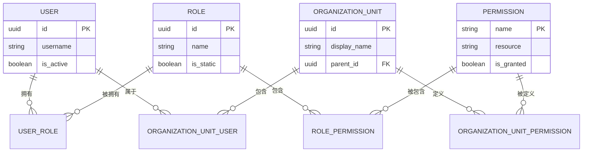
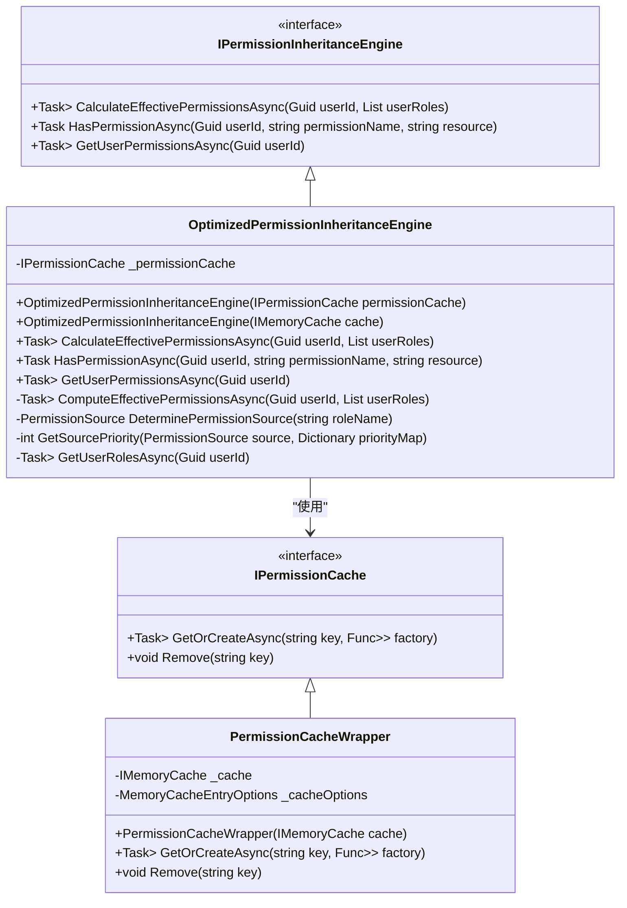
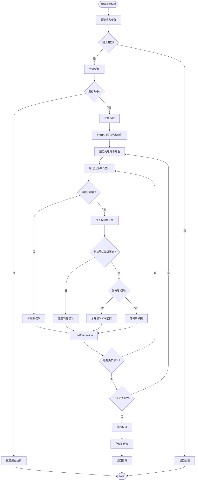
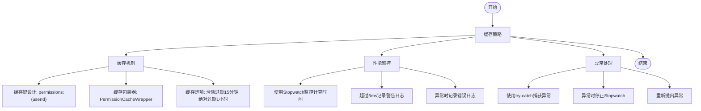
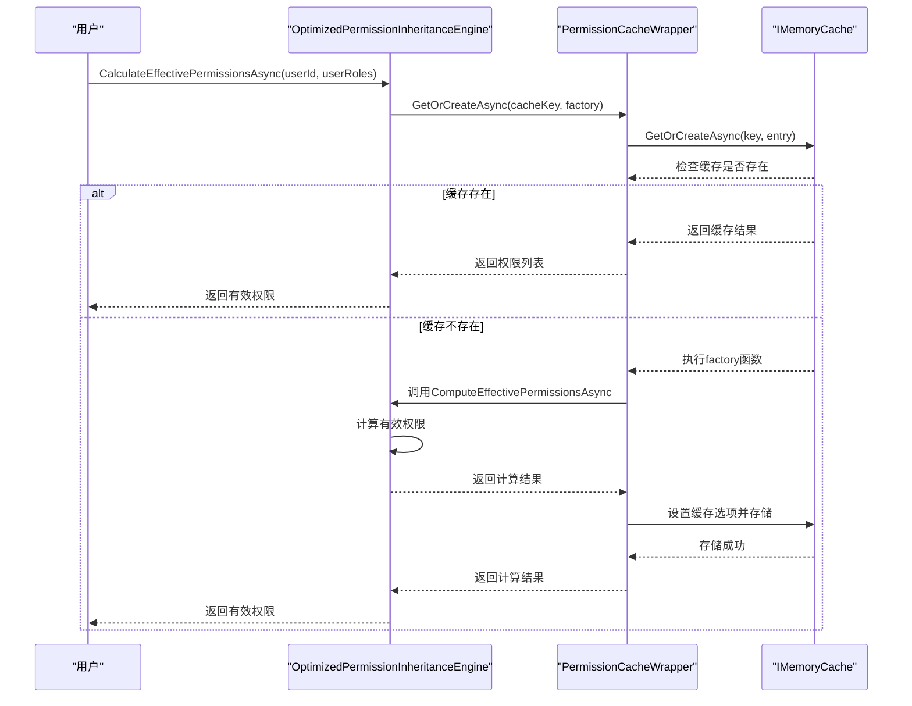
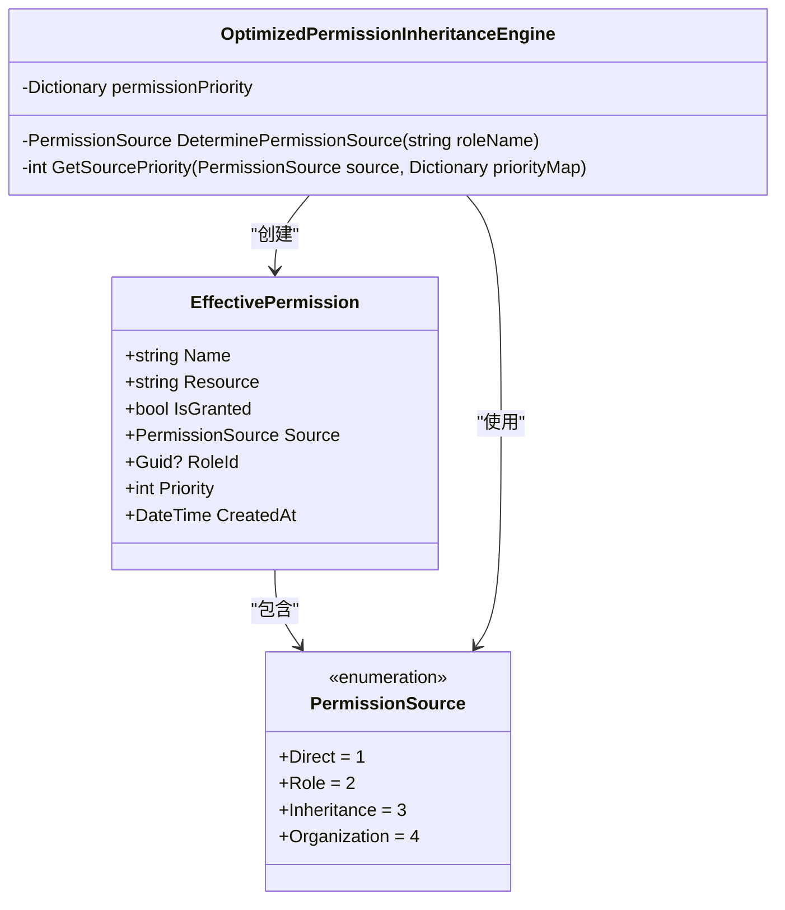
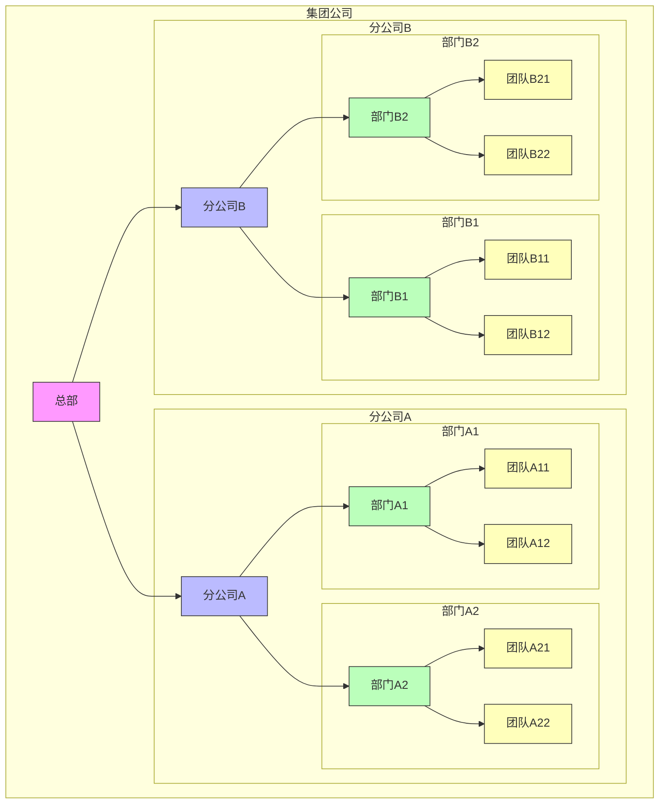

# 权限继承

<cite>
**本文档引用的文件**  
- [OptimizedPermissionInheritanceEngine.cs](file://src\SmartAbp.Application\Permissions\Engine\OptimizedPermissionInheritanceEngine.cs)
- [PermissionAppService.cs](file://src\SmartAbp.PermissionManagement.Service\Application\Permissions\PermissionAppService.cs)
- [RoleAppService.cs](file://src\SmartAbp.PermissionManagement.Service\Application\Roles\RoleAppService.cs)
- [UserAppService.cs](file://src\SmartAbp.PermissionManagement.Service\Application\Users\UserAppService.cs)
- [OrganizationAppService.cs](file://src\SmartAbp.PermissionManagement.Service\Application\Organizations\OrganizationAppService.cs)
- [PermissionModels.cs](file://src\SmartAbp.Application\Permissions\Models\PermissionModels.cs)
- [PermissionCacheWrapper.cs](file://src\SmartAbp.Application\Permissions\Engine\PermissionCacheWrapper.cs)
</cite>

## 目录
1. [简介](#简介)
2. [权限继承模型](#权限继承模型)
3. [优化的权限继承引擎](#优化的权限继承引擎)
4. [权限计算算法](#权限计算算法)
5. [性能优化策略](#性能优化策略)
6. [权限缓存机制](#权限缓存机制)
7. [权限冲突解决机制](#权限冲突解决机制)
8. [使用示例](#使用示例)
9. [结论](#结论)

## 简介
权限继承机制是hxlot项目权限管理系统的核心功能，它实现了基于角色-权限-用户的多层级权限继承模型。该系统支持在复杂组织架构下进行精细化的权限控制，通过优化的权限继承引擎确保高并发场景下的性能表现。本文档详细介绍了权限继承的实现原理、计算算法、性能优化策略以及使用方法。

## 权限继承模型
权限继承模型基于角色-权限-用户的三层结构，支持多层级组织架构下的权限传播。系统通过角色分配权限，用户通过角色继承权限，同时支持直接权限分配和组织级权限继承。

**图源**  
- [PermissionAppService.cs](file://src\SmartAbp.PermissionManagement.Service\Application\Permissions\PermissionAppService.cs)
- [RoleAppService.cs](file://src\SmartAbp.PermissionManagement.Service\Application\Roles\RoleAppService.cs)
- [UserAppService.cs](file://src\SmartAbp.PermissionManagement.Service\Application\Users\UserAppService.cs)
- [OrganizationAppService.cs](file://src\SmartAbp.PermissionManagement.Service\Application\Organizations\OrganizationAppService.cs)

**本节来源**  
- [PermissionAppService.cs](file://src\SmartAbp.PermissionManagement.Service\Application\Permissions\PermissionAppService.cs#L1-L138)
- [RoleAppService.cs](file://src\SmartAbp.PermissionManagement.Service\Application\Roles\RoleAppService.cs#L1-L161)
- [UserAppService.cs](file://src\SmartAbp.PermissionManagement.Service\Application\Users\UserAppService.cs#L1-L238)
- [OrganizationAppService.cs](file://src\SmartAbp.PermissionManagement.Service\Application\Organizations\OrganizationAppService.cs#L1-L147)

## 优化的权限继承引擎
`OptimizedPermissionInheritanceEngine`是权限继承的核心实现，它实现了`IPermissionInheritanceEngine`接口，提供了权限计算、权限检查和用户权限获取等功能。

**图源**  
- [OptimizedPermissionInheritanceEngine.cs](file://src\SmartAbp.Application\Permissions\Engine\OptimizedPermissionInheritanceEngine.cs)
- [PermissionCacheWrapper.cs](file://src\SmartAbp.Application\Permissions\Engine\PermissionCacheWrapper.cs)

**本节来源**  
- [OptimizedPermissionInheritanceEngine.cs](file://src\SmartAbp.Application\Permissions\Engine\OptimizedPermissionInheritanceEngine.cs#L17-L193)

## 权限计算算法
权限计算算法是`OptimizedPermissionInheritanceEngine`的核心，它通过合并用户所有角色的权限来计算最终的有效权限。算法采用优先级机制来解决权限冲突，确保权限继承的正确性。

**图源**  
- [OptimizedPermissionInheritanceEngine.cs](file://src\SmartAbp.Application\Permissions\Engine\OptimizedPermissionInheritanceEngine.cs#L70-L165)

**本节来源**  
- [OptimizedPermissionInheritanceEngine.cs](file://src\SmartAbp.Application\Permissions\Engine\OptimizedPermissionInheritanceEngine.cs#L70-L165)

## 性能优化策略
系统采用多种性能优化策略来确保高并发场景下的性能表现，包括缓存机制、性能监控和异常处理。

**图源**  
- [OptimizedPermissionInheritanceEngine.cs](file://src\SmartAbp.Application\Permissions\Engine\OptimizedPermissionInheritanceEngine.cs)
- [PermissionCacheWrapper.cs](file://src\SmartAbp.Application\Permissions\Engine\PermissionCacheWrapper.cs)

**本节来源**  
- [OptimizedPermissionInheritanceEngine.cs](file://src\SmartAbp.Application\Permissions\Engine\OptimizedPermissionInheritanceEngine.cs#L70-L130)
- [PermissionCacheWrapper.cs](file://src\SmartAbp.Application\Permissions\Engine\PermissionCacheWrapper.cs#L1-L38)

## 权限缓存机制
权限缓存机制是系统性能优化的关键，它通过`IPermissionCache`接口和`PermissionCacheWrapper`实现来管理权限缓存。

**图源**  
- [OptimizedPermissionInheritanceEngine.cs](file://src\SmartAbp.Application\Permissions\Engine\OptimizedPermissionInheritanceEngine.cs)
- [PermissionCacheWrapper.cs](file://src\SmartAbp.Application\Permissions\Engine\PermissionCacheWrapper.cs)

**本节来源**  
- [OptimizedPermissionInheritanceEngine.cs](file://src\SmartAbp.Application\Permissions\Engine\OptimizedPermissionInheritanceEngine.cs#L50-L65)
- [PermissionCacheWrapper.cs](file://src\SmartAbp.Application\Permissions\Engine\PermissionCacheWrapper.cs#L25-L35)

## 权限冲突解决机制
权限冲突解决机制通过权限优先级系统来处理不同来源权限之间的冲突，确保权限继承的正确性和一致性。

**图源**  
- [OptimizedPermissionInheritanceEngine.cs](file://src\SmartAbp.Application\Permissions\Engine\OptimizedPermissionInheritanceEngine.cs)
- [PermissionModels.cs](file://src\SmartAbp.Application\Permissions\Models\PermissionModels.cs)

**本节来源**  
- [OptimizedPermissionInheritanceEngine.cs](file://src\SmartAbp.Application\Permissions\Engine\OptimizedPermissionInheritanceEngine.cs#L72-L77)
- [OptimizedPermissionInheritanceEngine.cs](file://src\SmartAbp.Application\Permissions\Engine\OptimizedPermissionInheritanceEngine.cs#L166-L180)
- [PermissionModels.cs](file://src\SmartAbp.Application\Permissions\Models\PermissionModels.cs#L86-L92)

## 使用示例
以下示例展示了如何在复杂组织架构中使用权限继承机制实现精细化权限控制。

**图源**  
- [OrganizationAppService.cs](file://src\SmartAbp.PermissionManagement.Service\Application\Organizations\OrganizationAppService.cs)

**本节来源**  
- [OrganizationAppService.cs](file://src\SmartAbp.PermissionManagement.Service\Application\Organizations\OrganizationAppService.cs#L1-L147)

## 结论
hxlot项目的权限继承机制通过`OptimizedPermissionInheritanceEngine`实现了高效、可靠的权限管理。系统采用基于角色-权限-用户的三层模型，支持多层级组织架构下的权限传播。通过权限优先级机制解决权限冲突，确保权限继承的正确性。利用缓存机制和性能监控策略，保证了高并发场景下的性能表现。该权限继承机制为复杂组织架构下的精细化权限控制提供了坚实的基础。