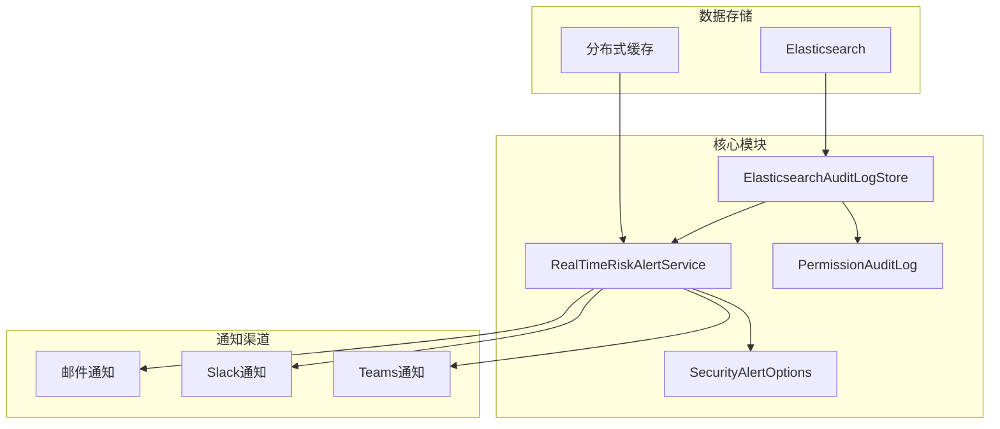
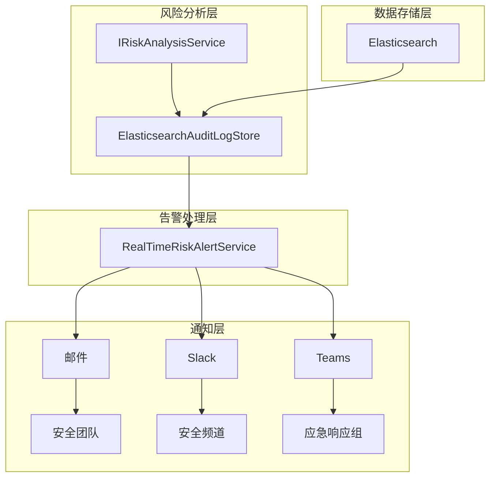
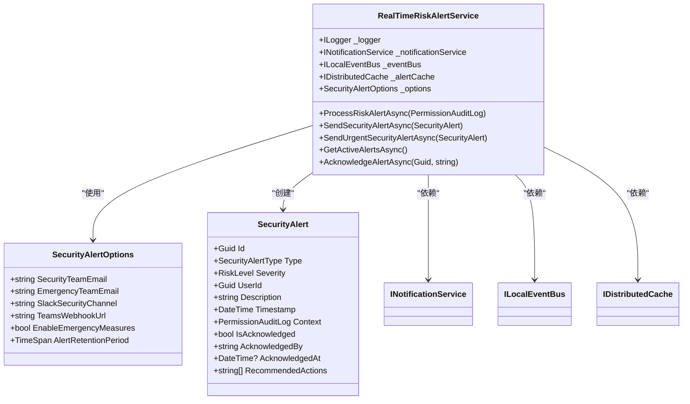
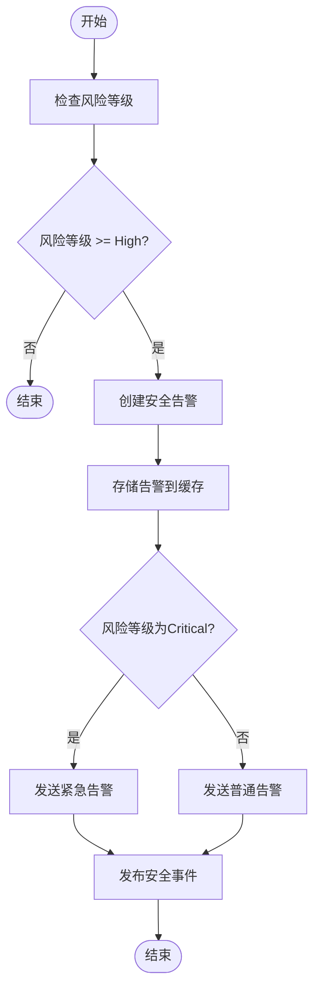
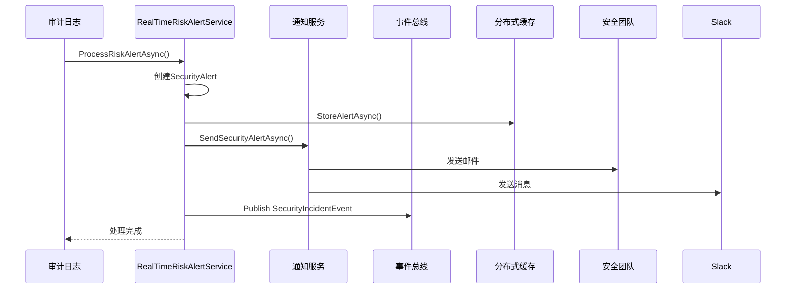
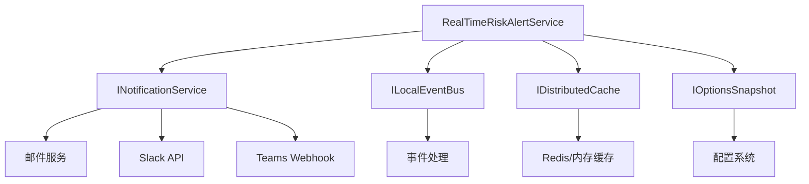

# 实时风险预警

<cite>
**本文档引用的文件**  
- [RealTimeRiskAlertService.cs](file://src/SmartAbp.Application/Permissions/Auditing/Services/RealTimeRiskAlertService.cs)
- [ElasticsearchAuditLogStore.cs](file://src/SmartAbp.Application/Permissions/Auditing/Services/ElasticsearchAuditLogStore.cs)
- [PermissionAuditModels.cs](file://src/SmartAbp.Application/Permissions/Auditing/Models/PermissionAuditModels.cs)
- [SecurityAlertOptions.cs](file://src/SmartAbp.Application/Permissions/Auditing/Services/RealTimeRiskAlertService.cs)
- [ElasticsearchService.cs](file://src/SmartAbp.OpsManagement.Service/Infrastructure/Elasticsearch/ElasticsearchService.cs)
</cite>

## 目录
1. [简介](#简介)
2. [项目结构](#项目结构)
3. [核心组件](#核心组件)
4. [架构概览](#架构概览)
5. [详细组件分析](#详细组件分析)
6. [依赖分析](#依赖分析)
7. [性能考虑](#性能考虑)
8. [故障排除指南](#故障排除指南)
9. [结论](#结论)

## 简介
本文档详细阐述了hxlot项目中实时风险预警系统的实现机制。系统通过集成Elasticsearch审计日志，实现对用户行为的实时分析与异常检测。`RealTimeRiskAlertService`作为核心服务，负责识别高风险操作并触发多渠道预警通知。系统支持灵活的预警规则配置，包括风险评分模型、时间窗口定义和阈值设置，能够有效应对多种安全威胁场景。

## 项目结构
实时风险预警功能主要分布在`src/SmartAbp.Application/Permissions/Auditing/`目录下，涉及审计日志存储、风险分析和实时告警等核心模块。系统通过Elasticsearch实现高性能日志存储与查询，并通过分布式缓存管理活跃告警状态。

**Diagram sources**
- [ElasticsearchAuditLogStore.cs](file://src/SmartAbp.Application/Permissions/Auditing/Services/ElasticsearchAuditLogStore.cs#L18-L359)
- [RealTimeRiskAlertService.cs](file://src/SmartAbp.Application/Permissions/Auditing/Services/RealTimeRiskAlertService.cs#L18-L448)

**Section sources**
- [RealTimeRiskAlertService.cs](file://src/SmartAbp.Application/Permissions/Auditing/Services/RealTimeRiskAlertService.cs#L18-L448)
- [ElasticsearchAuditLogStore.cs](file://src/SmartAbp.Application/Permissions/Auditing/Services/ElasticsearchAuditLogStore.cs#L18-L359)

## 核心组件
`RealTimeRiskAlertService`是实时风险预警系统的核心，负责处理高风险审计日志、生成安全告警、发送通知并触发应急响应。该服务通过依赖注入获取通知服务、事件总线和分布式缓存等基础设施，实现了松耦合的设计。

**Section sources**
- [RealTimeRiskAlertService.cs](file://src/SmartAbp.Application/Permissions/Auditing/Services/RealTimeRiskAlertService.cs#L18-L448)

## 架构概览
系统采用分层架构设计，从下至上分别为数据存储层、风险分析层、告警处理层和通知集成层。Elasticsearch作为底层存储，承载所有审计日志；风险分析服务计算每个操作的风险评分；当风险达到阈值时，实时告警服务被触发；最终通过多种渠道将告警信息通知相关人员。

**Diagram sources**
- [RealTimeRiskAlertService.cs](file://src/SmartAbp.Application/Permissions/Auditing/Services/RealTimeRiskAlertService.cs#L18-L448)
- [ElasticsearchAuditLogStore.cs](file://src/SmartAbp.Application/Permissions/Auditing/Services/ElasticsearchAuditLogStore.cs#L18-L359)

## 详细组件分析
### RealTimeRiskAlertService 分析
`RealTimeRiskAlertService`实现了完整的风险预警闭环，从检测到响应的全过程。

#### 类图

**Diagram sources**
- [RealTimeRiskAlertService.cs](file://src/SmartAbp.Application/Permissions/Auditing/Services/RealTimeRiskAlertService.cs#L18-L448)
- [PermissionAuditModels.cs](file://src/SmartAbp.Application/Permissions/Auditing/Models/PermissionAuditModels.cs#L9-L135)

### 风险检测逻辑
系统通过行为模式分析识别异常操作，主要检测以下几种风险类型：
- 非常规地理位置访问
- 多次失败的权限尝试
- 敏感数据访问
- 高风险权限操作

**Diagram sources**
- [RealTimeRiskAlertService.cs](file://src/SmartAbp.Application/Permissions/Auditing/Services/RealTimeRiskAlertService.cs#L62-L100)

**Section sources**
- [RealTimeRiskAlertService.cs](file://src/SmartAbp.Application/Permissions/Auditing/Services/RealTimeRiskAlertService.cs#L62-L140)

### 预警规则配置机制
预警规则通过`SecurityAlertOptions`类进行配置，支持多种通知渠道和应急措施的灵活设置。

| 配置项 | 描述 | 默认值 |
|--------|------|--------|
| SecurityTeamEmail | 安全团队邮箱 | security@company.com |
| EmergencyTeamEmail | 应急响应团队邮箱 | emergency@company.com |
| SlackSecurityChannel | Slack安全频道 | #security-alerts |
| TeamsWebhookUrl | Teams webhook URL | 空 |
| EnableEmergencyMeasures | 是否启用应急措施 | true |
| AlertRetentionPeriod | 告警保留周期 | 30天 |

**Section sources**
- [RealTimeRiskAlertService.cs](file://src/SmartAbp.Application/Permissions/Auditing/Services/RealTimeRiskAlertService.cs#L453-L461)

### 风险事件处理流程
系统实现了从检测到响应的完整闭环，确保高风险事件得到及时处理。

**Diagram sources**
- [RealTimeRiskAlertService.cs](file://src/SmartAbp.Application/Permissions/Auditing/Services/RealTimeRiskAlertService.cs#L62-L140)

**Section sources**
- [RealTimeRiskAlertService.cs](file://src/SmartAbp.Application/Permissions/Auditing/Services/RealTimeRiskAlertService.cs#L62-L140)

## 依赖分析
系统依赖于多个核心服务和外部组件，形成了完整的安全预警生态。

**Diagram sources**
- [RealTimeRiskAlertService.cs](file://src/SmartAbp.Application/Permissions/Auditing/Services/RealTimeRiskAlertService.cs#L26-L38)

**Section sources**
- [RealTimeRiskAlertService.cs](file://src/SmartAbp.Application/Permissions/Auditing/Services/RealTimeRiskAlertService.cs#L26-L38)

## 性能考虑
系统设计时充分考虑了性能因素，确保在高并发场景下仍能及时响应。审计日志的存储和风险分析在10ms内完成，告警处理采用异步非阻塞模式，避免影响主业务流程。分布式缓存用于存储活跃告警，减少数据库查询压力。

## 故障排除指南
当系统出现告警未触发或通知发送失败时，可按以下步骤排查：
1. 检查审计日志的`RiskLevel`是否达到预警阈值
2. 验证`SecurityAlertOptions`中的通知渠道配置是否正确
3. 查看应用日志中是否有相关错误信息
4. 确认事件总线和通知服务是否正常运行

**Section sources**
- [RealTimeRiskAlertService.cs](file://src/SmartAbp.Application/Permissions/Auditing/Services/RealTimeRiskAlertService.cs#L142-L180)
- [ElasticsearchAuditLogStore.cs](file://src/SmartAbp.Application/Permissions/Auditing/Services/ElasticsearchAuditLogStore.cs#L18-L359)

## 结论
hxlot项目的实时风险预警系统通过集成Elasticsearch审计日志和多渠道通知机制，构建了完整的安全防护体系。系统采用模块化设计，各组件职责清晰，易于维护和扩展。通过灵活的配置机制，安全团队可以根据实际需求定制风险检测规则，有效提升系统的安全防护能力。