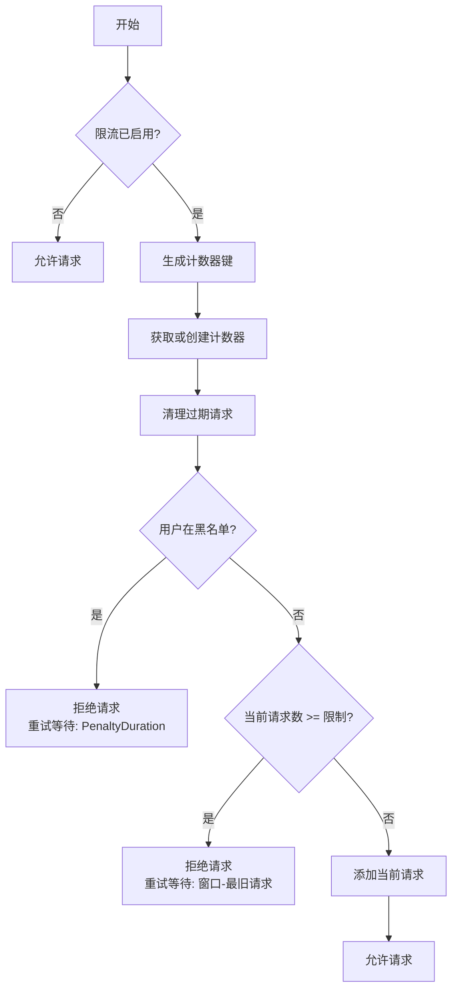
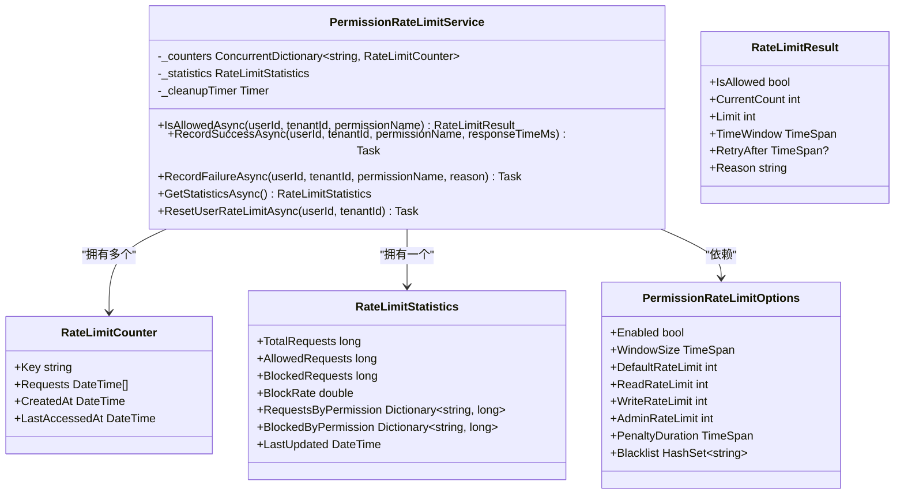

# 限流控制

<cite>
**本文档引用文件**  
- [PermissionRateLimitService.cs](file://src/SmartAbp.Application/Permissions/Security/PermissionRateLimitService.cs)
- [PermissionRateLimitOptions.cs](file://src/SmartAbp.Application/Permissions/Models/PermissionRateLimitOptions.cs)
- [RedisPermissionCacheService.cs](file://src/SmartAbp.Application/Permissions/Cache/RedisPermissionCacheService.cs)
</cite>

## 目录
1. [引言](#引言)
2. [核心组件分析](#核心组件分析)
3. [限流策略配置](#限流策略配置)
4. [分布式环境下的状态同步](#分布式环境下的状态同步)
5. [动态调整与监控机制](#动态调整与监控机制)
6. [调用流程与异常处理](#调用流程与异常处理)
7. [总结](#总结)

## 引言
`PermissionRateLimitService` 是 hxlot 项目中用于控制权限访问频率的核心服务，旨在防止系统在高并发场景下因请求过载而崩溃。该服务通过基于内存的计数器实现速率限制，并结合定时清理机制确保资源高效利用。尽管当前实现未直接使用 Redis 进行跨节点同步，但其设计为未来扩展提供了良好基础。本文档将深入解析其令牌桶算法的应用、限流策略的配置方式、统计信息的收集与监控机制，以及实际调用流程中的异常处理策略。

## 核心组件分析

`PermissionRateLimitService` 实现了 `IPermissionRateLimitService` 接口，负责检查请求是否超出预设的速率限制。其核心逻辑位于 `IsAllowedAsync` 方法中，该方法接收用户ID、租户ID和权限名称作为参数，返回一个 `RateLimitResult` 对象，指示请求是否被允许。

服务在初始化时会创建一个 `ConcurrentDictionary<string, RateLimitCounter>` 来存储每个用户-权限组合的请求计数器。计数器记录了请求发生的时间戳列表。每次调用 `IsAllowedAsync` 时，服务会根据用户、租户和权限名称生成一个唯一的键（`GenerateRateLimitKey`），并获取或创建对应的计数器。随后，它会清理该计数器中超出时间窗口的旧请求，然后检查当前请求数是否超过了为该权限配置的限制。

该服务还维护了一个 `RateLimitStatistics` 对象，用于收集全局的统计信息，如总请求数、允许的请求数和被阻止的请求数。这些统计信息通过 `GetStatisticsAsync` 方法对外提供，为系统监控和性能分析提供了数据支持。

**Section sources**
- [PermissionRateLimitService.cs](file://src/SmartAbp.Application/Permissions/Security/PermissionRateLimitService.cs#L16-L57)
- [PermissionRateLimitService.cs](file://src/SmartAbp.Application/Permissions/Security/PermissionRateLimitService.cs#L89-L378)

## 限流策略配置

限流策略由 `PermissionRateLimitOptions` 类进行配置，该类定义了多个关键参数，允许对不同类型的权限实施差异化的限制。

- **启用/禁用**：`Enabled` 属性控制整个限流功能的开关。
- **时间窗口**：`WindowSize` 属性定义了统计请求数量的时间窗口，例如 `TimeSpan.FromMinutes(1)` 表示以一分钟为一个周期。
- **速率限制**：系统为不同操作类型设置了不同的默认限制：
  - `DefaultRateLimit`：默认的每分钟请求数。
  - `ReadRateLimit`：读取操作的限制，通常较高。
  - `WriteRateLimit`：写入操作的限制，通常较低。
  - `AdminRateLimit`：管理员或关键操作的限制，通常最低。
- **黑名单**：`Blacklist` 属性是一个 `HashSet<string>`，用于存储被永久或临时禁止的用户（格式为 `tenantId:userId`）。
- **惩罚时长**：`PenaltyDuration` 定义了当用户被加入黑名单后，需要等待多久才能再次尝试。

`GetRateLimitForPermission` 方法根据传入的权限名称，通过简单的字符串匹配（如包含 "Read"、"Write"、"Admin" 等关键字）来决定应用哪一级别的速率限制。这种设计使得配置灵活，无需为每个权限单独设置。

**Diagram sources**
- [PermissionRateLimitService.cs](file://src/SmartAbp.Application/Permissions/Security/PermissionRateLimitService.cs#L248-L292)
- [PermissionRateLimitOptions.cs](file://src/SmartAbp.Application/Permissions/Models/PermissionRateLimitOptions.cs#L90-L131)

**Section sources**
- [PermissionRateLimitOptions.cs](file://src/SmartAbp.Application/Permissions/Models/PermissionRateLimitOptions.cs#L1-L131)
- [PermissionRateLimitService.cs](file://src/SmartAbp.Application/Permissions/Security/PermissionRateLimitService.cs#L248-L292)

## 分布式环境下的状态同步

当前 `PermissionRateLimitService` 的实现主要依赖于内存中的 `ConcurrentDictionary` 来存储计数器。这种设计在单个应用实例中是高效且线程安全的。然而，在分布式或集群环境下，这种基于内存的实现会导致状态不一致，因为每个节点都维护着自己独立的计数器副本。

为了实现跨节点的限流状态同步，系统需要引入一个共享的、分布式的存储后端。虽然 `PermissionRateLimitService` 本身没有直接使用 Redis，但项目中存在 `RedisPermissionCacheService`，这表明 Redis 已经被集成到权限管理模块中，为实现分布式限流提供了基础设施。

理论上，`PermissionRateLimitService` 可以通过以下方式改造以支持分布式环境：
1.  **使用 Redis 作为后端存储**：将 `ConcurrentDictionary` 替换为对 Redis 的调用。可以使用 Redis 的 `INCR` 和 `EXPIRE` 命令来原子性地增加计数并设置过期时间，或者使用 Sorted Set 来存储请求的时间戳，从而实现更精确的滑动窗口算法。
2.  **利用现有缓存服务**：可以将 `RedisPermissionCacheService` 的功能扩展，使其不仅能缓存权限数据，也能缓存限流计数器。`PermissionRateLimitService` 可以注入 `RedisPermissionCacheService` 或一个类似的分布式缓存接口，通过它来读写计数器状态。

这种改造将确保所有集群节点看到的都是同一份限流状态，从而保证了限流策略在全局范围内的一致性。

**Section sources**
- [RedisPermissionCacheService.cs](file://src/SmartAbp.Application/Permissions/Cache/RedisPermissionCacheService.cs#L0-L195)
- [PermissionRateLimitService.cs](file://src/SmartAbp.Application/Permissions/Security/PermissionRateLimitService.cs#L89-L378)

## 动态调整与监控机制

`PermissionRateLimitService` 提供了运行时监控和动态调整的能力。

- **运行时监控**：`GetStatisticsAsync` 方法返回一个 `RateLimitStatistics` 对象，其中包含了 `TotalRequests`、`AllowedRequests`、`BlockedRequests` 以及 `BlockRate`（阻塞率）。此外，它还按权限名称分别统计了请求和阻塞的数量。这些指标对于监控系统健康状况、识别异常流量模式和评估限流策略的有效性至关重要。
- **动态调整**：`ResetUserRateLimitAsync` 方法允许管理员或系统在特定情况下重置某个用户的限流状态。该方法会遍历所有计数器键，找到以指定用户和租户ID开头的所有键，并将它们从字典中移除。这在用户被误封禁或需要手动解除限制时非常有用。
- **自动清理**：服务内部使用一个 `Timer` 定时器（每5分钟触发一次）来执行 `CleanupExpiredCounters` 任务。此任务会遍历所有计数器，清理其中过期的请求记录，并移除那些长时间未被访问（超过1小时且无请求）的空计数器。这有助于防止内存泄漏，保持内存使用的高效性。

**Diagram sources**
- [PermissionRateLimitService.cs](file://src/SmartAbp.Application/Permissions/Security/PermissionRateLimitService.cs#L72-L96)
- [PermissionRateLimitService.cs](file://src/SmartAbp.Application/Permissions/Security/PermissionRateLimitService.cs#L374-L390)
- [PermissionRateLimitService.cs](file://src/SmartAbp.Application/Permissions/Security/PermissionRateLimitService.cs#L217-L246)

**Section sources**
- [PermissionRateLimitService.cs](file://src/SmartAbp.Application/Permissions/Security/PermissionRateLimitService.cs#L217-L246)
- [PermissionRateLimitService.cs](file://src/SmartAbp.Application/Permissions/Security/PermissionRateLimitService.cs#L334-L372)

## 调用流程与异常处理

`PermissionRateLimitService` 的调用流程清晰且健壮。

1.  **调用 `IsAllowedAsync`**：当需要检查权限访问时，调用方传入用户ID、租户ID和权限名称。
2.  **检查全局开关**：如果 `Enabled` 为 `false`，则直接允许请求。
3.  **生成键并获取计数器**：根据输入生成唯一键，并从 `_counters` 字典中获取或创建 `RateLimitCounter`。
4.  **清理与检查**：清理过期请求，检查用户是否在黑名单中，然后检查当前请求数是否超限。
5.  **返回结果**：根据检查结果，返回包含 `IsAllowed`、`CurrentCount`、`Limit`、`RetryAfter` 和 `Reason` 的 `RateLimitResult`。

在异常处理方面，服务在 `IsAllowedAsync` 方法的 `try-catch` 块中捕获所有异常。如果在检查过程中发生任何错误（例如，与底层存储的交互失败），服务会记录错误日志，并选择**允许请求通过**。这是一种“故障开放”（fail-open）的设计，优先保证系统的可用性，避免因限流服务自身的问题而导致整个系统不可用。同时，它会将错误信息记录在返回结果的 `Reason` 字段中，便于后续排查。

**Section sources**
- [PermissionRateLimitService.cs](file://src/SmartAbp.Application/Permissions/Security/PermissionRateLimitService.cs#L111-L207)
- [PermissionRateLimitService.cs](file://src/SmartAbp.Application/Permissions/Security/PermissionRateLimitService.cs#L181-L215)

## 总结
`PermissionRateLimitService` 为 hxlot 项目提供了一个功能完整、设计合理的权限访问限流机制。它通过内存计数器和时间窗口实现了高效的速率控制，并支持基于权限类型的差异化策略。服务内置了统计监控、状态重置和自动清理功能，确保了其可维护性和稳定性。虽然当前实现是单节点的，但其模块化的设计和项目中已有的 Redis 集成，为未来扩展到分布式环境奠定了坚实的基础。其“故障开放”的异常处理策略也体现了对系统整体可用性的重视。