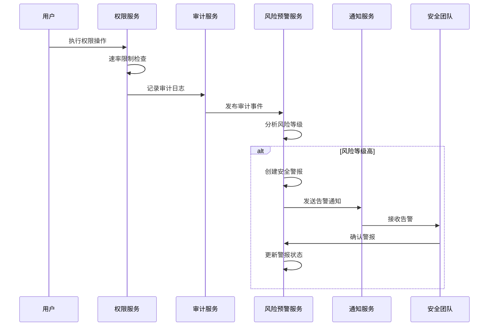

# 风险控制

<cite>
**本文档引用的文件**  
- [PermissionRateLimitService.cs](file://src\SmartAbp.Application\Permissions\Security\PermissionRateLimitService.cs)
- [RealTimeRiskAlertService.cs](file://src\SmartAbp.Application\Permissions\Auditing\Services\RealTimeRiskAlertService.cs)
- [PermissionRateLimitOptions.cs](file://src\SmartAbp.Application\Permissions\Models\PermissionRateLimitOptions.cs)
- [权限管理系统低代码配置.json](file://config\权限管理系统低代码配置.json)
</cite>

## 目录
1. [引言](#引言)
2. [权限速率限制服务](#权限速率限制服务)
3. [实时风险预警服务](#实时风险预警服务)
4. [风险事件处理流程](#风险事件处理流程)
5. [风险控制策略配置管理](#风险控制策略配置管理)
6. [监控指标与告警配置](#监控指标与告警配置)
7. [结论](#结论)

## 引言
hxlot项目的风险控制体系旨在保障系统在高并发、多租户环境下的安全性与稳定性。该体系通过`PermissionRateLimitService`实现精细化的权限访问速率控制，防止滥用和恶意请求；通过`RealTimeRiskAlertService`实现对异常行为的实时检测与响应，及时发现潜在安全威胁。本文档将深入解析这两个核心服务的实现机制、配置方式及运维监控策略，为系统安全提供全面的技术支持。

## 权限速率限制服务

`PermissionRateLimitService`是权限管理系统中的核心安全组件，负责对权限检查请求进行速率限制，防止高频访问导致系统资源耗尽或被滥用。该服务基于令牌桶算法思想，结合内存计数器与时间窗口机制，实现了高效、低延迟的限流控制。

服务通过`IPermissionRateLimitService`接口对外提供能力，包括检查访问权限、记录成功/失败请求、获取统计信息以及重置用户限流状态等。其核心逻辑在`IsAllowedAsync`方法中实现：首先根据用户ID、租户ID和权限名称生成唯一计数器键，然后清理过期请求记录，接着检查用户是否在黑名单中，最后判断当前请求频率是否超过预设阈值。若超出限制，则返回拒绝结果并建议重试时间。

限流策略支持按权限类型差异化配置，如管理员操作、读取操作、写入操作和默认操作分别设置不同的速率上限。同时，系统支持黑名单机制，可对特定用户实施更严格的访问控制。为避免内存泄漏，服务内置定时清理任务，定期清除长时间未使用的过期计数器。

**Section sources**
- [PermissionRateLimitService.cs](file://src\SmartAbp.Application\Permissions\Security\PermissionRateLimitService.cs#L89-L378)
- [PermissionRateLimitOptions.cs](file://src\SmartAbp.Application\Permissions\Models\PermissionRateLimitOptions.cs#L1-L131)

## 实时风险预警服务

`RealTimeRiskAlertService`负责对高风险权限审计日志进行实时分析，并触发相应的安全告警。该服务监听权限审计事件，当检测到风险等级为“高”或“严重”的操作时，立即生成安全警报并通知相关人员。

服务通过`ProcessRiskAlertAsync`方法处理风险事件。首先判断审计日志的风险等级，若达到预警阈值，则调用`CreateSecurityAlertAsync`创建安全警报对象。警报类型根据风险特征自动识别，如异常地理位置访问、多次失败尝试、敏感数据访问等。系统会生成相应的处置建议，帮助安全团队快速响应。

根据风险严重程度，服务采取不同的通知策略：对于“高”风险事件，通过邮件和Slack通知安全团队；对于“严重”风险事件，则触发紧急响应流程，包括发送带警示标志的邮件、通知应急响应小组、通过Teams Webhook推送告警卡片，并可能触发账户暂停等应急安全措施。所有警报均存储在分布式缓存中，供管理界面实时展示。

**Section sources**
- [RealTimeRiskAlertService.cs](file://src\SmartAbp.Application\Permissions\Auditing\Services\RealTimeRiskAlertService.cs#L18-L448)
- [权限管理系统低代码配置.json](file://config\权限管理系统低代码配置.json#L0-L799)

## 风险事件处理流程

风险事件的处理遵循从检测到响应的完整闭环流程。当用户执行权限相关操作时，系统首先通过`PermissionRateLimitService`进行速率限制检查。若请求频率正常，则继续执行权限验证，并生成审计日志。

审计日志经由事件总线发布，`RealTimeRiskAlertService`作为订阅者接收并分析日志。若日志风险等级达到预设阈值，服务立即创建安全警报，存储于分布式缓存，并通过多种渠道（邮件、Slack、Teams）发送通知。同时，服务发布`SecurityIncidentEvent`事件，供其他系统组件（如自动化响应系统）进一步处理。

安全人员可通过管理界面查看所有未确认的活动警报。在调查处理后，可通过调用`AcknowledgeAlertAsync`方法确认警报，系统会更新警报状态并发布`SecurityAlertAcknowledgedEvent`事件。对于严重事件，系统可能自动触发`EmergencySecurityEvent`，执行账户暂停或IP封禁等应急措施，形成完整的风险闭环处理机制。

**Diagram sources**
- [PermissionRateLimitService.cs](file://src\SmartAbp.Application\Permissions\Security\PermissionRateLimitService.cs#L89-L378)
- [RealTimeRiskAlertService.cs](file://src\SmartAbp.Application\Permissions\Auditing\Services\RealTimeRiskAlertService.cs#L18-L448)

## 风险控制策略配置管理

风险控制策略通过配置文件和代码选项相结合的方式进行管理，支持动态调整。核心配置位于`PermissionRateLimitOptions`类中，定义了速率限制的各项参数，如时间窗口大小、各类操作的速率上限、惩罚持续时间等。这些配置通过依赖注入框架注入到`PermissionRateLimitService`中，支持在不重启服务的情况下动态刷新。

黑名单等动态策略可通过管理界面进行维护，并实时生效。例如，管理员可将可疑用户加入黑名单，系统会立即阻止该用户的所有权限检查请求。此外，系统支持基于权限名称的智能限流策略，通过字符串匹配自动识别管理员、读取、写入等操作类型，并应用相应的限流规则。

`RealTimeRiskAlertService`的告警渠道配置（如安全团队邮箱、Slack频道、Teams Webhook地址）也通过`SecurityAlertOptions`进行管理，确保告警能够准确送达指定接收方。这种配置化的设计使得运维人员能够灵活调整风险控制策略，以适应不断变化的安全需求。

**Section sources**
- [PermissionRateLimitOptions.cs](file://src\SmartAbp.Application\Permissions\Models\PermissionRateLimitOptions.cs#L1-L131)
- [RealTimeRiskAlertService.cs](file://src\SmartAbp.Application\Permissions\Auditing\Services\RealTimeRiskAlertService.cs#L26-L38)

## 监控指标与告警配置

为确保风险控制体系的有效性，系统提供了丰富的监控指标和告警配置。`PermissionRateLimitService`内置统计功能，可实时获取总请求数、允许请求数、阻断请求数及阻断率等关键指标。这些指标可用于监控系统负载和安全态势，帮助运维人员及时发现异常流量模式。

系统配置了多层次的监控阈值，包括内存使用率、性能响应时间和异常率。当任一指标超过预设阈值（如内存使用率>80%、性能响应时间>100ms、异常率>5%）时，将触发相应的告警。这些告警同样通过`RealTimeRiskAlertService`进行管理，确保关键系统指标异常也能得到及时响应。

运维人员可参考以下配置示例设置告警规则：
- **速率限制告警**：当`BlockedRequests`在5分钟内超过100次时，发送通知。
- **性能告警**：当权限检查平均响应时间持续1分钟超过100ms时，触发警告。
- **安全告警**：当检测到“严重”级别风险事件时，立即通过多种渠道通知安全团队。

通过这些监控和告警机制，运维团队能够全面掌握系统安全状态，及时发现并处置潜在威胁。

**Section sources**
- [PermissionRateLimitOptions.cs](file://src\SmartAbp.Application\Permissions\Models\PermissionRateLimitOptions.cs#L1-L131)
- [RealTimeRiskAlertService.cs](file://src\SmartAbp.Application\Permissions\Auditing\Services\RealTimeRiskAlertService.cs#L18-L448)

## 结论
hxlot项目的风险控制体系通过`PermissionRateLimitService`和`RealTimeRiskAlertService`两大核心服务，构建了完善的权限访问控制与实时风险预警机制。该体系不仅能够有效防止滥用和攻击，还能对异常行为做出快速响应，保障系统安全稳定运行。通过灵活的配置管理和全面的监控告警，运维团队能够持续优化风险控制策略，应对不断演变的安全挑战。